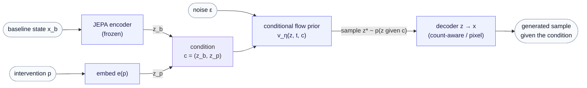

# ssl-lab

[](https://pleiadian53.github.io/ssl-lab/)

📖 **Documentation site (full math rendering):** <https://pleiadian53.github.io/ssl-lab/>

A research lab for **self-supervised learning (SSL)**. The aim is to track the state of the art across the SSL families and selectively go deep on the methods most worth mastering — staying at or ahead of the frontier rather than covering everything shallowly.

**Current focus — JEPA.** The first research line studies JEPA (joint-embedding predictive architectures) and extends it into a *sampleable generative model*. JEPA learns a representation by predicting the *embeddings* of masked/target regions from context embeddings — no pixel reconstruction, no likelihood. It is a representation learner, not a generative model. To *sample* data you add two pieces: a **prior** over the latent and a **decoder** back to data space.

The starting point is the simplest such slice — an *unconditional* flow-matching prior over a frozen JEPA latent, decoded back to data — built and verified end to end as a modality-agnostic proof of concept. From there the line has grown into a **design-space survey** of how to make JEPA generative, whose recommended build is a **conditional flow prior**: generation *given a condition* — a class, a perturbation, an intervention — paired with a decoder matched to the data. That conditional architecture is the one shown below, and the one this lab is building toward.



> The unconditional generative slice is built and verified end to end, and the conditional flow prior — the `v(z, t, c)` path with classifier-free guidance — is implemented and method-de-risked. The method is modality-agnostic; its applications (single-cell perturbation, digital phenotyping, and more) and the full design space are the **[Generative JEPA series](docs/generative_jepa/index.md)** and [Research directions](#research-directions) below.

This *generative* slice is one of **two complementary extensions of JEPA** the lab pursues. The second turns JEPA from a passive predictor into an *active* world-model — see [Research directions](#research-directions) below. The two are beginning to **converge**: the condition a generative JEPA samples under can be an *action*, and an action read as a latent **operator** is exactly the world-model line — so "generate the outcome of an intervention" and "plan the intervention" become two faces of one model.

## Why ssl-lab exists

ssl-lab is a spin-off of its sibling project [genai-lab](https://github.com/pleiadian53/genai-lab) (generative AI for computational biology). It's a focused R&D sandbox for state-of-the-art self-supervised learning — JEPA and new ideas built around it — kept deliberately **modality-agnostic** — method first, validated on a simple proof-of-concept before it meets real data. The aim is to mature these methods here and bring them back to genai-lab to develop more meaningful **genomic generative models**.

## Research directions

JEPA is a *representation learner* — it learns by predicting the embeddings of masked regions from context. ssl-lab pushes it past that in two complementary ways:

**1. Generative JEPA — make the representation *sampleable*.** *(method built + de-risked; design space mapped; applications WIP)* Add a prior over the latent and a decoder back to data space. The unconditional slice is verified end to end — a rich, non-collapsed latent (strong linear-probe accuracy with no pretraining labels) and *genuinely novel* samples. A full **[Generative JEPA design-space survey](docs/generative_jepa/index.md)** then maps four routes for making JEPA generative — decode the latent, a variational posterior, conditioned diffusion, planning on top — plus the **conditional flow prior** that unifies them: generation *given an intervention*, with a decoder matched to the data's likelihood. The method is modality-agnostic, and the conditional `v(z, t, c)` path is de-risked as a method; the applications are where it earns its keep:

- **Single-cell perturbation response** *(flagship, WIP)* — a staged "cell JEPA": intra-cell pretraining (Stage A) → variational / conditional-flow perturbation predictor (Stage B) → NB/ZINB count decoder (Stage C), on Norman-2019 Perturb-seq, graded on *effect size* (predicting unseen gene combinations) against a from-scratch CVAE baseline.
- **Digital phenotyping** — e.g. diabetes monitoring and management, where the rollout becomes a *generative personal world model*: a fan of plausible future trajectories under an intervention (this is also where Direction 2's world model meets the generative line).
- **Further modalities** — the core is a likelihood-matched conditional generator, so new domains drop in as data adapters; the [data-modalities primer](docs/generative_jepa/appendix-data-modalities.md) surveys single-cell counts, EHR codes, and wearable / CGM streams.

**2. Action operators on JEPA — make prediction *active*.** *(research line — tutorial corpus written; theory still developing)* Go from passively in-filling hidden regions to *acting on* them. JEPA's predictor already *is* a latent operator — but its query is a **frozen, blind action**: it says only *where* or *when* to predict, never *what acted*. Promote that query to a **learned operator the model chooses and conditions on** — *sensing* ("where should I look?") and *perturbing* ("what happens under this intervention?") — and the passive predictor becomes a controllable **world model**: it can roll futures forward, run counterfactuals ("what if more sleep?"), and surface change that known interventions don't explain. This builds on the **action-operator** formalism from the sibling project [GRL](https://github.com/pleiadian53/GRL), and spans two application poles — continuous behavioral / mental-health monitoring (operator structure *learned*) and protein structure & dynamics (structure *given* by SE(3)).

> 📄 **Tutorial series** (full math on the [documentation site](https://pleiadian53.github.io/ssl-lab/)) — three parts, read in this order:
> - **[Time-Series JEPA](docs/time_series_jepa/index.md)** — the substrate: JEPA pointed at time series, multimodal channels, and the one blind spot that motivates operators.
> - **[Action Operators](docs/action_operator/00-from-actions-to-operators.md)** — the foundation: what an action operator is, why JEPA benefits from one, and a gallery of concrete operators.
> - **[Operator World Models](docs/operator_world_models/index.md)** — the synthesis: condition the predictor on *what acted* for counterfactual rollout, composable interventions, and a sharpened change signal.
>
> *Status: an actively developing theoretical line — the operator formalism is still being worked out, not settled — and it now reaches into Direction 1. The [Generative JEPA series](docs/generative_jepa/index.md) treats action-conditioning as the bridge: the conditional flow prior's condition can be an action, and Route D's planner is an action operator, so the generative and world-model lines are converging on one substrate.*

A concrete motivation in genomics: given an RNA sequence, *sense* to localize candidate splice sites, then *perturb* (in-silico edits / mutations) to learn what they do to splicing — the kind of active, hypothesis-driven understanding passive prediction alone can't reach.

## Related projects

ssl-lab sits in a small constellation of related work:

- **[genai-lab](https://github.com/pleiadian53/genai-lab)** — the parent project: generative AI for computational biology. ssl-lab matures methods here and feeds them back to genai-lab for genomic generative models.

- **[NMDiff](https://github.com/pleiadian53/nmdiff)** — a **distinct branch of SSL** that sits outside the three classical families. Contrastive (SimCLR/CLIP), predictive (BERT/GPT/MAE), and self-distillation (BYOL/DINO) methods all share one structural property: the labeling function `T` is *fixed*, and only the encoder is learned. NMDiff promotes `T` itself to a domain-parameterized hypothesis `L(·; θ)` and jointly optimizes it with the downstream classifier via an outer-loop cross-view AUC criterion — the labeling function isn't a hyperparameter, it *is* the scientific hypothesis. Call it **hypothesis-driven SSL**: applied to transcript NMD efficiency (where ground-truth labels don't exist), but the pattern generalizes to any label-scarce setting where domain knowledge can parameterize a candidate labeling. Within the 2026 macro-trend of *learning the supervision signal itself* — alongside self-improving SSL, learned-augmentation SSL, and programmatic weak supervision — NMDiff is the interpretable, low-dimensional, domain-knowledge instance.

- **[GRL](https://github.com/pleiadian53/GRL)** — origin of the action-operator formalism that grounds the action-operator research direction above.

- **protein-ml-lab** *(sibling, not yet public)* — a first-principles depth study of the protein-ML stack (ESM, the AlphaFold lineage, RFdiffusion / ProteinMPNN / Chroma). It is the natural home for the action operator's **"given" pole**: here rotations and translations are honest **SE(3)** group elements, equivariance is *demanded* rather than learned, and frame-based structure prediction and generation are *operators on SE(3)* made literal (AlphaFold's residue frames, FrameDiff/RFdiffusion flows). Where ssl-lab's operators are **learned** from data, protein-ml-lab's are **given** by physics — the two poles of the same expressiveness↔structure dial, in two sibling repos.

## Layout

This project follows a use-case-driven R&D convention: reusable primitives in `src/`, thin driver scripts in `examples/`, intuition in `notebooks/`.

```
src/ssllab/
  data/        image-proxy + single-cell Perturb-seq adapters -> modality-agnostic token tensors
  models/      TinyViT backbone, JEPA encoder/predictor, latent decoder
  jepa/        block masking, EMA target, the assembled JEPA module
  objectives/  prediction loss + VICReg collapse regularizer
  generative/  flow prior (unconditional + conditional w/ classifier-free guidance),
               NB/ZINB count decoder, condition encoder, CVAE baseline
  action_operator/  context-conditioned latent operators — generator bases, exp(M)
  eval/        collapse diagnostics, linear probe, image-grid viz
  utils/       seeding, device selection
examples/
  jepa_basics/          01 train JEPA · 02 linear probe
  generative_jepa/      03 decoder · 04 flow prior · 05 sample · 06 eval ·
                        07 conditional flow · 08 sample conditional   (image proxy)
  perturbation_response/  cell-JEPA perturbation pipeline (WIP): process Norman ->
                        Stage A pretrain -> count decoder -> conditional flow ->
                        sample -> effect-size eval  (+ CVAE baseline)
```

## Setup

```bash
mamba env create -f environment.yml    # or: conda env create -f environment.yml
conda activate ssllab
pip install -e .
```

## Run the vertical slice

```bash
# 1. learn the representation (prints collapse diagnostics each epoch)
python examples/jepa_basics/01_train_jepa_mnist.py --epochs 5

# 2. confirm the frozen latent is semantically useful
python examples/jepa_basics/02_linear_probe.py

# 3. learn to decode the frozen latent back to pixels
python examples/generative_jepa/03_train_decoder.py --epochs 5

# 4. learn a sampleable prior over the frozen latent
python examples/generative_jepa/04_train_flow_prior.py --epochs 20

# 5. sample z ~ prior, decode -> output/jepa_mnist/samples/samples.png
python examples/generative_jepa/05_sample_and_decode.py
```

Artifacts are organized per experiment under `output/<experiment>/`:

```
output/jepa_mnist/
  checkpoints/  encoder.pt  decoder.pt  prior.pt
  samples/      samples.png  recon.png
  reports/      jepa_train.json  probe.json
  logs/         train.log
```

On a GPU pod this same tree is written under the network volume (`/runpod-volume/ssl-lab/output/<experiment>/`) and rsynced back to the local `output/` — same structure, env-dependent prefix swapped.

All scripts share an `--experiment` name (default `jepa_mnist`); pass a new name to keep separate runs side by side. On a GPU pod, the whole chain runs via `examples/generative_jepa/run_pod_pipeline.sh`.

## Remote training

Models that don't fit in your local environment train on remote GPU pods. That infra lives in a separate, decoupled package [`ops/`](ops/) (SkyPilot + RunPod) — the SSL library never imports it. Quick path:

```bash
pip install -e ops/                          # compute-check + dry-run
python examples/ops/ops_compute_check.py     # local vs pod?
python examples/ops/ops_run_pipeline.py --gpu a40 -- \
    python examples/jepa_basics/01_train_jepa_mnist.py --epochs 50   # dry-run
```

See [ops/README.md](ops/README.md) for the full provision → run → fetch workflow.
