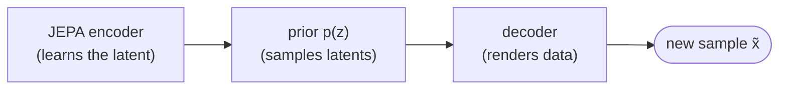

# Part 0 — Generative models, and why JEPA

*The gentle starting point. No prior familiarity with JEPA or generative modeling assumed.*

This series builds a generative model on top of a JEPA encoder. Before any of that makes sense, two questions deserve plain answers: **what is a generative model**, and **why would you build one on JEPA** rather than on something more obviously suited to generation? This chapter answers both from the ground up. If you already think in terms of latent-variable generative models and JEPA representations, skip to [Part 1 — The JEPA encoder](01-the-jepa-encoder.md).

## What "generative" means

Most machine learning you meet is **discriminative**: it takes an input and produces a label or a number — is this image a 7, is this email spam, what is this house worth. A **generative** model does something different and harder. It learns the *distribution* of the data well enough to **produce new examples** that could plausibly have come from it: a new handwritten digit, a new sentence, a new protein sequence that nature might have written but didn't.

The standard way to say this: real data are samples from some true distribution, written $p_{\mathrm{data}}(x)$ — a probability over all possible data points $x$, high where realistic examples live and near zero elsewhere. We never see this distribution directly, only a finite pile of samples from it (our training set). A generative model is a thing we can **sample from**, written $x \sim p_\vartheta(x)$, whose samples we want to be indistinguishable from real ones. Train it so that its $p_\vartheta$ matches the data's $p_{\mathrm{data}}$, and you can draw new $x$'s forever.

That single capability — *sample new, plausible data points* — is the whole goal. It is also why generative modeling is useful beyond making pretty pictures: the same machinery underlies designing candidate molecules, imputing missing measurements, simulating "what a cell would look like under this drug," and scoring how surprising a new observation is.

## Why it is hard, and the latent-variable shortcut

Generating directly in data space is brutal. An image is hundreds of pixels, a genome is millions of bases, and the realistic examples form a vanishingly thin sliver of that enormous space — almost every random pixel grid is noise, not a digit. A model has to learn the precise, intricate shape of that thin sliver.

The dominant modern trick is to **not** generate in data space at all. Instead:

1. **Compress** each data point into a much smaller **latent** vector $z$ — a compact code that keeps the meaningful content and drops the rest.
2. **Generate in latent space**, which is small and (if you chose the encoder well) smoothly organized, so the shape to learn is far simpler.
3. **Decode** the generated latent back into a full data point.

This is the *latent-variable* recipe, and it factorizes generation into a **prior** over latents, $p(z)$ — the part you sample from — and a **decoder** $p(x \mid z)$ that renders a latent into data:

$$
z \sim p(z), \qquad x \sim p(x \mid z).
$$

It is exactly how systems like latent diffusion (the engine behind modern image generators) work: a strong encoder defines the latent space, a generative model learns to sample latents, and a decoder turns them into pixels. The encoder is trained once; the generative machinery is built on top.

## A quick map of the families

It helps to place the pieces against the broader landscape. Generative models differ mainly in *how* they learn to produce samples:

| Family | Core idea | Where it shines |
|---|---|---|
| **Autoregressive** | predict the next token given the previous ones; sample one step at a time | language, DNA — anything sequential |
| **VAE** | learn an encoder + decoder with a simple latent prior, trained to reconstruct | fast, structured latents; often blurry samples |
| **GAN** | a generator competes against a discriminator that tries to spot fakes | sharp images; tricky to train |
| **Diffusion / flow** | gradually transform noise into data along a learned path | state-of-the-art image/audio quality |

This series uses the latent-variable recipe with a **flow** model for the prior ([Part 2 — The latent prior](02-the-latent-prior.md)) and a small **decoder** ([Part 3 — The decoder](03-the-decoder.md)). Those two choices are standard. The non-standard, still-open choice — the part we are actually researching — is **step 1: what defines the latent space**. That is where JEPA comes in.

## Why JEPA as the substrate

The quality of a latent-variable generative model is largely decided by the encoder that defines its latent space. If that space is smoothly and *semantically* organized — similar meanings sitting near each other, irrelevant surface variation collapsed away — the prior has a simple shape to learn and the decoder has a clean signal. If the latent space is a tangled mess of appearance detail, both jobs get harder.

So the question becomes: **what makes a good latent space to generate in, and who builds it best?** Two common answers have drawbacks for this purpose:

- A **VAE encoder** is trained to *reconstruct*, so it is pulled toward preserving appearance — exactly the nuisance detail we would rather abstract away.
- An **autoregressive** model has no reusable latent at all; generation and representation are the same forward pass.

**JEPA** (Joint-Embedding Predictive Architecture) offers a different kind of latent. It is a *self-supervised representation learner*: it learns, from unlabeled data alone, by **predicting the embedding of a hidden region from the embeddings of the visible region** — predicting *meaning*, never pixels. Because it is never asked to reproduce surface detail, it is free to throw away the unpredictable nuisance and keep the structure. The result is a latent space that is semantically strong, label-free, and modality-agnostic — a promising substrate for a prior to model. ([Part 1 — The JEPA encoder](01-the-jepa-encoder.md) unpacks exactly how it learns this.)

That is the bet this series tests: **a strong predictive representation (JEPA) plus a lightweight generative head (a prior and a decoder) yields a generative model that inherits the representation's semantic strength.** JEPA's contribution is the *encoder*; everything that makes it sampleable is bolted on afterward.

## The honest catch (and why this is interesting)

There is a real tension built into the idea, and the series does not hide it. JEPA is, by construction, **not a generative model**: it has no decoder and defines no probability density, so out of the box it cannot produce a single new data point. Worse, the very thing that makes its representation strong — discarding detail it deemed unpredictable — also discards detail a decoder would need to render crisp output. A latent trained to *understand* was never trained to be *decodable*.

So this is not a solved recipe to copy; it is a design exploration with a clear question: *how far can you turn a pure representation learner into a generator, and what does each addition cost?* The rest of the series answers it, one stage at a time, and measures the result honestly.

## What you will build

By the end you will understand each box and be able to run the whole thing. The road there:

1. **[The JEPA encoder](01-the-jepa-encoder.md)** — how JEPA learns a representation by predicting embeddings, and how we know it worked.
2. **[The latent prior](02-the-latent-prior.md)** — a flow model that learns to sample new latents from noise.
3. **[The decoder](03-the-decoder.md)** — turning a latent back into data, and the decodability cost made honest.
4. **[Sampling and evaluation](04-sampling-and-evaluation.md)** — closing the loop, and judging samples without just eyeballing them.

New to the symbols? The [notation reference](notation.md) defines every one.

---

*Next: [Part 1 — The JEPA encoder](01-the-jepa-encoder.md).*
