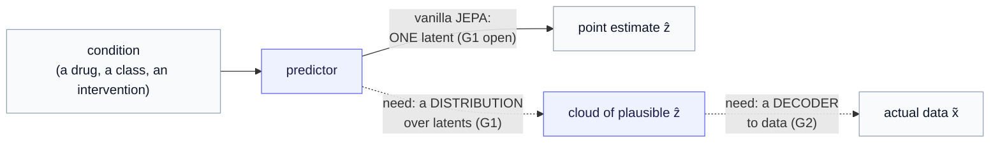
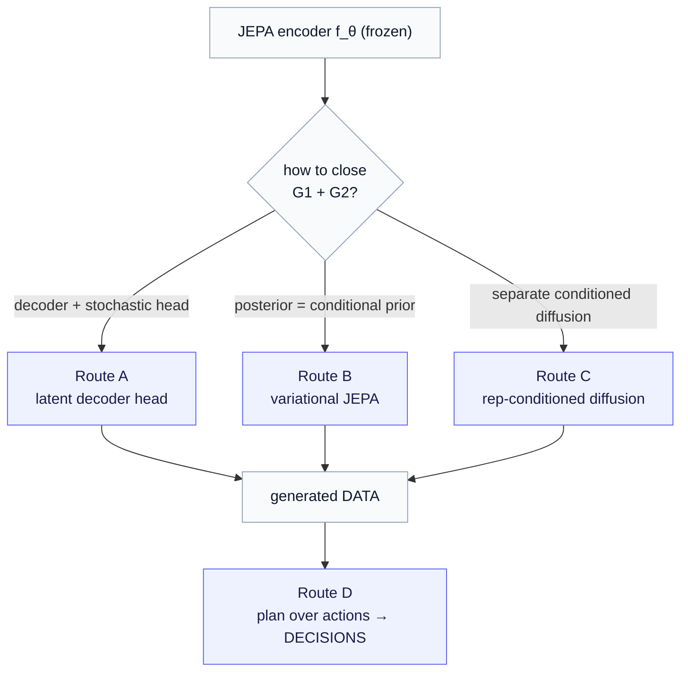

# Part 5 — Two gaps, four routes

*One realization is not the method. This chapter maps the whole design space — and reframes everything you built in Parts 0–4 as a single point in it.*

> **Where we are.** Parts 0–4 built a complete, runnable generative model on a JEPA encoder: freeze the encoder, learn a **flow-matching prior** over its latents, learn a **decoder**, then sample and decode. It works end-to-end on MNIST. But it is deliberately the *simplest* thing that closes the loop — one choice at every joint. This second half of the series steps back and asks the real question: *what is the full set of ways to make JEPA generative, and which one should you build for a serious application?* No new code yet — this chapter is the map you will read the rest of the arc against.

Let us recap what a generative model needs, because the whole design space falls out of it. From [Part 0](00-generative-models-and-why-jepa.md): a generative model is something you can **sample new, plausible data from**. JEPA, out of the box, cannot — it is an encoder. Parts 1–4 bolted on the missing pieces in one particular way. To see *why* that was one choice among several, we first name exactly what was missing.

---

## 1. Why JEPA is not generative — two *independent* gaps

It is tempting to say "JEPA is not generative because it has no decoder." That is only **half** the story, and the half it omits is where most of the design choices live. There are **two** missing pieces, and they are independent — closing one does nothing for the other.

> **Gap G1 — stochastic prediction.** JEPA's predictor is a *deterministic point estimate*. Given a context (and maybe a condition), it returns exactly **one** latent: $\hat z = g_\phi(z_{\text{ctx}}, \text{condition})$. One input, one output. Generation needs the opposite — a **distribution** over outcomes, because the real world is one-to-many.

> **Gap G2 — no decoder to data space.** JEPA's entire loss lives in *latent* space: it predicts an embedding and matches it to a target encoder's embedding. There is no map from a latent back to a data point. Generation needs a **decoder** $D_\omega: z \to x$ that emits an actual image, expression profile, or sensor trajectory.

A worked example makes the independence concrete. Picture the perturbation-biology setting the applications chapters will use: a cell, and a drug applied to it.

- **Solve only G2** (add a decoder to the deterministic predictor): you get *one* expression profile per drug. But identical cells given the identical drug respond *differently* — a real perturbation produces a whole population of outcomes. A single profile is a point estimate masquerading as a generative model. G1 is still open.
- **Solve only G1** (a distribution over latents): now you can sample many plausible *latent* cell-states. But a latent is not data — you cannot read a gene-expression number off it, cannot score it against a real measurement. G2 is still open.

> **The rule the whole arc obeys.** A usable generative JEPA must close **both** gaps. Every route below is, at heart, a *different pairing of how-it-closes-G1 with how-it-closes-G2.* Keep that lens and the design space stops looking like a zoo of methods and starts looking like a small grid of choices.

### Where Parts 0–4 sit in this picture

Re-read your own starter through the two-gap lens, because it is the cleanest first example. The flow-matching prior closes **G1**: instead of one latent, it lets you draw fresh latents from noise — a distribution. The decoder closes **G2**. So Parts 0–4 *are* a complete two-gap closure — just the **unconditional, marginal** one: the prior is over *all* latents $p(z)$, with no condition attached, and the "distribution over outcomes" is the whole data manifold rather than "the outcomes of *this* intervention." That is why the starter generates plausible-but-arbitrary digits rather than "a digit *given* some context." Everything in the design space below is, in one way or another, the **conditional, structured** generalization of that starter.

---

## 2. The design space — four routes

Four routes span the space. Read each as a mechanism — *how it closes G1, how it closes G2* — with one published landmark named where the mechanism was sharpened. (We organize by mechanism, not by paper; the landmarks are signposts, not the subject.)

| Route | The idea in one line | Closes G1 by… | Closes G2 by… | Landmark |
|---|---|---|---|---|
| **A — Latent decoder head** | bolt a decoder onto the predicted latent; make the predictor or decoder stochastic | a stochastic predictor / decoder | a decoder $D_\omega$ (count-aware for biology) | the conditional-VAE / NB-decoder family |
| **B — Variational JEPA** | the predictor emits a *posterior* over latents and *becomes* the conditional prior | a learned posterior $q_\phi(z\mid \text{ctx}, c)$ + sampling | a decoder (in representation or data space) | **Var-JEPA** |
| **C — Representation-conditioned diffusion** | keep JEPA as the encoder; train a *separate* diffusion model conditioned on its latent | diffusion noise | the diffusion model decodes to data | **D-JEPA** |
| **D — World-model planning** | freeze the encoder, learn an *action-conditioned* predictor, and *plan* over actions | — (not directly) | — (not directly) | **V-JEPA 2-AC** |

Two things to notice immediately, because they shape how to read the deep-dives.

**Routes A–C produce *data*; Route D produces *decisions*.** A, B, and C all end at a generated data point — an image, an expression profile, a future trajectory. Route D is generative in a different sense: it searches the space of *actions* (which drug, which intervention) to reach a goal state, and emits the **intervention**, not the data. It does not close G1 or G2 by itself — it sits *on top of* a route that does. So D is complementary, not a competitor; it is the planning layer the applications will want once a predictor exists.

**The current series is a stripped-down hybrid of A and C.** A marginal flow prior + a decoder is "Route C's machinery (a flow/diffusion-style prior over the latent) used unconditionally, with Route A's plain decoder." Seeing that is the point of the map: the starter is not *outside* the design space, it is one humble corner of it, and the routes are what you reach by adding **conditioning** and **structure**.

---

## 3. The constraint that decides the choice — capturing an intervention's effect

The four routes are not equally good, and what separates them is not elegance. There is one demand a generative model must meet to be useful in the applications this series targets, and it is sharp enough to rule routes in or out. Let us state the demand in full first, so the rest of the section has something concrete to point at:

> **The argument, up front.** In a real application you rarely care whether the model reproduces a subject's *current* state — you care whether it captures the **effect of an intervention**: what a drug does to a cell, what more exercise does to a person's glucose. And it is entirely possible for a model to learn an *excellent representation of the state* while *badly mis-estimating the effect*. When that happens, predicting a latent and stopping is not enough — you need a decoder that reaches the data space where the effect is actually measured.

Every clause of that argument turns on one notion — the **effect** of an intervention, and how large it is — so we define that before going further.

Take a cell, measure its gene expression, apply a drug, and measure again. For each gene, the **change** — how far its expression moved, up or down — is what biology calls its *differential expression*; the whole vector of those per-gene changes is the drug's **effect**, and its magnitude-and-pattern is the **effect size**. (The same notion, outside biology, is just "the change an intervention makes to the state" — in the diabetes example, what a week of exercise does to the metabolic latent.) The subtlety that makes this a real risk: you can predict the **after-state** quite accurately while still getting the **change** badly wrong — because the after-state is dominated by the large, intervention-independent **baseline** the subject already had, and the effect is a comparatively small perturbation riding on top of it. A model graded on reproducing the after-state can look excellent by nailing the baseline and fumbling exactly the part that matters. (A loose analogy: predicting tomorrow's temperature as "the same as today" is right most days yet useless for forecasting the *change* a weather front brings.)

**Is this a general law, or one paper's result?** Honest answer: a general *mechanism* with one concrete published *measurement*. The mechanism is **baseline dominance** — whenever (i) a subject's state is dominated by a large, stable baseline, (ii) the intervention's effect is small relative to that baseline, and (iii) the training signal is graded mostly on matching the *state* rather than the *effect*, a model can score well on the state and still miss the effect. It is not guaranteed to bite — where the effect is large relative to baseline it may not — but those three conditions are common. The concrete evidence is **Cell-JEPA (2026)**: applying JEPA to single-cell transcriptomics, it improves "absolute-state reconstruction but **not** effect-size estimation" — good at the after-state, poor at the change, exactly the predicted symptom.

**And it plausibly reaches our other domain.** A person managing diabetes has a stable metabolic baseline; the effect of "a week of more exercise" is a comparatively small shift on top of it. A JEPA latent could capture *who this person is* beautifully and still under-read *what the intervention does* — and in chronic-disease management the intervention's effect is the whole point (it is precisely the counterfactual rollout the [operator world model](../operator_world_models/index.md) is built to predict). So the discipline travels: the failure mode is not a quirk of cells, it is a property of any regime where a small effect rides on a large baseline.

This is why, in perturbation biology, effect size *is the benchmark*: models like **scGen**, **CPA**, and **scPPDM** are scored on the correlation (Pearson) between predicted and true differential expression on the top **DE** (differentially-expressed) genes — the genes the drug moved most. A model can have a beautiful latent and still mis-estimate the thing the benchmark measures. (Part 10 develops this from the ground up; here it is only the *reason* a data-space decoder is load-bearing.)

> **The consequence for route choice.** A generative head that maps back to **data space** (a decoder, Routes A/B/C) is not optional polish — it is the *mechanism* by which effect-size magnitude is recovered and calibrated. A pure latent-space model (or Route D alone) does not address it. This is the strongest reason the series does not stop at the latent: **closing G2 in data space is load-bearing**, not decorative, the moment you leave POC for a real benchmark.

---

## 4. The through-line you should already be suspicious of — the Gaussian prior

Here is a thread that runs through the whole arc, and which is worth flagging now so you read the deep-dives with the right question in mind.

The simplest way to make a prediction *stochastic* (G1) is to have the network output the parameters of a **Gaussian** — a mean $\mu_\phi$ and a per-dimension spread $\sigma_\phi$ — and sample from it. It is mathematically clean: closed-form density, one-shot sampling, a tidy KL term. It is the workhorse of the VAE family, and it is the natural first thing to reach for in Route A or B.

It is also, for realistic applications, **limiting** — and not for the reason usually stated. The problem is not "Gaussians are simple." It is that a diagonal Gaussian is **unimodal per condition**: for one fixed condition it can only place a single bump of probability. When the truth is genuinely *multi-modal* — the same drug drives two distinct cell fates; the same day could plausibly go two ways for a patient — a single Gaussian averages them into a midpoint that is *neither*, and the diagonal assumption additionally forbids any correlation between latent dimensions. The elegant default quietly throws away exactly the structure a real response has.

> **A trade-off, not a verdict.** This is genuine open ground, and the series treats it as such. The Gaussian buys a tractable density and a free one-shot sample; the price is unimodality. The expressive alternatives — a **mixture** of Gaussians, a **flow** (which is what Parts 0–4 already used for the *marginal* prior), a **diffusion** posterior — buy multi-modal, correlated outcomes at the cost of closed-form density and cheap sampling. *Where to sit on that dial is application-specific.* But you should not accept a single Gaussian as obviously adequate just because it is the textbook move — and [Part 7](07-route-b-variational-and-beyond-gaussian.md), on the variational route, is where this gets developed in full.

---

## 5. The honest open problem — likelihood and design

One last thing to carry through the arc, stated plainly so no chapter oversells.

By the time you have bolted a prior and a decoder onto JEPA, you have — structurally — **rebuilt a VAE or a latent-diffusion model, with JEPA serving as encoder pretraining.** That is not a criticism; JEPA's encoder is a genuinely strong, dropout-robust, semantically-organized substrate, and that is worth a great deal. But it means the generative head inherits the *limitations* of whatever family you reach for, and in particular **none** of the four routes hands you a tractable **data-space likelihood** for free. The capabilities a likelihood model gives — de-novo design, and scoring "how surprising is this point?" as $\log p(\text{ref})$ vs $\log p(\text{alt})$ (the bread and butter of variant effect prediction in genomics) — do not come automatically. Recovering them is the genuinely hard, still-open part, and the series will keep naming it rather than papering over it.

---

## 6. The arc from here

With the map in hand, the deep-dives each take one route and build it honestly — mechanism, worked example, what it costs to scale:

- **[Part 6 — Route A: a decoder on the latent](06-route-a-latent-decoder-head.md):** the lowest-friction closure; count-aware decoders for biology; the "collapses into a conditional VAE" risk.
- **[Part 7 — Route B: variational JEPA, and the trouble with Gaussian](07-route-b-variational-and-beyond-gaussian.md):** the predictor *becomes* the conditional prior; the Gaussian critique developed, and expressive-posterior upgrades.
- **[Part 8 — Route C: representation-conditioned diffusion](08-route-c-conditioned-diffusion.md):** the most modular closure; two models, swappable halves; where the starter's flow prior grows up.
- **[Part 9 — Route D: world-model planning](09-route-d-world-model-planning.md):** generating *interventions* by energy minimization — the bridge to the [Operator World Models](../operator_world_models/index.md) series.
- **[Part 10 — Application: computational biology](10-application-computational-biology.md):** the staged synthesis for perturbation response; scGen/CPA/scPPDM and the effect-size benchmark.
- **[Part 11 — Application: digital phenotyping](11-application-digital-phenotyping.md):** a personalized diabetes world model — sampling future trajectories under an intervention.

> **Recap before we descend.** A generative JEPA must close two independent gaps — a *distribution* over outcomes (G1) and a *decoder* to data (G2). Four routes pair those closures differently: A bolts on a decoder, B makes the predictor a variational conditional prior, C trains a conditioned diffusion model on the latent, D plans over actions. Routes A–C make data; D makes decisions on top of them. The effect-size finding says the decoder must reach *data* space to matter; the Gaussian critique says don't accept a unimodal prior by default; and a tractable likelihood remains the open prize. Now we take the routes one at a time.

---

*Previous: [Part 4 — Sampling and evaluation](04-sampling-and-evaluation.md). Next: [Part 6 — Route A: a decoder on the latent](06-route-a-latent-decoder-head.md). New symbols (the conditioning vocabulary $z_b$, $z_p$, $q_\phi$) are defined as they arrive and collected in the [notation reference](notation.md).*
