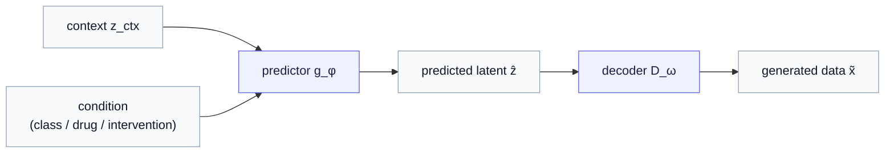
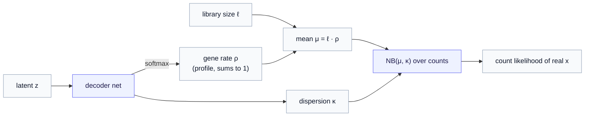

# Part 6 — Route A: a decoder on the latent

*The lowest-friction closure: keep JEPA's predictor, hang a decoder off its output. The cheapest way to close both gaps — and the one that most tempts you to forget JEPA was ever there.*

> **Recap — where this sits.** [Part 5](05-two-gaps-four-routes.md) mapped the design space: a generative JEPA must close **G1** (turn the predictor's single guess into a *distribution* over outcomes) and **G2** (add a *decoder* from latent back to data), and four routes pair those closures differently. This chapter takes **Route A**, the most direct of the four: JEPA already predicts a latent — so just decode it. Cheapest path from encoder to generator. Its very cheapness is also its trap, as we will see. New vocabulary (the count decoder, library size) is defined as it arrives; the [notation reference](notation.md) collects every symbol.

We start with Route A precisely *because* it is the most obvious move, and obvious moves deserve scrutiny. JEPA hands you a predictor $g_\phi$ that maps a context to a latent $\hat z$. A decoder $D_\omega$ maps a latent to data. Compose them and you have a generator — the *wiring* is a single line, $\tilde x = D_\omega(g_\phi(\dots))$, both gaps apparently closed (building the decoder you drop in is rather more than a line, as §2 shows — but the *move* really is that small). The whole chapter is about what that small move hides — first the mechanics it gets right, then the honest question it forces: *did JEPA actually buy you anything, or have you just rebuilt a VAE wearing a JEPA hat?*

---

## 1. The mechanism — decode the predicted latent

Recall JEPA's predictor. In standard (non-generative) JEPA it takes the context and a **query** — a pointer to *what* or *where* to predict (the masked region to fill in, or how far ahead to look) — and returns the target latent. To *generate*, we put that query slot to a new use: instead of a position, we feed it the **condition** we want to generate *under* (a class, a perturbation, an intervention), so the predictor returns the latent that follows from that condition:

$$
\hat z = g_\phi(z_{\text{ctx}}, \text{condition}).
$$

(Conditioning the predictor's query on an external action like this — rather than on a masked position — is the generalization every route in this half of the series is built on; standard JEPA never sees the condition.) Route A then adds exactly one thing — a decoder on the end:

$$
\tilde x = D_\omega(\hat z).
$$

That is the entire skeleton. The decoder closes **G2** outright: there is now a map from latent to data, so the model emits an actual data point $\tilde x$ rather than an embedding.

But notice what this skeleton does *not* yet do. The predictor returns one $\hat z$, so the decoder returns one $\tilde x$ — a point estimate, not a population. **G1 is still open.** Closing it means making something on this path *stochastic*, and there are two places to put the randomness — which we get to in §3, because the choice turns out to matter a great deal. First, the decoder itself deserves a careful look, because "add a decoder" is where a subtle, general lesson lives.

---

## 2. G2 — the decoder, and why "just MSE" is the wrong reflex

The naive decoder is a network $D_\omega: z \to x$ trained to **reconstruct**, and the loss you reach for quietly assumes a *likelihood* for the data: squared error (MSE) assumes a **Gaussian**, binary cross-entropy assumes a **Bernoulli**. The [Part 3](03-the-decoder.md) starter used the Bernoulli/BCE choice over pixels for MNIST — and for images that is the right fit.

For single-cell gene expression, *neither* generic choice fits — and that is exactly the point. The **MSE/Gaussian** reflex (reaching for squared error because counts look like "just numbers") is wrong; so is the **Bernoulli/BCE** pixel loss — counts are neither real-valued nor binary. The data needs its *own* likelihood, a **count** distribution (NB/ZINB, built below). Seeing why the off-the-shelf losses fail teaches a lesson that applies to every modality you will ever decode into.

> **New to single-cell data?** The rest of this section uses gene-count vocabulary (counts, dropout, library size). If that is unfamiliar, the [data-modalities primer](appendix-data-modalities.md) explains it from scratch in two minutes — or read on; the *lesson* (match the decoder to the data's likelihood) lands either way.

Single-cell RNA-seq data are **gene counts** — for each cell, how many transcripts of each gene were captured. Three properties break a Gaussian/MSE decoder:

- **Counts are non-negative integers**, not continuous reals. An MSE decoder happily predicts $-3.2$ transcripts.
- **They are heavily overdispersed** — the variance across cells is far larger than the mean, which a fixed-variance Gaussian cannot represent.
- **They are dominated by dropout** — typically over 90% of entries are zero, many of them *technical* zeros (the gene was expressed but not captured), a measurement artifact rather than biology.

An MSE decoder spends its capacity fighting all three, modeling measurement noise as if it were signal. The fix is to make the decoder emit the **parameters of a count distribution** rather than a single number, and train it by the *likelihood* of the real counts under that distribution. The standard choice is the **negative binomial** (NB) — read it as "a distribution over counts with a mean $\mu$ and a dispersion $\kappa$ that lets the variance exceed the mean" — or its zero-inflated cousin **ZINB**, which adds an explicit probability of a structural zero for the dropout.

Concretely, the convention this project follows (and the one worth picturing): the decoder turns the latent into a **rate** over genes with a softmax — a relative expression profile $\rho$ that sums to one — then scales it by the cell's **library size** $\ell$ (its total captured counts, i.e. its sequencing depth) to get the NB mean, with a per-gene dispersion:

$$
\rho = \mathrm{softmax}(\text{decoder}(z)), \qquad \mu = \ell \cdot \rho, \qquad x \mid z, \ell \sim \mathrm{NB}(\mu, \kappa).
$$

Read that last piece aloud, since the notation is doing real work: $x \mid z, \ell \sim \mathrm{NB}(\mu, \kappa)$ says *the count vector $x$, **given** the latent $z$ and the library size $\ell$, is **distributed as** a negative binomial with mean $\mu$ and dispersion $\kappa$.* The bar $\mid$ is "given / conditional on"; the tilde $\sim$ is "is distributed as" (the same symbol as in $x \sim \mathcal{N}(\mu, \sigma^2)$ for a Gaussian). The shift this encodes is the whole point of the section: the decoder does **not** emit one predicted count vector — it emits the *parameters of a distribution over* count vectors, and the real $x$ is treated as a draw from it.

So what the decoder actually emits are the distribution's parameters: the gene-rate profile $\rho$ and the dispersion $\kappa$. Note the **mean $\mu$ is not emitted directly** — it is assembled as $\mu = \ell \cdot \rho$, with the library size $\ell$ entering as a *given* covariate, not a prediction. (In the simpler Gaussian case the head outputs $\mu$ and $\sigma$ directly; the count case has this extra assembly step.) Training then maximizes the **likelihood** — how probable the *real* counts are under the distribution the decoder produced.

That training principle is not new to this chapter, even if the word is. "Maximize the likelihood" just means *pick the parameters that make the observed data as probable as possible* — and it is exactly what the MSE and BCE losses at the top of this section were already doing under the hood. Squared error is the (negative log-)likelihood of a Gaussian; binary cross-entropy is the likelihood of a Bernoulli; minimizing either *is* maximizing a likelihood. The NB head simply swaps in the count likelihood — the training principle is identical, only the assumed distribution changes. (This is the same notion of likelihood the series will keep returning to, including the harder question of a tractable *data-space* likelihood flagged in [Part 5 §5](05-two-gaps-four-routes.md).)

**ZINB** is one refinement on top, aimed squarely at the dropout problem from earlier. Real single-cell counts carry even *more* zeros than a negative binomial alone expects — those technical, "the gene was on but nothing was captured" zeros — so the **zero-inflated** NB adds, per gene, an explicit probability $\pi$ of a structural zero, mixed in alongside the NB. Mechanically it is just one more output head: the decoder emits $(\rho, \kappa, \pi)$ instead of $(\rho, \kappa)$, and nothing else about the setup changes. Whether you need it depends on how dropout-heavy your data are — plain NB is often enough.

### The count likelihood, written out

We have been saying "maximize the likelihood of the real counts." For research you want the *actual* objective, not a gesture at it — so here it is, built up factor by factor.

Start with a single gene. The negative-binomial probability of observing a count $x$, given mean $\mu$ and dispersion $\kappa$, is

$$
p(x \mid \mu, \kappa) = \frac{\Gamma(x + \kappa)}{x! \cdot \Gamma(\kappa)} \left(\frac{\kappa}{\kappa + \mu}\right)^{\kappa} \left(\frac{\mu}{\kappa + \mu}\right)^{x}.
$$

Each factor earns its place — read them in turn:

- $\Gamma$ is the **gamma function**, the factorial generalized to real numbers ($\Gamma(n) = (n-1)!$ for integer $n$). The leading fraction is the *combinatorial normalizer* — the job the binomial coefficient does for integer counts — and we need $\Gamma$ rather than plain factorials precisely because $\kappa$ is a *real-valued* dispersion knob the network learns, not an integer.
- Write $q = \kappa/(\kappa + \mu)$. The last two factors are then $q^{\kappa}(1-q)^{x}$ — the familiar "successes and failures" shape of a negative binomial. This distribution has mean $\mu$ and **variance $\mu + \mu^2/\kappa$**: a small $\kappa$ means a large variance (heavily overdispersed), and $\kappa \to \infty$ collapses the variance back to $\mu$, recovering the Poisson. So $\kappa$ is exactly the overdispersion control the earlier "variance exceeds the mean" property called for.

A whole cell is a product over its genes (counts taken conditionally independent given the latent), so its **log**-likelihood — turning that product into a numerically stable sum — is

$$
\log p(x \mid \mu, \kappa) = \sum_{g} \Big[ \log\Gamma(x_g + \kappa_g) - \log\Gamma(\kappa_g) - \log(x_g!) + \kappa_g \log\frac{\kappa_g}{\kappa_g + \mu_g} + x_g \log\frac{\mu_g}{\kappa_g + \mu_g} \Big],
$$

over genes $g$, with $\mu_g = \ell \cdot \rho_g$. The training loss is the **negative** log-likelihood, averaged over the $N$ cells in a batch:

$$
\mathcal{L}_{\mathrm{NB}} = -\frac{1}{N} \sum_{i=1}^{N} \log p\big(x^{(i)} \mid \mu^{(i)}, \kappa^{(i)}\big).
$$

Minimizing $\mathcal{L}_{\mathrm{NB}}$ *is* maximizing the likelihood; gradients flow back through $\mu = \ell\rho$ and $\kappa$ into the decoder. (The $\log(x_g!)$ term does not depend on any parameter, so it is a constant you can drop during optimization — a small practical note.)

**ZINB** wraps one mixture step around this. With a per-gene dropout probability $\pi_g$, each gene's count is a *mixture* — a structural zero with probability $\pi_g$, otherwise an NB draw:

$$
p_{\mathrm{ZINB}}(x_g) = \pi_g \cdot \mathbf{1}[x_g = 0] + (1 - \pi_g)\cdot \mathrm{NB}(x_g \mid \mu_g, \kappa_g).
$$

Read the two cases off the formula: a **zero** can arise two ways — the dropout switch fired ($\pi_g$), *or* the NB itself produced a zero — while a **positive** count ($x_g > 0$, where the indicator $\mathbf{1}[x_g = 0]$ vanishes) can only come from the NB term, scaled by $(1 - \pi_g)$. The loss is again the negative log of this, summed over genes and averaged over cells. That negative-log-likelihood is the concrete $\mathcal{L}_{\mathrm{decode}}$ the routes plug in wherever they decode to gene counts — and the same template (write the data's distribution, take its negative log-likelihood) is what you instantiate for *any* modality, with a Gaussian, a Bernoulli, or whatever the measurement model demands.

> **The general lesson — match the decoder to the data's likelihood.** Pixels → Bernoulli/BCE. Counts → NB/ZINB. Continuous sensor values → Gaussian. The decoder is *where the data's measurement model lives*, and getting it right is not fussiness — it is the difference between modeling the signal and modeling the noise. This recurs in every route, because every route that produces data needs a decoder, and this is the part they share.

And here is the payoff that ties back to [Part 5's effect-size argument](05-two-gaps-four-routes.md). A count likelihood grades the model on getting the *magnitude* of each gene's expression right — which is exactly the differential-expression signal a latent-only model was shown to miss. So Route A's decoder is not a formality bolted onto a finished model; it is **the mechanism by which calibrated effect sizes are recovered.** That is why the series insists on closing G2 in *data* space, not just predicting a latent and stopping.

---

## 3. G1 — where you put the stochasticity (and why it matters)

Now close the other gap. A decoder on a deterministic $\hat z$ produces a single predicted profile per condition. The NB is itself a distribution, so you do get *some* spread — but it is **measurement** spread (how noisy the readout of one predicted state is), not **outcome** spread (the genuinely different states the same condition can produce). Those are two different kinds of randomness, and conflating them is a classic error:

- **Observation noise** — the NB's dispersion. "Given *this* cell state, how noisy is the count readout?"
- **Outcome heterogeneity** — the real target of G1. "The same drug drives some cells to fate X and others to fate Y." Identical inputs, genuinely different *states*.

Capturing outcome heterogeneity requires randomness in the **latent**, not just in the decoder. So Route A closes G1 honestly only if you make the *latent* stochastic, and there are two sub-choices:

- **(a) Stochastic predictor.** Have $g_\phi$ emit a *distribution* over $\hat z$ — for instance a Gaussian with mean $\mu_\phi$ and spread $\sigma_\phi$ — then sample $\hat z$ and decode. Draw repeatedly and you get a population of distinct cell states, decoded to a population of count profiles. *(This is already the doorstep of Route B — a stochastic predictor that emits a posterior is, taken seriously, the variational route of [Part 7](07-route-b-variational-and-beyond-gaussian.md). Route A with a stochastic head and Route B differ mostly in how principled you make the prior.)*
- **(b) A separate prior you sample.** Keep the predictor deterministic but draw the latent's variation from a learned prior $p(z)$ — which is exactly what the [Part 2](02-the-latent-prior.md) flow prior did, in its *unconditional* form. Route C ([Part 8](08-route-c-conditioned-diffusion.md)) is the grown-up, *conditional* version of this.

> **The seam to remember.** A deterministic predictor plus an NB decoder gives you measurement noise dressed up as a generative model — it will *look* stochastic (sample the NB and counts jiggle) while missing the multiplicity that makes a response interesting. Honest G1 in Route A means a stochastic latent, sub-choice (a) or (b). Which one you pick is the fork into Routes B and C.

---

## 4. The honest risk — you may have just built a conditional VAE

Here is the tension that makes Route A worth thinking about further. Take it at its most natural: a stochastic Gaussian predictor (sub-choice a), a decoder, trained **jointly, end-to-end**, with the reconstruction loss flowing all the way back. Stand back and look at the shape: encoder → a latent *distribution* → decoder → reconstruction, regularized toward a prior. That is, structurally, a **conditional variational autoencoder (CVAE).** You have not obviously built "a generative JEPA"; you may have built a CVAE that happened to start from JEPA weights.

And the JEPA-ness can actively *wash out*. JEPA's whole identity is to predict in latent space and **never reconstruct** — that is what lets its encoder discard unpredictable surface detail and keep meaning. The moment a reconstruction gradient flows back into the encoder, the encoder is pulled to *preserve decodable detail* — precisely the pressure JEPA was designed to avoid. Train long enough jointly and the encoder drifts toward a reconstruction encoder, with JEPA pretraining reduced to a fancy initialization.

This forces the question the whole series circles: **what did JEPA buy?** Two honest postures, and the choice between them is Route A's central design knob:

- **Freeze the encoder** (the [Parts 0–4](index.md) discipline): train only the decoder and head on top. The representation stays a pure self-supervised artifact — but you inherit the **decodability caveat** of [Part 3](03-the-decoder.md): JEPA threw away detail the decoder now wishes it had, so samples can look soft.
- **Train jointly**: you regain decodability and effect-size calibration — but you take on the **CVAE-collapse risk**, and you must *demonstrate*, not assume, that JEPA pretraining bought something a from-scratch CVAE would not have.

> **The methodological discipline of Route A.** Always baseline against a plain conditional VAE trained from scratch. If JEPA-pretraining does not beat it — on sample quality, on effect-size correlation, on data efficiency — then you paid for an expensive initialization and learned nothing about JEPA's generative value. "JEPA's added value must be *shown*, not assumed" is not a slogan here; it is the experiment Route A obligates you to run. *(Where to sit on the freeze ↔ joint dial is genuinely open and application-specific — a frozen encoder for a clean research artifact, a light adapter or partial fine-tune when decodability is failing. Present the trade-off; do not pretend there is a universal setting.)*

---

## 5. Where the Parts 0–4 starter sits in Route A

It is worth placing your own working model precisely, because the contrast sharpens what *conditional* Route A actually adds. Let us walk through the starter piece by piece rather than compress it into a phrase.

Recall what [Parts 0–4](index.md) built. It **froze** the JEPA encoder, learned a **flow-matching prior** $p(z)$ over the frozen latents, and **decoded** sampled latents with a **Bernoulli** (pixel) head. Now map each piece onto the two gaps from [Part 5](05-two-gaps-four-routes.md):

- **G2 — the decoder.** Closed by the Bernoulli pixel head: the simplest possible likelihood, perfectly fine for MNIST.
- **G1 — the stochasticity.** Closed *not* by a stochastic predictor but by **the prior you sample from** — this is sub-choice (b) of §3. You draw a fresh latent from the learned $p(z)$ and decode it; the randomness lives in that draw.

So the starter is a genuine, complete two-gap closure. But notice the one word that sets it apart from everything else in this chapter: it is **unconditional**. The prior $p(z)$ is *marginal* — it models the distribution of *all* latents lumped together, with no input slot for a condition. So the starter can generate *a* plausible digit, but never *a digit given a class* (or, in biology, *a cell given a drug*). It answers "what does a plausible data point look like?" — never "…given this intervention?"

That single missing capability is the entire gap between the starter and **conditional Route A**. Conditional Route A keeps the very same bones — encode, get a latent, decode — and adds exactly two things: it feeds a **condition** (a class label; or a baseline cell plus a perturbation) into the predictor so that generation is *given* an intervention, and it swaps the toy Bernoulli decoder for the **count-aware** NB/ZINB one of §2 so that effect sizes are recovered. In a phrase: the starter is the *unconditional skeleton*; conditional Route A is that skeleton with a condition slot and a real decoder. (Completing the flow prior *itself* into a conditional model — rather than only conditioning the decoder — is exactly what [Part 9](09-conditional-flow-prior.md) does, once the routes are all on the table.)

---

## 6. What it costs, and how it scales

Route A's character, summed up for when you are choosing among the four:

- **Lowest engineering friction.** It reuses decoders you already have and adds no second model. If a count decoder exists in the codebase, Route A is an afternoon's wiring.
- **Cheapest sampling.** One forward pass through predictor and decoder (plus one latent draw). No iterative integration.
- **Produces data directly**, in the right likelihood, so effect-size calibration is *available* — the thing Part 5 said is load-bearing.
- **Its limits are the seams to the other routes.** A single Gaussian predictor is unimodal per condition (the Gaussian critique — straight into Route B). A marginal prior is unconditional (Route C makes it conditional and expressive). And the freeze/joint dial trades decodability against CVAE-collapse with no free lunch.

> **Recap, and the hand-off.** Route A is the cheapest closure: decode the predicted latent (G2), make the latent stochastic (G1), match the decoder's likelihood to the data (NB/ZINB for counts — where effect size is recovered). Its discipline is to prove JEPA earned its keep against a plain CVAE, and its central knob is freeze-versus-joint. The two soft spots it leaves — *unimodal* stochasticity and an *unprincipled* prior — are exactly what the next route repairs. [Part 7 — Route B](07-route-b-variational-and-beyond-gaussian.md) makes the "stochastic predictor" idea principled (the predictor *becomes* the conditional prior) and confronts the Gaussian limitation head-on.

---

*Previous: [Part 5 — Two gaps, four routes](05-two-gaps-four-routes.md). Next: [Part 7 — Route B: variational JEPA, and the trouble with Gaussian](07-route-b-variational-and-beyond-gaussian.md). Symbols: the [notation reference](notation.md).*
