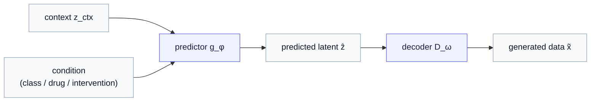
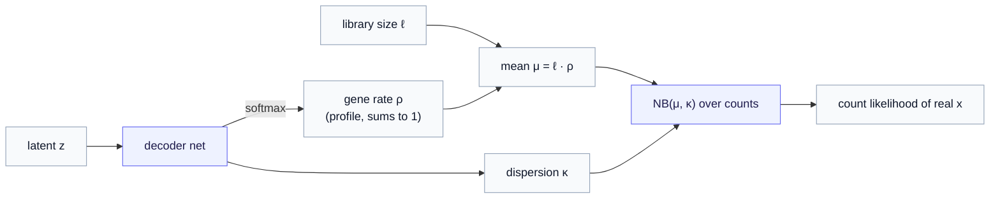
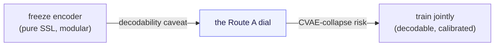

# Part 6 — Route A: a decoder on the latent

*The lowest-friction closure: keep JEPA's predictor, hang a decoder off its output. The cheapest way to close both gaps — and the one that most tempts you to forget JEPA was ever there.*

> **Recap — where this sits.** [Part 5](05-two-gaps-four-routes.md) mapped the design space: a generative JEPA must close **G1** (turn the predictor's single guess into a *distribution* over outcomes) and **G2** (add a *decoder* from latent back to data), and four routes pair those closures differently. This chapter takes **Route A**, the most direct of the four: JEPA already predicts a latent — so just decode it. Cheapest path from encoder to generator. Its very cheapness is also its trap, as we will see. New vocabulary (the count decoder, library size) is defined as it arrives; the [notation reference](notation.md) collects every symbol.

We start with Route A precisely *because* it is the most obvious move, and obvious moves deserve scrutiny. JEPA hands you a predictor $g_\phi$ that maps a context to a latent $\hat z$. A decoder $D_\omega$ maps a latent to data. Compose them and you have a generator. One line of code, both gaps apparently closed. The whole chapter is about what that one line hides — first the mechanics it gets right, then the honest question it forces: *did JEPA actually buy you anything, or have you just rebuilt a VAE wearing a JEPA hat?*

---

## 1. The mechanism — decode the predicted latent

Recall the vanilla JEPA predictor. Given the encoded context $z_{\text{ctx}}$ and a condition (a class, a perturbation, an intervention — whatever you are generating *given*), it returns a single latent:

$$
\hat z = g_\phi(z_{\text{ctx}}, \text{condition}).
$$

Route A adds exactly one thing — a decoder on the end:

$$
\tilde x = D_\omega(\hat z).
$$

That is the entire skeleton. The decoder closes **G2** outright: there is now a map from latent to data, so the model emits an actual data point $\tilde x$ rather than an embedding.

But notice what this skeleton does *not* yet do. The predictor returns one $\hat z$, so the decoder returns one $\tilde x$ — a point estimate, not a population. **G1 is still open.** Closing it means making something on this path *stochastic*, and there are two places to put the randomness — which we get to in §3, because the choice turns out to matter a great deal. First, the decoder itself deserves a careful look, because "add a decoder" is where a subtle, general lesson lives.

---

## 2. G2 — the decoder, and why "just MSE" is the wrong reflex

The naive decoder is a network $D_\omega: z \to x$ trained to **reconstruct**: push the decoded output toward the real data with a squared-error (MSE) or, for binary pixels, a cross-entropy loss. That is exactly what the [Part 3](03-the-decoder.md) starter did for MNIST — a Bernoulli/BCE decoder over pixels — and for images it is fine.

For single-cell gene expression it is *wrong*, and seeing why teaches a lesson that applies to every modality you will ever decode into.

Single-cell RNA-seq data are **gene counts** — for each cell, how many transcripts of each gene were captured. Three properties break a Gaussian/MSE decoder:

- **Counts are non-negative integers**, not continuous reals. An MSE decoder happily predicts $-3.2$ transcripts.
- **They are heavily overdispersed** — the variance across cells is far larger than the mean, which a fixed-variance Gaussian cannot represent.
- **They are dominated by dropout** — typically over 90% of entries are zero, many of them *technical* zeros (the gene was expressed but not captured), a measurement artifact rather than biology.

An MSE decoder spends its capacity fighting all three, modeling measurement noise as if it were signal. The fix is to make the decoder emit the **parameters of a count distribution** rather than a single number, and train it by the *likelihood* of the real counts under that distribution. The standard choice is the **negative binomial** (NB) — read it as "a distribution over counts with a mean $\mu$ and a dispersion $\kappa$ that lets the variance exceed the mean" — or its zero-inflated cousin **ZINB**, which adds an explicit probability of a structural zero for the dropout.

Concretely, the convention this project follows (and the one worth picturing): the decoder turns the latent into a **rate** over genes with a softmax — a relative expression profile $\rho$ that sums to one — then scales it by the cell's **library size** $\ell$ (its total captured counts, i.e. its sequencing depth) to get the NB mean, with a per-gene dispersion:

$$
\rho = \mathrm{softmax}(\text{decoder}(z)), \qquad \mu = \ell \cdot \rho, \qquad x \mid z, \ell \sim \mathrm{NB}(\mu, \kappa).
$$

ZINB adds, per gene, a dropout probability $\pi$ that mixes in extra zeros. The decoder's output is $(\rho, \kappa)$ (and $\pi$ for ZINB); the training signal is how probable the *real* counts are under the resulting distribution.

> **The general lesson — match the decoder to the data's likelihood.** Pixels → Bernoulli/BCE. Counts → NB/ZINB. Continuous sensor values → Gaussian. The decoder is *where the data's measurement model lives*, and getting it right is not fussiness — it is the difference between modeling the signal and modeling the noise. This recurs in every route, because every route that produces data needs a decoder, and this is the part they share.

And here is the payoff that ties back to [Part 5's effect-size argument](05-two-gaps-four-routes.md). A count likelihood grades the model on getting the *magnitude* of each gene's expression right — which is exactly the differential-expression signal a latent-only model was shown to miss. So Route A's decoder is not a formality bolted onto a finished model; it is **the mechanism by which calibrated effect sizes are recovered.** That is why the series insists on closing G2 in *data* space, not just predicting a latent and stopping.

---

## 3. G1 — where you put the stochasticity (and why it matters)

Now close the other gap. A decoder on a deterministic $\hat z$ produces a single predicted profile per condition. The NB is itself a distribution, so you do get *some* spread — but it is **measurement** spread (how noisy the readout of one predicted state is), not **outcome** spread (the genuinely different states the same condition can produce). Those are two different kinds of randomness, and conflating them is a classic error:

- **Observation noise** — the NB's dispersion. "Given *this* cell state, how noisy is the count readout?"
- **Outcome heterogeneity** — the real target of G1. "The same drug drives some cells to fate X and others to fate Y." Identical inputs, genuinely different *states*.

Capturing outcome heterogeneity requires randomness in the **latent**, not just in the decoder. So Route A closes G1 honestly only if you make the *latent* stochastic, and there are two sub-choices:

- **(a) Stochastic predictor.** Have $g_\phi$ emit a *distribution* over $\hat z$ — for instance a Gaussian with mean $\mu_\phi$ and spread $\sigma_\phi$ — then sample $\hat z$ and decode. Draw repeatedly and you get a population of distinct cell states, decoded to a population of count profiles. *(This is already the doorstep of Route B — a stochastic predictor that emits a posterior is, taken seriously, the variational route of [Part 7](07-route-b-variational-and-beyond-gaussian.md). Route A with a stochastic head and Route B differ mostly in how principled you make the prior.)*
- **(b) A separate prior you sample.** Keep the predictor deterministic but draw the latent's variation from a learned prior $p(z)$ — which is exactly what the [Part 2](02-the-latent-prior.md) flow prior did, in its *unconditional* form. Route C ([Part 8](08-route-c-conditioned-diffusion.md)) is the grown-up, *conditional* version of this.

> **The seam to remember.** A deterministic predictor plus an NB decoder gives you measurement noise dressed up as a generative model — it will *look* stochastic (sample the NB and counts jiggle) while missing the multiplicity that makes a response interesting. Honest G1 in Route A means a stochastic latent, sub-choice (a) or (b). Which one you pick is the fork into Routes B and C.

---

## 4. The honest risk — you may have just built a conditional VAE

Here is the tension that makes Route A worth thinking about rather than just typing. Take it at its most natural: a stochastic Gaussian predictor (sub-choice a), a decoder, trained **jointly, end-to-end**, with the reconstruction loss flowing all the way back. Stand back and look at the shape: encoder → a latent *distribution* → decoder → reconstruction, regularized toward a prior. That is, structurally, a **conditional variational autoencoder (CVAE).** You have not obviously built "a generative JEPA"; you may have built a CVAE that happened to start from JEPA weights.

And the JEPA-ness can actively *wash out*. JEPA's whole identity is to predict in latent space and **never reconstruct** — that is what lets its encoder discard unpredictable surface detail and keep meaning. The moment a reconstruction gradient flows back into the encoder, the encoder is pulled to *preserve decodable detail* — precisely the pressure JEPA was designed to avoid. Train long enough jointly and the encoder drifts toward a reconstruction encoder, with JEPA pretraining reduced to a fancy initialization.

This forces the question the whole series circles: **what did JEPA buy?** Two honest postures, and the choice between them is Route A's central design knob:

- **Freeze the encoder** (the [Parts 0–4](index.md) discipline): train only the decoder and head on top. The representation stays a pure self-supervised artifact — but you inherit the **decodability caveat** of [Part 3](03-the-decoder.md): JEPA threw away detail the decoder now wishes it had, so samples can look soft.
- **Train jointly**: you regain decodability and effect-size calibration — but you take on the **CVAE-collapse risk**, and you must *demonstrate*, not assume, that JEPA pretraining bought something a from-scratch CVAE would not have.

> **The methodological discipline of Route A.** Always baseline against a plain conditional VAE trained from scratch. If JEPA-pretraining does not beat it — on sample quality, on effect-size correlation, on data efficiency — then you paid for an expensive initialization and learned nothing about JEPA's generative value. "JEPA's added value must be *shown*, not assumed" is not a slogan here; it is the experiment Route A obligates you to run. *(Where to sit on the freeze ↔ joint dial is genuinely open and application-specific — a frozen encoder for a clean research artifact, a light adapter or partial fine-tune when decodability is failing. Present the trade-off; do not pretend there is a universal setting.)*

---

## 5. Where the Parts 0–4 starter sits in Route A

It is worth placing your own working model precisely, because it sharpens what "conditional Route A" adds. The starter is: freeze the encoder, learn a **marginal** flow prior $p(z)$, decode with a **Bernoulli** head — **unconditional**. In Route A's terms, that is "G2 by a decoder, G1 by sub-choice (b) with a marginal prior, frozen, with the simplest decoder likelihood."

Conditional Route A — the biology-ready version — changes two things: it feeds a **condition** (a baseline cell plus a perturbation, say) into the predictor so generation is *given* an intervention, and it swaps the Bernoulli decoder for a **count-aware** NB/ZINB one so effect sizes are recovered. So the starter is the unconditional skeleton; this chapter is the conditional, calibrated flesh on the same bones.

---

## 6. What it costs, and how it scales

Route A's character, summed up for when you are choosing among the four:

- **Lowest engineering friction.** It reuses decoders you already have and adds no second model. If a count decoder exists in the codebase, Route A is an afternoon's wiring.
- **Cheapest sampling.** One forward pass through predictor and decoder (plus one latent draw). No iterative integration.
- **Produces data directly**, in the right likelihood, so effect-size calibration is *available* — the thing Part 5 said is load-bearing.
- **Its limits are the seams to the other routes.** A single Gaussian predictor is unimodal per condition (the Gaussian critique — straight into Route B). A marginal prior is unconditional (Route C makes it conditional and expressive). And the freeze/joint dial trades decodability against CVAE-collapse with no free lunch.

> **Recap, and the hand-off.** Route A is the cheapest closure: decode the predicted latent (G2), make the latent stochastic (G1), match the decoder's likelihood to the data (NB/ZINB for counts — where effect size is recovered). Its discipline is to prove JEPA earned its keep against a plain CVAE, and its central knob is freeze-versus-joint. The two soft spots it leaves — *unimodal* stochasticity and an *unprincipled* prior — are exactly what the next route repairs. [Part 7 — Route B](07-route-b-variational-and-beyond-gaussian.md) makes the "stochastic predictor" idea principled (the predictor *becomes* the conditional prior) and confronts the Gaussian limitation head-on.

---

*Previous: [Part 5 — Two gaps, four routes](05-two-gaps-four-routes.md). Next: [Part 7 — Route B: variational JEPA, and the trouble with Gaussian](07-route-b-variational-and-beyond-gaussian.md). Symbols: the [notation reference](notation.md).*
