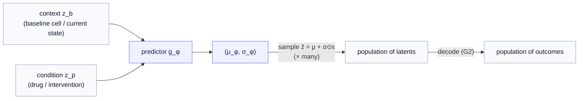
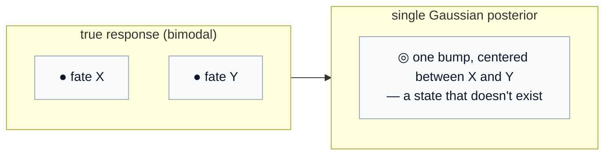
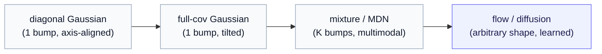

# Part 7 — Route B: variational JEPA, and the trouble with Gaussian

*The predictor stops guessing one latent and starts emitting a whole distribution — becoming, in the bargain, its own conditional prior. The most principled route of the four, and the place the Gaussian assumption finally has to be confronted.*

> **Recap — where this sits.** [Part 5](05-two-gaps-four-routes.md) mapped four routes; [Part 6](06-route-a-latent-decoder-head.md) built Route A (bolt a decoder on the predicted latent) and left two soft spots: its stochasticity was *unimodal* (a single Gaussian predictor), and its prior was *unprincipled* (stochasticity bolted on ad hoc). Route B repairs both by making the predictor **variational** — it emits a distribution, derived from a coherent objective. New vocabulary (posterior, prior, KL, the reparameterization trick) is defined as it arrives; the [notation reference](notation.md) collects every symbol. If "perturbation" or "differential expression" is unfamiliar, the [data-modalities primer](appendix-data-modalities.md) covers them.

At the end of Route A we noticed that the cheapest way to make the predictor stochastic — have it emit a Gaussian and sample — was already standing on the doorstep of a more principled route. This chapter walks through that door. Route B takes the idea seriously: the predictor emits a **posterior** over the next latent, and that posterior, trained against a learnable **prior**, *is* the generative model — nothing bolted on afterward. It is the cleanest theory of the four. It is also where the Gaussian assumption, convenient everywhere so far, finally has to be examined — because in Route B the posterior's *shape* is the model's expressiveness, and a Gaussian's shape is exactly the thing that limits it.

---

## 1. The single change — the predictor emits a distribution

Recall the vanilla JEPA predictor: given the encoded context and a condition, it returns one latent, $\hat z = g_\phi(z_{\text{b}}, z_{\text{p}})$. Here we name the two inputs, because Route B is conditional by design:

- $z_{\text{b}}$ — the **context** (the "before"): the encoded state you start from. In biology, the baseline (control) cell $z_b = f_\theta(x_b)$; in the diabetes example, the person's current metabolic latent. The subscript $b$ reads "baseline."
- $z_{\text{p}}$ — the **condition** (the "what we did"): a learned embedding $z_p = e(p)$ of the intervention $p$ — a drug, a knocked-out gene, a logged action. ($e$ is a small learned embedding, the same trick word embeddings use for tokens.)

Route B changes one thing about the predictor's *output*. Instead of a single latent, it emits the **parameters of a distribution** over the next latent. In the simplest, Gaussian form, that is a mean and a (log-)variance:

$$
(\mu_\phi,\ \log \sigma_\phi^2) = g_\phi(z_b, z_p), \qquad q_\phi(z \mid z_b, z_p) = \mathcal{N}\big(\mu_\phi,\ \mathrm{diag}(\sigma_\phi^2)\big).
$$

Read it in words: given the context $z_b$ and the condition $z_p$, the predictor returns a **cloud** of plausible next-latents — centered at $\mu_\phi$, with a per-dimension spread $\sigma_\phi$.

**A reminder of the object itself**, since few of us keep it memorized: a one-dimensional Gaussian $\mathcal{N}(\mu, \sigma^2)$ is the bell-shaped density $p(z) = \frac{1}{\sigma\sqrt{2\pi}} \exp\big(-\frac{(z-\mu)^2}{2\sigma^2}\big)$ — a single hump peaked at the mean $\mu$, with width set by the standard deviation $\sigma$. The multi-dimensional $\mathcal{N}(\mu, \Sigma)$ is that same shape lifted to vectors, with a covariance matrix $\Sigma$ setting the cloud's size and orientation. Here $\Sigma = \mathrm{diag}(\sigma_\phi^2)$ is **diagonal** — each coordinate gets its own variance and the density factorizes into independent per-dimension bells (an axis-aligned ellipsoid; what that costs is §3).

The symbol $q_\phi$ is the **posterior**: "the distribution of the outcome latent $z$, *given* the context and the condition," with the $q$ flagging it as a *learned approximation* (the variational-autoencoder tradition). The $\mathrm{diag}$ says the covariance is **diagonal** — each latent dimension gets its own independent spread, no modeled correlations (we will come back to this — it is one of the two defects).

To actually draw an outcome you use the **reparameterization trick**: sample standard noise and shift-and-scale it by the predicted parameters,

$$
\hat z = \mu_\phi + \sigma_\phi \odot \varepsilon, \qquad \varepsilon \sim \mathcal{N}(0, I),
$$

where $\odot$ is the elementwise product. Each fresh $\varepsilon$ gives a different $\hat z$ — a different plausible outcome — and (the reason for the trick rather than a raw sampler) gradients flow through $\mu_\phi, \sigma_\phi$ so the predictor is trainable. Draw repeatedly and you get a **population** of outcomes; decode each (a data-space decoder, exactly Route A's G2) and you get a population of data points.

That is the whole mechanism. It closes **G1** the *honest* way Route A asked for — stochasticity in the **latent**, capturing genuine outcome heterogeneity, not just measurement noise — and a decoder closes **G2**.

**Worked example.** Apply one drug to two genetically identical cells; they respond a little differently — real biology is stochastic. A deterministic predictor cannot represent "a range of plausible after-states"; the posterior $q_\phi$ can, and sampling it 1,000 times simulates a population of responding cells. Same structure in the diabetes example: "given today and *more exercise*, here is the spread of plausible next states," not one.

---

## 2. Why this is the *clean* route — the predictor becomes the conditional prior

Here is the elegant part, and the reason Route B is often called the most principled of the four.

In Route A (and in the [Parts 0–4](index.md) starter) the thing you sample from was a **separate** prior $p(z)$, bolted onto a frozen encoder after the fact. Route B has no separate prior. The object you sample from at generation time *is* the predictor's own conditional distribution. More precisely, the variational frame has two distributions and a coupling:

- the **posterior** $q_\phi(z \mid z_b, z_p)$ — the predictor's output, used during *training*, where it is allowed to be pulled toward the true outcome;
- a **learnable conditional prior** $\pi(z \mid z_b, z_p)$ — what you sample from at *generation* time, when no outcome is available to peek at;
- a **KL term** $\mathrm{KL}(q_\phi \Vert \pi)$ that pulls the two together. (KL divergence reads as "how different are these two distributions"; driving it down makes the prior you sample from agree with the posterior the model learned.)

The slogan **"the predictor becomes the conditional prior"** is exactly this: the JEPA predictor already maps $(z_b, z_p)$ to a prediction, so it is *precisely* the object that should emit the conditional prior — no new module, you simply reinterpret its output as distribution parameters. The generative machinery and the JEPA predictor are the *same network*. That is why the theory is clean: you did not staple a generative model onto JEPA; you let JEPA's own predictor *be* the generative model.

The training objective collects the pieces — the latent prediction that carries JEPA's representation quality, the KL that makes the prior sampleable, and the decoder term that closes G2 in data space (the part that, from [Part 5 §3](05-two-gaps-four-routes.md), recovers effect size):

$$
\mathcal{L} = \underbrace{\mathcal{L}_{\text{predict}}}_{\text{latent match}} + \lambda_{\text{kl}} \underbrace{\mathcal{L}_{\text{KL}}}_{\text{prior} \leftrightarrow \text{posterior}} + \lambda_{\text{dec}} \underbrace{\mathcal{L}_{\text{decode}}}_{\text{NB/ZINB or pixel}}.
$$

> **The honest cost.** Two things you now have to manage that Route A did not force on you: the **variational machinery** (a prior network, a KL term), and the **balancing of predictive vs. generative terms** — the weight $\lambda_{\text{kl}}$ especially. Too much KL and the posterior collapses to the prior (it ignores the input and stops being informative); too little and the prior you sample from never matches the posterior you trained, so generation drifts. This loss-balancing is the practical tax of the cleanest theory.

So far, so good — and so clean. But there is a catch hiding inside that innocuous $\mathcal{N}(\cdot)$, and it is the one you flagged from the start.

---

## 3. The trouble with Gaussian — unimodality per condition

This is the heart of the chapter. The Gaussian posterior is the textbook default, and it is tempting to accept it as obviously adequate. It is not — and the reason is **not** "Gaussians are too simple." It is sharper and more specific:

> **The real defect.** A diagonal Gaussian is **unimodal per condition**. For one *fixed* context-and-condition $(z_b, z_p)$ it can place only a **single bump** of probability. When the truth has *two* plausible outcomes for that one condition, the Gaussian cannot represent both — it centers a single bump *between* them, predicting a state that is **neither**.

**Worked example — the failure in one picture.** A drug drives some cells toward fate X and others toward fate Y — a genuinely **bimodal** response (this is common; cells at a decision point commit to different lineages). The true outcome distribution has two peaks. A single Gaussian, forced to cover both with one bump, sits in the valley *between* the peaks — assigning highest probability to a cell state that essentially never occurs.

And there is a **second**, independent defect from the same line of math: the $\mathrm{diag}$ in $\mathrm{diag}(\sigma_\phi^2)$. A diagonal covariance forbids any *correlation* between latent dimensions — the cloud is an axis-aligned ellipsoid, never a tilted one. So even within a single mode it cannot express "when this direction goes up, that one goes down," the co-variation a real response is full of.

Why this matters for the applications, stated plainly: real perturbation responses **are** multimodal (cells take different fates), and a person's trajectory can genuinely fork. A model that averages modes into a nonexistent midpoint mis-estimates exactly the structure you care about — and, tying back, it corrupts the effect-size and counterfactual predictions that were the whole point of reaching data space.

> **A trade-off, not a verdict.** The Gaussian is not *worthless* — it buys real things: a **closed-form density** (you can write down $q(z)$ and score it), **one-shot sampling** (one draw, no iteration), and a **tidy KL** with a Gaussian prior. The price for all that convenience is unimodality and zero correlations. So the Gaussian is a **floor**, not the answer — the right baseline to start from and the thing to *surpass* the moment the response is genuinely multi-modal. Where to sit on that dial is application-specific; the rest of this chapter is the ladder up from the floor.

---

## 4. Beyond Gaussian — expressive posteriors

The fix is to keep the variational frame but make the posterior **richer**. There is a ladder, rising in expressiveness (and cost):

| posterior | what it adds | what it costs | fixes |
|---|---|---|---|
| **diagonal Gaussian** | the floor | nothing — closed form, one-shot | — |
| **full-covariance Gaussian** | correlations between dimensions (tilted ellipsoid) | a full covariance to parameterize | the diagonal defect |
| **mixture (MDN)** | several Gaussian bumps → genuinely **multimodal** | pick the number of components $K$; mode-collapse risk | the unimodality defect |
| **normalizing-flow / flow-matching posterior** | an (almost) **arbitrary** shape, learned | iterative sampling; no closed-form density | both, fully |
| **diffusion posterior** | arbitrary shape via many denoising steps | heaviest; a second model | both — and this *is* Route C |

The **mixture density network (MDN)** is the direct cure for the bimodal-response example: a weighted sum of Gaussians, $\sum_m \alpha_m \mathcal{N}(\mu_m, \sigma_m^2)$, can put one component on fate X and another on fate Y instead of straddling them. The **flow** and **diffusion** rows go further — they drop the closed-form distribution entirely and *learn the transport* from noise to latent.

That last move deserves a precise statement, because it unifies this whole route with the next one:

> **The reparameterization trick *is* a one-step flow.** Look again at $\hat z = \mu_\phi + \sigma_\phi \odot \varepsilon$: it is a fixed, closed-form, **one-shot** map from noise to latent, and because it is affine, the only shapes it can reach are Gaussians. A flow keeps the same "transport the noise to a latent" idea but lets the map be a **learned, many-step** drift — so the reachable distribution can be any shape. "Beyond Gaussian" is, literally, *let the noise-to-latent map have more than one step.* The expressive posteriors of Route B and the diffusion model of Route C are points on a single continuum: how expressive you let the conditional sampler be. (This is also the seed of the **conditional flow-matching prior** — a learned conditional transport over the JEPA latent — which is the natural next step beyond this series.)

---

## 5. One Route-B-specific choice — decode where?

A design fork unique to the variational route: the posterior can be trained to reconstruct in **representation space** or in **data space**, and the difference decides whether you recover effect size.

- **Representation-space decoding.** Match the sampled latent against the target *encoder's* embedding of the true outcome — stay entirely in JEPA's latent world, no data decoder. Clean and cheap, but it never produces data, so (recall [Part 5 §3](05-two-gaps-four-routes.md)) it cannot recover effect-size magnitude. Fine for studying the latent; insufficient for the benchmark.
- **Data-space decoding.** Hang Route A's count/pixel decoder on the sampled latent. Now you produce actual data and recover calibrated effect sizes — at the cost of the decoder and its likelihood.

The practical upshot: a *useful* Route B is **the variational predictor (the principled G1) composed with Route A's data decoder (the G2).** The routes are not rivals — Route B supplies the clean stochastic head, Route A supplies the decoder, and together they are the staged model the [computational-biology chapter](11-application-computational-biology.md) builds (intra-cell JEPA encoder → variational perturbation predictor → count decoder).

---

## 6. The honest placement — yes, this is a conditional VAE

It is worth saying out loud, because [Route A §4](06-route-a-latent-decoder-head.md) raised it and Route B is where it becomes undeniable: a variational predictor with a Gaussian posterior and a data decoder, trained jointly, **is a conditional variational autoencoder (CVAE)** living in JEPA's latent space. The encoder produces a context, the predictor produces a latent distribution, a decoder reconstructs — that is a CVAE, full stop.

The series does not hide from this; it **owns** it. The difference Route B makes over "just train a CVAE" is *principle, not architecture*: Route A bolted stochasticity on ad hoc; Route B derives it from a coherent variational objective with a real prior and a KL coupling, on top of a **JEPA-pretrained, dropout-robust encoder** and the predict-in-latent objective. Same family, cleaner derivation, stronger encoder. And the discipline from Route A still binds: you must **show** that the JEPA pretraining and the variational structure beat a plain CVAE trained from scratch — on effect-size correlation, on calibration, on data efficiency — rather than assume it. The honest meta-point from [Part 5 §5](05-two-gaps-four-routes.md) stands: you have rebuilt a CVAE with JEPA as encoder pretraining, and a tractable data-space likelihood is still not free.

---

## 7. What it costs, and where it leads

Route B's character, for when you are choosing among the four:

- **Cleanest theory.** The predictor *is* the conditional prior; generation is native and conditional (unlike the starter's unconditional flow prior).
- **Honest G1.** Latent-level stochasticity captures real outcome heterogeneity, not just measurement noise.
- **Its central cost is the Gaussian floor.** A diagonal Gaussian is unimodal and uncorrelated; real responses need expressive posteriors (full-covariance, mixture, flow, diffusion), which buy multimodality at the price of closed-form density and one-shot sampling.
- **Plus loss-balancing.** The KL weight is a live knob — collapse on one side, drift on the other.

> **Recap, and the hand-off.** Route B makes the predictor variational: it emits a posterior $q_\phi(z \mid z_b, z_p)$, *becomes* its own conditional prior via a KL-coupled learnable prior, closes G1 honestly in the latent, and composes with Route A's decoder for G2. Its defining issue is the **Gaussian floor** — unimodal per condition, no correlations — which the expressive-posterior ladder climbs out of. And the top of that ladder, where the posterior becomes a *learned, multi-step transport*, is no longer a closed-form distribution at all — it is a **diffusion model conditioned on the latent**. Following that one step further lands us in [Part 8 — Route C](08-route-c-conditioned-diffusion.md): the most modular and most expressive route, where the generative model is a separate network and the JEPA latent is its condition.

---

*Previous: [Part 6 — Route A: a decoder on the latent](06-route-a-latent-decoder-head.md). Next: [Part 8 — Route C: representation-conditioned diffusion](08-route-c-conditioned-diffusion.md). Symbols: the [notation reference](notation.md). Unfamiliar with the biology? The [data-modalities primer](appendix-data-modalities.md).*
