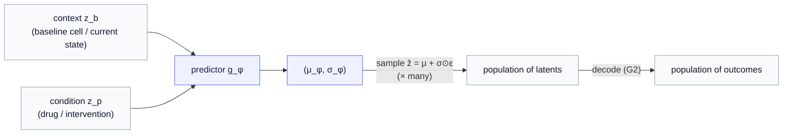
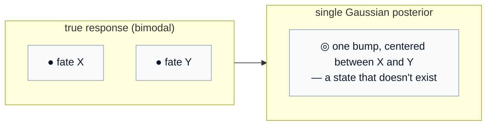
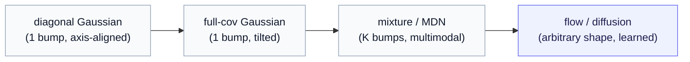

# Part 7 — Route B: variational JEPA, and the trouble with Gaussian

*The most principled route of the four — and the place the Gaussian assumption finally has to be confronted.*

> **Recap — where this sits.** [Part 5](05-two-gaps-four-routes.md) mapped four routes; [Part 6](06-route-a-latent-decoder-head.md) built Route A (bolt a decoder on the predicted latent) and left two soft spots: its stochasticity was *unimodal* (a single Gaussian predictor), and its prior was *unprincipled* (stochasticity bolted on ad hoc). Route B repairs both by making the predictor **variational** — it emits a distribution, derived from a coherent objective. New vocabulary (posterior, prior, KL, the reparameterization trick) is defined as it arrives; the [notation reference](notation.md) collects every symbol. If "perturbation" or "differential expression" is unfamiliar, the [data-modalities primer](appendix-data-modalities.md) covers them.

Let us pick up the thread. [Route A](06-route-a-latent-decoder-head.md) closed both gaps the cheapest way — decode the predicted latent, and make it stochastic — but the stochasticity was *improvised*: the simplest way to get it was to have the predictor emit a Gaussian and sample, with no principled account of *what distribution* the latent should actually follow. That works, and it was the right first step, but it is unsatisfying. A generative model ought to *state* its latent distribution and derive its randomness from a coherent objective, not approximate one by reflex — and, as Route A flagged, an improvised single Gaussian is both unimodal and bolted-on rather than derived. That dissatisfaction is exactly what the next route answers.

Route B is where the predictor stops guessing a single latent and starts emitting a **whole distribution** — and, in the bargain, becomes its own **conditional prior**: the posterior it emits, trained against a learnable prior, *is* the generative model, with nothing bolted on afterward. That makes it the cleanest theory of the four. It is also where the Gaussian assumption, convenient everywhere so far, finally has to be confronted — because in Route B the posterior's *shape* is the model's expressiveness, and a Gaussian's shape is exactly the thing that limits it.

---

## 1. The single change — the predictor emits a distribution

From [Part 5](05-two-gaps-four-routes.md) and [Route A](06-route-a-latent-decoder-head.md) we have the predictor's general shape: it takes a context and a condition and returns the next latent, $\hat z = g_\phi(z_{\text{ctx}}, \text{condition})$. So far "condition" has been left abstract. Route B commits fully to the *conditional* setting, so this is the moment to give those two inputs concrete names — the conditioning vocabulary [Part 5](05-two-gaps-four-routes.md) said would arrive here. The conditional setting is easy to picture: a state you start from, and an intervention applied to it.

- $z_b$ — the **context** (the "before"): the encoded state you start from — the same role Parts 5–6 called $z_{\text{ctx}}$, now written $z_b$. In biology, the baseline (control) cell, $z_b = f_\theta(x_b)$; in the diabetes example, the person's current metabolic latent. The subscript $b$ reads "baseline."
- $z_p$ — the **condition / intervention** (the "what we did"): a learned embedding $z_p = e(p)$ of the intervention $p$ — a drug, a knocked-out gene, a logged action. ($e$ is a small learned embedding, the same trick word embeddings use for tokens.)

With those names in hand, the conditioned predictor is $\hat z = g_\phi(z_b, z_p)$ — the *same* predictor, with the abstract "condition" now spelled out as the (baseline, intervention) pair. Note that $z_b$ and $z_p$ come from **different maps** — $z_b$ from the encoder $f_\theta$, $z_p$ from a separate learned embedding $e$ — a distinction worth pausing on; the [Q&A on the condition embedding](QA/condition-embedding-where-it-comes-from.md) explains why they differ, where $e$ comes from, and how each is trained.

Route B changes one thing about the predictor's *output*. Instead of a single latent, it emits the **parameters of a distribution** over the next latent. In the simplest, Gaussian form, that is a mean and a (log-)variance:

$$
(\mu_\phi,\ \log \sigma_\phi^2) = g_\phi(z_b, z_p), \qquad q_\phi(z \mid z_b, z_p) = \mathcal{N}\big(\mu_\phi,\ \mathrm{diag}(\sigma_\phi^2)\big).
$$

Read it in words: given the context $z_b$ and the condition $z_p$, the predictor returns a **cloud** of plausible next-latents — centered at $\mu_\phi$, with a per-dimension spread $\sigma_\phi$.

**A reminder of the object itself**, since few of us keep it memorized: a one-dimensional Gaussian $\mathcal{N}(\mu, \sigma^2)$ is the bell-shaped density $p(z) = \frac{1}{\sigma\sqrt{2\pi}} \exp\big(-\frac{(z-\mu)^2}{2\sigma^2}\big)$ — a single hump peaked at the mean $\mu$, with width set by the standard deviation $\sigma$. The multi-dimensional $\mathcal{N}(\mu, \Sigma)$ is that same shape lifted to vectors, with a covariance matrix $\Sigma$ setting the cloud's size and orientation. Here $\Sigma = \mathrm{diag}(\sigma_\phi^2)$ is **diagonal** — each coordinate gets its own variance and the density factorizes into independent per-dimension bells (an axis-aligned ellipsoid; what that costs is §3).

The symbol $q_\phi$ is the **posterior**: "the distribution of the outcome latent $z$, *given* the context and the condition," with the $q$ flagging it as a *learned approximation* (the variational-autoencoder tradition). One clarification worth making now, since it is a natural place to stumble: this is the *posterior*, and its partner the **prior** — also a distribution over the same outcome latent $z$ given $(z_b, z_p)$, but *blind to the actual outcome* — arrives shortly in §2 below. The conditioning context $z_b, z_p$ is not itself the prior; it is the *givens* that both distributions sit on. The two differ only in whether they have seen the outcome. The $\mathrm{diag}$ says the covariance is **diagonal** — each latent dimension gets its own independent spread, no modeled correlations (we will come back to this — it is one of the two defects).

To actually draw an outcome you use the **reparameterization trick**: sample standard noise and shift-and-scale it by the predicted parameters,

$$
\hat z = \mu_\phi + \sigma_\phi \odot \varepsilon, \qquad \varepsilon \sim \mathcal{N}(0, I),
$$

where $\odot$ is the elementwise product. Each fresh $\varepsilon$ gives a different $\hat z$ — a different plausible outcome — and (the reason for the trick rather than a raw sampler) gradients flow through $\mu_\phi, \sigma_\phi$ so the predictor is trainable. Draw repeatedly and you get a **population** of outcomes; decode each (a data-space decoder, exactly Route A's G2) and you get a population of data points.

That is the whole mechanism. It closes **G1** the *honest* way Route A asked for — stochasticity in the **latent**, capturing genuine outcome heterogeneity, not just measurement noise — and a decoder closes **G2**.

> **Want the architecture spelled out?** The diagrams in this chapter stay abstract. If you want JEPA's two-stream design rebuilt from scratch — exactly which stream produces $z_b$, $z_p$, the EMA goalpost $z'$, and the $(\mu_\phi, \sigma_\phi)$ heads, and where the reparameterized sample is born — the companion [Part 7a](07a-jepa-two-streams-and-route-b.md) is the wiring diagram, with a vector-by-vector inventory.

**Worked example.** Apply one drug to two genetically identical cells; they respond a little differently — real biology is stochastic. A deterministic predictor cannot represent "a range of plausible after-states"; the posterior $q_\phi$ can, and sampling it 1,000 times simulates a population of responding cells. Same structure in the diabetes example: "given today and *more exercise*, here is the spread of plausible next states," not one.

---

## 2. Why this is the *clean* route — the predictor becomes the conditional prior

Here is the elegant part, and the reason Route B is often called the most principled of the four.

In Route A (and in the [Parts 0–4](index.md) starter) the thing you sample from was a **separate** prior $p(z)$, bolted onto a frozen encoder after the fact. Route B has no separate prior. The object you sample from at generation time *is* the predictor's own conditional distribution. More precisely, the variational frame has two distributions and a coupling:

- the **posterior** $q_\phi(z \mid z_b, z_p)$ — the predictor's output, used during *training*, where it is allowed to be pulled toward the true outcome;
- a **learnable conditional prior** $\pi(z \mid z_b, z_p)$ — what you sample from at *generation* time, when no outcome is available to peek at;
- a **KL term** $\mathrm{KL}(q_\phi \Vert \pi)$ that pulls the two together. (KL divergence reads as "how different are these two distributions"; driving it down makes the prior you sample from agree with the posterior the model learned.)

That prior deserves a word of its own, since it is the genuinely new object in the list. A *prior* is what you believe about the outcome latent *before* seeing the outcome, and both words attached to it here mark a departure from the textbook variational autoencoder. In a standard VAE the prior is a fixed, input-free standard normal $\mathcal{N}(0, I)$. This one is instead **learnable** — its parameters are trained rather than fixed — and **conditional** — it depends on the baseline $z_b$ and the intervention $z_p$, so each condition gets its own outcome cloud. Why both departures are necessary rather than cosmetic is what the companion [Part 7b](07b-the-prior-and-the-kl-term.md) works out; here it is enough to hold that the prior is trained and condition-aware, not the off-the-shelf unit Gaussian.

The slogan **"the predictor becomes the conditional prior"** is exactly this: the JEPA predictor already maps $(z_b, z_p)$ to a prediction, so it is *precisely* the object that should emit the conditional prior — no new module, you simply reinterpret its output as distribution parameters. The generative machinery and the JEPA predictor are the *same network*. That is why the theory is clean: you did not staple a generative model onto JEPA; you let JEPA's own predictor *be* the generative model.

The training objective collects the pieces — the latent prediction that carries JEPA's representation quality, the KL that makes the prior sampleable, and the decoder term that closes G2 in data space (the part that, from [Part 5 §3](05-two-gaps-four-routes.md), recovers effect size):

$$
\mathcal{L} = \underbrace{\mathcal{L}_{\text{predict}}}_{\text{latent match}} + \lambda_{\text{kl}} \underbrace{\mathcal{L}_{\text{KL}}}_{\text{prior} \leftrightarrow \text{posterior}} + \lambda_{\text{dec}} \underbrace{\mathcal{L}_{\text{decode}}}_{\text{NB/ZINB or pixel}}.
$$

> **The honest cost.** Two things you now have to manage that Route A did not force on you: the **variational machinery** (a prior network, a KL term), and the **balancing of predictive vs. generative terms** — the weight $\lambda_{\text{kl}}$ especially. Too much KL and the posterior collapses to the prior (it ignores the input and stops being informative); too little and the prior you sample from never matches the posterior you trained, so generation drifts. This loss-balancing is the practical tax of the cleanest theory.

So far, so good — and so clean. But there is a catch hiding inside that innocuous $\mathcal{N}(\cdot)$, and it is the one you flagged from the start.

---

## 3. The trouble with Gaussian — unimodality per condition

This is the heart of the chapter. The Gaussian posterior is the textbook default, and it is tempting to accept it as obviously adequate. It is not — and the reason is **not** "Gaussians are too simple." It is sharper and more specific:

> **The real defect.** A diagonal Gaussian is **unimodal per condition**. For one *fixed* context-and-condition $(z_b, z_p)$ it can place only a **single bump** of probability. When the truth has *two* plausible outcomes for that one condition, the Gaussian cannot represent both — it centers a single bump *between* them, predicting a state that is **neither**.

**Worked example — the failure in one picture.** Picture a drug that pushes a cell to a *decision point* — a fork from which two different developmental **trajectories** branch, one ending at fate X, the other at fate Y. Identical cells go one way or the other (this is common; cells at a lineage branch commit to one path or the other), so the distribution of *outcomes* has two distinct peaks: it is genuinely **bimodal**. A single Gaussian, forced to cover both peaks with one bump, sits in the valley *between* them — assigning its highest probability to a cell state that lies on neither path and essentially never occurs. (The two diverging *paths* are the underlying cause; what the predictor must represent here is the two-peaked distribution of where they *end up* — the trajectory itself is what the temporal world model would roll out, [§6 of Part 9](09-conditional-flow-prior.md).)

And there is a **second**, independent defect from the same line of math: the $\mathrm{diag}$ in $\mathrm{diag}(\sigma_\phi^2)$. A diagonal covariance forbids any *correlation* between latent dimensions — the cloud is an axis-aligned ellipsoid, never a tilted one. So even within a single mode it cannot express "when this direction goes up, that one goes down," the co-variation a real response is full of.

Why this matters for the applications, stated plainly — and it shows up in *both* domains this series carries, so consider each in turn. In the **cell** setting, real perturbation responses are routinely multimodal: identical cells commit to different fates. In the **digital-phenotyping** setting (the diabetes example), a *person's* metabolic trajectory can genuinely **fork** over time — the same starting state under the same intervention can plausibly lead to two distinct futures (a regimen that stabilizes one week and slips the next). Either way, a model that averages those modes into a nonexistent midpoint mis-estimates exactly the structure you care about — and, tying back, it corrupts the effect-size and counterfactual predictions that were the whole point of reaching data space.

> **A trade-off, not a verdict.** The Gaussian is not *worthless* — it buys real things: a **closed-form density** (you can write down $q(z)$ and score it), **one-shot sampling** (one draw, no iteration), and a **tidy KL** with a Gaussian prior. The price for all that convenience is unimodality and zero correlations. So the Gaussian is a **floor**, not the answer — the right baseline to start from and the thing to *surpass* the moment the response is genuinely multi-modal. Where to sit on that dial is application-specific; the rest of this chapter is the ladder up from the floor.

---

## 4. Beyond Gaussian — expressive posteriors

The fix is to keep the variational frame but make the posterior **richer**. There is a ladder, rising in expressiveness (and cost):

| posterior | what it adds | what it costs | fixes |
|---|---|---|---|
| **diagonal Gaussian** | the floor | nothing — closed form, one-shot | — |
| **full-covariance Gaussian** | correlations between dimensions (tilted ellipsoid) | a full covariance to parameterize | the diagonal defect |
| **mixture (MDN)** | several Gaussian bumps → genuinely **multimodal** | pick the number of components $K$; mode-collapse risk | the unimodality defect |
| **normalizing-flow / flow-matching posterior** | an (almost) **arbitrary** shape, learned | iterative sampling; no closed-form density | both, fully |
| **diffusion posterior** | arbitrary shape via many denoising steps | heaviest; a second model | both — and this *is* Route C |

The **mixture density network (MDN)** is the direct cure for the bimodal-response example: a weighted sum of Gaussians, $\sum_m \alpha_m \mathcal{N}(\mu_m, \sigma_m^2)$, can put one component on fate X and another on fate Y instead of straddling them. The **flow** and **diffusion** rows go further — they drop the closed-form distribution entirely and *learn the transport* from noise to latent.

That last move deserves a precise statement, because it unifies this whole route with the next one:

> **The reparameterization trick *is* a one-step flow.** Look again at $\hat z = \mu_\phi + \sigma_\phi \odot \varepsilon$: it is a fixed, closed-form, **one-shot** map from noise to latent, and because it is affine, the only shapes it can reach are Gaussians. A flow keeps the same "transport the noise to a latent" idea but lets the map be a **learned, many-step** drift — so the reachable distribution can be any shape. "Beyond Gaussian" is, literally, *let the noise-to-latent map have more than one step.* The expressive posteriors of Route B and the diffusion model of Route C are points on a single continuum: how expressive you let the conditional sampler be. (This is also the seed of the **conditional flow prior** — a learned conditional transport over the JEPA latent — which [Part 9](09-conditional-flow-prior.md) builds in full, and [Part 9a](09a-three-identities-formalized.md) shows is the very same object Route B reaches at the top of this ladder.)

---

## 5. Representation space vs data space — and how the loss $\mathcal{L}$ closes both gaps

Everything in §1–4 was about the *shape of the distribution* over the outcome latent — that is **G1**, the "give me a distribution over outcomes" gap, and we have now handled it (a posterior, sampled, made expressive). But a distribution over *latents* is not yet data. To close **G2** and recover effect size, the model has to be held accountable in **data space** — and that raises a fork worth seeing clearly, because one side of it is *literally vanilla JEPA*.

**Representation-space matching — this side is the original JEPA.** The representation learner you started from never decodes to data at all: it trains purely by matching its predicted latent against the *target encoder's* latent — the EMA goalpost $z' = f_{\bar\theta}(x_{\text{out}})$ from [Part 7a](07a-jepa-two-streams-and-route-b.md). In Route B that is the **predict** term, pulling the posterior mean toward the encoded real outcome:

$$
\mathcal{L}_{\text{predict}} = \big\lVert \mu_\phi - \mathrm{sg}(z') \big\rVert^2.
$$

This is exactly JEPA-as-representation-learner, intact inside Route B — and it is what keeps the latent *meaningful*. But notice what it does **not** do: it never produces a data point, defines no density over data, so on its own it cannot recover effect-size *magnitude* (the [Part 5 §3](05-two-gaps-four-routes.md) finding). Representation-space matching is necessary, and **not generative**.

**Data-space decoding — this side is what makes it a generative model.** To emit actual data — and recover effect size — you hang a decoder on the *sampled* latent $\hat z$ (Route A's NB count head, or a pixel head) and score the real data under it: the **decode** term $\mathcal{L}_{\text{decode}}$. This is the step that reaches data space, closes **G2**, and is where effect-size magnitude lives. Data-space decoding is JEPA-as-generative-model.

> **The distinction in one line.** Representation-space matching is what makes JEPA a good *representation learner*; data-space decoding is the addition that makes it a *generative model*. Route B does both — but that is only *two* of its three pieces. The part §1–4 built sits in between: the prediction is now a **distribution** ($\mu_\phi, \sigma_\phi$), not a fixed latent $z$, and that variational head is what supplies **G1**. So the full move is three-fold — *keep* the representation backbone, *make the prediction variational* (G1), and *decode to data* (G2) — which is exactly the three terms of the loss below.

Now read the full Route B loss (the one from §2) through this lens. Each term has a distinct job, and the three together are exactly why one objective addresses *both* gaps:

$$
\mathcal{L} = \underbrace{\mathcal{L}_{\text{predict}}}_{\text{rep-space: JEPA backbone}} + \lambda_{\text{kl}} \underbrace{\mathcal{L}_{\text{KL}}}_{\text{G1: prior} \leftrightarrow \text{posterior}} + \lambda_{\text{dec}} \underbrace{\mathcal{L}_{\text{decode}}}_{\text{G2: data-space decode}}.
$$

And — the part not to gloss over — with a Gaussian posterior and prior, each of the three terms has a closed or standard form you can write down and implement.

**(1) The representation-space term** is the latent match from above, anchoring the posterior mean to the EMA-encoded real outcome:

$$
\mathcal{L}_{\text{predict}} = \big\lVert \mu_\phi - \mathrm{sg}(z') \big\rVert^2.
$$

This is vanilla JEPA's *entire* loss — it keeps the representation strong, but alone is not generative.

**(2) The KL term** has a **closed form** (no sampling needed) between the diagonal-Gaussian posterior $q = \mathcal{N}(\mu_\phi, \mathrm{diag}(\sigma_\phi^2))$ and the learnable prior $\pi = \mathcal{N}(\mu_\pi, \mathrm{diag}(\sigma_\pi^2))$ — summing a per-dimension expression over the $D$ latent coordinates $i$:

$$
\mathcal{L}_{\text{KL}} = \sum_{i=1}^{D} \left[ \log\frac{\sigma_{\pi,i}}{\sigma_{\phi,i}} + \frac{\sigma_{\phi,i}^2 + (\mu_{\phi,i} - \mu_{\pi,i})^2}{2 \sigma_{\pi,i}^2} - \frac{1}{2} \right].
$$

(If you fix the prior to a standard normal, $\pi = \mathcal{N}(0, I)$ — the textbook VAE choice — this collapses to the familiar $\frac{1}{2}\sum_i (\sigma_{\phi,i}^2 + \mu_{\phi,i}^2 - 1 - \log \sigma_{\phi,i}^2)$.) This term is what makes **G1** *principled* rather than improvised: it ties the posterior to a prior you can sample at generation, so the stochasticity is *derived*, not bolted on — the whole reason Route B is "Route B" and not "Route A with a Gaussian head."

> **Why a *learnable* prior, why pull the posterior toward it, and where this KL formula comes from.** Those three questions deserve more than a formula. The companion [Part 7b](07b-the-prior-and-the-kl-term.md) answers each in turn: why the prior is learnable and *conditional* rather than the textbook $\mathcal{N}(0, I)$; why the coupling is a train/test consistency constraint (the decoder is trained on posterior samples but generation draws from the prior) that also *falls out* of a variational lower bound; and the full derivation of the closed-form diagonal-Gaussian KL above, with the standard-normal case as a check.

**(3) The decoder term** is the negative log-likelihood of the *real* data under the decoder applied to a sampled latent $\hat z$. For single-cell counts that is the **negative-binomial** NLL — summed over genes $g$:

$$
\mathcal{L}_{\text{decode}} = -\sum_g \log \mathrm{NB}\big(x_g \mid \mu_g, \kappa_g\big), \qquad \mu = \ell \rho, \quad \rho = \mathrm{softmax}(\text{decoder}(\hat z)),
$$

which [Part 6 §2](06-route-a-latent-decoder-head.md) writes out factor by factor; for images it is the Bernoulli/BCE pixel loss. This closes **G2** and is where effect-size magnitude is recovered.

So a *useful* Route B is the variational predictor (the principled **G1**) composed with a data-space decoder (the **G2**), with the representation-space term as the JEPA backbone they both ride on. The routes are not rivals: Route B supplies the clean stochastic head, Route A supplies the decoder, and together they are the staged model the [computational-biology chapter](11-application-computational-biology.md) builds (intra-cell JEPA encoder → variational perturbation predictor → count decoder).

---

## 6. The honest placement — yes, this is a conditional VAE

It is worth saying out loud, because [Route A §4](06-route-a-latent-decoder-head.md) raised it and Route B is where it becomes undeniable: a variational predictor with a Gaussian posterior and a data decoder, trained jointly, **is a conditional variational autoencoder (CVAE)** living in JEPA's latent space. The encoder produces a context, the predictor produces a latent distribution, a decoder reconstructs — that is a CVAE, full stop.

The series does not hide from this; it **owns** it. The difference Route B makes over "just train a CVAE" is *principle, not architecture*: Route A bolted stochasticity on ad hoc; Route B derives it from a coherent variational objective with a real prior and a KL coupling, on top of a **JEPA-pretrained, dropout-robust encoder** and the predict-in-latent objective. Same family, cleaner derivation, stronger encoder. And the discipline from Route A still binds: you must **show** that the JEPA pretraining and the variational structure beat a plain CVAE trained from scratch — on effect-size correlation, on calibration, on data efficiency — rather than assume it. The honest meta-point from [Part 5 §5](05-two-gaps-four-routes.md) stands: you have rebuilt a CVAE with JEPA as encoder pretraining, and a tractable data-space likelihood is still not free.

### The landmark — Var-JEPA, and where Route B is a deliberate subset of it

This whole reframing is not ours alone: it is the thesis of **Var-JEPA**, the variational formulation of JEPA we name in [Part 5](05-two-gaps-four-routes.md) as Route B's landmark. It is worth being precise about what we share with it and where it goes further, because the differences are exactly the design choices Route B is making — and seeing them sharpens what "Route B" even is.

**What we share — the central insight is the same.** Var-JEPA reverse-engineers a latent-variable model whose ELBO *recovers the JEPA predictor as a learned conditional prior*, coupled to a variational posterior by a KL. That is, line for line, the claim of §2 above ("the predictor becomes the conditional prior") and the ELBO derivation in [Part 7b](07b-the-prior-and-the-kl-term.md). The shared move is to read standard JEPA as a *deterministic specialization* of a variational model, and to make the latent generative structure explicit. On the core idea, Route B and Var-JEPA are the same model.

**Where Var-JEPA goes further.** It is the *fuller* version of the idea, in four concrete ways. (Its notation, briefly: $s_x$ is the context latent, $s_y$ the target latent, and $z$ a separate auxiliary noise variable — distinct from our outcome latent.)

- **Variational on *both* sides.** Var-JEPA makes the *context* a stochastic latent too — its own posterior $q(s_x \mid x)$, its own prior, its own KL term. Route B keeps the baseline deterministic, $z_b = f_\theta(x_b)$. Var-JEPA is variational end-to-end; Route B only on the outcome.
- **A separate heterogeneity variable.** Var-JEPA factors the outcome randomness into a dedicated auxiliary $z$ ("the variability in $s_y$ that $s_x$ cannot explain"), drawn from a standard normal at generation. Route B folds that randomness into the single outcome posterior — a coarser factorization.
- **It decodes *both* observations.** Var-JEPA's ELBO reconstructs the context *and* the target (a five-term objective); the context-reconstruction term is what pins the latents to encode predictive information with principled uncertainty. Route B decodes only the outcome.
- **The ELBO replaces the anti-collapse heuristics.** This is Var-JEPA's headline. It argues that the ELBO — specifically an entropy term on the target posterior — prevents representation collapse *on its own*, so the **EMA target, the stop-gradient, and VICReg-style surrogate costs become unnecessary**; standard JEPA's EMA is reframed as a heuristic stand-in for that variational regularization.

That last point lands directly on a seam this series already exposed. Route B, as we build it, **keeps the EMA backbone**: the representation-space term $\mathcal{L}_{\text{predict}} = \lVert \mu_\phi - \mathrm{sg}(z') \rVert^2$ matches the predicted mean against the EMA-encoded outcome $z'$ — and [Part 7b §3](07b-the-prior-and-the-kl-term.md) notes that this term sits *outside* the ELBO, riding on top of it. In Var-JEPA's language, $\mathcal{L}_{\text{predict}}$ is precisely the "deterministic specialization plus architectural heuristic" you can *drop* once you commit to the full variational objective. So Route B is, deliberately, a **hybrid**: a variational, action-conditioned head bolted onto the EMA–stop-gradient JEPA backbone, rather than the fully variational replacement Var-JEPA derives.

**Where Route B is not a subset, but a different aim.** The hybridity buys a direction Var-JEPA does not pursue. Var-JEPA's auxiliary $z$ is *unconditioned* noise (a VAE-style latent for masked-view self-supervision); Route B's condition $z_p = e(p)$ is an *external intervention* — an action. Route B is therefore an **action-conditioned generative model of an outcome given an intervention**, aimed at perturbation response with a count-space likelihood (NB/ZINB) and the effect-size discipline, where Var-JEPA is a representation-learning reformulation validated on tabular data with Gaussian decoders. Same generative skeleton; one is the principled, fully-variational reformulation of *pretraining*, the other a pragmatic, action-conditioned slice pointed at *conditional generation*.

The honest takeaway: if your goal is the cleanest variational JEPA *as a representation learner*, Var-JEPA is the more complete object and worth reading as the reference. If your goal is a conditional generator of perturbation outcomes, Route B is that object's applied cousin — and the EMA term it keeps is a *choice*, not an oversight, with Var-JEPA marking the principled end of the dial you could slide toward by dropping it.

---

## 7. What it costs, and where it leads

Route B's character, for when you are choosing among the four:

- **Cleanest theory.** The predictor *is* the conditional prior; generation is native and conditional (unlike the starter's unconditional flow prior).
- **Honest G1.** Latent-level stochasticity captures real outcome heterogeneity, not just measurement noise.
- **Its central cost is the Gaussian floor.** A diagonal Gaussian is unimodal and uncorrelated; real responses need expressive posteriors (full-covariance, mixture, flow, diffusion), which buy multimodality at the price of closed-form density and one-shot sampling.
- **Plus loss-balancing.** The KL weight is a live knob — collapse on one side, drift on the other.

> **Recap, and the hand-off.** Route B makes the predictor variational: it emits a posterior $q_\phi(z \mid z_b, z_p)$, *becomes* its own conditional prior via a KL-coupled learnable prior, closes G1 honestly in the latent, and composes with Route A's decoder for G2. Its defining issue is the **Gaussian floor** — unimodal per condition, no correlations — which the expressive-posterior ladder climbs out of. And the top of that ladder, where the posterior becomes a *learned, multi-step transport*, is no longer a closed-form distribution at all — it is a **diffusion model conditioned on the latent**. Following that one step further lands us in [Part 8 — Route C](08-route-c-conditioned-diffusion.md): the most modular and most expressive route, where the generative model is a separate network and the JEPA latent is its condition.

---

*Previous: [Part 6 — Route A: a decoder on the latent](06-route-a-latent-decoder-head.md). Next: [Part 8 — Route C: representation-conditioned diffusion](08-route-c-conditioned-diffusion.md). Symbols: the [notation reference](notation.md). Unfamiliar with the biology? The [data-modalities primer](appendix-data-modalities.md).*
