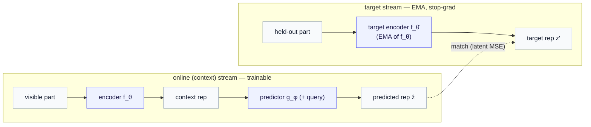
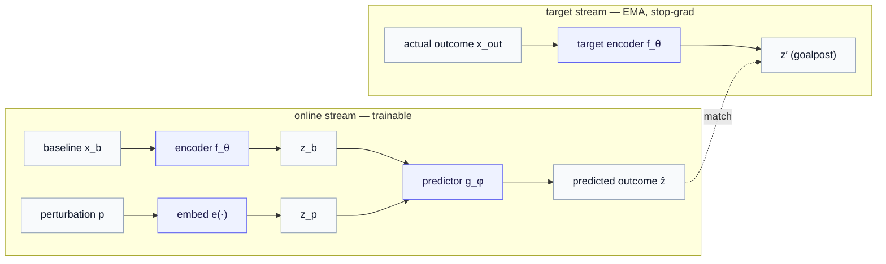
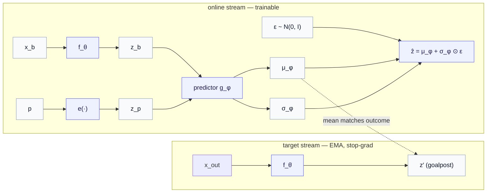
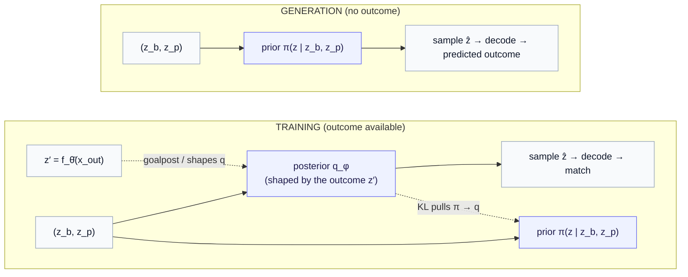

# Part 7a — JEPA from scratch, rebuilt for Route B: where every latent comes from

*A companion to [Part 7](07-route-b-variational-and-beyond-gaussian.md) for readers who want the architecture spelled out. We rebuild JEPA's two streams from the ground up, then add Route B's machinery one change at a time — tracking every latent vector ($z_b$, $z_p$, $z'$, $\mu$, $\sigma$, $\hat z$) to exactly where it is produced and what job it does.*

> **Why this chapter exists.** [Part 7](07-route-b-variational-and-beyond-gaussian.md) makes the *conceptual* case for Route B; its diagrams stay abstract. But the architecture is where confusion lives: Route B layers a conditional-VAE structure onto JEPA's two-stream design, and suddenly there are several latent vectors — a baseline, a condition, an outcome, a mean, a spread, a sample — and it is not obvious which stream produces which. This chapter is the wiring diagram. We assume only [Part 1](01-the-jepa-encoder.md)'s "predict embeddings, not pixels" idea and build the rest from scratch.

The plan is strict buildup. First **vanilla JEPA**, the two streams, with nothing generative about it. Then the **reframe** that turns the prediction target from "a masked region" into "a different observation" — this alone introduces $z_b$, $z_p$, and $z'$. Then **Route B's one change** — emit a distribution instead of a point — which introduces $\mu$, $\sigma$, and the sampled $\hat z$. By the end you will have a single table saying where each vector is born and which stream it lives in.

---

## 1. Vanilla JEPA — the two streams, precisely

JEPA learns by **predicting the representation of a held-out part of an input from the representation of the visible part** — entirely in latent space, never reconstructing pixels. To do that without the model cheating (collapsing everything to a constant), it uses an **asymmetric two-stream** design.

**The online (context) stream** — fully trainable:

- an **encoder** $f_\theta$ (weights $\theta$) that maps the *visible* part of the input to a representation;
- a **predictor** $g_\phi$ (weights $\phi$) that takes the context representation, plus a *query* saying which held-out part to predict, and outputs a **predicted representation** of that held-out part.

**The target stream** — *not* trainable by gradient:

- a single **target encoder** $f_{\bar\theta}$ that maps the *held-out* part of the input to its representation. That is the whole target stream.

Three properties make this work, and they are the things most easily gotten wrong:

- **The target encoder is an EMA copy of the online *encoder*.** Its weights are not learned directly; they are a slow exponential moving average of the online encoder's weights, $\bar\theta \leftarrow \tau \bar\theta + (1-\tau)\theta$ with $\tau$ close to 1. It "follows" the online encoder a few steps behind. (Reminder: an EMA is just a running average that updates a little toward the new value each step; here it averages weights, giving a stable, slowly-drifting copy.)
- **There is no predictor on the target stream.** The asymmetry is the point — only the online side predicts, the target side just encodes. (If both sides were symmetric and trainable, the easiest way to make two representations match is to make them both constant — a failure mode known as **representation collapse**. The asymmetry here, together with the stop-gradient below, is what blocks it.)
- **Stop-gradient on the target.** The target representation is treated as a fixed goalpost: no gradient flows back into $f_{\bar\theta}$. We write this $\mathrm{sg}(\cdot)$.

The training objective is then just "predicted target representation should match the actual target representation," measured in latent space:

$$
\mathcal{L}_{\text{JEPA}} = \big\lVert g_\phi(f_\theta(\text{visible}),\ \text{query}) - \mathrm{sg}\big(f_{\bar\theta}(\text{held-out})\big) \big\rVert^2.
$$

So in vanilla JEPA there are exactly two representations of interest: the predictor's output $\hat z$ (online), and the EMA target's output $z'$ (target stream). The loss pulls the first toward the second. (An aside on the "projector" some implementations add: a small MLP head placed after the encoder, on both streams, before the predictor/loss. It is a useful empirical trick but inessential to the roles we are tracking, so we fold it into the encoder and do not draw it separately.)

> **Hold onto this shape:** *a latent now → a predictor → a predicted latent; an EMA-encoded goalpost; match them.* Everything Route B does is keep this shape and change what plays the role of "now," "goalpost," and "predict."

---

## 2. The reframe — the target becomes a *different observation*

Here is the single conceptual move that turns JEPA toward generation, and it introduces three of our vectors at once.

In vanilla JEPA, the held-out "target" is *one or more masked regions of the same input* — a held-out set of patches of the same image (usually several regions, not a single patch; the [Q&A on target selection](QA/jepa-target-selection-and-coverage.md) unpacks how many, how they are chosen, and whether the visible and held-out sets cover the whole image). For a **conditional generative** task it becomes a *different observation entirely*: given a **baseline** and a **perturbation applied to it**, predict the **outcome**. In the running biology example: baseline = a control cell $x_b$, perturbation = a drug $p$, outcome = the perturbed cell $x_{\text{out}}$.

Re-read the two streams with this new target and the vectors fall out:

- **Online stream now carries two inputs.** It encodes the baseline, $z_b = f_\theta(x_b)$, and it embeds the perturbation, $z_p = e(p)$ — where $e$ is a small learned embedding of the intervention identity (a drug, a knocked-out gene). The predictor's "query" is no longer a position; it is the condition. So the predictor consumes the pair: $g_\phi(z_b, z_p)$. (These two are produced by *different* mechanisms — the encoder for the state, a learned embedding for the intervention — and trained differently; the [Q&A on the condition embedding](QA/condition-embedding-where-it-comes-from.md) unpacks where $e$ comes from and whether it is learned within JEPA.)
- **Target stream encodes the *actual outcome*.** The EMA target encoder reads the real perturbed cell: $z' = f_{\bar\theta}(x_{\text{out}})$, stop-grad. This is the goalpost — "what the cell actually became," in representation space.

Still deterministic, the model is now "conditional JEPA": predict the outcome latent from baseline + condition, and match the EMA-encoded real outcome.

$$
\hat z = g_\phi(z_b, z_p), \qquad \mathcal{L} = \big\lVert \hat z - \mathrm{sg}(z') \big\rVert^2.
$$

This already resolves half the confusion. **$z_b$ and $z_p$ are produced in the online stream** (encoder and condition-embedding); **$z'$ is produced by the EMA target encoder, from the actual outcome.** None of this is generative yet — the predictor still outputs a single point $\hat z$. The generative change is one more step.

---

## 3. Route B's one change — predict a *distribution*, not a point

The deterministic model above has the defect [Part 7](07-route-b-variational-and-beyond-gaussian.md) is about: one condition, one prediction — but identical cells under the *same* perturbation respond *differently*, so the honest target is a *spread* of outcomes. Route B's entire architectural change is to make the predictor emit the **parameters of a distribution** over the outcome latent instead of a single vector. In the Gaussian case, that is a mean and a (log-)spread:

$$
(\mu_\phi,\ \log \sigma_\phi^2) = g_\phi(z_b, z_p).
$$

So the predictor's output head now has **two outputs, $\mu_\phi$ and $\sigma_\phi$**, where before it had one. That is the literal answer to "where do $\mu$ and $\sigma$ come from": they are the predictor's two output heads, computed in the online stream from $(z_b, z_p)$.

To turn those parameters into an actual sampled outcome latent — and keep the whole thing differentiable so $g_\phi$ can be trained by gradient descent — you use the **reparameterization trick**: draw standard noise and shift-and-scale it by the predicted parameters.

$$
\hat z = \mu_\phi + \sigma_\phi \odot \varepsilon, \qquad \varepsilon \sim \mathcal{N}(0, I),
$$

where $\odot$ is elementwise multiply. (The trick matters because you cannot backpropagate through a raw "sample from a distribution" step; but you *can* backpropagate through $\mu + \sigma \odot \varepsilon$, treating $\varepsilon$ as an external input. The randomness is pushed into $\varepsilon$, which has no parameters.) Each fresh $\varepsilon$ gives a different $\hat z$ — so drawing repeatedly produces a *population* of predicted outcome latents from one $(z_b, z_p)$.

Training keeps the same goalpost: the predicted distribution's mean $\mu_\phi$ is pulled toward the EMA-encoded real outcome $z'$, so the cloud centers on what actually happened, while its spread $\sigma_\phi$ is free to widen to cover the heterogeneity.

That diagram is the heart of what you asked to see. Compared with vanilla JEPA, *nothing* about the two-stream skeleton changed — same online encoder, same EMA target, same stop-gradient goalpost. The only edit is that the predictor's single output became a $(\mu_\phi, \sigma_\phi)$ pair, and a reparameterized noise draw turns that pair into the sampled outcome latent $\hat z$.

---

## 4. Completing the variational picture — prior, and train-versus-test

There is one more piece, and it is the piece that earns the name "variational" (Route B rather than "Route A with a Gaussian head"). It comes from a simple problem: **at generation time you do not have the outcome.** During training the goalpost $z'$ exists (you have the real perturbed cell). At deployment you are *predicting* an unseen outcome, so the spread you sample from must be produced **without** seeing it.

This forces a distinction between two distributions over the outcome latent:

- a **prior** $\pi(z \mid z_b, z_p)$ — depends only on the baseline and the condition, *never* on the outcome. **This is what you sample at generation.**
- a **posterior** $q_\phi(z \mid z_b, z_p)$ — the predictor's training-time distribution, the one whose mean is pulled to the real outcome $z'$. It is allowed to be shaped by the outcome (through the matching loss, and — in the fuller variational form — by taking $z'$ as an input).

A **KL term** ties them, $\mathrm{KL}(q_\phi \Vert \pi)$, pulling the prior toward the posterior so that the cloud you sample at test agrees with the cloud the training signal shaped. The full Route B loss is the latent-prediction term plus this coupling (plus, for G2, a decoder term — [Part 6](06-route-a-latent-decoder-head.md)):

$$
\mathcal{L} = \underbrace{\lVert \mu_\phi - \mathrm{sg}(z') \rVert^2}_{\text{predict (match the outcome)}} + \lambda_{\text{kl}} \underbrace{\mathrm{KL}(q_\phi \Vert \pi)}_{\text{prior} \leftrightarrow \text{posterior}} + \lambda_{\text{dec}} \mathcal{L}_{\text{decode}}.
$$

> **The honest nuance, since you will meet both forms.** In the *fully* variational form, the posterior is literally a network that takes the outcome $z'$ as an *input* (a recognition model that "peeks" at the answer during training) — that is the cleanest version, and it is the [Part 13](13-choosing-a-route.md) litmus: *a network that sees the true outcome at train → Route B*. In the *amortized* form the series mostly writes, the predictor $g_\phi(z_b, z_p)$ emits the distribution directly and the outcome enters only through the matching loss. Both are Route B; they differ in whether the outcome is an *input* to the posterior or only a *target* of the loss. Either way the train/test asymmetry — sample the posterior (outcome-aware) at train, the prior (outcome-blind) at test, KL-coupled — is the defining structure.

---

## 5. The full vector inventory — where each one is born

Here is the table the whole chapter was building toward. Every latent vector in Route B, the stream and component that produces it, and whether it exists at training, generation, or both.

| vector | what it is | produced by | stream | train / test |
|---|---|---|---|---|
| $x_b$ | the baseline observation (control cell) | given data | input | both |
| $z_b = f_\theta(x_b)$ | encoded baseline (the "before" / context) | online **encoder** $f_\theta$ | online | both |
| $p,\ z_p = e(p)$ | the perturbation, and its learned embedding | condition **embedding** $e$ | online | both |
| $\mu_\phi,\ \sigma_\phi$ | parameters of the outcome distribution | the **predictor** $g_\phi$'s two heads | online | both |
| $\varepsilon \sim \mathcal{N}(0,I)$ | reparameterization noise (no parameters) | a noise draw | — | both |
| $\hat z = \mu_\phi + \sigma_\phi \odot \varepsilon$ | a *sampled* predicted outcome latent | the reparameterization step | online | both |
| $x_{\text{out}}$ | the *actual* outcome (real perturbed cell) | given data | input | **train only** |
| $z' = f_{\bar\theta}(x_{\text{out}})$ | encoded real outcome — the **goalpost** | the **EMA target encoder** $f_{\bar\theta}$ | target | **train only** |
| $\pi(z \mid z_b, z_p)$ | the prior you sample at generation | the prior network | online | both (sampled at test) |

Two readings of this table are worth saying out loud, because they are the crux:

- **The outcome ($x_{\text{out}}$, $z'$) exists only at training.** It is the goalpost the predicted distribution is fit to, and — in the fully variational form — an input to the posterior. At generation it is gone, which is *why* you need the outcome-blind prior $\pi$ to sample from.
- **$\mu$ and $\sigma$ are the predictor's outputs, not a separate module.** The "distribution" is not a new stream; it is the predictor growing a second head. The reparameterization step ($\mu + \sigma \odot \varepsilon$) is the only genuinely new arrow versus deterministic conditional JEPA.

---

## 6. Mapping back to Part 7, and what comes next

A quick reconciliation so the notation lines up. [Part 7](07-route-b-variational-and-beyond-gaussian.md) wrote the predictor's output as the posterior $q_\phi(z \mid z_b, z_p) = \mathcal{N}(\mu_\phi,\ \mathrm{diag}(\sigma_\phi^2))$ and noted a learnable prior $\pi$ coupled by KL — exactly the pieces above, just drawn abstractly. And [Part 7 §6](07-route-b-variational-and-beyond-gaussian.md) observed that this whole thing, with a Gaussian, *is a conditional VAE living in JEPA's latent space.* You can now see that literally in the wiring: an encoder, a latent distribution with a learnable prior, a KL, a decoder — the CVAE skeleton — wrapped around JEPA's online/EMA-target two streams, with the EMA target playing the role of the "reconstruction goalpost" in representation space.

And the seam to the rest of the survey is now concrete too. The *only* limited piece in this architecture is the shape of that predicted distribution: a diagonal Gaussian, which is unimodal per condition. Everything else — the two streams, the EMA goalpost, the reparameterized sample, the prior/posterior/KL — stays exactly as drawn when you climb the [expressive-posterior ladder](07-route-b-variational-and-beyond-gaussian.md). Replace the Gaussian $(\mu_\phi, \sigma_\phi)$ head with a **conditional flow field** $v_\eta(z, t, z_b, z_p)$ and you have the [conditional flow prior](09-conditional-flow-prior.md) of Part 9 — same skeleton, a more expressive distribution where the Gaussian head used to be.

> **Recap.** Vanilla JEPA is two streams: an online encoder+predictor and an EMA target encoder, matched in latent space with a stop-gradient goalpost. The conditional/generative task keeps that skeleton and changes the target to a *different observation* — introducing $z_b$ (encoded baseline, online), $z_p$ (embedded condition, online), and $z'$ (EMA-encoded actual outcome, the goalpost, train-only). Route B's one architectural change is to make the predictor emit a *distribution* $(\mu_\phi, \sigma_\phi)$ instead of a point, sampled via reparameterization into $\hat z$ — with an outcome-blind prior to sample at test, KL-coupled to the outcome-aware posterior. Every vector has a home; the table in §5 is the map.

---

*Companion to [Part 7 — Route B](07-route-b-variational-and-beyond-gaussian.md). Background: [Part 1 — The JEPA encoder](01-the-jepa-encoder.md). Next in the survey: [Part 8 — Route C](08-route-c-conditioned-diffusion.md); the expressive limit: [Part 9 — the conditional flow prior](09-conditional-flow-prior.md). Symbols: the [notation reference](notation.md).*
