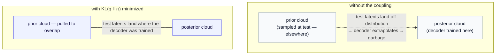

# Part 7b — The learnable prior and the KL term, up close

*A companion to [Part 7 §5](07-route-b-variational-and-beyond-gaussian.md) for readers who want the variational coupling demystified rather than asserted. Three questions, answered in order: what is this **learnable prior** (and why not the textbook $\mathcal{N}(0, I)$)? why must the **posterior stay close to the prior** at all? and where does the **closed-form KL term** in the loss actually come from?*

> **Why this chapter exists.** [Part 7 §5](07-route-b-variational-and-beyond-gaussian.md) writes the KL term as a closed form and moves on, and [Part 7a](07a-jepa-two-streams-and-route-b.md) wires the prior into the architecture — but both treat "minimize the KL between posterior and prior" as a known move. For many readers (the author included) that move stays a little mysterious: *why* a learnable prior, *why* pull the two together, and *where* does that specific per-dimension formula come from? This chapter slows all the way down. It assumes [Part 7 §1–2](07-route-b-variational-and-beyond-gaussian.md) (the posterior $q_\phi$, the prior $\pi$, the reparameterization trick) and [Part 7a §4](07a-jepa-two-streams-and-route-b.md) (where each sits in the two-stream wiring), and it reuses the Gaussian-density reminder from [Part 7 §1](07-route-b-variational-and-beyond-gaussian.md). Nothing else.

We answer the three questions in the order you would meet them: first *what the prior is*, then *why it must be coupled to the posterior*, then *the derivation of the coupling term itself* — both where it comes from (a lower bound) and what it evaluates to (the closed form).

---

## 1. The learnable prior — and why not $\mathcal{N}(0, I)$

Recall the two distributions over the outcome latent $z$, from [Part 7 §2](07-route-b-variational-and-beyond-gaussian.md) and the wiring in [Part 7a §4](07a-jepa-two-streams-and-route-b.md):

- the **posterior** $q_\phi(z \mid z_b, z_p)$ — the predictor's training-time distribution, whose mean is pulled toward the EMA-encoded real outcome $z'$. It is allowed to be shaped by the outcome.
- the **prior** $\pi(z \mid z_b, z_p)$ — what you sample from at **generation**, when no outcome exists. It depends only on the baseline $z_b$ and the condition $z_p$.

The word doing quiet work is **conditional**: $\pi$ takes $(z_b, z_p)$ as inputs and emits its own parameters $(\mu_\pi, \sigma_\pi)$. Architecturally it is a small **prior network** — a sibling of the predictor that reads the same condition but, unlike the posterior, never sees the outcome (this is the "prior network" row of the [Part 7a §5 inventory](07a-jepa-two-streams-and-route-b.md)). That is a real departure from the textbook VAE, and it is worth seeing why.

**The textbook choice is a fixed, unconditional standard normal.** In a vanilla VAE the prior is simply $p(z) = \mathcal{N}(0, I)$ — no parameters, no inputs, the same unit Gaussian for every example. It is a fine default when the latent space is a generic "code" and you only want *a* plausible sample. But Route B is **conditional**: the question is never "give me a plausible cell," it is "give me a plausible cell *given this baseline and this drug*." A single global $\mathcal{N}(0, I)$ cannot answer that — it has no slot for the condition, so by construction it would hand you the same outcome cloud regardless of which drug you asked about.

Picture it concretely. Two interventions on the same cell: a strong differentiation drug that drives the cell to a sharply different state, and a vehicle control that barely moves it. The *plausible-outcome cloud* for the first is far from the baseline and possibly multimodal; for the second it sits almost on top of the baseline. A fixed $\mathcal{N}(0, I)$ describes neither — it is a generic blob in latent space with no memory of the condition. A **learnable conditional prior** can place a *different* cloud for each $(z_b, z_p)$: near the baseline for the control, far and wide for the differentiation drug. That is the capability $\mathcal{N}(0, I)$ structurally lacks.

> **The dial of priors — three settings.** It helps to see the choice as a dial, from least to most expressive.
>
> | prior | inputs | what it can express | where it fits |
> |---|---|---|---|
> | **fixed** $\mathcal{N}(0, I)$ | none | one generic latent cloud, same for all | the textbook VAE; fine for *unconditional* generation |
> | **learnable unconditional** $\mathcal{N}(\mu_\pi, \sigma_\pi)$ | none (but fit to data) | one cloud, shaped to the actual marginal of latents | a better-calibrated unconditional prior |
> | **learnable conditional** $\pi(z \mid z_b, z_p)$ | the condition | a *different* cloud per condition | **Route B** — generation *given* an intervention |
>
> Route B sits at the bottom row because the whole point is conditioning. (And once you let the prior be conditional, the next question is how *expressive* its shape may be — a Gaussian, a mixture, a flow — which is exactly the [expressive-posterior ladder](07-route-b-variational-and-beyond-gaussian.md) and the [conditional flow prior](09-conditional-flow-prior.md). This chapter stays on the Gaussian rung; the *learnability* and the *conditioning* are the point here, not the shape.)

So: the prior is learnable and conditional because generation needs an outcome-blind, condition-aware distribution to sample from, and a fixed unit Gaussian is neither condition-aware nor fit to the data. It lives in the same online stream as the predictor, drawn as a separate head in the [Part 7a §4 generation diagram](07a-jepa-two-streams-and-route-b.md). What we have *not* yet explained is why it should be tied to the posterior at all — why not just learn the prior directly and ignore $q_\phi$? That is the next question, and it is the heart of the matter.

---

## 2. Why the posterior must stay close to the prior

This is the step that tends to stay mysterious, so we will give it twice: once as a concrete train/test story you can picture, and once as the principle it is an instance of.

### 2.1 The operational reason — train and test must see the same latents

Look carefully at *which distribution feeds the decoder at each phase*, because the asymmetry is the whole story.

- **At training**, you have the real outcome. You sample the latent from the **posterior** $\hat z \sim q_\phi(z \mid z_b, z_p)$ — the outcome-aware cloud — and decode it, and the decoder learns to turn *those* latents into the right data. So the decoder is trained on **posterior samples**.
- **At generation**, the outcome is gone. You sample from the **prior** $\hat z \sim \pi(z \mid z_b, z_p)$ — the outcome-blind cloud — and decode that.

Now the trap is visible. The decoder only ever *learned* on latents drawn from the posterior. If the prior places its cloud somewhere *else* — a different center, a different spread — then at generation you are feeding the decoder latents from a region it was never trained on. The decoder is being asked to extrapolate, and it will produce garbage: blurry, off-condition, or simply wrong outcomes. **The decoder's competence is only as wide as the latent region it saw in training, and that region is defined by the posterior.**

The KL term $\mathrm{KL}(q_\phi \Vert \pi)$ is the fix: it *pulls the prior to overlap the posterior*, so that the cloud you sample at test sits where the cloud you trained on sits. Train-time and test-time latents come from the same place, and the decoder is asked, at generation, only what it was taught.

That is the demystified version: **the KL is a train/test consistency constraint.** It is not a vague "regularizer that keeps things smooth"; it has a precise job — make the distribution you *sample* at generation agree with the distribution you *decoded from* in training, so the decoder is never surprised.

### 2.2 The principled reason — it falls out of a lower bound

The operational story explains *why you would want* the prior and posterior aligned. The deeper fact is that you do not have to *impose* the KL by hand at all — it **falls out automatically** the moment you write down the right training objective. That objective is a **variational lower bound**, and we derive it in §3. The one-sentence preview: trying to maximize the probability the model assigns to the *real* outcome forces exactly two terms — "decode the latent well" and "keep the posterior close to the prior" — so the KL is not bolted on, it is *half of the only honest objective there is*.

> **The bottleneck reading, in one breath.** There is a third, complementary intuition worth knowing. The KL measures, in **nats**, how much information the posterior spends moving away from the prior. Penalizing it makes the latent a *limited-capacity channel*: the posterior may only deviate from the prior as much as it can "pay for" by decoding the data better. Too small a KL weight and the posterior over-uses the channel (memorizing, poor generation); too large and the posterior is crushed onto the prior and **ignores its input** — the **posterior collapse** failure [Part 7 §2](07-route-b-variational-and-beyond-gaussian.md) flagged as the cost of $\lambda_{\text{kl}}$ being too high. The KL weight is the knob on that channel's width.

---

## 3. Where the KL term comes from — the variational lower bound

Now the derivation that makes §2.2 precise. The goal of a generative model is to make the **real data probable**: for an outcome $x$ (the real perturbed cell) under condition $c = (z_b, z_p)$, we want to maximize the conditional likelihood $\log p(x \mid c)$. The model produces $x$ through a latent: sample $z$ from the prior $\pi(z \mid c)$, then decode with $p_\omega(x \mid z)$ (the [Part 6](06-route-a-latent-decoder-head.md) decoder, weights $\omega$). So the quantity we actually want is the marginal over the latent,

$$
\log p(x \mid c) = \log \int p_\omega(x \mid z)  \pi(z \mid c)  dz.
$$

That integral is intractable — it averages the decoder over *every* latent. The variational trick is to introduce the posterior $q_\phi(z \mid c)$ (the outcome-aware cloud; in the fully variational form it also reads $z'$) and use it as an importance weight. Multiply and divide by $q_\phi$ inside the integral, recognize an expectation over $q_\phi$, and apply **Jensen's inequality** ($\log$ of an average is at least the average of the $\log$, because $\log$ is concave):

$$
\log p(x \mid c) = \log  \mathbb{E}_{q_\phi}\left[ \frac{p_\omega(x \mid z)  \pi(z \mid c)}{q_\phi(z \mid c)} \right] \ \ge\ \mathbb{E}_{q_\phi}\big[\log p_\omega(x \mid z)\big] + \mathbb{E}_{q_\phi}\left[\log \frac{\pi(z \mid c)}{q_\phi(z \mid c)}\right].
$$

The second expectation is, by definition, the **negative** KL divergence from $q_\phi$ to $\pi$. So the bound reads

$$
\log p(x \mid c) \ \ge\ \underbrace{\mathbb{E}_{q_\phi}\big[\log p_\omega(x \mid z)\big]}_{\text{decode the real data well}} \ -\ \underbrace{\mathrm{KL}\big(q_\phi(z \mid c)  \Vert  \pi(z \mid c)\big)}_{\text{posterior close to prior}} \ =:\ \text{ELBO}.
$$

This is the **evidence lower bound (ELBO)**. Read the two terms: the first rewards a posterior whose samples the decoder can turn back into the real $x$; the second penalizes a posterior that strays from the prior. Maximizing the ELBO maximizes (a lower bound on) the data likelihood — and it is *the* objective, not a heuristic.

Flip the sign to get a loss to minimize, and the two generative terms of Route B appear exactly:

$$
-\text{ELBO} \ =\ \underbrace{- \mathbb{E}_{q_\phi}\big[\log p_\omega(x \mid z)\big]}_{\mathcal{L}_{\text{decode}}} \ +\ \underbrace{\mathrm{KL}\big(q_\phi \Vert \pi\big)}_{\mathcal{L}_{\text{KL}}}.
$$

The decoder term $\mathcal{L}_{\text{decode}}$ is the negative log-likelihood from [Part 6](06-route-a-latent-decoder-head.md) (the NB/ZINB count loss, or the pixel BCE); the KL term is the coupling. **Neither was invented — both are forced by the single act of lower-bounding $\log p(x \mid c)$.** That is the precise sense of §2.2: the KL is half of the only honest objective.

> **How does $\mathcal{L}_{\text{predict}}$ fit?** The ELBO yields two terms — decode and KL — but the [Part 7 §5](07-route-b-variational-and-beyond-gaussian.md) loss has *three*. The extra one, $\mathcal{L}_{\text{predict}} = \lVert \mu_\phi - \mathrm{sg}(z') \rVert^2$, is **not** part of the ELBO; it is JEPA's own representation-space anchor, layered on top. Its jobs are to keep the representation strong (it *is* vanilla JEPA's loss) and to directly supervise the posterior mean onto the encoded real outcome $z'$, which stabilizes training and is precisely what makes this a *JEPA*-grounded model rather than a plain conditional VAE. So: two terms from the variational bound (the generative content), one term from JEPA (the representation content) — exactly the [Part 7 §5](07-route-b-variational-and-beyond-gaussian.md) split of rep-space backbone + G1 coupling + G2 decode.

With the bound established, one task remains: the KL is still written abstractly. For diagonal Gaussians it has a clean closed form, and deriving it is the last step.

---

## 4. The closed-form KL between two diagonal Gaussians

The KL is defined as an expectation under $q$ of the log-ratio,

$$
\mathrm{KL}(q \Vert \pi) = \mathbb{E}_{q}\big[\log q(z) - \log \pi(z)\big].
$$

We evaluate it for two Gaussians and then lift to the diagonal multivariate case. Do **one dimension** first, with posterior $q = \mathcal{N}(\mu_q, \sigma_q^2)$ and prior $\pi = \mathcal{N}(\mu_p, \sigma_p^2)$. Recall the log-density of a 1-D Gaussian (the reminder from [Part 7 §1](07-route-b-variational-and-beyond-gaussian.md)):

$$
\log \mathcal{N}(z \mid \mu, \sigma^2) = -\tfrac{1}{2}\log(2\pi\sigma^2) - \frac{(z - \mu)^2}{2\sigma^2}.
$$

Subtract the two log-densities and take the expectation under $q$. Two standard facts about a draw $z \sim q$ do all the work:

- $\mathbb{E}_{q}\big[(z - \mu_q)^2\big] = \sigma_q^2$ — the posterior's own variance (this handles the $\log q$ part).
- $\mathbb{E}_{q}\big[(z - \mu_p)^2\big] = \sigma_q^2 + (\mu_q - \mu_p)^2$ — variance plus the squared gap between the means (the bias–variance split; this handles the $\log \pi$ part).

Carry them through:

$$
\mathrm{KL}(q \Vert \pi) = \underbrace{\tfrac{1}{2}\log\frac{\sigma_p^2}{\sigma_q^2}}_{\text{from the two }\log(2\pi\sigma^2)\text{ terms}} \ -\ \underbrace{\frac{\mathbb{E}_q[(z-\mu_q)^2]}{2\sigma_q^2}}_{=  1/2} \ +\ \underbrace{\frac{\mathbb{E}_q[(z-\mu_p)^2]}{2\sigma_p^2}}_{=  (\sigma_q^2 + (\mu_q-\mu_p)^2)/(2\sigma_p^2)}.
$$

Collecting the pieces gives the single-dimension result:

$$
\mathrm{KL}(q \Vert \pi) = \log\frac{\sigma_p}{\sigma_q} + \frac{\sigma_q^2 + (\mu_q - \mu_p)^2}{2\sigma_p^2} - \frac{1}{2}.
$$

Because a **diagonal** Gaussian factorizes into independent per-dimension Gaussians, and KL **adds** across independent coordinates, the $D$-dimensional KL is just the sum of $D$ copies of the above. Substituting the Route B names — posterior $q = q_\phi$ (subscript $\phi$), prior $\pi$ (subscript $\pi$), coordinates $i = 1, \dots, D$ — reproduces the [Part 7 §5](07-route-b-variational-and-beyond-gaussian.md) formula exactly:

$$
\mathcal{L}_{\text{KL}} = \sum_{i=1}^{D} \left[ \log\frac{\sigma_{\pi,i}}{\sigma_{\phi,i}} + \frac{\sigma_{\phi,i}^2 + (\mu_{\phi,i} - \mu_{\pi,i})^2}{2 \sigma_{\pi,i}^2} - \frac{1}{2} \right].
$$

**The textbook special case as a check.** Fix the prior to the standard normal, $\mu_{\pi,i} = 0$ and $\sigma_{\pi,i} = 1$ (the vanilla-VAE choice). Then $\log(\sigma_{\pi,i}/\sigma_{\phi,i}) = -\tfrac{1}{2}\log\sigma_{\phi,i}^2$, the denominators become 1, and each term collapses to

$$
\tfrac{1}{2}\big(\sigma_{\phi,i}^2 + \mu_{\phi,i}^2 - 1 - \log\sigma_{\phi,i}^2\big),
$$

which is the familiar VAE KL quoted in [Part 7 §5](07-route-b-variational-and-beyond-gaussian.md). The general formula contains it as the $\mu_\pi = 0, \sigma_\pi = 1$ corner.

> **A 1-D numeric sanity check.** Take a posterior $\mathcal{N}(1,\ 0.5^2)$ against a standard-normal prior $\mathcal{N}(0, 1)$. The general formula: $\log(1/0.5) + (0.25 + 1)/(2 \cdot 1) - 0.5 = 0.693 + 0.625 - 0.5 = 0.818$ nats. The collapsed VAE formula: $\tfrac{1}{2}(0.25 + 1 - 1 - \log 0.25) = \tfrac{1}{2}(0.25 + 1.386) = 0.818$ nats. They agree, as they must — a small reassurance that the algebra and the special case line up.

---

## 5. Recap — the three questions, answered

- **What the learnable prior is.** A small **prior network** that reads the condition $(z_b, z_p)$ and emits a Gaussian $\mathcal{N}(\mu_\pi, \mathrm{diag}(\sigma_\pi^2))$ to sample at generation. It is **learnable and conditional** — not the fixed $\mathcal{N}(0, I)$ of a vanilla VAE — because generation must produce a *different* outcome cloud for each baseline-and-intervention, which a global unit Gaussian cannot. It lives in the online stream alongside the predictor ([Part 7a §4](07a-jepa-two-streams-and-route-b.md)).
- **Why the posterior is held close to the prior.** Operationally, the decoder is trained on **posterior** samples but generation draws from the **prior**; the KL aligns the two clouds so test-time latents land where the decoder was taught — a train/test consistency constraint, not a vague regularizer. Principledly, the KL is not imposed at all: it *falls out* of lower-bounding the data likelihood.
- **Where the KL term comes from.** Lower-bounding $\log p(x \mid c)$ with the posterior $q_\phi$ and Jensen's inequality yields the **ELBO** = (expected decode log-likelihood) $-$ KL$(q_\phi \Vert \pi)$; negating it gives $\mathcal{L}_{\text{decode}} + \mathcal{L}_{\text{KL}}$, and JEPA's $\mathcal{L}_{\text{predict}}$ rides on top as the representation anchor. The KL between two diagonal Gaussians has the per-dimension closed form derived in §4, with the standard-normal prior as a special case.

With the prior and the KL no longer mysterious, the [Part 7 §5](07-route-b-variational-and-beyond-gaussian.md) loss reads as what it is: a variational lower bound (decode + KL) on a JEPA-pretrained backbone (predict), three terms doing three jobs.

---

*Companion to [Part 7 §5 — Route B](07-route-b-variational-and-beyond-gaussian.md). Architecture: [Part 7a](07a-jepa-two-streams-and-route-b.md). The decoder term: [Part 6](06-route-a-latent-decoder-head.md). Symbols: the [notation reference](notation.md).*
