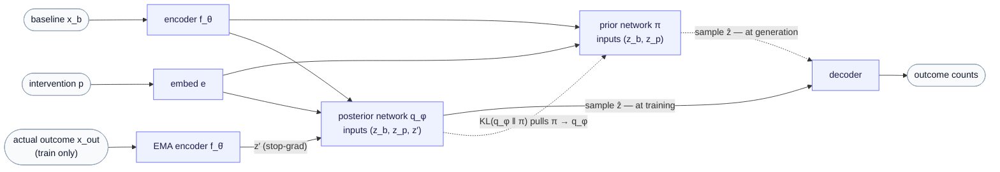
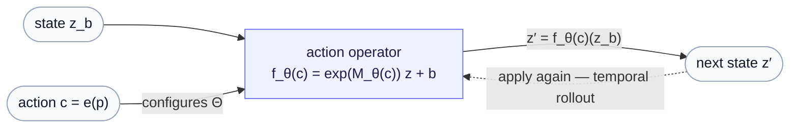

# Part 7c — Which network is the prior? Posterior, recognition, and the action-operator view

*A companion to [Part 7 §1–2](07-route-b-variational-and-beyond-gaussian.md) for readers who find the prior/posterior bookkeeping slippery — especially without a variational-autoencoder background. We pin down what the prior and posterior actually are in Route B, why the JEPA predictor "is" the conditional prior, the two architectures (amortized vs. recognition) that both count as Route B, and how the action-operator view generalizes the whole picture.*

> **Why this chapter exists.** [Part 7 §1](07-route-b-variational-and-beyond-gaussian.md) writes the predictor's output as the **posterior** $q_\phi(z \mid z_b, z_p)$; [Part 7 §2](07-route-b-variational-and-beyond-gaussian.md) then says "the predictor becomes the conditional **prior**." Read quickly, those look contradictory — and for anyone meeting the prior/posterior vocabulary for the first time, the conditioning inputs $z_b, z_p$ being deterministic *vectors* makes it worse: a prior is supposed to be a *distribution*, so where is it? This chapter slows all the way down. It assumes only [Part 7 §1](07-route-b-variational-and-beyond-gaussian.md) (the predictor emits $(\mu_\phi, \sigma_\phi)$) and the conditioning names $z_b$ (baseline), $z_p = e(p)$ (intervention) from there; everything else — prior, posterior, amortized, recognition — is built from scratch. The payoff is that the apparent §1-vs-§2 contradiction dissolves into a single clean picture, and the picture then generalizes.

The plan: first fix *what counts as the data*, because prior and posterior are meaningless without it; then show the conditioning context is **not** the prior; then the two architectures that both deserve the name "Route B," with a wiring diagram for the one [Part 7 §1](07-route-b-variational-and-beyond-gaussian.md) does *not* draw; then settle which object the §2 slogan names; and finally the action-operator view, which contains all of this as a special case.

---

## 1. First: what counts as "the data"?

"Prior" and "posterior" are never absolute — they are always defined *relative to some data being explained*. So before anything else: in Route B, **what plays the role of the data?**

It is the **outcome** — the actual perturbed cell, observation $x_{\text{out}}$, whose representation is the EMA-encoded $z' = f_{\bar\theta}(x_{\text{out}})$ (the "goalpost" of [Part 7a §2](07a-jepa-two-streams-and-route-b.md)). The outcome latent $z$ is the quantity we put a distribution over; $z'$ is its *realized value* once the experiment is actually run.

The context $(z_b, z_p)$ is **not** the data. It is the *setup* — the givens of the experiment ("this baseline cell, this drug"). It is known before, during, and after; it is never the thing being explained.

With "the data" fixed, the Bayesian *before/after* snaps into place — and, crucially, **it is before/after the outcome, not before/after the context:**

- **Prior** $\pi(z \mid z_b, z_p)$ — your belief about where the outcome latent $z$ will land, *before* you have seen the outcome, **given the setup**. "Before running the experiment, but knowing the baseline and the drug, what range of after-states do I expect?"
- **Posterior** — your belief about $z$ *after* (or informed by) the outcome. "Now that I have actually seen the perturbed cell, where is $z$?"

Both condition on $(z_b, z_p)$. The *only* thing that distinguishes them is whether they have seen the outcome. That is the entire content of "prior vs. posterior" here.

> **What "the outcome" really is — and why it forces a distribution.** A natural reading of $x_b \to z_b$ and $x_{\text{out}} \to z'$ is "the same cell, before and after the perturbation." That is the one thing to *un*-learn: single-cell RNA-seq is **destructive** — reading a cell's transcripts lyses it — so no cell is measured before *and* after. $x_b$ is a **control** cell's gene counts; $x_{\text{out}}$ is a **different, perturbed** cell's counts (same gene panel, same dimension, different physical cell). The pairing exists only between *populations* — control cells vs. perturbed cells — never individuals. That is *why* the outcome is a **distribution** to be inferred rather than a single vector to look up, and it is the deep reason Route B puts a distribution over $z$ at all. The data-modalities primer covers the counts themselves; see the [appendix](appendix-data-modalities.md).

---

## 2. The conditioning context is not the prior

Here is the first thing that trips people up: if $q_\phi(z \mid z_b, z_p)$ is the posterior, surely the prior is "$z_b, z_p$"? But $z_b$ (the encoded baseline) and $z_p = e(p)$ (the embedded intervention) are deterministic **point estimates** — single vectors — and a prior must be a *probability distribution*. So they cannot be the prior.

The resolution is to separate two objects that merely share inputs:

| object | what it is | type |
|---|---|---|
| the **context** $z_b, z_p$ | the deterministic encodings of baseline and intervention | point estimates (vectors) — the *givens* |
| the **prior** $\pi(z \mid z_b, z_p)$ | a distribution over the outcome latent $z$, *parameterized by* that context | a probability distribution |

The prior is **not** $z_b, z_p$. It is a distribution over $z$ that *takes* $z_b, z_p$ as inputs. In the Gaussian case a small **prior network** reads the context and emits parameters,

$$
(\mu_\pi, \log\sigma_\pi^2) = \text{prior-net}(z_b, z_p), \qquad \pi(z \mid z_b, z_p) = \mathcal{N}\big(\mu_\pi, \mathrm{diag}(\sigma_\pi^2)\big),
$$

which is unmistakably a distribution — just one *conditioned on* point-estimate inputs.

That a distribution is conditioned on deterministic inputs does not demote it from "distribution." The everyday analogue: in linear regression, $p(y \mid x) = \mathcal{N}(w^\top x, \sigma^2)$ is a perfectly good conditional distribution even though $x$ is a fixed point. Conditioning on a point is not the same as *being* a point. The term of art for $\pi(z \mid z_b, z_p)$ is a **conditional prior** (or *learned* conditional prior, since the network's weights are trained) — exactly the object [Part 7b §1](07b-the-prior-and-the-kl-term.md) contrasts with the textbook VAE's fixed, input-free $\mathcal{N}(0, I)$, and the reason the contrast matters.

---

## 3. Two architectures, both Route B — amortized vs. recognition

Now the heart of the confusion, and it is a genuine one worth stating plainly rather than smoothing over. [Part 7 §1](07-route-b-variational-and-beyond-gaussian.md) writes the predictor's output as $q_\phi(z \mid z_b, z_p)$ — conditioned on *exactly* $(z_b, z_p)$, with no outcome among its inputs. If the prior is *also* a function of $(z_b, z_p)$, what distinguishes them? The answer is that "Route B" names **two** architectures, and they differ precisely in whether that distinction shows up in the *inputs* or only in the *training signal*.

**1. Recognition (clean) form.** The posterior is a *separate, augmented* network that **also takes the outcome** $z'$ as an input,

$$
q_\phi(z \mid z_b, z_p, z'),
$$

while a *second* network — with the bare predictor signature $(z_b, z_p)$ — is the **prior** $\pi(z \mid z_b, z_p)$. Here the two are unambiguous and differ in *one input*: the posterior sees $z'$ ("peeks at the answer" during training); the prior does not. This is the textbook conditional-VAE structure (Sohn et al., 2015): a recognition network that reads the target, a conditional prior that does not, a decoder, and a KL tying prior to posterior.

**2. Amortized form (what [Part 7 §1](07-route-b-variational-and-beyond-gaussian.md)'s equation literally writes).** A *single* network $g_\phi(z_b, z_p)$ emits one distribution, **blind to** $z'$. It does double duty: during **training** it is read as the posterior — its mean pulled toward the real outcome $z'$ by the matching term $\mathcal{L}_{\text{predict}} = \lVert \mu_\phi - \mathrm{sg}(z') \rVert^2$ — and at **generation**, the very same output is what you sample, i.e. the prior. Same network output, two roles, distinguished only by whether the outcome is in play. So [Part 7 §1](07-route-b-variational-and-beyond-gaussian.md) labels it $q_\phi$ (the training-time view) and [Part 7 §2](07-route-b-variational-and-beyond-gaussian.md)'s slogan calls it "the prior" (the generation-time view) — not a contradiction, but the same object named from two phases.

The choice between them is a real design dial, and it is the [Part 13](13-choosing-a-route.md) litmus seen up close: *does a network see the true outcome at training?* Recognition form, yes (the posterior takes $z'$); amortized form, no (the outcome enters only through the loss). [Part 7a §4](07a-jepa-two-streams-and-route-b.md) draws the train-versus-test asymmetry for the amortized case; this chapter draws the recognition case next, because seeing the two-network wiring is what makes the distinction concrete.

---

## 4. The recognition-form architecture, drawn

[Part 7 §1](07-route-b-variational-and-beyond-gaussian.md)'s diagram shows the **amortized** form: one predictor $g_\phi(z_b, z_p)$ emitting $(\mu_\phi, \sigma_\phi)$, sampled and decoded. It is worth seeing the **recognition** form beside it, because the extra network and the extra input $z'$ are exactly what make "prior vs. posterior" visible in the wiring rather than only in the loss.

Read the wiring against [Part 7 §1](07-route-b-variational-and-beyond-gaussian.md)'s single-predictor diagram:

- There are now **two networks**, not one. The **prior network** $\pi$ takes only $(z_b, z_p)$. The **posterior (recognition) network** $q_\phi$ takes $(z_b, z_p, z')$ — the *same* context plus the EMA-encoded real outcome $z'$ (stop-grad, as in [Part 7a §1](07a-jepa-two-streams-and-route-b.md)). The extra arrow carrying $z'$ into $q_\phi$ — and *only* into $q_\phi$ — is the whole prior/posterior distinction, made into a wire.
- **At training**, you sample $\hat z$ from the *posterior* (which has seen the outcome) and decode it, so the decoder learns on outcome-informed latents; the **KL** $\mathrm{KL}(q_\phi \Vert \pi)$ drags the outcome-blind prior toward that posterior.
- **At generation**, the outcome is gone, so the posterior cannot run (it has no $z'$ to read). You sample from the **prior** instead — and because the KL pulled it onto the posterior during training, what you sample matches what the decoder was trained on ([Part 7b §2](07b-the-prior-and-the-kl-term.md) is the why).

The amortized form of [Part 7 §1](07-route-b-variational-and-beyond-gaussian.md) is what you get by *collapsing these two networks into one*: drop the $z'$ input, let the single $g_\phi(z_b, z_p)$ play both boxes, and move the "informed by the outcome" job from an input wire to the $\mathcal{L}_{\text{predict}}$ loss. Both diagrams are Route B; the recognition one simply makes the roles explicit.

---

## 5. So "the predictor becomes the conditional prior" — which object?

Now the §1-vs-§2 puzzle answers itself. The slogan **"the predictor becomes the conditional prior"** ([Part 7 §2](07-route-b-variational-and-beyond-gaussian.md)) is about the **prior** $\pi$ — the thing you sample at generation.

The reason is the **input signature**. The JEPA predictor's defining shape is a map $(z_b, z_p) \mapsto \text{prediction}$ that *never sees the outcome*. That outcome-blind, context-only signature is exactly the signature of a **prior** (a prior is, definitionally, your belief before the outcome). The posterior, in the clean recognition form, takes one *more* input — the outcome $z'$. So the object whose inputs line up with the JEPA predictor's is the prior, not the posterior. The slogan's point is this structural coincidence: JEPA's predictor was already a conditional prior — a map from context to a distribution over the next latent, blind to the outcome — so you do not bolt on a separate generative module; you reinterpret the predictor's output as the prior's parameters $(\mu_\pi, \sigma_\pi)$. The sentence just before the slogan says the same thing operationally — "the object you sample from at generation time *is* the predictor's own conditional distribution" — and sampling at generation *is* sampling the prior.

And the apparent clash with [Part 7 §1](07-route-b-variational-and-beyond-gaussian.md) calling that output $q_\phi$ (the posterior) is just the §3 dial:

- in the **recognition** form, the predictor-signature object *is* $\pi$, and the posterior is the separate $z'$-augmented network;
- in the **amortized** form, one network is both — posterior in training (pulled to $z'$), prior at generation (sampled) — so §1 names it from the training side and §2 from the generation side.

**One line to keep:** prior and posterior here are the *same predictor*, distinguished only by whether they have seen the outcome. The slogan looks from the generation side (no outcome $\Rightarrow$ prior); §1 looks from the training side (outcome in play $\Rightarrow$ posterior).

---

## 6. One experiment, every object in place

Walk a single perturbation through and each object lands where it belongs.

- **Setup (context, point estimates).** Encode the baseline cell, $z_b = f_\theta(x_b)$; embed the drug, $z_p = e(p)$. Fixed vectors — the *givens*.
- **Prior (before the outcome).** Given this baseline and this drug, where do you expect the after-state to be? That spread over the outcome latent $z$ is $\pi(z \mid z_b, z_p) = \mathcal{N}(\mu_\pi, \mathrm{diag}(\sigma_\pi^2))$ — a real distribution, parameterized by the (point-estimate) context. **This is what you sample at generation.**
- **Outcome (the data).** Run the experiment; observe a perturbed cell $x_{\text{out}}$; encode it, $z' = f_{\bar\theta}(x_{\text{out}})$. *This* is the data the prior was "before."
- **Posterior (after the outcome).** Informed by $z'$, your belief about $z$ tightens and shifts: $q_\phi$, with mean $\mu_\phi$ pulled toward $z'$. In the recognition form it takes $z'$ as an input; in the amortized form the loss does the pulling.
- **KL coupling.** $\mathrm{KL}(q_\phi \Vert \pi)$ drags the outcome-blind prior toward the outcome-informed posterior, so generation matches training ([Part 7b §2](07b-the-prior-and-the-kl-term.md)).

The drug and baseline are the experimental *conditions*; the perturbed cell is the *result*. Prior and posterior are your belief about the result — before and after seeing it — both taken *given* the conditions. The conditions being point estimates is exactly as it should be; it does not make the prior any less a distribution.

---

## 7. The general view — the action operator

Everything above treats the condition $z_p$ as an extra *input* fed alongside $z_b$: the predictor $g_\phi(z_b, z_p)$ takes the intervention as a side-channel. There is a strictly more general way to read the same arrow, and it is where this series meets the companion [Operator World Models](../operator_world_models/index.md) line: read the action not as an input but as an **operator that transforms the state**.

Instead of "feed $z_p$ in beside $z_b$," write the conditioned map as an **action operator** $f_{\theta(c)}$ — an operator on latent space whose parameters $\theta(c)$ are *configured by* the action $c = e(p)$ — carrying the baseline to the outcome:

$$
z' = f_{\theta(c)}(z_b), \qquad f_{\theta(c)}(z) = \exp\big(M_{\theta(c)}\big) z + b,
$$

where $\exp(\cdot)$ is the matrix exponential and $M_{\theta(c)}$ is a generator the action selects (the gallery of generators is [operator world models, Part 4](../operator_world_models/04-generator-bases-and-the-operator-in-code.md)). The Route B predictor is the *same arrow* $z_b \to z'$ — the operator view simply gives it algebraic structure.

**Why this is *more* general — and why Route B's predictor is the special case.** Feeding the condition as a flat input is the structure-free instance of letting the action configure an operator. Keeping the structure buys four things the side-input form cannot express:

- **Composition.** Two interventions become a *product* of operators, $f_{\theta(c_2)} \circ f_{\theta(c_1)}$ — so combined perturbations (or a sequence of behaviors) compose, rather than needing a fresh embedding for every pair. This is exactly the "predict unseen gene combinations" structure of the perturbation application.
- **Invertibility and an inspectable spectrum.** $\exp(M)$ is always invertible, and the eigenvalues of $M_{\theta(c)}$ read out the dynamics' *stability* — a decompensation flag ($\mathrm{Re}(\lambda) > 0$) you can inspect, which a black-box conditioned MLP hides.
- **Temporal rollout.** An operator can be *applied repeatedly* — $z_b \to z_1 \to z_2 \to \cdots$ — turning the one-shot conditioned prediction into a *world model* that rolls a trajectory forward. This is precisely the step from static cell perturbation (one outcome) to digital phenotyping (a forking metabolic trajectory over time).
- **A decision variable.** Because the action is now a structured object $\Theta$, you can *search over it* — which is planning ([Route D, Part 10](10-route-d-world-model-planning.md)): "which intervention reaches the goal?" rather than "what does this intervention do?".

And the prior/posterior story carries over unchanged, now with meaning attached. The **prior** is the distribution of $f_{\theta(c)}(z_b)$ *before* the outcome — its stochasticity coming from a distribution over operators (a *policy* over actions, $\pi_\psi$) or an explicit noise term, rather than from a Gaussian head bolted onto an MLP. The **posterior** is that belief once the real outcome $z'$ is in hand. So the action operator does not replace the prior/posterior structure of this chapter — it *hosts* it, and adds composition, invertibility, rollout, and planning on top. Route B is what you get when you forget the operator's algebra and keep only "a conditioned distribution over the next latent."

The notation differs between the two series (the operator line writes the encoder $E$ and reserves $f_\theta$ for the *operator*, where this series writes the encoder $f_\theta$ and the predictor $g_\phi$); the full reconciliation table is in [Route D, Part 10 §5](10-route-d-world-model-planning.md), and the awareness dial — from a condition-blind encoder up to *conditional pretraining*, where the operator becomes native — is the aside in [Part 9 §6](09-conditional-flow-prior.md). The deep dive is [conditioning JEPA on actions](../operator_world_models/03-conditioning-jepa-on-actions.md).

---

## 8. Recap

- **Prior and posterior are defined relative to the *outcome*, not the context.** Both condition on $(z_b, z_p)$; only the posterior is informed by the realized outcome $z'$. The point-estimate context is the *givens*, not the prior.
- **The prior is a distribution** $\pi(z \mid z_b, z_p)$ over the outcome latent — conditional on the context, blind to the outcome — not the vectors $z_b, z_p$ themselves.
- **"Route B" is two architectures.** Recognition form: a separate posterior network reads $z'$; a prior network does not. Amortized form ([Part 7 §1](07-route-b-variational-and-beyond-gaussian.md)): one network does both, the outcome entering through $\mathcal{L}_{\text{predict}}$ rather than an input. The recognition diagram in §4 makes the roles explicit; the amortized one collapses them.
- **"The predictor becomes the conditional prior" names the prior** — the generation-time object you sample, whose outcome-blind input signature matches the JEPA predictor's. It can also be written $q_\phi$ in §1 because, in the amortized form, prior and posterior are the same predictor seen from two phases.
- **The action operator generalizes all of this:** read the action as an operator $f_{\theta(c)}$ that *transforms* the state rather than an input fed beside it, and you gain composition, invertibility, an inspectable spectrum, temporal rollout, and planning — with Route B's conditioned predictor as the structure-free special case.

---

*Companion to [Part 7 — Route B](07-route-b-variational-and-beyond-gaussian.md). See also [Part 7a](07a-jepa-two-streams-and-route-b.md) (the two-stream architecture), [Part 7b](07b-the-prior-and-the-kl-term.md) (the learnable prior and the KL term), and [Part 10 — Route D](10-route-d-world-model-planning.md) (the action-operator and planning bridge). Symbols: the [notation reference](notation.md).*
