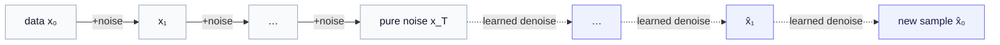
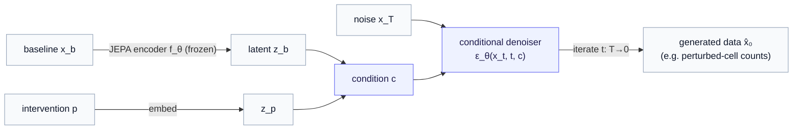

# Part 8 — Route C: representation-conditioned diffusion

*Stop trying to make the predictor generative, and instead train a whole second model — a diffusion model — whose only job is to turn noise into data, steered by the JEPA latent. The most modular route, the most expressive, and the heaviest.*

> **Recap — where this sits.** [Part 5](05-two-gaps-four-routes.md) mapped four routes; [Part 6](06-route-a-latent-decoder-head.md) bolted a decoder on the predicted latent (Route A); [Part 7](07-route-b-variational-and-beyond-gaussian.md) made the predictor *variational* (Route B) and ended on a cliffhanger — when you push the posterior past a Gaussian, past a mixture, all the way to a *learned, many-step transport*, it stops being a closed-form distribution and becomes a generative model in its own right. This chapter follows that thread to its destination: a **diffusion model**, conditioned on the JEPA latent. New machinery (the forward/reverse process, the denoiser, the score) is built from scratch, with reminders of the standard pieces as they appear. If the biology vocabulary is unfamiliar, the [data-modalities primer](appendix-data-modalities.md) has it.

At the end of Route B we climbed a ladder of ever-more-expressive posteriors — Gaussian, full-covariance, mixture, flow — and noticed the top rung was no longer a tidy formula you sample once, but a *process* you run. Route C embraces that fully and reorganizes the whole architecture around it. Instead of asking JEPA's predictor to *be* generative, it keeps JEPA as a pure **representation engine** and trains a **separate** generative model — a diffusion model — that consumes the JEPA latent as a steering signal and emits data. Two models, a clean seam between them. That decoupling is the route's great virtue and its great cost, and the chapter is about both. But first we have to build the diffusion model itself, because everything downstream rests on it — and we will build it slowly, from the idea up.

---

## 1. The core idea — generation as gradual denoising

Here is the picture to hold before any math. Take a real data point and *destroy* it in slow motion: add a little random noise, then a little more, and a little more, over many small steps, until after enough steps nothing is left but pure static — a sample of meaningless noise. That is a fixed, mechanical *forward* process; it requires no learning, you just keep adding noise.

Now imagine running it **backwards**. If you could, at each step, *remove* a little noise — nudge the static slightly toward "what real data looks like" — then starting from fresh random static and denoising step by step would carry you from noise all the way back to a brand-new, realistic data point. The catch: the backward step is *not* free. Knowing how to take a noisy thing and make it slightly *less* noisy, in a way that lands you on the data manifold, is hard — and that is the one thing a diffusion model **learns**.

> **The one-sentence version.** A diffusion model learns to *reverse* a fixed noising process: train a network to denoise-by-one-step, and then generate by starting from pure noise and denoising repeatedly until a real-looking sample emerges.

Solid arrows are the fixed forward corruption; dashed arrows are the *learned* reverse. Two world-model gaps fall out immediately, which is why diffusion is a complete generative route on its own: generation starts from **random** noise (different static → different sample), which closes **G1** (stochastic outcomes); and the reverse process ends in **data space**, which closes **G2** (you get an actual data point). Now let us make each half precise.

---

## 2. The forward process — destroying data on a schedule

The forward process is just repeated addition of Gaussian noise, and we can write the whole thing in closed form. Index the steps by $t = 0, 1, \dots, T$, with $x_0$ a real data point and $x_T$ essentially pure noise. The standard construction (DDPM) defines each step as

$$
x_t = \sqrt{1 - \beta_t}\ x_{t-1} + \sqrt{\beta_t}\ \epsilon, \quad \epsilon \sim \mathcal{N}(0, I),
$$

where $\beta_t$ is a small **noise schedule** (how much fresh noise to inject at step $t$), and — reminder of the symbols — $\mathcal{N}(0, I)$ is the standard Gaussian (mean zero, identity covariance, i.e. independent unit-variance noise in every dimension), and $\epsilon$ is one draw from it. Each step shrinks the signal slightly ($\sqrt{1-\beta_t} < 1$) and adds a little noise.

The convenient miracle: because each step is linear-Gaussian, you can **jump to any step in one shot** without simulating the intermediate ones. Defining $\alpha_t = 1 - \beta_t$ and the running product $\bar\alpha_t = \prod_{s=1}^{t} \alpha_s$ (read $\bar\alpha_t$ as "how much of the original signal survives to step $t$"), the marginal is

$$
x_t = \sqrt{\bar\alpha_t}\ x_0 + \sqrt{1 - \bar\alpha_t}\ \epsilon, \quad \epsilon \sim \mathcal{N}(0, I).
$$

Read it: at step $t$, the noisy point is a fixed blend of the *clean* data ($x_0$, weighted by $\sqrt{\bar\alpha_t}$) and *pure noise* ($\epsilon$, weighted by $\sqrt{1 - \bar\alpha_t}$). Early on $\bar\alpha_t \approx 1$ so $x_t \approx x_0$ (barely corrupted); as $t \to T$, $\bar\alpha_t \to 0$ so $x_t \approx \epsilon$ (all noise). This closed form is what makes training cheap — you can land on any noise level instantly.

---

## 3. The reverse process — what the network actually learns

The reverse step is the learned part. The remarkable fact (from the theory of diffusion) is that, for small enough steps, the reverse of a Gaussian-noising step is *itself* approximately Gaussian — so the model only has to predict that reverse Gaussian's **mean**, and a standard reparameterization makes even that prediction simple. After the algebra (which we will not grind through), the whole learning problem collapses to a startlingly plain objective: **given a noised point and its noise level, predict the noise that was added.**

Concretely, a network $\epsilon_\theta(x_t, t)$ takes the noisy point $x_t$ and the step index $t$ and tries to output the noise $\epsilon$ used to make it. Train it by simple regression — the same mean-squared error we have used throughout:

$$
\mathcal{L}_{\text{diff}} = \mathbb{E}_{x_0, t, \epsilon} \big\lVert \epsilon - \epsilon_\theta(x_t, t) \big\rVert^2, \quad x_t = \sqrt{\bar\alpha_t}\ x_0 + \sqrt{1 - \bar\alpha_t}\ \epsilon.
$$

Read the recipe off the expectation: take a real $x_0$, pick a random step $t$, draw noise $\epsilon$, *form* the noised $x_t$ with the closed-form blend, and ask the network to recover $\epsilon$ from $(x_t, t)$. No adversary, no sampling inside the loss, no likelihood to evaluate — just "guess the noise," averaged over data, steps, and noise draws. (This is why diffusion training is so stable: at heart it is denoising regression.)

> **Why "predicting the noise" is the same as learning to denoise — and the link to the *score*.** If you can predict the noise $\epsilon$ in $x_t = \sqrt{\bar\alpha_t}x_0 + \sqrt{1-\bar\alpha_t}\ \epsilon$, you can solve for an estimate of the clean $x_0$, which is exactly a denoise step. Even deeper: predicting the noise is, up to a known scale, predicting the **score** — the gradient $\nabla_{x} \log p_t(x)$ of the log-density of the noised data, the vector field pointing "toward where real data is denser." (Reminder: a *score* in this sense is just the gradient of a log-probability; following it uphill moves you toward more-probable points.) So a diffusion model is equivalently a *score model*, and sampling is following the score from noise toward data — the same "follow the arrows from noise to data" picture the [Part 2](02-the-latent-prior.md) flow prior drew, with diffusion and rectified flow as two members of one family of learned noise-to-data transports.

**Sampling** then runs the reverse chain: start from pure noise $x_T \sim \mathcal{N}(0, I)$, and for $t = T, T-1, \dots, 1$ use $\epsilon_\theta(x_t, t)$ to take one denoising step toward $x_{t-1}$, until $x_0$ is a finished sample. Many steps (tens to hundreds), which is the practical price — though sampler advances and the rectified-flow cousin (straighter paths, fewer steps) cut it down.

---

## 4. The actual route — condition the diffusion on the JEPA latent

Everything so far is an *unconditional* diffusion model: it generates *a* plausible data point, not data *given* something. Route C's defining move is to make it **conditional**, and the conditioning signal is the **JEPA latent**. The single change is to feed the condition into the denoiser:

$$
\epsilon_\theta(x_t, t, c), \qquad c = \text{the JEPA representation (context } z_b \text{ and/or intervention } z_p).
$$

Now the learned vector field that carries noise to data is *steered* by $c$: generate with $c = $ "this baseline cell, this drug," and the reverse process lands in the part of data space corresponding to that perturbed cell. Everything else — the forward process, the loss, the sampler — is unchanged; the network simply gets an extra input.

**Worked example.** Condition on $(z_b, z_p) = $ (a control cell's JEPA latent, the embedding of "drug X"). Run the reverse process from noise and you get one plausible perturbed-cell expression profile; run it again from fresh noise and you get a *different* plausible profile. A thousand runs simulate the population of responding cells — and because the response is generated by an arbitrarily-flexible reverse process rather than a single Gaussian, it can be genuinely **multimodal** (the two-fates problem from [Part 7 §3](07-route-b-variational-and-beyond-gaussian.md)), with whatever correlations the data demand. This is the expressiveness Route B's Gaussian floor could not reach, now had in full.

A design choice worth naming: the diffusion can run in **data space** (denoise directly to gene counts — closes G2 in data space, so effect sizes are recoverable per [Part 5 §3](05-two-gaps-four-routes.md)) or in a **latent space** (denoise to a latent, then a decoder to data — the classic "latent diffusion" of modern image generators). Latent-space diffusion is cheaper and is the usual choice when the data space is huge; data-space diffusion is the most direct for effect-size calibration.

---

## 5. The payoff and the price — modularity

Route C's signature is **decoupling**, and it is worth appreciating why that is valuable. There are two models with a clean interface between them — a JEPA encoder that produces $c$, and a conditional diffusion model that consumes it — and that seam buys real engineering freedom:

- **Either half is swappable.** Improve the representation (a bigger/better JEPA, a different modality's encoder) without touching the generator; improve the generator (a better sampler, a flow instead of diffusion, a stronger architecture) without retraining the encoder. The latent is the contract between them.
- **Training is staged and independent.** Freeze the JEPA encoder (pure self-supervised artifact, exactly the [Parts 0–4](index.md) discipline), then train the diffusion model on top against the frozen latents. No reconstruction gradient ever flows into the encoder, so — unlike the joint-trained Route A/B — the encoder *cannot* collapse toward a reconstruction model. The "did JEPA stay JEPA?" worry from [Route A §4](06-route-a-latent-decoder-head.md) is structurally avoided here.
- **It is exactly the latent-diffusion recipe.** "Encode with a strong representation model, then train a (conditional) diffusion model to generate from that latent" is precisely how modern image and video generators are built. Route C is that recipe with JEPA as the chosen encoder.

The price is the flip side of the same coin: **two models to train, tune, and serve**, and **iterative sampling** (many denoising steps per sample, versus Route A/B's one-shot draw). It is the heaviest of the four routes. And note where the [Parts 0–4](index.md) starter sits in this light: that unconditional rectified-flow prior over frozen latents *is* a stripped-down Route C — same "separate learned noise-to-data transport over the JEPA latent," minus the conditioning and using flow's straight-line cousin of diffusion. The starter was Route C in miniature all along.

---

## 6. The honest placement — likelihood, and "is this still JEPA?"

Two candid notes, consistent with the rest of the series.

First, **the meta-point holds, again**: bolting a conditional diffusion model onto a JEPA encoder gives you a *latent-diffusion model with JEPA as encoder pretraining*. That is a strong, modern architecture — but the generative power is the diffusion model's; JEPA's contribution is the representation it conditions on. As always, you must **show** that conditioning on a JEPA latent beats conditioning on a cheaper representation, rather than assume it.

Second, on **likelihood** — the open prize from [Part 5 §5](05-two-gaps-four-routes.md): diffusion is better placed than Routes A/B here. Score-based diffusion models admit a **probability-flow ODE**, a deterministic map between noise and data whose change-of-variables gives an exact(-in-principle) likelihood — so in the latent or data space the model operates on, you *can* score "how probable is this point," which is what de-novo design and variant scoring want. The honest caveat: when a decoder sits between the diffusion space and the final data space, exactness in *data* space is again broken, and the compute to evaluate the ODE likelihood is non-trivial. So Route C moves the likelihood question forward — it does not fully close it.

---

## 7. What it costs, and where it leads

Route C's character, for choosing among the four:

- **Most expressive.** A learned, many-step reverse process can match (almost) any conditional data distribution — multimodal, correlated, heavy-tailed — clearing the Gaussian floor entirely.
- **Most modular.** Two models, a clean latent interface, independent training, no encoder-collapse risk. The latent-diffusion recipe with JEPA as the encoder.
- **Closest to a usable likelihood.** The probability-flow ODE gives an in-principle density in the diffusion's own space.
- **Heaviest.** Two models to train and tune; iterative (multi-step) sampling. The cost you pay for the expressiveness and the modularity.

> **Recap, and the hand-off.** Route C keeps JEPA as a pure representation engine and trains a *separate* conditional diffusion model — a learned reverse-noising process steered by the JEPA latent — to emit data. It closes G1 (start from random noise) and G2 (denoise into data space), reaches expressiveness Routes A/B cannot, stays cleanly modular, and comes closest to a tractable likelihood — at the price of a second model and iterative sampling. With Routes A, B, and C we now have three ways to generate *data* from a JEPA latent. Before the fourth route, we pause to collect a model that has been quietly forming in the gaps between B and C — the **conditional flow prior**, which is at once Route B's expressive limit (a flow posterior beyond Gaussian) and Route C done with flow instead of diffusion, and which is *also* the [Parts 0–4](index.md) starter finally completed into a conditional model. That synthesis is [Part 9 — The conditional flow prior](09-conditional-flow-prior.md). Then [Route D](10-route-d-world-model-planning.md) does something different in kind: it produces not data but **decisions** — *which intervention to apply* to reach a goal — and is where this series shakes hands with the [Operator World Models](../operator_world_models/index.md) line.

---

*Previous: [Part 7 — Route B](07-route-b-variational-and-beyond-gaussian.md). Next: [Part 9 — The conditional flow prior: completing the starter](09-conditional-flow-prior.md). Symbols: the [notation reference](notation.md). Unfamiliar with the biology? The [data-modalities primer](appendix-data-modalities.md).*
