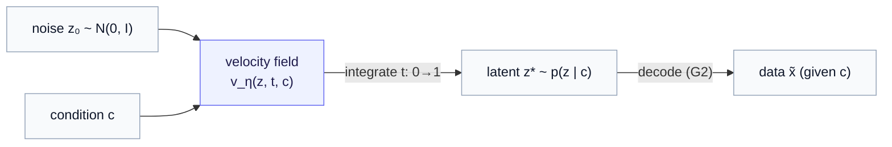
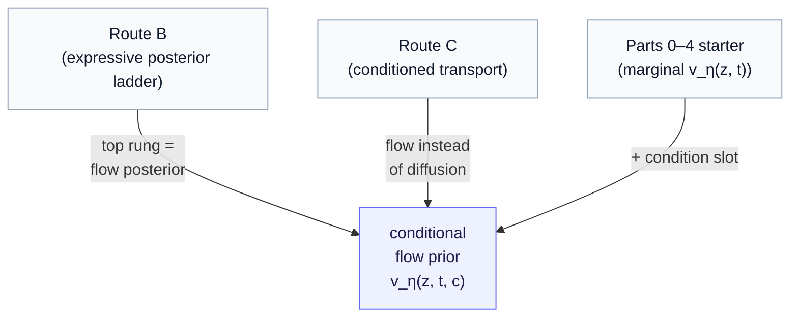

# Part 9 — The conditional flow prior: completing the starter

*The Parts 0–4 starter presented an unconditional flow prior; here we introduce conditioning by adding a single input to its velocity field — and the result is not a new route, but the one model where Route B's expressive limit, Route C's flow variant, and the original starter all coincide.*

> **Recap — where this sits.** [Part 7](07-route-b-variational-and-beyond-gaussian.md) climbed a ladder of ever-more-expressive posteriors and found its top rung was a *learned transport*, not a closed-form distribution. [Part 8](08-route-c-conditioned-diffusion.md) built one such transport — a conditional **diffusion** model — and noted in passing that diffusion's straight-line sibling, **rectified flow**, is the very thing the [Part 2](02-the-latent-prior.md) starter already used (unconditionally). This chapter ties those threads into one knot. We take the starter's flow prior, add a condition, and recognize the result as the model that Parts 7 and 8 were each circling from their own side. Flow basics are recalled (not re-derived) as we go; the [notation reference](notation.md) holds the symbols.

The [Parts 0–4](index.md) starter presented an unconditional flow prior — a complete generative model that makes *a* plausible digit, but never *a digit given a class*; *a* plausible cell, never *a cell given a drug*. That was exactly the right place to begin. Now, with the routes in hand, we **introduce conditioning**: we let that same flow prior generate *given a condition* — a class, a perturbation, an intervention — by adding a single input to its velocity field. The cost is small (one extra argument); the reward is large, in two ways at once. It turns the starter into a model that can answer "…given this intervention?", and — more interestingly — it lands us on a model that Routes B and C both point at from opposite directions. Let us build it, then collect the payoff.

---

## 1. The starter's flow prior, recalled in one breath

We'll do just enough recap of the notion of a flow prior to change one thing; for the full construction — or if any step below feels unfamiliar — see [Part 2](02-the-latent-prior.md).

The starter's prior is a **flow** that transports easy noise into data-like latents. Pick a noise point $z_0 \sim \mathcal{N}(0, I)$ (the standard Gaussian — mean zero, unit variance per dimension) and a real **data latent** $z_1$, and connect them with a straight line in time $t \in [0, 1]$:

$$
z_t = (1 - t) z_0 + t z_1, \qquad u_t = \frac{d z_t}{dt} = z_1 - z_0.
$$

So at every point on that line we know both *where the particle is* ($z_t$) and *how fast it should move* ($u_t = z_1 - z_0$, constant along the line). A network $v_\eta(z_t, t)$, representing the **velocity field** with weights $\eta$, is trained to predict that velocity from position and time alone, by plain regression:

$$
\mathcal{L}_{\mathrm{CFM}}(\eta) = \mathbb{E}\big\lVert v_\eta(z_t, t) - u_t \big\rVert^2.
$$

To *generate*, you start at noise and follow the learned arrows — integrate $dz/dt = v_\eta(z, t)$ from $z_0 \sim \mathcal{N}(0, I)$ up to $t = 1$, landing on a fresh latent. That is the whole starter prior: many crossing straight paths average, at the optimum, into one flow that carries the entire noise cloud onto the entire latent cloud $p(z)$.

It is worth being precise about what that distribution $p(z)$ is, because it is exactly the thing the next section changes. It is the **marginal** distribution of latents — every latent from every training example, pooled into one cloud, with no memory of which class or condition produced each one. And the velocity field reflects that: $v_\eta(z, t)$ takes only a position $z$ and a time $t$ as inputs, so there is simply nowhere to tell it *which kind* of latent you are after. That is what makes the prior **unconditional** — it will happily hand you *a* sample from the pooled cloud, but it cannot answer "a sample *given* this class" or "*given* this drug," because the class and the drug were never inputs in the first place. That one missing input is the whole of what we add next.

---

## 2. The single change — give the velocity field the condition

Here is the entire edit. Pair each training data latent $z_1$ with the **condition** $c$ it came under, and let the velocity field *see* $c$:

$$
\mathcal{L}_{\mathrm{CFM}}(\eta) = \mathbb{E}_{(z_1, c),\ z_0,\ t}\big\lVert v_\eta(z_t,\ t,\ c) - u_t \big\rVert^2, \qquad z_t = (1-t) z_0 + t z_1, \quad u_t = z_1 - z_0.
$$

Everything else is untouched — same straight-line interpolant, same constant target velocity $u_t$, same mean-squared regression. The network simply gets an extra input $c$ and, as a result, learns a *different flow for each condition*. Generation conditions the same integration:

$$
\frac{dz}{dt} = v_\eta(z, t, c), \qquad z(0) \sim \mathcal{N}(0, I), \qquad z^{*} = z(1).
$$

Fix $c$, release a noise sample, follow the (now $c$-steered) arrows, and you arrive at a latent drawn from $p(z \mid c)$ instead of the lumped-together $p(z)$. That is the conditional flow prior, in full. The apology is gone: this model answers "what latent, *given* $c$?"

---

## 3. What `c` is, and the worked example

The condition $c$ is the same conditioning vocabulary [Part 7](07-route-b-variational-and-beyond-gaussian.md) introduced: a **context** $z_b$ (the "before" — a baseline cell's latent, a person's current state) and an **intervention** $z_p$ (the drug, the action), so $c = (z_b, z_p)$.

**Worked example.** Train on pairs: for each (control cell, drug) you have the *perturbed* cell, encode it to its latent $z_1$, and tag it with $c = (z_b, z_p) = $ (the control cell's latent, the drug's embedding). The flow learns to transport noise onto the distribution of *perturbed-cell latents given that baseline and drug*. At generation, fix $c = $ (this patient's cell, "drug X"), sample noise, integrate to a latent, and decode (an NB count head, [Part 6](06-route-a-latent-decoder-head.md)) to a gene-count profile. Re-sample the noise and you get a *different* plausible profile — a thousand draws simulate the responding-cell population. And because a flow can bend noise into (almost) any shape, that population can be genuinely **multimodal** — the two-fates response a single Gaussian could not represent ([Part 7 §3](07-route-b-variational-and-beyond-gaussian.md)) — with whatever correlations the data carry.

---

## 4. The payoff — one model, three identities

This is why the chapter exists. The conditional flow prior is not a fifth route; it is the **single concrete model where three earlier threads coincide.** Read the same object three ways:

| seen as… | the conditional flow prior is… | which chapter wanted it |
|---|---|---|
| **Route B's expressive limit** | the **flow posterior** — the top rung of the expressive-posterior ladder, replacing the Gaussian $q_\phi(z \mid z_b, z_p)$ with an arbitrarily-shaped, learned conditional distribution | [Part 7 §4](07-route-b-variational-and-beyond-gaussian.md) |
| **Route C with flow** | Route C's "separate conditional generative model over the latent," realized with **rectified flow** instead of diffusion (the two are siblings — both learned noise→data transports) | [Part 8 §3](08-route-c-conditioned-diffusion.md) |
| **the starter, completed** | the [Parts 0–4](index.md) marginal flow prior $v_\eta(z, t)$ with a **condition slot** $v_\eta(z, t, c)$ added — nothing else changed | [Part 2](02-the-latent-prior.md) |

That triple identity is worth pausing on, because it dissolves a false sense that B and C were rival camps. They were two *descriptions* of the same expressive-conditional-generation idea — one arrived at by making a variational posterior richer and richer, the other by conditioning a standalone transport — and the conditional flow prior is where the descriptions meet. The starter was already standing on that spot, one input short.

---

## 5. Why flow here — and what you trade

If diffusion (Route C) and flow are siblings, why give flow its own chapter rather than fold it into Route C? Because the *flow* realization has a distinct practical profile worth stating, and because it is the one your codebase already runs.

- **Straighter paths, fewer steps.** Rectified flow's training targets are straight lines, so its learned transport is close to straight — and a near-straight ODE needs only a handful of integration steps to sample, where diffusion's curved reverse process typically wants many. This is the practical edge [Part 2](02-the-latent-prior.md) already flagged, now inherited by the conditional version.
- **A dead-simple objective.** Conditional flow matching is one mean-squared regression (predict the velocity), with no adversary, no sampling inside the loss, no noise-schedule to tune. It is arguably the gentlest expressive generator to train.
- **The same expressiveness↔tractability trade as everywhere.** Like diffusion, the flow gives an *implicit* distribution — you sample by integrating, and there is no closed-form density to read off in one line (a likelihood is available only through the flow's ODE, the same change-of-variables story as Route C's probability-flow ODE). That is the price for clearing the Gaussian's unimodality: you give up the Gaussian's closed form and one-shot sample, exactly the dial from [Part 7 §3](07-route-b-variational-and-beyond-gaussian.md).

---

## 6. How it closes the gaps, and the honest placement

For completeness, in the now-familiar terms:

- **G1 (stochastic outcomes)** — closed by the conditional noise→latent transport: different noise draws, fed through the $c$-steered flow, give different plausible latents, a real population rather than a point.
- **G2 (decoder to data)** — closed by a decoder on the sampled latent (NB/ZINB for counts), so the model emits data and **effect sizes are recoverable** ([Part 5 §3](05-two-gaps-four-routes.md)). The flow can equally run in data space directly; latent-space-plus-decoder is the cheaper default.

And the honest notes, unchanged in spirit from the rest of the series: structurally this is *latent flow-matching generation with JEPA as encoder pretraining* — a strong, modern stack whose generative power is the flow's; JEPA contributes the representation the flow is conditioned on, and you must **show** that conditioning on a JEPA latent earns its keep over a cheaper representation. On the open likelihood question ([Part 5 §5](05-two-gaps-four-routes.md)), the flow is in the same place as Route C: an in-principle density via its ODE, broken in *data* space by any decoder that sits after the flow.

---

## 7. What it costs, and where it leads

The conditional flow prior, summed up:

- **The starter, finally conditional.** One input to the velocity field turns the marginal $p(z)$ into $p(z \mid c)$ — generation *given* an intervention.
- **The meeting point of B and C.** Route B's flow posterior and Route C's flow transport are the same object; this is it. Expressive (multimodal, correlated), like both.
- **Cheap to sample, simple to train.** Near-straight paths → few integration steps; one regression loss.
- **Implicit density.** No closed-form likelihood; the expressiveness-vs-tractability dial sits on the expressive side.

> **Recap, and the hand-off.** By adding a single conditioning input to the starter's velocity field, we completed it into $v_\eta(z, t, c)$ — a conditional flow prior that samples $p(z \mid c)$, closes both gaps, and turns out to be Route B's expressive limit and Route C's flow variant at once. That closes the *data-generating* half of the design space: Routes A, B, C, and this synthesis all answer "what data, given a condition?" The final route answers a different question entirely — not "what data?" but "what *action*?" — by planning over an action-conditioned predictor to reach a goal. That is [Part 10 — Route D: world-model planning](10-route-d-world-model-planning.md), where this series meets the [Operator World Models](../operator_world_models/index.md) line.

---

*Previous: [Part 8 — Route C](08-route-c-conditioned-diffusion.md). Next: [Part 10 — Route D: world-model planning](10-route-d-world-model-planning.md). Symbols: the [notation reference](notation.md). Unfamiliar with the biology? The [data-modalities primer](appendix-data-modalities.md).*
