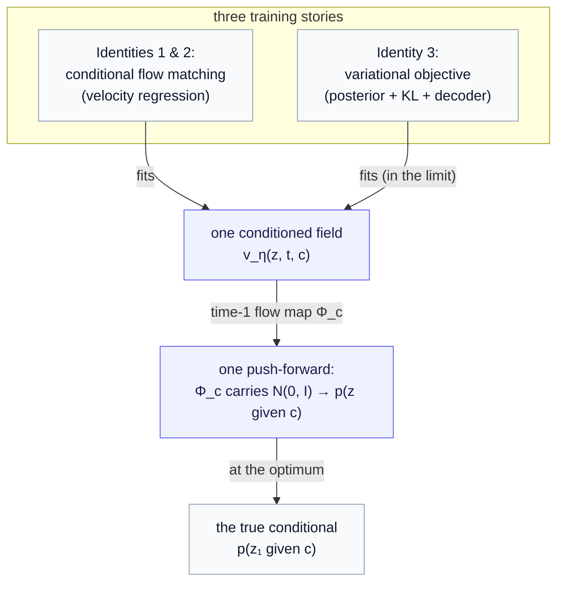

# Part 9a — The three identities, made precise: one push-forward, three training stories

*A companion to [Part 9](09-conditional-flow-prior.md) for readers who want the "one model, three identities" claim turned from a story into a statement you can check. We define the single object all three names point at, show each name specifies exactly it, and then are honest about the one place the equivalence is a limit rather than an identity — the training objective.*

> **Why this chapter exists.** [Part 9 §4](09-conditional-flow-prior.md) claimed that the conditional flow prior is, at once, Route B's expressive limit, Route C done with flow, and the starter completed — "two descriptions of the same idea," meeting at one model. That is the right intuition, but it is stated informally, and for the chapter's central thesis the informal version invites a fair objection: *a variational posterior trained with a KL term and a flow trained by velocity regression are not obviously the same thing.* They are not — as **objectives**. They are the same as **generative objects**. This chapter draws that line exactly. It assumes [Part 7](07-route-b-variational-and-beyond-gaussian.md) (the variational route and the expressive-posterior ladder), [Part 8 §3](08-route-c-conditioned-diffusion.md) (the score/transport picture), and [Part 9 §1–2](09-conditional-flow-prior.md) (the conditioned velocity field), and adds one tool: the **push-forward** of a distribution through a map.

The plan is strict buildup. First we name the **one object** — a base Gaussian pushed through a conditioned flow map — and pin down the push-forward notation. Then we take each of the three "identities" in turn and show it specifies *that same object*. Finally we separate the two things the informal claim quietly conflated: the **generative object** (where the equivalence is exact) and the **training objective** (where it is exact only in a limit). The payoff is a precise version of the slogan: *one architecture, three training stories, and a single distribution they all aim at.*

---

## 1. The one object — a base Gaussian pushed through a conditioned flow

Everything hinges on a single construction, so we build it carefully.

Start with the conditioned velocity field from [Part 9 §2](09-conditional-flow-prior.md): a network $v_\eta(z, t, c)$ with weights $\eta$, taking a latent position $z \in \mathbb{R}^D$, a flow time $t \in [0, 1]$, and a condition $c = (z_b, z_p)$. Hold the condition $c$ fixed and read $v_\eta(\cdot, \cdot, c)$ as a time-dependent vector field on $\mathbb{R}^D$. Integrating it defines the **flow map** $\phi^c_t$ — "where does a particle starting at $z_0$ sit at time $t$, under condition $c$":

$$
\frac{d}{dt} \phi^c_t(z_0) = v_\eta\big(\phi^c_t(z_0),\ t,\ c\big), \qquad \phi^c_0(z_0) = z_0.
$$

The object we care about is the **time-1 map**, written $\Phi_c := \phi^c_1$. It sends a noise point to a generated latent: $z = \Phi_c(z_0)$.

Now the key definition. Feed the standard Gaussian through $\Phi_c$ and you get a distribution over latents. That distribution is the **push-forward** of the base by $\Phi_c$, written $(\Phi_c)_\# \mathcal{N}(0, I)$ — read it as "the distribution of $\Phi_c(z_0)$ when $z_0 \sim \mathcal{N}(0, I)$." Call it $p_\eta(z \mid c)$:

$$
p_\eta(z \mid c)\ :=\ (\Phi_c)_\# \mathcal{N}(0, I), \qquad \text{i.e.}\quad z = \Phi_c(z_0),\ \ z_0 \sim \mathcal{N}(0, I).
$$

That is the one object. It is fully determined by two ingredients and nothing else: the **base** ($\mathcal{N}(0, I)$) and the **conditioned field** ($v_\eta$, which fixes $\Phi_c$). Two construction routes that share both ingredients define the *same* distribution — not a similar one, the same one. The whole chapter is the observation that all three "identities" share both ingredients.

> **Why a push-forward, and not a density.** Notice we defined $p_\eta(z \mid c)$ by *how to sample it*, not by a formula for its density. That is deliberate and it is the expressive-generator bargain from [Part 7 §3](07-route-b-variational-and-beyond-gaussian.md): a flow gives you an easy sampler and an *implicit* density (available only through the change-of-variables along the ODE), in exchange for shapes a Gaussian cannot reach. The push-forward is exactly the right language for an object you define by its sampler.

---

## 2. Identity 1 — the completed starter *is* this object, by construction

This one is immediate, and it is why we start here. [Part 9 §2](09-conditional-flow-prior.md) *built* the completed starter as precisely this push-forward: take the marginal velocity field $v_\eta(z, t)$, add a condition slot to get $v_\eta(z, t, c)$, then sample by integrating from $z_0 \sim \mathcal{N}(0, I)$ to $t = 1$. That integration *is* $\Phi_c$, and the resulting sample distribution *is* $(\Phi_c)_\# \mathcal{N}(0, I)$.

So "the starter, completed" is not *like* the one object — it is the definition of it, written in the starter's vocabulary. Identity 1 is a tautology, and we keep it as the anchor the other two are measured against.

---

## 3. Identity 2 — Route C with flow is the same push-forward

[Part 8](08-route-c-conditioned-diffusion.md) framed Route C as "keep JEPA as a pure encoder and train a *separate* conditional generative model over the latent — a learned noise-to-data transport steered by $c$." The phrase **learned noise-to-data transport** is the tell: a transport is, by definition, a map carrying a base distribution to a target one. A conditional transport realized as a flow is a map $\Phi_c$, and the model it defines is $(\Phi_c)_\# \mathcal{N}(0, I)$ — Identity 1's object again.

The diffusion-versus-flow choice does not change the *type* of object, only the **path family** the transport travels:

- **Diffusion** ([Part 8 §2–3](08-route-c-conditioned-diffusion.md)) learns a curved, many-step reverse process. Its *stochastic* sampler is not literally a deterministic $\Phi_c$ — but its **probability-flow ODE** (the deterministic map with the same marginals, [Part 8 §6](08-route-c-conditioned-diffusion.md)) *is* a transport map, so even diffusion's generative distribution is a push-forward of the base.
- **Rectified flow** ([Part 2](02-the-latent-prior.md), [Part 9](09-conditional-flow-prior.md)) learns a near-straight transport directly, and *is* a deterministic $\Phi_c$ out of the box.

Take the flow member, give it the condition slot, and you get the *same field* $v_\eta(z, t, c)$ and the *same* $\Phi_c$ as Identity 1. "Route C with flow" and "the completed starter" are two names for one construction: a conditioned transport over the JEPA latent, with the only difference (diffusion vs. flow) being a path-family choice that leaves the object's *type* — a conditioned push-forward — unchanged.

---

## 4. Identity 3 — Route B's flow posterior is the same push-forward

This is the identity that needs the most care, because Route B looks the most different — it has a posterior, a prior, and a KL term, none of which appear above. The bridge is the **reparameterization map**.

Recall [Part 7 §1](07-route-b-variational-and-beyond-gaussian.md): Route B samples its outcome latent by transforming noise,

$$
\hat z = \mu_\phi + \sigma_\phi \odot \varepsilon, \qquad \varepsilon \sim \mathcal{N}(0, I).
$$

Read the right-hand side as a *map* applied to noise: $\hat z = T_\phi(\varepsilon;\ c)$ with $c = (z_b, z_p)$, where in the Gaussian case $T_\phi$ is the affine map $\varepsilon \mapsto \mu_\phi + \sigma_\phi \odot \varepsilon$. [Part 7 §4](07-route-b-variational-and-beyond-gaussian.md) made the decisive observation that this affine map *is a one-step flow*, and the expressive-posterior ladder is exactly the move of letting $T_\phi$ be richer — full-covariance (affine but tilted), mixture (several maps), and at the **top rung**, a *flow*: a many-step, ODE-integrated map.

At that top rung, $T_\phi(\cdot;\ c)$ is no longer affine — it is an integrated velocity field, i.e. exactly a time-1 flow map $\Phi_c$. So the distribution Route B samples at the top of its ladder is

$$
(T_\phi)_\# \mathcal{N}(0, I)\ =\ (\Phi_c)_\# \mathcal{N}(0, I)\ =\ p_\eta(z \mid c).
$$

The same object once more. Route B reaches it by asking "how expressive can the reparameterized sampler be?" and answering "let it be a flow"; the answer's *sampler* is identical to Identities 1 and 2.

One honest wrinkle, because Route B has *two* distributions. The thing you sample at generation is the **prior** $\pi(z \mid c)$, not the training-time posterior $q_\phi$ (they are coupled by the KL term, [Part 7 §2](07-route-b-variational-and-beyond-gaussian.md)). So "Route B's flow posterior" is, at generation time, a **flow prior** — the posterior's expressive shape transferred to the prior you sample. That is why Part 9 can call one model both "Route B's expressive limit" and "the conditional flow *prior*" without contradiction: in the well-trained limit the KL coupling drives the prior to match the posterior, and the prior you sample is the flow. We return to this wrinkle next, because it is where the equivalence stops being exact.

---

## 5. Where the equivalence is exact — and where it is only a limit

We can now state the precise version of the slogan, and it has two clauses that the informal §4 ran together.

**Exact, as generative objects.** Identities 1, 2, and 3 all sample $(\Phi_c)_\# \mathcal{N}(0, I)$ for a conditioned velocity field $v_\eta(z, t, c)$. Given the *same* trained field and the *same* base, the three produce **identically distributed** samples — this is a genuine identity of measures, not an analogy. The architecture is shared down to the integration.

**A limit, as training objectives.** What differs is *how each route fits $v_\eta$* — and therefore *which* field each lands on in finite practice:

- **Identities 1 and 2** fit the field by **conditional flow matching**: regress $v_\eta(z_t, t, c)$ onto the straight-line target $u_t = z_1 - z_0$ over pairs $(z_1, c)$ ([Part 9 §2](09-conditional-flow-prior.md)). At the optimum this transports the base onto the *true conditional of outcome latents*, $p(z_1 \mid c)$ — the distribution of encoded real outcomes given the condition.
- **Identity 3** fits the field inside a **variational objective**: a posterior pulled toward the encoded real outcome (the $\mathcal{L}_{\text{predict}}$ term), a KL coupling to the prior, and a decoder term ([Part 7 §5](07-route-b-variational-and-beyond-gaussian.md)). At its optimum — exact posterior, KL driven to zero, prior fit to the encoded outcomes — the prior it samples is *also* $p(z_1 \mid c)$.

So all three are **consistent estimators of the same target conditional** $p(z_1 \mid c)$, realized by the same architecture, differing only in the route they take to it. In the idealized optimum they coincide. In finite practice the regression route (CFM) and the variational route (ELBO with a KL) can land on *different* fields — different estimators, same estimand — and they carry different failure modes: CFM has no posterior-collapse knob to mistune, while the variational route can collapse the posterior onto the prior or drift if $\lambda_{\mathrm{kl}}$ is off ([Part 7 §2](07-route-b-variational-and-beyond-gaussian.md)).

This is also exactly the [Part 13](13-choosing-a-route.md) litmus, seen from the formal side. The question "does a network see the true outcome at training?" separates the *recognition* posterior (Route B's $q_\phi$, which does) from the *amortized* flow prior (CFM, which fits the conditional directly). Both aim at $p(z_1 \mid c)$; the litmus is about which training story gives you calibration *by construction* versus *by luck* — a statement about the objective, precisely the clause where the three stop being identical.

---

## 6. Recap — what the precise version buys you

The slogan "one model, three identities" survives the scrutiny, sharpened into two clauses:

- **One generative object, exactly.** All three names specify $(\Phi_c)_\# \mathcal{N}(0, I)$ — a base Gaussian pushed through a conditioned flow map. Same base, same field, same samples. This is an identity, and it means **one implementation serves all three**: a conditioned velocity field, integrated.
- **Three training stories, coincident only in the limit.** Conditional flow matching (Identities 1, 2) and the variational objective (Identity 3) are different routes to fitting that field; they meet at the true conditional $p(z_1 \mid c)$ in the idealized optimum, and can differ — with different failure modes — in finite practice.

The practical upshot is liberating: because the *object* is shared, you may choose the **path family** (flow vs. diffusion) and the **training story** (regression vs. variational) *independently*, by engineering taste and by the [Part 13](13-choosing-a-route.md) calibration litmus — without changing what you are ultimately modeling. That freedom is the real content of "they were two descriptions of the same idea."

---

*Companion to [Part 9 — The conditional flow prior](09-conditional-flow-prior.md). Background: [Part 7 — Route B](07-route-b-variational-and-beyond-gaussian.md) and [Part 8 — Route C](08-route-c-conditioned-diffusion.md). The calibration litmus it connects to: [Part 13 — Choosing a route](13-choosing-a-route.md). Symbols: the [notation reference](notation.md).*
