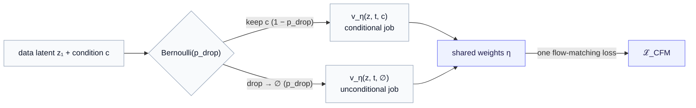
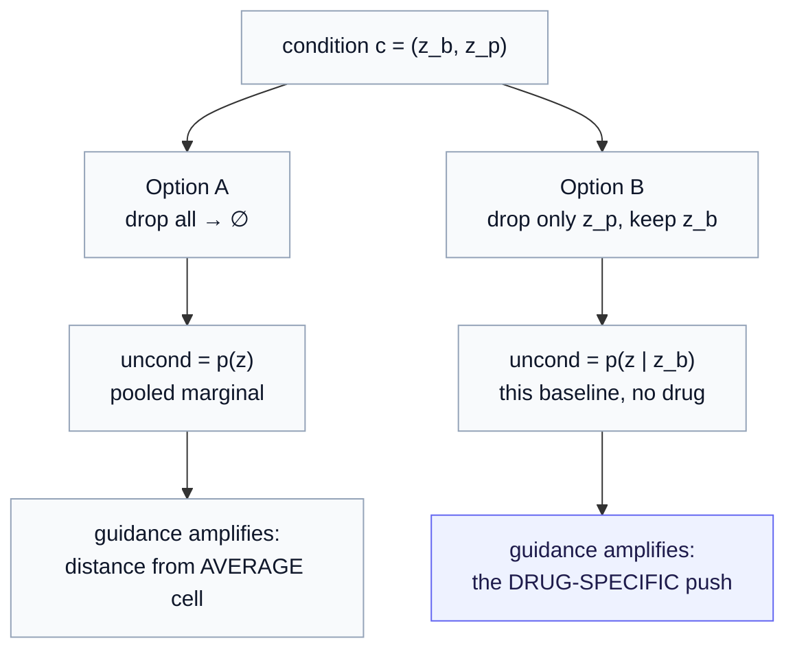

# Part 9b — Classifier-free guidance: a volume knob for the condition

*The [Part 9](09-conditional-flow-prior.md) conditional flow prior can already generate "a latent given a condition." This chapter adds the one thing it was still missing: a dial that controls **how hard** it leans on that condition — a knob you can turn up at sampling time to make the perturbation's fingerprint sharper, without retraining. That dial is classifier-free guidance (CFG), and it is the reason two innocuous flags — `--p-drop` and `--guidance` — appear in the perturbation-response code.*

> **Recap — where this sits.** [Part 9](09-conditional-flow-prior.md) took the Parts 0–4 flow prior and gave its velocity field one extra input, the condition $c$, turning the marginal $p(z)$ into the conditional $p(z\mid c)$. We could then fix a drug, release noise, follow the $c$-steered arrows, and land on a perturbed-cell latent. That closed the "generate *given* an intervention" story — but only at a single, fixed *strength* of conditioning. This chapter adds a strength knob. Everything is recalled, not re-derived; the [notation reference](notation.md) holds the symbols, and the flow-matching mechanics live in [Part 9](09-conditional-flow-prior.md).

---

## 1. The hook — a conditional model that still hedges

Picture the pipeline running exactly as [Part 9](09-conditional-flow-prior.md) left it. We have a frozen JEPA encoder, a trained conditional velocity field $v_\eta(z, t, c)$, and a count decoder. We pick a perturbation — say the transcription factor knockout **KLF1** — build its condition $c = (z_b, z_p)$ from a control-cell baseline $z_b$ and the perturbation embedding $z_p$, and generate a few hundred cells. We decode, we look at the effect: the generated cells *do* move in KLF1's direction… but weakly. The predicted change from control is smeared, timid, half-swallowed by the average-cell signal. The model responded to the drug, but it *hedged*.

Why would a correctly-trained conditional generator hedge? Two honest reasons, and they compound:

1. **Regression rewards the average.** The conditional flow is trained by a squared-error objective (predict the velocity $u_t = z_1 - z_0$; [Part 9 §1](09-conditional-flow-prior.md)). Squared error is minimized by conditional *means*. When the data for a given condition are scarce or noisy — the usual case in a perturbation screen, where each drug may have a few hundred cells — the safest prediction is to drift toward the pooled marginal $p(z)$, because that is where most of the probability mass sits. The condition's distinctive push is real but faint, and a mean-seeking loss under-uses it.

2. **We sometimes *want* to trade diversity for fidelity.** Even with a perfectly-trained model, at generation time we may care less about capturing every last cell in the responding population and more about answering "what does this perturbation do, *distinctively*?" That is a deliberate re-weighting we would like to control at sampling time — a dial, not a retrain.

So we want a single scalar knob $s$ with a clean meaning: **at $s=1$, generate honestly from $p(z\mid c)$; turn $s$ above $1$ to lean harder into the condition, sharpening the response at the cost of some diversity.** Classifier-free guidance is precisely that knob. The rest of this chapter earns it, from the ground up.

---

## 2. The small idea first — guidance is arrow arithmetic

Before any probability theory, here is the whole intuition as a picture, in the latent space the flow lives in.

Freeze the clock at some point $(z, t)$ along the generation — you are at position $z$ at flow-time $t$, deciding which way to step. Two velocity fields could tell you where to go:

- $v_\eta(z, t, \varnothing)$ — the **unconditional** arrow. The symbol $\varnothing$ (read "null") means "no condition given"; this arrow points the way the *pooled, drug-agnostic* cloud flows. It is the "just make some plausible cell" direction.
- $v_\eta(z, t, c)$ — the **conditional** arrow, with $c$ the KLF1 condition. This one points the way the *KLF1-response* cloud flows.

The difference between them,

$$
\Delta v  =  v_\eta(z, t, c)  -  v_\eta(z, t, \varnothing),
$$

is the part of the motion that exists **because of the condition** — strip out "cell-ness in general," and what remains is the drug-specific push. Read the symbols: $\Delta v$ is a vector in latent space; it is the conditional arrow minus the unconditional arrow, i.e. "how the drug bends the flow relative to no-drug."

Guidance says: *don't just take one Δv-worth of drug push — take $s$ of them.* The **guided velocity** is

$$
\tilde v_s(z, t, c)  =  v_\eta(z, t, \varnothing)  +  s \big[  v_\eta(z, t, c) - v_\eta(z, t, \varnothing)  \big]  =  v_\eta(z, t, \varnothing) + s \Delta v.
$$

Every symbol: $\tilde v_s$ is the guided arrow we will actually follow; $s \ge 0$ is the **guidance scale** (the knob); the bracket is $\Delta v$, the drug-specific push. Start at the unconditional arrow, then add $s$ copies of the drug push.

Three settings tell the story:

- $s = 0$: $\tilde v_0 = v_\eta(z,t,\varnothing)$ — ignore the drug entirely, generate a generic cell.
- $s = 1$: $\tilde v_1 = v_\eta(z,t,\varnothing) + \Delta v = v_\eta(z,t,c)$ — exactly the honest conditional. **No amplification.**
- $s > 1$: **extrapolate past** the conditional — step *further* in the drug direction than the model, on its own, would.

Here is the geometry. The guided arrow lands at the conditional when $s=1$, and marches one more $\Delta v$ beyond it for each unit of extra guidance.

<svg viewBox="0 0 460 300" xmlns="http://www.w3.org/2000/svg" role="img" aria-label="Vector diagram of classifier-free guidance as arrow arithmetic">
  <defs>
    <marker id="ah-gray" markerWidth="10" markerHeight="10" refX="8" refY="3" orient="auto"><path d="M0,0 L8,3 L0,6 Z" fill="#94a3b8"/></marker>
    <marker id="ah-indigo" markerWidth="10" markerHeight="10" refX="8" refY="3" orient="auto"><path d="M0,0 L8,3 L0,6 Z" fill="#6366f1"/></marker>
    <marker id="ah-amber" markerWidth="10" markerHeight="10" refX="8" refY="3" orient="auto"><path d="M0,0 L8,3 L0,6 Z" fill="#f59e0b"/></marker>
    <marker id="ah-dash" markerWidth="10" markerHeight="10" refX="8" refY="3" orient="auto"><path d="M0,0 L8,3 L0,6 Z" fill="#475569"/></marker>
  </defs>
  <!-- base point -->
  <circle cx="80" cy="260" r="4" fill="#0f172a"/>
  <text x="60" y="278" font-family="ui-sans-serif, system-ui" font-size="13" fill="#0f172a">z (position at time t)</text>
  <!-- unconditional arrow -->
  <line x1="80" y1="260" x2="240" y2="200" stroke="#94a3b8" stroke-width="2.5" marker-end="url(#ah-gray)"/>
  <text x="150" y="245" font-family="ui-sans-serif, system-ui" font-size="13" fill="#64748b">v(z,t,∅)  uncond</text>
  <!-- conditional arrow -->
  <line x1="80" y1="260" x2="300" y2="130" stroke="#6366f1" stroke-width="2.5" marker-end="url(#ah-indigo)"/>
  <text x="238" y="150" font-family="ui-sans-serif, system-ui" font-size="13" fill="#6366f1">v(z,t,c)  cond  (s=1)</text>
  <!-- delta v #1 : uncond tip -> cond tip -->
  <line x1="240" y1="200" x2="300" y2="130" stroke="#475569" stroke-width="2" stroke-dasharray="5 4" marker-end="url(#ah-dash)"/>
  <text x="300" y="196" font-family="ui-sans-serif, system-ui" font-size="12" fill="#475569">Δv</text>
  <!-- delta v #2 : cond tip -> guided tip (s=2) -->
  <line x1="300" y1="130" x2="360" y2="60" stroke="#475569" stroke-width="2" stroke-dasharray="5 4" marker-end="url(#ah-dash)"/>
  <text x="360" y="118" font-family="ui-sans-serif, system-ui" font-size="12" fill="#475569">Δv</text>
  <!-- guided arrow s=2 -->
  <line x1="80" y1="260" x2="360" y2="60" stroke="#f59e0b" stroke-width="2.5" marker-end="url(#ah-amber)"/>
  <text x="300" y="52" font-family="ui-sans-serif, system-ui" font-size="13" fill="#d97706">guided  (s=2)</text>
</svg>

The unconditional arrow (gray) and the conditional arrow (indigo) share a tail. Their tip-to-tip gap is $\Delta v$ (dashed). Guidance with $s=2$ (amber) starts at the unconditional tip and lays down **two** $\Delta v$'s — landing well beyond the honest conditional. That "beyond" is the amplification: the flow now pushes into regions *more* distinctively KLF1-like than the training data alone would suggest.

That is the entire mechanism. Everything below explains *why it is legitimate*, *why it needs a special training trick*, and *what it costs*.

---

## 3. The ancestor — classifier guidance, and a Bayes identity

Guidance did not begin classifier-*free*. It began with an actual classifier, and the free version is best understood as a clever way to delete that classifier. So let us meet the ancestor first; it is one line of Bayes.

We need one tool: the **score**. The score of a distribution $p$ at a point $z$ is

$$
\nabla_z \log p(z) \quad=\quad \text{"the direction in which } \log p \text{ increases fastest at } z\text{."}
$$

Read it plainly: $\nabla_z$ is the gradient with respect to $z$ (a vector of partial derivatives, one per latent dimension); $\log p(z)$ is the log-density. So the score is the vector pointing "uphill in probability" — nudge $z$ a little along the score and it becomes more typical of $p$. Score-based generative models (diffusion, and by close analogy flows) work by repeatedly stepping along an estimate of the score.

Now the one line. Bayes' rule relates the conditional density $p(z \mid c)$ to the unconditional $p(z)$ and a classifier $p(c \mid z)$ — the probability that a point $z$ belongs to condition $c$:

$$
p(z \mid c)  =  \frac{p(c \mid z)  p(z)}{p(c)}.
$$

Take the log — products become sums — and then the gradient $\nabla_z$. The term $\log p(c)$ has no $z$ in it, so its gradient vanishes:

$$
\underbrace{\nabla_z \log p(z \mid c)}_{\text{conditional score}}  =  \underbrace{\nabla_z \log p(z)}_{\text{unconditional score}}  +  \underbrace{\nabla_z \log p(c \mid z)}_{\text{classifier gradient}}.
$$

Read it in words: **the direction toward a more-probable cell-given-drug equals the direction toward a more-probable cell-in-general, plus the direction that makes a classifier more sure the cell is a drug-response.** The last term is a signpost pointing at "more KLF1-like."

**Classifier guidance** exploits this by *scaling the signpost*. Instead of adding one classifier gradient, add $\gamma$ of them ($\gamma \ge 1$):

$$
s_{\text{guided}}(z)  =  \nabla_z \log p(z)  +  \gamma \nabla_z \log p(c \mid z).
$$

With $\gamma > 1$ you steer harder toward the class than the honest conditional would. It works — but it has a cost baked in: you must **train a separate classifier** $p(c \mid z)$, and not on clean cells, but on the *noised* intermediate latents the generator passes through at every time $t$. That is an extra model, extra training, and a notorious source of brittleness. This is the thing classifier-free guidance deletes.

---

## 4. The trick — deleting the classifier

The insight (Ho & Salimans, 2022) is almost cheeky: we never actually needed the classifier as a separate object, because the same Bayes identity that *introduced* it can be rearranged to *express* it in terms of things we already have. Solve the boxed equation of §3 for the classifier gradient:

$$
\nabla_z \log p(c \mid z)  =  \underbrace{\nabla_z \log p(z \mid c)}_{\text{conditional score}}  -  \underbrace{\nabla_z \log p(z)}_{\text{unconditional score}}.
$$

In words: **the classifier's signpost is just (conditional score − unconditional score).** We do not need to train $p(c\mid z)$ at all — we can *manufacture* its gradient by subtracting the unconditional score from the conditional score, both of which come from a generative model, not a classifier.

Substitute this back into the classifier-guidance formula and collect terms. Writing $s$ for the guidance scale (renaming $\gamma \to s$ to match the code):

$$
\begin{aligned}
s_{\text{guided}}
&= \nabla_z \log p(z)  +  s \big[\nabla_z \log p(z \mid c) - \nabla_z \log p(z)\big] \\[4pt]
&= (1 - s) \nabla_z \log p(z)  +  s \nabla_z \log p(z \mid c).
\end{aligned}
$$

Two ways to read the final line, both worth holding:

- **As an interpolation/extrapolation** between the unconditional and conditional scores, with weights $(1-s)$ and $s$. At $s=0$ you get the pure unconditional; at $s=1$ the pure conditional; at $s>1$ you extrapolate *past* the conditional, away from the unconditional.
- **As "conditional plus extra push":** rearranged, $s_{\text{guided}} = \nabla_z\log p(z\mid c) + (s-1)\big[\nabla_z\log p(z\mid c) - \nabla_z\log p(z)\big]$ — the honest conditional, plus $(s-1)$ extra copies of the drug-specific direction. This is the §2 arrow picture, now derived rather than asserted.

No classifier appears anywhere. All you need is one model that can produce **both** the conditional score and the unconditional score. And that "both from one model" is the last piece — §6.

---

## 5. From scores to velocities — CFG in a flow

We built the flow prior on **velocity fields**, not scores ([Part 9](09-conditional-flow-prior.md)): the network $v_\eta(z, t, c)$ predicts how fast a particle at position $z$, time $t$, under condition $c$, should move. So we need CFG stated for velocities.

The good news is structural: in these generative families the velocity field plays the same role the score plays in diffusion — it is the learned vector field you integrate to turn noise into data. The guidance combination transfers verbatim. Replace each score by the corresponding velocity, keep the exact same weights:

$$
\boxed{ \tilde v_s(z, t, c)  =  v_\eta(z, t, \varnothing)  +  s \big[  v_\eta(z, t, c) - v_\eta(z, t, \varnothing)  \big] }
$$

with, equivalently, $\tilde v_s = (1-s) v_\eta(z, t, \varnothing) + s v_\eta(z, t, c)$. This is identical to the §2 arrow arithmetic — which is the point: the picture we started with *is* the classifier-free guidance formula, now with a derivation behind it. Symbols once more: $\tilde v_s$ is the guided velocity we integrate; $v_\eta(\cdot,\cdot,\varnothing)$ is the unconditional velocity (null condition); $v_\eta(\cdot,\cdot,c)$ the conditional; $s$ the guidance scale.

To generate, we integrate the guided field instead of the plain conditional one — the only change to the [Part 9](09-conditional-flow-prior.md) sampler is which velocity we ask for at each step:

$$
\frac{dz}{dt} = \tilde v_s(z, t, c), \qquad z(0) \sim \mathcal N(0, I), \qquad z^\ast = z(1).
$$

**One honest technical note.** For diffusion, guidance on the score corresponds *exactly* to sampling a re-weighted distribution (roughly $p(z\mid c)^{s} p(z)^{1-s}$, a "sharpened" tilt of the conditional toward the class). For flows the velocity-space combination is the standard, well-behaved *analogue* rather than an exact identity for arbitrary curved paths — but for **rectified (near-straight) flows**, which is what your codebase runs, it behaves as intended and is the accepted practice. We take the sharpening interpretation as a faithful mental model, and treat the precise density it targets as an in-principle question, consistent with the "implicit density" honesty of [Part 9 §5](09-conditional-flow-prior.md).

---

## 6. Why you need dropout — one network, two jobs

The guidance formula needs two outputs from the *same* weights $\eta$: the conditional velocity $v_\eta(z,t,c)$ and the unconditional velocity $v_\eta(z,t,\varnothing)$. But our network was built to take a condition. How does it produce a *no-condition* output?

The answer is the training trick that makes the whole thing "classifier-free": **condition dropout.** During training, on each example, with some probability $p_{\text{drop}}$ we hide the condition — replace $c$ by a fixed **null token** $\varnothing$ — and ask the network to predict the velocity anyway. The rest of the time it sees the real $c$. So the same weights are trained on a mixture of two tasks:

- most of the time (prob. $1 - p_{\text{drop}}$): "given the drug, predict the velocity" → learns $v_\eta(z,t,c)$;
- some of the time (prob. $p_{\text{drop}}$): "given nothing, predict the velocity" → learns $v_\eta(z,t,\varnothing)$, which is exactly the pooled, marginal flow.

One model, two roles, separated only by whether the condition slot holds $c$ or $\varnothing$. That is the economy CFG buys: no second network, no classifier — just a dropout coin flip during training.



This is where the `--p-drop` flag lives. In `04_train_cond_flow.py` the loss is called as

```python
loss = cfm_loss(flow, z1, c=c, p_drop=args.p_drop)   # default p_drop = 0.1
```

so on ~10% of examples the condition is nulled, teaching the shared weights the unconditional job alongside the conditional one. A reference implementation, matching your `VelocityMLP(z, t, c)` interface and typed for clarity:

```python
import torch
from torch import Tensor

def cfm_loss(
    flow: torch.nn.Module,      # v_η : (z, t, c) -> velocity, the VelocityMLP
    z1: Tensor,                 # (B, D) real data latents (frozen JEPA latents)
    c: Tensor,                  # (B, C) encoded condition (output of ConditionEncoder)
    p_drop: float = 0.1,        # probability of nulling the condition per example
    c_null: Tensor | None = None,  # (C,) the null token ∅; learned param or zeros
) -> Tensor:
    """Conditional flow-matching loss with classifier-free condition dropout.

    Trains one velocity field to serve as BOTH v_η(z,t,c) and v_η(z,t,∅),
    by randomly replacing the condition with a null token during training.
    """
    B, D = z1.shape
    device = z1.device

    # 1. Straight-line interpolant between noise z0 and data z1 (Part 9 §1).
    z0 = torch.randn_like(z1)                        # z0 ~ N(0, I)
    t = torch.rand(B, 1, device=device)             # t ~ Uniform[0,1], per example
    zt = (1.0 - t) * z0 + t * z1                     # position on the line at time t
    u_t = z1 - z0                                    # constant target velocity

    # 2. Classifier-free dropout: null the condition on a Bernoulli(p_drop) mask.
    if c_null is None:
        c_null = torch.zeros_like(c[0])             # simplest null: the zero vector
    drop = (torch.rand(B, device=device) < p_drop)  # (B,) True where we null
    c_in = torch.where(drop.unsqueeze(1), c_null.expand_as(c), c)

    # 3. One mean-squared regression — same objective as Part 9, unchanged.
    v_pred = flow(zt, t, c_in)                       # v_η(z_t, t, c_in)
    return ((v_pred - u_t) ** 2).mean()
```

Two design details worth flagging, because they matter for what "unconditional" *means* later (§9):

- **What the null token is.** The reference above uses the zero vector for clarity, but this codebase uses the safer, standard choice: a *learned* null embedding — `VelocityMLP.null_cond`, a trainable parameter (initialized to zeros) the network sees whenever the condition is dropped. Learned is preferable because a fixed zero may accidentally coincide with a meaningful region of condition space. (Because the null token lives on the model, the real `ssllab.generative.flow.cfm_loss(model, z1, c, p_drop)` reads it from `model.null_cond` rather than taking a `c_null` argument as the teaching version does.)
- **Where the drop happens.** Here we null the *already-encoded* condition vector `c`. An alternative nulls further upstream, inside the `ConditionEncoder`, which opens the door to dropping only *part* of the condition — the subject of §9.

---

## 7. The sampling knob — `--guidance`

The training half gave the network its two roles. The sampling half spends them. At generation we integrate the **guided** velocity of §5, and the guidance scale $s$ is your `--guidance` flag (default `1.0` = pure conditional, no amplification):

```python
@torch.no_grad()
def guided_velocity(
    flow: torch.nn.Module,
    z: Tensor, t: Tensor,       # current position and time
    c: Tensor, c_null: Tensor,  # real condition and null token
    guidance: float,            # s: 1.0 = honest conditional, >1 amplifies
) -> Tensor:
    """CFG-combined velocity  ṽ_s = v(z,t,∅) + s·[v(z,t,c) − v(z,t,∅)]."""
    v_c = flow(z, t, c)
    if guidance == 1.0:
        return v_c              # fast path: no need for the extra forward pass
    v_u = flow(z, t, c_null)
    return v_u + guidance * (v_c - v_u)


@torch.no_grad()
def sample_perturbed_latents(
    flow: torch.nn.Module,
    c: Tensor,                  # (N, C) condition, one per cell to generate
    c_null: Tensor,             # (C,) the null token
    n: int, guidance: float, steps: int,
    device: str, generator: torch.Generator,
) -> Tensor:
    """Integrate the guided flow from noise to perturbed-cell latents (Euler)."""
    D = flow.data_dim
    z = torch.randn(n, D, device=device, generator=generator)  # z(0) ~ N(0, I)
    dt = 1.0 / steps
    for i in range(steps):
        t = torch.full((n, 1), i * dt, device=device)
        v = guided_velocity(flow, z, t, c, c_null, guidance)
        z = z + dt * v                                         # Euler step
    return z                                                    # z* ~ sharpened p(z|c)
```

This is the shape of the real `sample_perturbed_latents(bundle, pid, n, guidance, steps, ...)` call in `05_sample_perturbed.py`. Note the small efficiency point: at $s=1$ you can skip the unconditional forward pass entirely (the fast path above); at $s>1$ each integration step costs **two** network evaluations instead of one — the standard CFG tax.

> **Smoke test — the identities you can assert.** Two properties should hold to machine precision and make good unit tests:
> `guided_velocity(..., guidance=1.0) == flow(z, t, c)` (guidance 1 is the honest conditional), and
> `guided_velocity(..., guidance=0.0) == flow(z, t, c_null)` (guidance 0 is the unconditional). If either fails, the sign or the interpolation weights are wrong.

---

## 8. What guidance actually does to the population

The arrow picture (§2) shows guidance at one point. Zoom out to the whole generated population and a cleaner story appears: **guidance sharpens the conditional distribution.**

At $s=1$ you sample the honest $p(z\mid c)$ — the full responding-cell population, with its real spread. As $s$ rises above $1$, sampling concentrates onto the regions that are *distinctively* this condition: high under $p(z\mid c)$ **and** low under the pooled $p(z)$. Generic "cell-ness" — the mass both distributions share — gets suppressed; the drug's fingerprint gets exaggerated. The population's *center* pushes further from control, and its *spread* narrows.

<svg viewBox="0 0 460 240" xmlns="http://www.w3.org/2000/svg" role="img" aria-label="Guidance sharpens and shifts the conditional distribution">
  <defs>
    <marker id="ah2" markerWidth="10" markerHeight="10" refX="8" refY="3" orient="auto"><path d="M0,0 L8,3 L0,6 Z" fill="#d97706"/></marker>
  </defs>
  <!-- axis -->
  <line x1="60" y1="200" x2="410" y2="200" stroke="#94a3b8" stroke-width="1.5"/>
  <text x="300" y="222" font-family="ui-sans-serif, system-ui" font-size="12" fill="#64748b">a latent coordinate (e.g. a KLF1-response axis)</text>
  <!-- unconditional: wide, low, left -->
  <path d="M90 200 C 160 200 160 130 230 130 C 300 130 300 200 370 200" fill="none" stroke="#94a3b8" stroke-width="2.5"/>
  <text x="96" y="150" font-family="ui-sans-serif, system-ui" font-size="12" fill="#64748b">p(z)  pooled</text>
  <!-- conditional s=1: medium, shifted right -->
  <path d="M206 200 C 248 200 248 92 290 92 C 332 92 332 200 374 200" fill="none" stroke="#6366f1" stroke-width="2.5"/>
  <text x="250" y="86" font-family="ui-sans-serif, system-ui" font-size="12" fill="#6366f1">p(z|c)  s=1</text>
  <!-- guided s>1: narrow, taller, further right -->
  <path d="M270 200 C 298 200 298 66 326 66 C 354 66 354 200 382 200" fill="none" stroke="#f59e0b" stroke-width="2.5"/>
  <text x="336" y="60" font-family="ui-sans-serif, system-ui" font-size="12" fill="#d97706">s&gt;1  sharpened</text>
  <!-- push arrow -->
  <line x1="292" y1="112" x2="322" y2="86" stroke="#d97706" stroke-width="1.8" marker-end="url(#ah2)"/>
</svg>

Left to right: the pooled marginal $p(z)$ (gray, broad, centered near the average cell); the honest conditional $p(z\mid c)$ (indigo, shifted toward the KLF1 response); and the $s>1$ guided distribution (amber, narrower, taller, pushed *further* from the pool). Guidance buys **effect strength and distinctiveness** and pays in **diversity**.

This is the classic guidance trade-off, and it is not free in either direction:

| turning $s$ **up** | turning $s$ **down (toward 1)** |
|---|---|
| stronger, more distinct perturbation effect | fuller, more faithful population spread |
| better *precision* toward the condition | better *recall* / diversity |
| risk of over-sharpening: artifacts, collapsed variance, biologically implausible extremes | risk of hedging: timid, smeared effects (the §1 failure) |

There is a sweet spot, and it is empirical — which is exactly why `--guidance` is a *tunable evaluation knob*, not a fixed constant, in your effect-size pipeline (§10).

---

## 9. Into JEPA — guidance lives downstream, and one real design choice

Where does all of this sit relative to the JEPA encoder? Cleanly *downstream* of it, and this is the payoff of the [Part 9 §6](09-conditional-flow-prior.md) "freeze-then-add" design.

Recall the arrangement: the encoder is trained purely self-supervised on cell *states*, then **frozen**; it produces the baseline latent $z_b$ but never sees the perturbation. All conditioning — and therefore all of guidance — lives in the flow's velocity field $v_\eta(z, t, c)$. So classifier-free guidance touches JEPA not at all. The encoder is condition-blind; guidance is a manipulation of the *flow's* two velocity outputs on the frozen latents. Turning `--guidance` up does not re-run, re-train, or perturb the encoder. That modularity is precisely what freezing bought us.

But there is one genuine design decision that JEPA's two-part condition forces, and your notes have already flagged it as the open question. The condition is a **pair**, $c = (z_b, z_p)$: the baseline cell latent $z_b$ (a JEPA activation) and the perturbation embedding $z_p$. When we "drop the condition to $\varnothing$," *which part do we drop?*

**Option A — drop the whole condition, $c \to \varnothing$.** The unconditional model becomes the fully pooled marginal $p(z)$: baseline forgotten, drug forgotten. Guidance then amplifies "distance from the **global average cell**." The extra push includes "be more cell-like-under-*any*-perturbation, and less like the population mean."

**Option B — drop only the perturbation, $z_p \to \varnothing$, keep $z_b$.** The unconditional model becomes $p(z \mid z_b)$: "what this baseline does with **no drug**" — essentially the control/self response. Guidance then amplifies specifically the **perturbation-relative push**, $\Delta v = v_\eta(z,t,(z_b,z_p)) - v_\eta(z,t,(z_b,\varnothing))$, which isolates *the drug's effect on this baseline* and strips out the "cell-is-a-cell" component that Option A leaves in.

For perturbation biology, Option B is usually the more meaningful target: you want to sharpen the **drug effect**, not the generic difference from an average cell. It answers "make the KLF1-*specific* change bigger," holding the baseline fixed — which is exactly the quantity a perturbation screen cares about.



Which one your code does is decided by **where the null-token dropout is applied** — and the current implementation is **Option A**. Here `ConditionEncoder.forward(z_b, pert_id)` fuses the baseline and the perturbation embedding through an MLP into a *single* condition vector `c` (there is no sliceable `z_b`/`z_p` split downstream), and `cfm_loss` nulls that whole `c` to `null_cond`. So "unconditional" means the fully pooled marginal $p(z)$, and guidance amplifies distance from the average cell. Option B would instead null *inside* the `ConditionEncoder` — replacing the `pert_id` pathway with a null perturbation while keeping the real $z_b$ — yielding $p(z \mid z_b)$ as the unconditional reference. The two give *different meanings* to the same `--guidance` number, and therefore different biological readings of "stronger effect." If the goal is drug-effect sharpening, moving the drop into the condition encoder (Option B) is a small, high-leverage change to `ssllab.generative.condition.ConditionEncoder`.

---

## 10. In the cell — the effect-size payoff

Now the biology, which is where guidance stops being a curiosity and becomes a lever on the metric you actually report.

Recall the evaluation ([`06_eval_effect_size.py`](../../examples/perturbation_response/06_eval_effect_size.py)): for each held-out perturbation you generate a population, read out its **mean normalized expression** from the count decoder (`predicted_expression` uses the decoder's gene-rate $\rho$ as log1p-CP10K, so the metric is library-size-free), compute the **predicted** change from control on the top differentially-expressed (DE) genes, and correlate it against the **measured** change — the **Δ-correlation** on top-$k$ DE genes (default $k = 20$). High Δ-correlation means "the model got the *shape and size* of the real response right."

The §1 failure — timid, smeared effects — shows up here as a **low Δ-correlation**: the predicted change vector is too small and too diffuse, so its correlation with the sharp measured change is weak. Guidance is the direct antidote, and this is why `--guidance` threads through both the sampler and the evaluator:

```python
# 06_eval_effect_size.py
p.add_argument("--guidance", type=float, default=1.0, help="classifier-free guidance weight")
# ...
def predict(pid, name):
    return predicted_expression(bundle, decoder, pid, args.n,
                                guidance=args.guidance, steps=args.steps, ...)
```

The intended workflow is a **guidance sweep**: hold everything else fixed, evaluate Δ-correlation at $s = 1.0, 1.5, 2.0, 3.0, \dots$, and watch the curve. You will typically see it *rise* as guidance sharpens the timid effect toward the real one, *peak* at some $s^\ast$ where predicted and measured effects best align, then *fall* as over-guidance pushes the population into implausible extremes — variance collapses, artifact genes light up, the decoded counts drift off the data manifold. That inverted-U is the empirical sweet spot §8 promised, now measured in the currency that matters.

**Reading the biology of the two knobs, together:**

- `--p-drop` (train, default `0.1`) is not a performance dial you tune per-perturbation — it is the *enabling* condition. It must be nonzero and modest (≈0.1–0.2) so the shared weights genuinely learn the unconditional job; too small and the null branch is undertrained (guidance becomes noisy), too large and the conditional job starves (the model forgets the drugs). Set it once, sensibly, and leave it.
- `--guidance` (sample, default `1.0`) is the per-run lever you *do* sweep. It says, in biological terms, "how far to trust and amplify the model's read of what this perturbation distinctively does." At `1.0` you report the model's honest conditional; above `1.0` you trade responding-population diversity for a sharper, more distinct effect — and you let the Δ-correlation curve tell you how far is too far.

And the honest caveat, in keeping with the series: a higher Δ-correlation under guidance is a statement about *effect-size recovery on top-DE genes*, not proof the full responding distribution is right. Guidance can improve the mean-effect metric while *narrowing* the population below its true spread. If your downstream question is "what is the **average** effect of KLF1?", guidance to the sweet spot is a clear win; if it is "what is the full *heterogeneity* of the KLF1 response, including a possible minority second fate?", push guidance gently and watch that you are not sharpening a genuinely multimodal population ([Part 9 §3](09-conditional-flow-prior.md)) down to a single mode. The knob that sharpens an effect can also erase a rare cell state.

---

## 11. Guidance meets composition — extrapolating to unseen combinations

Guidance controls *how hard* you lean on a condition; it says nothing about *which* conditions you can form. For the flagship perturbation task the conditions that matter most are the ones never seen in training — **unseen gene combinations** — and that capability comes from a different part of the code, one that composes cleanly with guidance.

The default condition encoder (`--cond-type table`) embeds each perturbation through a learned lookup table (a per-perturbation `nn.Embedding`). That is fine for perturbations seen in training, but it has no slot for a combination it never saw — `e(A+B)` simply does not exist. The alternative (`--cond-type geneset`, the `GeneSetConditionEncoder`) builds the perturbation embedding **from its target genes** instead:

$$
z_p(A + B) = e(A) + e(B),
$$

an additive pool over a learned *per-gene* table (`build_pert_gene_matrix` turns each perturbation into a multi-hot set of target genes; `control` targets none, so $z_p = 0$). Because the pooling is over gene slots and never over a per-perturbation slot, an unseen combination $A+B$ is assembled from the *already-trained* parts $e(A)$ and $e(B)$ — so the flow can be conditioned on, and generate, a perturbation it has never observed. (A `deepsets` variant, $z_p = \phi(\sum_g \psi(e(g)))$, adds a permutation-invariant refinement for interactions a pure sum cannot capture.) This is exactly what the held-out `--split combo` evaluation ([`06_eval_effect_size.py`](../../examples/perturbation_response/06_eval_effect_size.py)) tests.

The two levers are **orthogonal and composable**:

- **Composition** (the gene-set encoder) extends *which* conditions you can form — including combinations absent from training.
- **Guidance** (CFG) controls *how hard* you lean on whichever condition you formed.

Point both at the same unseen combo and you *generate* $A+B$ (composition) and then *sharpen* its predicted effect (guidance) — the "predict, then amplify, an unseen intervention" workflow a screen actually wants. It is also the in-code shadow of the **composition** property the recap (§12) attributes to the action operator: pooling interventions as $e(A)+e(B)$ here is the embedding-space version of composing operators $f_{\theta(c_2)} \circ f_{\theta(c_1)}$ there.

**One honest caution, sharper than for seen perturbations.** Guidance on an unseen combination amplifies the model's *extrapolated* belief about $A+B$ — a belief resting on the additivity baked into $e(A)+e(B)$. Where that assumption fails (genuine epistasis, $A+B$ doing what neither single predicts), guidance faithfully sharpens the *wrong* effect. So the diversity–fidelity sweep of §10 carries an extra risk for held-out combos — you compound extrapolation error with amplification. Sweep guidance more cautiously there, and read the combo Δ-correlation, not the in-distribution one.

---

## 12. Recap, cost, and where it points

**Recap.** A pure conditional generator hedges — regression seeks the mean, and scarce per-condition data pull samples back toward the pooled marginal. Classifier-free guidance adds a sampling-time knob $s$ that leans harder into the condition, built from one Bayes identity: the classifier's signpost, $\nabla_z\log p(c\mid z)$, equals (conditional score − unconditional score), so we can *manufacture* guidance from a generative model alone, no classifier needed. Realized for flows, the guided velocity is $\tilde v_s = v_\eta(z,t,\varnothing) + s [ v_\eta(z,t,c) - v_\eta(z,t,\varnothing) ]$. Two pieces make it run: **condition dropout** at training (`--p-drop`) teaches one network to be both conditional and unconditional; the **guidance scale** at sampling (`--guidance`) spends those two outputs, $s=1$ honest, $s>1$ amplified.

**What it costs.**

- **Two forward passes per step** at $s \ne 1$ — the standard CFG tax at sampling time.
- **A diversity–fidelity trade** — guidance sharpens the effect and narrows the population; the sweet spot is empirical, found by sweeping against Δ-correlation.
- **Sensitivity to `steps` at high $s$** — a strongly guided velocity field is more curved, so aggressive guidance may need more ODE integration `steps` to stay stable, and can still push latents off the data manifold (the §10 over-sharpening failure).
- **A meaning that depends on the null-token design** — dropping all of $c$ (amplify distance from the average cell) versus dropping only $z_p$ (amplify the drug-specific push) give different biology; read the code before trusting the number.
- **No cost to JEPA** — guidance is entirely downstream of the frozen encoder; the representation is untouched.

**Where it points.** Guidance is a *sampling-time* correction bolted onto a *condition-blind* encoder — the [Part 9 §6](09-conditional-flow-prior.md) decoupled end of the awareness dial. It sharpens what the downstream flow already knows, but it cannot add conditioning the encoder never learned. The other end of that dial — where conditioning is *native* to the representation, learned as the encoder's pretext task — is the operator world model ([Part 10](10-route-d-world-model-planning.md), and the [Operator World Models](../operator_world_models/index.md) line, where the predictor becomes an action-configured operator $f_{\theta(c)}$). Guidance and native conditioning are not rivals: one turns up a condition the flow was told about; the other builds the representation *around* the condition from the start. Which you reach for depends on whether the intervention is a downstream steering signal or the substrate of the whole model.

---

*Previous: [Part 9a — Three identities, formalized](09a-three-identities-formalized.md). Up: [Part 9 — The conditional flow prior](09-conditional-flow-prior.md). Next: [Part 10 — Route D: world-model planning](10-route-d-world-model-planning.md). Symbols: the [notation reference](notation.md). Code: [`04_train_cond_flow.py`](../../examples/perturbation_response/04_train_cond_flow.py) (`--p-drop`), [`05_sample_perturbed.py`](../../examples/perturbation_response/05_sample_perturbed.py) and [`06_eval_effect_size.py`](../../examples/perturbation_response/06_eval_effect_size.py) (`--guidance`).*
