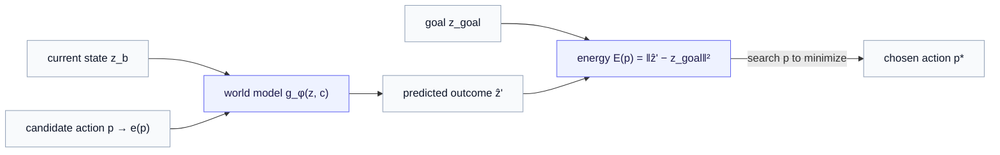
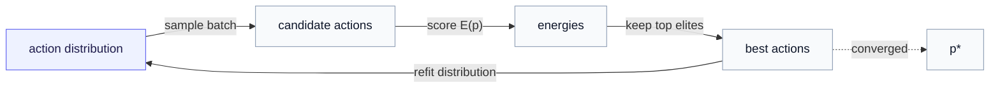

# Part 10 — Route D: world-model planning

*The other three routes answer "given this intervention, what happens?" This one answers the inverse — "which intervention should I apply to get where I want?" It generates not data, but decisions.*

> **Recap — where this sits.** [Parts 6–9](05-two-gaps-four-routes.md) built four ways to generate *data* given a condition: Route A (decode the latent), Route B (variational posterior), Route C (conditioned diffusion), and the conditional flow prior that unifies B and C. All of them are **forward** models — condition in, data out. Route D turns the question around. It freezes the encoder, treats the conditioned predictor as a **world model**, and *searches* the space of actions to reach a goal. New ideas (the planning energy, the Cross-Entropy Method) are built up as they arrive. This chapter is also where the series formally shakes hands with the [Operator World Models](../operator_world_models/index.md) line, so it carries a **notation reconciliation** (§5). The landmark is V-JEPA 2-AC.

Every route so far has been a *forward* generator: you hand it a condition — a class, a drug, an intervention — and it produces the data (or latent) that follows. That is exactly right when the question is "what will happen if I do this?" But step back and notice that the question you most often *want* answered, in drug discovery or in managing a chronic disease, is the **inverse**: not "what does drug X do?" but "**which** drug should I give to push this cell toward health?"; not "what does more exercise do to this person's glucose?" but "**what** should this person change to reach their target?" That is not a request to generate data. It is a request to generate a **decision** — to choose an action. Route D is the route that does this, and it does it by *planning* over a world model rather than sampling from a generator.

---

## 1. The inversion — from "what happens?" to "what action?"

Start from the object every route shares: a **predictor** $g_\phi(z, c)$ that takes a current latent state $z$ and a condition $c$ and returns the next latent $z'$. (Recall $c$ is the action, usually a learned embedding $c = e(p)$ of an intervention $p$ — a drug, a gene knockout, a logged behavior.) Read forward, it answers "from state $z$, under action $c$, where do I land?":

$$
z' = g_\phi(z, c), \qquad c = e(p).
$$

Planning inverts this. You are given a current state $z_b$ (the "before" — a diseased cell, a person's present metabolic state) and a **goal** state $z_{\text{goal}}$ (a healthy phenotype, a target glucose pattern), and you want the action that *gets you there*. Define a **planning energy** — read $\mathcal{E}(p)$ as "how far the predicted outcome of action $p$ lands from the goal":

$$
\mathcal{E}(p) = \big\lVert g_\phi\big(z_b,\ e(p)\big) - z_{\text{goal}} \big\rVert^2.
$$

(We write the energy $\mathcal{E}$ in script to keep it distinct from the encoder; the norm $\lVert \cdot \rVert^2$ is the squared distance from §-anywhere.) Low energy means "the world model predicts this action lands close to the goal." So the decision you want is the action that **minimizes** the energy:

$$
p^{*} = \arg\min_{p}\ \mathcal{E}(p).
$$

That $p^{*}$ — the chosen intervention — *is* the output. Route D is "generative in the **decision** sense": it produces the *action*, not the data. Nothing is decoded; the answer is "do $p^{*}$."

---

## 2. How the search works — optimization, not just ranking

The energy tells you how good *one* action is. To get $p^{*}$ you have to search the action space — and *how* you search is the difference between a brute-force ranking and genuine planning.

If the action space is a small, fixed list — say a library of 200 candidate drugs — you can simply evaluate $\mathcal{E}(p)$ for each and pick the smallest. That is **virtual screening as ranking**: score every candidate, sort, done. It works, but it only ever returns something already on the list, and it does not scale to *combinations* (200 drugs make 200 singles but ~20,000 pairs, and far more triples).

The more powerful move is to **optimize** over the action space, and a standard derivative-free optimizer fits perfectly here: the **Cross-Entropy Method (CEM)**. A quick build-up, since it is simple but may be unfamiliar:

1. Start with a broad guess distribution over actions (e.g. a Gaussian over a continuous dose vector, or a categorical over a discrete menu).
2. **Sample** a batch of candidate actions from it.
3. **Score** each by its energy $\mathcal{E}(p)$ (one forward pass through the world model apiece).
4. Keep the best fraction — the **elites** (say the top 10%).
5. **Refit** the distribution to those elites (e.g. set the Gaussian's mean and variance to the elites' mean and variance).
6. Repeat from step 2. Each round concentrates the distribution on lower-energy actions, until it collapses onto a near-optimal $p^{*}$.

This turns in-silico screening from "rank a fixed candidate list" into "**optimize** over the whole space of actions and combinations" — searching for interventions that may not have been on any list. It is the same loop a model-predictive controller runs to choose a robot's next move; here the "move" is a perturbation and the "world" is the JEPA latent.

---

## 3. Worked example — screening as planning

Make it concrete in the perturbation-biology setting. You have a **diseased** cell, encode it to $z_b$, and you have a **target** healthy or differentiated state $z_{\text{goal}}$ (the latent of a reference healthy cell, say). You want the perturbation that would push the diseased cell toward health. Route D runs CEM over the perturbation space — single gene knockouts, drug doses, and crucially their *combinations* — scoring each candidate by how close the world model predicts its outcome lands to $z_{\text{goal}}$, and returns the best intervention $p^{*}$. That is computational drug-target discovery framed as planning: not "rank these 200 drugs," but "find the intervention (possibly a combination no one screened) that the world model believes reaches the goal."

The same shape appears in the [diabetes example](../operator_world_models/05-worked-example-diabetes.md). Given a person's current metabolic latent $z_b$ and a goal (a target time-in-range, encoded as $z_{\text{goal}}$), search the space of interventions — exercise minutes, insulin adjustments, diet changes, and their combinations — for the plan the world model predicts gets closest to the goal. This is precisely the *counterfactual rollout* of the operator world model, now with a search loop wrapped around it to **choose** rather than merely compare.

---

## 4. Route D does not close G1 or G2 — it sits on top

A crucial point about where Route D fits, because it is easy to mis-slot. Routes A, B, C, and the conditional flow prior each close the two gaps and emit **data**. Route D closes *neither* gap directly: its output is an action $p^{*}$, not a sample and not a data point. It needs a forward generator underneath it — the very $g_\phi$ it plans over — and if you then want to *see* what the chosen action produces (the actual expression profile, the predicted glucose trajectory), you decode it with one of the data-routes.

So Route D is not a rival to A/B/C; it is a **layer on top of them**. The data-routes answer "what happens?"; Route D uses that ability in a loop to answer "what should I do?". A complete system often has both: a conditional generator (say the conditional flow prior of Part 9) to model outcomes, and a planner (Route D) to choose interventions against a goal.

---

## 5. The bridge to operator world models — and a notation reconciliation

This is the moment the generative-JEPA series meets the [Operator World Models](../operator_world_models/index.md) series, because Route D's central object — an **action-conditioned predictor** that carries a latent state to its successor under an action — is *exactly* what that series calls an **action operator**.

Look at the two descriptions side by side. Here we write the conditioned predictor $g_\phi(z, c)$ and read it "from state $z$ under action $c$, predict $z'$." The operator-world-models series writes the same transformation as $f_{\theta(c)}(z)$ — an operator *configured by* the action $c$ — and gives it explicit structure, $f_{\theta(c)}(z) = \exp(M_{\theta(c)}) z + b$, so that it is invertible, composable, and has an inspectable spectrum. The two are the same arrow $z \to z'$; the operator view simply adds algebraic structure to the predictor and a policy that *chooses* the action.

> **Notation reconciliation — read this if you cross between the two series.** The same symbol means *different* things across them, so do not carry a symbol over without translating it.
>
> | concept | this series (`generative_jepa`) | `operator_world_models` |
> |---|---|---|
> | **encoder** | $f_\theta$ | $E$ (online $E_\xi$, EMA target $E_{\bar\xi}$) |
> | **action-conditioned predictor / latent operator** | $g_\phi(z, c)$ | $f_{\theta(c)}(z) = \exp(M_{\theta(c)}) z + b$ |
> | **the action / condition** | $c = e(p)$ | $c_t$ (intervention), $\theta(c_t)$ (operator parameters) |
> | **policy that chooses the action** | (the CEM search of §2) | $\pi_\psi(z, c_t)$ |
> | **next latent** | $z'$ | $z_{t+1}$ |
>
> The trap is the first two rows: **$f_\theta$ is the *encoder* here, but the *operator* there** — opposite meanings of the same symbol. This series writes the encoder $f_\theta$ and the predictor $g_\phi$; the operator series writes the encoder $E$ and the operator $f_\theta$. (The same reconciliation, from the operator side, is in `dev/operator_world_models/QA/action-operator-vs-conditioning-and-priors.md`.)

What the operator world model *adds* on top of Route D's bare planner is structure and learning machinery: the $\exp(M)$ form (so interventions compose and the dynamics' stability is readable from eigenvalues), a learned **policy** $\pi_\psi$ that emits the action instead of a CEM search, and the full treatment of when the conditioned dynamics are merely *associational* versus genuinely *causal*. Route D is the planning idea in its simplest, search-based form; the [Operator World Models](../operator_world_models/index.md) series — in particular [conditioning JEPA on actions](../operator_world_models/03-conditioning-jepa-on-actions.md) and the [diabetes worked example](../operator_world_models/05-worked-example-diabetes.md) — is the deep dive.

---

## 6. The landmark — V-JEPA 2-AC

Route D is not a thought experiment; it is the template behind recent **action-conditioned video world models**. V-JEPA 2-AC freezes a video-JEPA encoder, trains an action-conditioned predictor, and **plans** toward a goal *image* by energy minimization with exactly the CEM loop of §2 — sampling action sequences, rolling them through the world model, and keeping the ones that land nearest the goal. Map it onto our setting and the correspondence is one-to-one: the robot's action becomes the **perturbation**, and the goal image becomes the **goal phenotype** $z_{\text{goal}}$. The machinery transfers wholesale from "plan a robot's motion to reach a target scene" to "plan an intervention to reach a target cell state."

---

## 7. The honest caveats

Two, both load-bearing, both inherited from the world model the planner rides on.

**The plan is only as good as the world model.** Route D optimizes against $g_\phi$'s *predictions*, not against reality. If the predictor is wrong in some region of action space, CEM will happily find and exploit that error — proposing an intervention that looks great to the model and does nothing in the lab. A planner amplifies its world model's blind spots, so the predictor's calibration (the effect-size discipline of [Part 5 §3](05-two-gaps-four-routes.md)) matters even more here than in the forward routes.

**Associational, not causal — and planning leans on the difference harder.** The predictor is learned from *observational* data, so $g_\phi(z, c)$ captures the dynamics that *accompany* action $c$, not necessarily the dynamics $c$ would *cause* if newly imposed. The forward routes could hide behind "this is the conditional distribution"; a planner cannot, because the whole point is to *intervene*. Genuine causal validity needs interventional data or assumptions you must defend separately — the same caveat the [operator world model](../operator_world_models/03-conditioning-jepa-on-actions.md) raises, sharpened by the fact that you are now acting on the answer. Treat $p^{*}$ as a *hypothesis to test*, not a verdict.

---

## 8. Where this leaves the routes

Route D's character, for the final entry in the design map:

- **It generates decisions, not data.** Output is the action $p^{*}$, found by minimizing a goal-conditioned energy over the action space.
- **It sits on top of A/B/C**, using a forward predictor as a world model; decode with a data-route to see the chosen action's effect.
- **It is the bridge to operator world models** — the action-conditioned predictor *is* the action operator, and the planner is the simplest form of choosing the action (a policy is the learned form).
- **Its plan inherits the world model's errors and its associational limits** — calibrate the predictor, and treat the chosen intervention as a hypothesis.

> **Recap, and the turn to applications.** With Route D the design map is complete: four ways to generate *data* given a condition (A, B, C, and the conditional flow prior), and one way to generate a *decision* given a goal (D), planning on top of them. We have, in other words, the full toolkit for turning a JEPA encoder into a controllable generative model — and the natural question now is what it is *for*. The last two chapters put the toolkit to work on the two domains that motivated the whole series: [Part 11 — computational biology](11-application-computational-biology.md) (perturbation response, where effect size is the benchmark) and [Part 12 — digital phenotyping](12-application-digital-phenotyping.md) (a personalized diabetes world model).

---

*Previous: [Part 9 — The conditional flow prior](09-conditional-flow-prior.md). Next: [Part 11 — Application: computational biology](11-application-computational-biology.md). The deep dive on action operators: the [Operator World Models](../operator_world_models/index.md) series. Symbols: the [notation reference](notation.md).*
