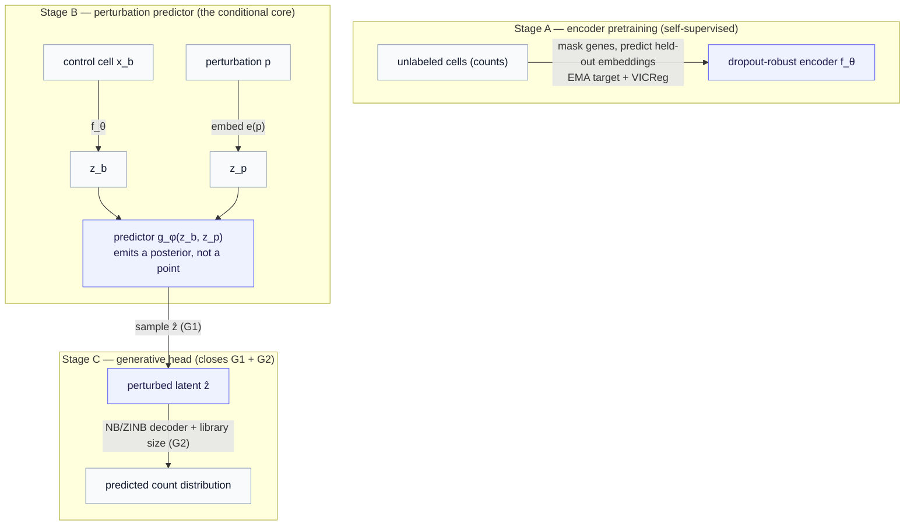

# Part 11 — Application: computational biology (perturbation response)

*The toolkit is built; here is the first thing it is for. We assemble the routes into one model that predicts how a cell responds to a perturbation — and confront the metric that has quietly governed every design choice: effect size.*

> **Recap — where this sits.** [Parts 6–10](05-two-gaps-four-routes.md) built four routes to turn a JEPA encoder into a generator — decode the latent (A), a variational posterior (B), conditioned diffusion (C), and planning on top (D) — plus the conditional flow prior that unifies B and C. This chapter does not introduce new machinery — it **assembles** those pieces into a concrete model for one of the two domains that motivated the whole series: predicting single-cell responses to perturbations, the central problem in computational drug discovery. The perturbation setup is reintroduced here from scratch; for the data itself the [data-modalities primer](appendix-data-modalities.md) covers it, and for a deeper standalone treatment (datasets, baselines, the broader modeling progression) see the optional companion [genai-lab perturbation-prediction guide](https://github.com/pleiadian53/genai-lab/blob/main/docs/applications/perturbation_prediction.md).

We have spent five chapters building a controllable generative model on top of a JEPA encoder, in the abstract. The natural question is what it is *for* — and the answer that has been pulling on every design decision (the count decoder, the effect-size constraint) is this domain. So let us put the toolkit to work, on a problem that is both economically enormous and a clean test of everything we built.

**The problem, from scratch.** A cell's state can be read as a vector of gene-expression counts (the [primer](appendix-data-modalities.md) explains the measurement). Take a **baseline** (control) cell, **apply a perturbation** — knock out a gene, add a drug, or a combination — and the cell shifts to a new **perturbed** state. The task is to **predict that perturbed state from the baseline cell and the perturbation, without running the experiment** — and to predict it as a *distribution*, because identical cells respond heterogeneously. Do this well and you can screen millions of interventions in silico instead of at the bench. That is the prize.

---

## 1. Why this problem fits generative JEPA — and the trap

Two features of single-cell perturbation data make it almost a designed fit for the JEPA approach, and one feature makes it a trap if you are not careful.

**It fits, reason one — label scarcity.** You can sequence an ocean of *unlabeled* cells cheaply, but *perturbation-labelled* cells (this cell, under this specific drug) are comparatively scarce. That is precisely the regime self-supervised pretraining was built for: learn a strong representation from the unlabeled ocean, then attach the conditional machinery to the labelled trickle.

**It fits, reason two — latent prediction is the right bet.** Most of a raw count vector is nuisance — dropout zeros, technical noise (again, the [primer](appendix-data-modalities.md)). A reconstruction model spends capacity reproducing that noise; JEPA's "predict in latent space, not data space" instinct spends it on the *meaningful* structure instead. Predicting the *embedding* of a perturbed cell is a far better-posed target than predicting its 20,000 exact (mostly-zero) counts.

**The trap — effect size.** Here is the constraint from [Part 5 §3](05-two-gaps-four-routes.md), now in its native habitat. A model can learn an excellent *representation* of cell state — cluster cell types, transfer zero-shot — and still badly mis-estimate the **effect size**: the *magnitude and pattern of the change* a perturbation causes, measured as the correlation between predicted and true differential expression on the most-affected genes. Recent single-cell JEPA work reports exactly this split (good absolute state, poor effect-size estimation), and effect size *is the benchmark* this field is scored on. The consequence drives the whole architecture: **a decoder back to count space is not optional polish — it is the mechanism that recovers calibrated effect sizes.** A model that stops at the latent will look great on representation metrics and fail the test that matters.

---

## 2. The assembled model — three stages

Putting the routes together gives a three-stage model. Each stage is a piece you already know, used where it is strongest: JEPA pretraining for a robust encoder, a conditional predictor as the core, and a count-decoder head to close both gaps and recover effect size.

**Stage A — encoder pretraining.** This is the *same* masked-embedding-prediction objective you met in [Part 1](01-the-jepa-encoder.md), with one swap: **genes** now play the role that image patches played there. Train the encoder $f_\theta$ self-supervised on the unlabeled ocean — mask a random subset of a cell's genes and predict the *embedding* of the held-out genes from the visible ones, against a slow EMA target, with **VICReg** anti-collapse. (Hide some, predict their representation from the rest — patches became genes, nothing else changed.) (Reminder: VICReg — variance-invariance-covariance regularization — keeps the latent from shrinking to a constant by enforcing per-dimension variance and decorrelation; without it, predict-your-own-embedding objectives can collapse to "embed everything as the same vector.") This is the regime where latent prediction clearly beats reconstruction, and it uses far more data than the labelled subset.

**Stage B — the perturbation predictor.** This is the conditional predictor from the routes, in its biology form. Encode the control cell to the context $z_b = f_\theta(x_b)$; embed the perturbation to $z_p = e(p)$ (per-gene/per-drug embeddings, combinations composed); and predict the perturbed latent with $g_\phi(z_b, z_p)$. (In the language of the companion [Operator World Models](../operator_world_models/index.md) line — an active, still-developing line in this project — this predictor *is* an action operator in its *static* form: the perturbation is the action, carrying the baseline latent to the perturbed one, with no time axis. [Part 12](12-application-digital-phenotyping.md) takes the same object into the *temporal* setting.) Crucially, make it **variational** ([Route B](07-route-b-variational-and-beyond-gaussian.md)) — emit a *posterior* over the perturbed latent, not a single point — so it can represent the cell-to-cell heterogeneity (the G1 gap). For richer, multimodal responses, the posterior can be the [conditional flow prior](09-conditional-flow-prior.md) or a [conditioned diffusion](08-route-c-conditioned-diffusion.md) instead of a Gaussian.

**Stage C — the generative head.** Sample a perturbed latent $\hat z$ from the posterior (closes **G1** — draw repeatedly for a population), and decode it with an **NB/ZINB count head** conditioned on library size ([Route A](06-route-a-latent-decoder-head.md)'s decoder, closes **G2**). This produces actual count profiles *and* — the whole point — recovers the effect-size magnitude a latent-only model misses.

The training objective collects the pieces, trained in stages (A, then B+C jointly):

$$
\mathcal{L} = \mathcal{L}_{\text{predict}} + \lambda_{\text{vic}} \mathcal{L}_{\text{VICReg}} + \lambda_{\text{nb}} \mathcal{L}_{\text{NB}} + \lambda_{\text{kl}} \mathcal{L}_{\text{KL}}.
$$

Each term has a job: $\mathcal{L}_{\text{predict}}$ and $\mathcal{L}_{\text{VICReg}}$ carry the JEPA representation quality; $\mathcal{L}_{\text{NB}}$ (the count likelihood written out in [Part 6](06-route-a-latent-decoder-head.md)) is what forces effect-size calibration; $\mathcal{L}_{\text{KL}}$ (the variational coupling of [Part 7](07-route-b-variational-and-beyond-gaussian.md)) is what makes the prior sampleable. The main tuning lever is $\lambda_{\text{nb}}$ against the latent terms: too small and effect sizes stay uncalibrated; too large and the model degenerates into a plain conditional count-VAE, losing the JEPA pretraining benefit.

---

## 3. Two masking schemes — keep them distinct

A subtlety that trips people up: there are **two different masking/prediction tasks** in this model, and conflating them muddies the design.

- **Intra-cell (Stage A, pretraining).** Mask *genes within one cell*, predict the held-out genes' embedding from the visible ones. This learns the **encoder** — a representation of cell state. It is condition-blind (no perturbation involved).
- **Inter-cell (Stage B, the predictor).** Context is a *control cell plus a perturbation*; the target is the *perturbed cell's* embedding. This learns the **action** — how a perturbation moves cell state.

They are complementary: the first builds the representation, the second models the transformation on it. And they sit at the two ends of the awareness dial from [Part 9 §6](09-conditional-flow-prior.md) — the Stage-A encoder is condition-blind, and Stage B adds the conditioning on top (frozen-encoder for clean modularity, or jointly trained if the conditional task should shape the representation, at the cost of the collapse risk).

---

## 4. Evaluation — report all three axes, never one

This is the methodological discipline the effect-size trap forces, and it is the single most important thing to get right when reporting results. **Never report representation quality alone** — a model can ace latent metrics and still fail the benchmark that matters. Report three axes:

| axis | what it measures | example metric | what it catches |
|---|---|---|---|
| **Representation** | did the encoder learn biology? | zero-shot cell-type transfer (AvgBIO), neighborhood structure | JEPA's strength |
| **Effect size** | did it get the *magnitude of the change* right? | Pearson / R² between predicted and true differential expression on top-$K$ DE genes | the standard benchmark — JEPA's weak spot |
| **Calibration** | is the predicted uncertainty *real*? | predicted vs. observed cell-to-cell variance; coverage of posterior intervals | whether the distribution is honest, not decorative |

(AvgBIO is a standard aggregate of biology-conservation scores for how well the latent separates known cell types; the DE-gene Pearson is the differential-expression correlation from [Part 5 §3](05-two-gaps-four-routes.md).) And test the *world-model* claim on the right splits: not just held-out single perturbations, but held-out **combinations**, so the model is judged on genetic-interaction structure rather than memorized singletons. The established baselines to measure against are the field's perturbation-prediction models — **scGen, CPA, GEARS, scPPDM** — on a standard genetic-interaction benchmark such as the Norman et al. Perturb-seq dataset.

> **The reporting trap, stated once.** If you publish only AvgBIO and the neighborhood plots, you will look excellent and have shown nothing about the thing the field measures. Representation **and** effect size **and** calibration, every time.

---

## 5. From prediction to discovery — screening as planning

Everything so far is a *forward* model: perturbation in, response out. The economically decisive use is the *inverse*, and it is exactly [Route D](10-route-d-world-model-planning.md). Once the perturbation predictor is calibrated, treat it as a world model and **plan**: given a *diseased* cell state $z_b$ and a *target* healthy or differentiated state $z_{\text{goal}}$, search the perturbation space — single knockouts, drugs, and their combinations — for the intervention whose predicted outcome lands closest to the goal, using the CEM loop of [Part 10 §2](10-route-d-world-model-planning.md). This turns in-silico screening from "rank a fixed candidate list" into "optimize over perturbation and combination space" — computational drug-target discovery as goal-directed search.

The caveat travels with it: the plan is only as good as the predictor, and an observational predictor gives *associational* dynamics, so the chosen perturbation is a **hypothesis to test at the bench**, not a verdict. Calibration (Stage C) is what makes that hypothesis worth testing.

---

## 6. How each route shows up here

The synthesis, mapped back to the design space so the assembly is explicit:

| design-space piece | role in the perturbation model |
|---|---|
| **JEPA pretraining** ([Parts 1](01-the-jepa-encoder.md)) | Stage A — the dropout-robust encoder, from unlabeled cells |
| **Route B** (variational predictor) | Stage B — the conditional perturbation predictor, emitting a posterior for heterogeneity |
| **Conditional flow prior / Route C** ([Parts 9](09-conditional-flow-prior.md), [8](08-route-c-conditioned-diffusion.md)) | Stage B/C upgrade — an expressive, multimodal posterior when a Gaussian is too coarse |
| **Route A** (count decoder) | Stage C — the NB/ZINB head that closes G2 and recovers effect size |
| **Route D** (planning) | Section 5 — screening as goal-directed search over perturbations |

---

## 7. The honest notes

Three, carried from the routes and sharpened by the application.

**This is a conditional count-VAE with JEPA pretraining — show it earns its keep.** Structurally, Stage B+C is a conditional NB-VAE living in JEPA's latent ([Route A §4](06-route-a-latent-decoder-head.md), [Route B §6](07-route-b-variational-and-beyond-gaussian.md)). The JEPA contribution is the dropout-robust pretrained encoder. So the experiment you owe is the baseline: does the JEPA-pretrained model beat a from-scratch conditional NB-VAE on effect size, on calibration, on data efficiency? If not, the pretraining bought nothing here, and you should say so.

**Associational, not causal.** The predictor learns the dynamics that *accompany* a perturbation in observational data, not necessarily those it would *cause* if newly imposed — and §5's planner acts on exactly that gap. Genuine causal claims need interventional data or defended assumptions.

**Likelihood and de-novo design remain open.** A count decoder recovers effect-size magnitude, but a tractable *data-space* likelihood — the thing that would let you score arbitrary cell states or design de-novo — is not free in any of these routes ([Part 5 §5](05-two-gaps-four-routes.md)). The diffusion/flow heads come closest (their ODE gives an in-principle density), but a decoder after them breaks exactness. Naming this honestly is part of the job.

---

## 8. Where this leaves us

> **Recap, and the turn to the second domain.** Assembling the routes gives a staged perturbation model: JEPA pretraining for a dropout-robust encoder (Stage A), a variational — or flow/diffusion — perturbation predictor for heterogeneity (Stage B), and an NB/ZINB count head that closes G2 and *recovers effect size* (Stage C), with Route D planning on top for screening. The discipline that makes it honest is reporting representation **and** effect size **and** calibration, and proving JEPA beats a from-scratch count-VAE. This was the first motivating domain — cells and drugs. The [final chapter](12-application-digital-phenotyping.md) turns the same toolkit on the second: a *person*, monitored continuously, and a **personalized world model for chronic-disease management** — where the "cell" is a patient, the "perturbation" is an intervention they can choose, and the goal is their own health.

---

*Previous: [Part 10 — Route D](10-route-d-world-model-planning.md). Next: [Part 12 — Application: digital phenotyping](12-application-digital-phenotyping.md). Background: the [data-modalities primer](appendix-data-modalities.md); the optional [genai-lab perturbation-prediction guide](https://github.com/pleiadian53/genai-lab/blob/main/docs/applications/perturbation_prediction.md). Symbols: the [notation reference](notation.md).*
