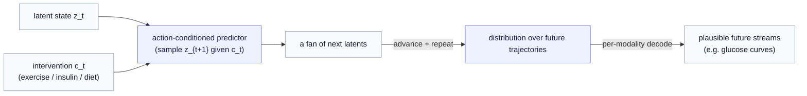

# Part 12 — Application: digital phenotyping (a personalized world model for chronic-disease management)

*The last chapter, and the one the whole series was aimed at. We turn the toolkit on a person — monitored continuously, over time — and build a world model you can roll into the future, sample plausible outcomes from, and steer with the interventions that person can actually choose.*

> **Recap — where this sits.** [Parts 6–10](05-two-gaps-four-routes.md) built the toolkit (four data-routes + the conditional flow prior + planning); [Part 11](11-application-computational-biology.md) applied it to **cells** — a *static* perturbation, one baseline-plus-drug step. This chapter turns the same toolkit on the second motivating domain: a **person**, monitored continuously, where the world evolves *over time* and the "perturbation" is an intervention they can choose and sustain. It is where this series meets the [Operator World Models](../operator_world_models/index.md) line most directly — so we recap that idea before building on it. The data streams are covered in the [primer](appendix-data-modalities.md) (which also carries the standing caveat for all health data); the deep companion is the [diabetes worked example](../operator_world_models/05-worked-example-diabetes.md).

There is a long-standing dream behind this chapter: a *world model of a person*. Not a dashboard of where their health has been, but a model of how their state *evolves* — one that can roll their next two weeks forward in its head, and answer "what would happen to me if I changed something?" For someone managing a chronic condition like type-2 diabetes, that is the difference between a passive monitor and an actionable companion. The previous eleven chapters built every piece this needs; this one assembles them, and in doing so closes the loop with the action-operator world model the sibling series develops in full.

---

## 1. The setup — a person as a continuously-monitored system

First, the domain, from scratch. **Digital phenotyping** is the continuous, passive, multimodal monitoring of a person's physiological and behavioral state from wearables and sensors — decoding everyday signals into health-relevant estimates, with little or no active input from the person. For diabetes management, the streams are concrete (the [primer](appendix-data-modalities.md) describes the data): a **continuous glucose monitor** reading blood sugar every five minutes, an **insulin** pen logging doses, **carbohydrate** intake, **steps/exercise**, **sleep**, **weight**, and the person's **medical-code history** (diagnoses, prescriptions, labs) as a sparse symbolic stream.

Two features make this, like the cell problem, a natural fit for the JEPA approach:

- **Label scarcity.** You get gigabytes of passive sensor stream per person per month against a trickle of sparse, noisy labels (occasional self-reports, quarterly labs). That is the self-supervised-pretraining regime exactly.
- **Latent prediction is the right bet.** You do not want to spend model capacity reconstructing accelerometer micro-noise or the exact shape of every glucose wiggle. You want the latent that is *predictive of the next chunk of behavior* — JEPA's instinct, again.

So the encoder is built the same way as everywhere in this series — self-supervised, by masked-embedding prediction (here over windows of the multimodal stream, with genes-or-patches replaced by *time-and-modality* blocks) — and it produces the object everything downstream acts on: a **latent metabolic state** $z_t$, the person's situation at time $t$, encoded from the recent window of all their streams. (This is exactly the encoder the [diabetes worked example](../operator_world_models/05-worked-example-diabetes.md) builds; we reuse it.)

---

## 2. From a static outcome to a temporal rollout

Here is the one genuine difference from [Part 11](11-application-computational-biology.md), and it is the hinge of the chapter. There, the model predicted a *single* outcome: cell plus drug, one step, the perturbed cell. A person's health is not one step — it **evolves over time**. So the predictor is not a one-shot map; it is a **temporal** one that advances the latent state through time, $z_t \to z_{t+1}$, and conditioning it on what the person *did* between $t$ and $t+1$ — an insulin dose, a walk, a meal — gives an **action-conditioned predictor**.

That object has a name in the sibling series, and it is worth recapping here because a reader may not have met it. The [Operator World Models](../operator_world_models/index.md) series — an **active, still-developing companion line** in this project, which we build on in its current form rather than treat as a finished framework — reads an action as an **operator** that *carries the latent state to its successor*: the action $c_t$ configures a transformation $f_{\theta(c_t)}$ that takes $z_t$ to $z_{t+1}$. Iterate it and you get a **rollout** — the model imagining a trajectory days ahead without living through it. Swap the action and re-roll and you get a **counterfactual rollout** — the same starting state, a different intervention, a different future. (For the structure of that operator — why it is built as $\exp(M)$, how interventions compose, how its eigenvalues flag a destabilizing trajectory — that series is the deep dive; here we only need it as the *world model* this chapter makes generative.)

The connection to this series is one-to-one, and it is the same one [Part 10 §5](10-route-d-world-model-planning.md) drew: the action-conditioned predictor $g_\phi(z_t, c_t)$ we have been writing *is* that action operator $f_{\theta(c_t)}(z_t)$ — same arrow $z_t \to z_{t+1}$, two notations. (Part 10 carries the full reconciliation table; the one trap to remember is that $f_\theta$ is the *encoder* here but the *operator* there.)

> **So the world model in this chapter is the operator world model.** What this series adds is not the dynamics — that series has those — but the machinery to make the rollout *generative*: a *distribution* over futures rather than a single predicted trajectory. That is the marriage the next section makes.

---

## 3. Making the rollout generative — a fan of plausible futures

A bare operator rollout produces *one* predicted trajectory — a single line into the future. But a person's future is not a line; it is a spread of plausible outcomes, and an honest model should say so (the same G1 argument as everywhere: one condition, many possible futures). The routes are exactly what turn the single line into a sampled fan.

Apply Route B / the [conditional flow prior](09-conditional-flow-prior.md) at *each step*: instead of predicting a single next latent, the action-conditioned predictor emits a **distribution** over $z_{t+1}$ given the current state and the intervention; sample from it, then advance again. Roll that forward and you do not get one future — you get a **fan of plausible future trajectories** under the chosen intervention. And to *see* those futures as actual streams (a predicted glucose curve, not just a latent), decode with a per-modality head — [Route A](06-route-a-latent-decoder-head.md)'s G2 generalized to the mix of streams: a Gaussian-like likelihood for the continuous CGM signal, a count/event likelihood for discrete logs, a categorical one for medical codes.

That is the whole synthesis in one line: **controllable generation = the operator world model's action-conditioned rollout + generative JEPA's per-step sampling and decoding.** The operator series supplies *what happens next under an action*; this series supplies *the distribution over what happens, sampled and rendered*.

---

## 4. What it is for — three capabilities

With a sampleable, action-conditioned rollout in hand, the same three uses the [diabetes worked example](../operator_world_models/05-worked-example-diabetes.md) lays out become *generative*:

- **Counterfactual rollout — the headline.** "What would my glucose look like over the next two weeks under my current regimen, versus adding a daily walk, versus intensifying insulin?" Each is the same rollout run under a different $c$ — now returning a *distribution* of trajectories (with its uncertainty), not a single line. This is the difference between a passive monitor and a system that helps you *choose*. Read the futures out in clinically meaningful terms (predicted time-in-range, hypoglycemia risk), as that example does.
- **Surprise / change detection.** The gap between the predicted future and the observed one is a personalized change-point signal: when the world model — conditioned on the *known* interventions — keeps being surprised, that residual is *change not explained by anything the person did*, the substrate for catching a metabolic decline early. The generative version sharpens it: ask whether the observed trajectory sits in the *tail* of the predicted distribution, scored against the person's own history.
- **Planning ([Route D](10-route-d-world-model-planning.md)).** Invert it: given the current state and a goal (a target time-in-range), search the space of interventions the person can sustain — exercise, dose adjustments, diet — for the regimen the world model predicts reaches the goal. Personalized, goal-directed intervention as search.

---

## 5. The honest notes — sharper in the personal/health setting

Every caveat from the routes returns here, and the stakes raise them.

**Associational, not causal — and a person will act on it.** The model learns from a person's *observational* history, so its conditioned dynamics capture what *accompanies* an intervention, not necessarily what it *causes* (maybe they only ever walked on days they already felt well). Counterfactual validity needs interventional data or defended assumptions. Treat every rollout as **decision support to discuss with a clinician**, never a verdict — this is the lesson that sank earlier digital-phenotyping ventures that overclaimed.

**Non-stationarity.** Personal baselines drift — with seasons, jobs, devices, life changes. Separating a *meaningful state change* from ordinary baseline *drift* is the core statistical problem of the whole domain, and it is genuinely hard; a change-point signal that ignores drift will cry wolf.

**The explain-away risk.** Conditioning is double-edged: if the intervention model is too expressive, it can absorb a *genuine* decline into "some intervention effect" and *flatten* the surprise signal you built it to raise. Keeping the intervention representation small and structured (the named-basis discipline of the operator series) is what keeps the detector honest — the same expressiveness-vs-structure dial, now load-bearing for safety.

---

## 6. The synthesis — two series, one controllable world model

It is worth seeing the two series as the two halves of one system, because that is the payoff:

| piece | supplied by |
|---|---|
| the **encoder** (latent metabolic state from multimodal streams) | JEPA pretraining ([Part 1](01-the-jepa-encoder.md)) |
| the **temporal, action-conditioned dynamics** ($z_t \to z_{t+1}$ under an intervention) | the [Operator World Models](../operator_world_models/index.md) series — the action operator |
| the **per-step distribution** over the next state (a fan, not a line) | Route B / the [conditional flow prior](09-conditional-flow-prior.md) |
| the **decoder** to actual streams (predicted glucose curves) | Route A's G2, per-modality |
| **choosing** the intervention toward a goal | [Route D](10-route-d-world-model-planning.md) planning |

The operator series answers *how the state moves under an action*; this series answers *how to sample and render the spread of what could happen, and how to choose*. Together they are a **controllable, sampleable, personalized world model** — the thing the opening dream described.

---

## 7. Closing the series

> **The whole arc, in one breath.** A JEPA encoder gives a *map* of data but cannot generate. Making it generative means closing **two gaps** — a *distribution* over outcomes (G1) and a *decoder* to data (G2) — and there are **four routes** that pair those closures (decode the latent, a variational posterior, conditioned diffusion, and planning on top), plus the **conditional flow prior** that unifies the middle two and completes the starter. The constraint that governs every choice is **effect size**: a latent-only model can ace representation and miss the change that matters, so a decoder to *data* space is load-bearing. We then put the toolkit to work on the two domains that motivated it — **cells** (static perturbation, effect-size benchmark) and **people** (a temporal, controllable world model for chronic-disease management). What stays open is honestly open: a tractable *data-space likelihood* for de-novo design and scoring, and genuine *causal* validity for the counterfactuals. The reward, when it works, is a model that does not just describe a system but lets you ask it *what if* — and, in the personal case, helps someone steer their own health.

This is the foundation the lab set out to build: turning a strong self-supervised representation into a generative model that keeps the representation's semantic strength, and onward into a world model you can act on. The cell and the person are the same construction with the dial turned — a static perturbation versus a temporal rollout — which is exactly why one toolkit serves both.

That closes the *conceptual* arc. If you are not only reading but *building*, one question remains — of all these routes, which do you implement first? The closing [discussion chapter](13-choosing-a-route.md) collapses the survey into a single reasoned recommendation (and is honest about the goal that recommendation assumes).

---

*Previous: [Part 11 — Application: computational biology](11-application-computational-biology.md). Next: [Part 13 — Discussion: choosing a route to build](13-choosing-a-route.md). The deep dive on the temporal action operator: the [Operator World Models](../operator_world_models/index.md) series and its [diabetes worked example](../operator_world_models/05-worked-example-diabetes.md). Back to the [series overview](index.md); symbols in the [notation reference](notation.md).*
