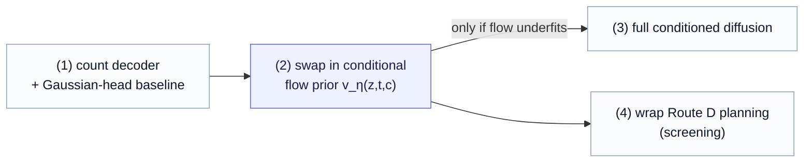

# Part 13 — Discussion: choosing a route to build

*The route chapters deliberately picked no winner — they laid out trade-offs and kept the options live. This chapter does the opposite, on purpose: it answers the practitioner's question. Of all these, which do you build *first*, and why? The answer is a reasoned recommendation, not a law — and it depends on what you are trying to do.*

> **Recap — where this sits.** [Parts 6–10](05-two-gaps-four-routes.md) surveyed the routes neutrally; [Parts 11–12](11-application-computational-biology.md) assembled specific choices into two applications. This chapter steps back and makes a **recommendation** — which is a different kind of document, so read it that way: an opinion argued from the trade-offs, explicit about the goal it assumes and honest about the fork where a different goal would flip it. Nothing new mechanically; everything here was built earlier.

A tutorial can responsibly present every route as a legitimate option. A *builder* cannot build all of them — and shouldn't. You implement one well, plus maybe a baseline or two for benchmarking, and you want that one to be both the most promising *and* the cheapest to stand up. Those two criteria normally pull in opposite directions. The interesting claim of this chapter is that, for one very common goal, they collapse onto a single choice — and seeing *why* is more useful than the answer itself.

---

## 1. First, clear the field — Route D is phase two

[Route D](10-route-d-world-model-planning.md) is out of contention as a *first* build, and not because it is weak. It produces **decisions** — the intervention $p^{*}$ that minimizes the planning energy $\mathcal{E}(p) = \lVert g_\phi(z_b, e(p)) - z_{\text{goal}} \rVert^2$ — not data. It closes neither gap, and it *presupposes* a forward generator to plan over. You cannot build the planning layer before the thing it plans on exists. So Route D is a phase-two capability by construction: it wraps a *calibrated* forward model once you have one. That leaves Routes A, B, C, and the [conditional flow prior](09-conditional-flow-prior.md) (Part 9) as the genuine contenders for "turn JEPA into an effective generative model."

---

## 2. The lens that decides it

Your two criteria usually trade off, and the table makes the tension visible:

| Route | "Most promising" (effectiveness) | "First to develop" (cost / proximity to existing code) |
|---|---|---|
| **A** (Gaussian head) | **Low** — unimodal per condition; risks being a CVAE in a JEPA hat | **Highest** — an afternoon's wiring |
| **B** (Gaussian variational) | **Medium** — principled, but the same Gaussian floor | **Medium** — adds a prior network + KL balancing |
| **C** (conditioned diffusion) | **Highest** — fully expressive, modular | **Lowest** — a second model, many-step sampling |
| **Part 9** (conditional flow prior) | **High** — expressive and modular like C | **High** — one extra input to code you already run |

Read the two columns and the usual dilemma is stark: A is cheapest but ineffective on exactly the responses that matter; C is most effective but heaviest. With no existing code you would face a real choice — prototype with A and accept the Gaussian floor, or pay for C up front. What dissolves the dilemma is the word *effective* in the question, together with what is already sitting in the repo.

---

## 3. The recommendation — the conditional flow prior + a count decoder

**For the goal of "predict the calibrated *distribution* of responses to an intervention," build the [conditional flow prior](09-conditional-flow-prior.md) as the G1 mechanism, married to [Route A](06-route-a-latent-decoder-head.md)'s count decoder for G2.** In the four-route vocabulary, that is a **Route B core realized at its flow limit rather than with a Gaussian** — which, as [Part 9](09-conditional-flow-prior.md) showed, is *simultaneously* Route C done with rectified flow. You are not dodging the A/B/C question; you are picking the single object where B and C coincide, and bolting Route A's decoder on the end.

Three reasons it wins as a *first* build, each from an earlier chapter:

- **It skips the Gaussian floor for free.** A Gaussian head (A or B) is unimodal per condition, and the canonical failure — the [two-fates problem](07-route-b-variational-and-beyond-gaussian.md) — is routine in the domains this series targets: a perturbation drives identical cells to fate X or fate Y, so the true response is genuinely bimodal, and a single Gaussian confidently predicts the empty valley between them. You would build the Gaussian version, watch it fail on the benchmark, and climb the expressive-posterior ladder anyway. The flow prior is the *top* of that ladder — multimodal and correlated from the start.
- **It is modular like Route C, without diffusion's weight.** Freeze the encoder, train the flow on frozen latents; no reconstruction gradient touches the encoder, so the "did JEPA quietly become a reconstruction model?" collapse risk (A/B's central hazard) is structurally absent. But rectified flow's near-straight paths sample in a handful of integration steps where a diffusion denoiser wants many.
- **It is the gentlest expressive generator to train** — one velocity-MSE, no adversary, no noise schedule, no KL weight to balance — and you have already debugged its unconditional twin (the [Parts 0–4](index.md) starter), so the training dynamics are known territory, not new risk.

> **The one-line case.** "Most promising" and "first to develop" normally trade off; here they collapse onto the conditional flow prior, because for *this* codebase the expressive option costs about the same as the Gaussian floor you would otherwise build and discard.

---

## 4. But sequence it honestly — the build order

The route is the conditional flow prior; the *order* you build it in should respect two disciplines the route chapters were right to insist on.

1. **Build G2 — the count decoder — first.** The load-bearing piece for the benchmark is not the fancy prior; it is the decoder that reaches data space, because that is where [effect size](05-two-gaps-four-routes.md) lives (the NB head of [Part 6](06-route-a-latent-decoder-head.md): a softmax gene-rate $\rho$, dispersion $\kappa$, mean assembled as $\mu = \ell \cdot \rho$, trained on the count likelihood). Every route shares it; you need it regardless.
2. **Keep Route A's Gaussian head as the baseline you are obligated to beat.** This is the experiment the whole arc hangs on: a from-scratch conditional NB-VAE. If your JEPA-pretrained conditional-flow model does not beat it on effect size, calibration, and data efficiency, the JEPA pretraining and the flow expressiveness bought nothing — and you want to know that early. The Gaussian head is cheap, closed-form, and one-shot: an ideal debugging and baselining instrument even though it is not the final answer.

So the order is: **(1)** NB/ZINB decoder + Gaussian-head baseline → **(2)** swap the Gaussian head for the conditional flow field $v_\eta(z, t, c)$ → **(3)** escalate to full conditioned diffusion *only if* flow's expressiveness proves insufficient on your data → **(4)** wrap Route D planning around the calibrated forward model for screening.

---

## 5. Route A vs Route B — the distinction worth holding

These two come up as "similar but different," and the cleanest way to keep them straight is a single test. They can be the *same picture* architecturally — predictor emits Gaussian parameters, you sample, you decode — so the wiring is not the tell. The tell is the objective.

> **The one-question litmus.** *During training, is there a network that gets to see the true outcome and produce a distribution from it?*
>
> - **Yes → Route B.** That network is the posterior $q_\phi(z \mid z_b, z_p)$ — it is *allowed to peek* at the answer during training. A learnable conditional prior $\pi(z \mid z_b, z_p)$ — which cannot peek, and is what you sample from at generation — is pulled toward it by a $\mathrm{KL}(q_\phi \Vert \pi)$ term. This is amortized variational inference: a CVAE built *on purpose*.
> - **No → Route A.** The stochasticity is just a noise input, shaped by whatever reconstruction pressure happened to produce. A CVAE you *fell into*.

The consequence is what makes the distinction matter: **Route B's spread is *trained to match reality* (calibrated by construction); Route A's spread is calibrated by luck.** That calibration is the entire reason to pay Route B's KL-balancing tax. And here is the punchline that ties A → B → Part 9 together: the conditional flow prior reaches **Route B's expressive ceiling without paying Route B's KL tax** — pure flow-matching, no posterior/prior pair, yet a distribution of the same (in fact richer) expressive class. That is not bookkeeping; it is the practical reason the flow is the right thing to build.

(One honest note on the equivalence: "B and C coincide at Part 9" is a statement about the *object* — the class of conditional distributions you can represent — not about the *training recipe*. Route B's recipe and the bare flow-matching recipe are different objectives that converge to the same expressive class.)

---

## 6. Where the novelty lives — two parallel angles, both open

A caution that the verdict above can obscure, and the most important strategic point in this chapter: **the flow is the *substrate*, not the contribution.** A conditional flow-matching prior over a frozen latent plus a count decoder is architecturally close to existing latent-generative models, and (as [Part 9](09-conditional-flow-prior.md) notes) flow-versus-diffusion is nearly cosmetic in capability. So "build the conditional flow prior" answers *which vehicle*, not *what is new*. If the aim is genuinely beyond state-of-the-art, the novelty must come from elsewhere — and there are two candidate sources, kept here as parallel, open directions rather than a settled pick:

- **Structured conditioning (the action-operator angle).** If the conditioning is not a generic embedding but *operator-structured* — named, composable generators in the $\exp(M)$ form of the [Operator World Models](../operator_world_models/index.md) line (an active, still-developing companion line in this project) — the model gains capabilities generic latent-generative models lack: predicting unseen *combinations* by **composing** intervention operators, **interpreting** what an intervention does to the latent (its generator's spectrum), and an **explain-away-safe surprise signal**. This is where *reliable*, *useful*, and *novel* converge, and the conditional flow becomes the expressive sampler riding on top of a structured world model.
- **The JEPA-pretraining payoff (the empirical angle).** A rigorous result that JEPA pretraining + a calibrated generative head *recovers* the effect-size signal that latent-only JEPA misses (recall Cell-JEPA found JEPA improves representation but **not** effect-size estimation) **and** beats reconstruction-based generative models on it. That is a testable, benchmark-driven contribution in its own right.

Neither is settled; both are worth pursuing. The point for *this* chapter is only to keep them in view, so that building the conditional flow prior is understood as standing up the *vehicle* for a contribution that lives in the conditioning structure or the demonstrated representation payoff — not mistaken for the contribution itself.

---

## 7. The fork that would flip the recommendation

Every recommendation has a hidden assumption, and honesty means naming it. This one assumes the goal is **"predict the calibrated distribution of responses to an intervention."** For that, the conditional flow prior plus count decoder is the strongest first method and the one you are closest to shipping.

But the flow gives an **implicit** density — you sample by integrating, with a likelihood available only through the ODE change-of-variables, and *broken in data space by any decoder placed after it* ([Part 5 §5](05-two-gaps-four-routes.md)). So if the near-term goal is **de-novo design** or variant-style **scoring** ($\log p(\text{ref})$ vs $\log p(\text{alt})$) — capabilities this lab's genomics ambitions point toward — the calculus changes: you would want to keep the generative process in a single space where the probability-flow ODE stays exact, or reach for a different family altogether. That open likelihood problem is the one none of the routes close.

> **The recommendation, stated with its assumption.** *If* the goal is calibrated response-distribution prediction (the perturbation and chronic-disease applications of this series), build the **conditional flow prior + count decoder**, decoder first, with the Gaussian head as the baseline to beat. *If* de-novo design or likelihood scoring is a near-term requirement, treat that as a different problem and reconsider the family. Keep both forks live until the goal is fixed.

---

## 8. Where this leaves the builder

- **Build first:** the count decoder (G2, effect size), then the conditional flow prior $v_\eta(z, t, c)$ as the G1 mechanism — Route B's expressive limit and Route C-with-flow at once, cheapest on existing code.
- **Always benchmark against:** a from-scratch conditional NB-VAE; if JEPA + flow doesn't beat it, find out early.
- **Hold the novelty elsewhere:** in the structured conditioning (operator-informed) and/or the demonstrated JEPA-effect-size payoff — the flow is the substrate.
- **Respect the fork:** the recommendation is for response-distribution prediction; de-novo design / scoring changes it.

That is the practitioner's path through a design space the rest of the series was careful not to collapse — collapsed here, deliberately, with the seams left visible.

---

*Previous: [Part 12 — Application: digital phenotyping](12-application-digital-phenotyping.md). The route deep-dives: [Part 6 (A)](06-route-a-latent-decoder-head.md), [Part 7 (B)](07-route-b-variational-and-beyond-gaussian.md), [Part 8 (C)](08-route-c-conditioned-diffusion.md), [Part 9 (conditional flow prior)](09-conditional-flow-prior.md), [Part 10 (D)](10-route-d-world-model-planning.md). Back to the [series overview](index.md).*
