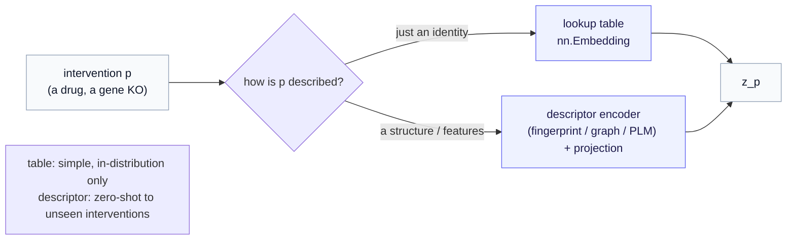

# Q&A — Why the baseline and the condition use different mechanisms, and where the condition embedding comes from

> **Origin.** This note expands the bullet in [Part 7a §2](../07a-jepa-two-streams-and-route-b.md) — *"the online stream now carries two inputs: it encodes the baseline, $z_b = f_\theta(x_b)$, and it embeds the perturbation, $z_p = e(p)$."* That one line introduces two *different* maps without dwelling on why, so the question is collected here to keep the tutorial flow clean. Prerequisite: [Part 7a §1–2](../07a-jepa-two-streams-and-route-b.md) (the two streams, and the reframe to a conditional target).

---

## The question

Conditional JEPA's online stream produces two vectors by two visibly different routes: the baseline goes through the **encoder** ($z_b = f_\theta(x_b)$), while the perturbation goes through a separate **embedding** ($z_p = e(p)$). Three things deserve an answer:

1. Why two distinct mechanisms at all — why not run both through the same encoder?
2. Where does the condition embedding $e(p)$ actually come from — is it a separate, pretrained network?
3. Can $e$ be learned *within* JEPA, jointly with everything else?

---

## 1. Two inputs, two *kinds* of thing — so two maps

The asymmetry is not an arbitrary wart; it mirrors a real asymmetry in the data. The two inputs are different *types*, and each needs the map appropriate to its type.

- **The baseline $x_b$ is a state — an observation.** A control cell's expression profile, an image, a sensor reading: high-dimensional, structured data that *lives in the space the encoder was trained on*. The right map is therefore the JEPA encoder $f_\theta$ itself — it was pretrained (self-supervised) precisely to turn such observations into representations. So $z_b = f_\theta(x_b)$ reuses a map you already have.
- **The perturbation $p$ is an identity — a name.** "Which drug?" "Which gene was knocked out?" That is a categorical label, not an observation. There is no "image of a drug" for $f_\theta$ to read; feeding a drug's *name* into a cell-state encoder is a type error. So $p$ needs its own map: from an intervention identity to a vector. That map is $e$, written $z_p = e(p)$.

Read the two together and the design reads as type-correctness, not duplication: **states get the state-encoder; interventions get an intervention-encoder.** $f_\theta$ encodes *what the subject is*; $e$ encodes *what was done to it*. They are different questions about different objects, so they go through different machinery, and the predictor $g_\phi(z_b, z_p)$ then combines the two.

> **The "why not unify?" test.** You could only push $p$ through $f_\theta$ if you had an *observation* of the intervention — say a drug's molecular structure. But then you would not be reusing the *cell* encoder; you would be giving the intervention its own proper encoder for *that* observation (a molecule encoder). So unification does not collapse the two maps into one — it just turns $e$ into a richer encoder. Which is exactly the next section.

---

## 2. Where $e(p)$ comes from — three options, simplest by default

$e$ is a design choice with a clear ladder, from simplest to most capable.

**(a) A learned embedding table — the default.** In the simplest and most common form, $e$ is a lookup table: one learnable vector per intervention, exactly like a word embedding assigns a vector to each token. Concretely, `nn.Embedding(num_interventions, d)`. It is **initialized randomly and learned jointly with the predictor** by the same conditional loss — not a separate pretrained network. Drug #7 gets a $d$-dimensional row; training nudges that row until $g_\phi(z_b, e(\text{drug 7}))$ predicts drug 7's outcomes well.

**(b) A descriptor-based encoder — for reach beyond the training set.** Instead of a bare table, derive $z_p$ from a *description* of the intervention:

- **drugs → molecular structure** (a fingerprint, or a pretrained molecular encoder over the compound's graph);
- **genes → gene features** (a gene-relationship/ontology graph, a co-expression embedding, or a protein language model over the gene's product).

Here $e$ is "a (possibly pretrained) feature map, plus a small trainable projection."

**(c) The reason to climb to (b): unseen interventions.** This is the crux. A lookup table has **no row for an intervention it never saw** — hand it a brand-new drug and it simply cannot produce $z_p$, so it cannot predict that drug's effect. A descriptor-based $e$ maps *any* intervention with a known description to a vector, so it can attempt **zero-shot** prediction for interventions absent from training. That is precisely how methods built for combinatorial or unseen-perturbation generalization work — e.g. gene-perturbation models that embed genes through a biological knowledge graph, or drug models that embed compounds through molecular structure. The trade-off is honest: the table is trivially simple but in-distribution only; the descriptor map reaches new interventions but needs a descriptor and an encoder for it.

---

## 3. Yes — $e$ is learned within JEPA

Directly to the third question: the condition embedding is **learned inside the model**, not imported as a finished external artifact. In form (a), the table $e$ is trained jointly with the predictor $g_\phi$ by the conditional objective. In form (b), the pretrained *features* may be frozen, but the projection that turns them into $z_p$ is still trained jointly. Either way, $e$ is a sub-module of the conditional JEPA, optimized end-to-end with the loss.

What *is* true — and probably the source of the "two mechanisms" feeling — is that the two maps have **different training histories**:

- $f_\theta$ is **pretrained** by self-supervision on states (Parts 0–4) and is often *frozen* during conditioning, to keep it a clean, reusable representation;
- $e$ is **learned during the conditional phase**, because intervention identities only acquire meaning once you have outcomes to align them against.

So "two mechanisms" is really "one model, two sub-modules trained at different times for different input types." Nothing is outsourced to a black box unless you *choose* form (b) for its zero-shot reach — and even then the glue is learned in-model.

---

## 4. The deeper view (a signpost)

One more thing, flagged rather than developed. In the design above, the condition is a **vector** that the predictor consumes alongside $z_b$ — concatenate-and-predict. A richer alternative lifts the intervention from a *vector* to an **operator** that acts *on* the baseline latent — schematically $z' = \Theta(p) z_b$ (the operator $\Theta(p)$ applied to $z_b$), where the intervention becomes a learned transformation of state rather than a side input. That changes what $z_p$ *is* (a transformation, not a coordinate) and buys composability and an inspectable structure, at the cost of a stronger modeling commitment. It is the subject of the [Operator World Models](../../operator_world_models/index.md) line; for Route B, the condition-vector design of this chapter is the right, simpler starting point.

> **One-line answer.** The baseline and the condition go through different maps because they are different *types* — an observed state ($z_b = f_\theta(x_b)$, the reused SSL encoder) versus a named intervention ($z_p = e(p)$, an embedding of identity). $e$ is, by default, a small lookup table learned jointly inside JEPA — not an external pretrained network — though you can swap in a structure/feature-based encoder when you need to generalize to interventions never seen in training.

---

*Back to the tutorial: [Part 7a — JEPA from scratch, rebuilt for Route B](../07a-jepa-two-streams-and-route-b.md). Related: [Part 11 — computational biology](../11-application-computational-biology.md) (where unseen-perturbation generalization is the benchmark). Symbols: the [notation reference](../notation.md).*
