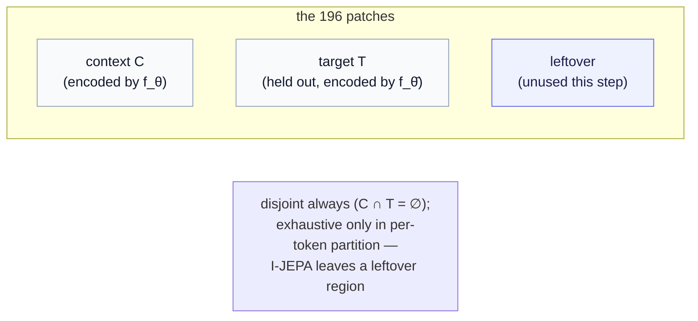

# Q&A — How JEPA chooses its prediction targets, and whether they cover the whole input

> **Origin.** This note expands one sentence in [Part 7a §2](../07a-jepa-two-streams-and-route-b.md) — *"the held-out target is a masked region of the same input."* That phrasing is a deliberate simplification to keep the main argument moving; the full story is collected here so the tutorial flow stays uncluttered. No new prerequisites — if you have read [Part 7a §1](../07a-jepa-two-streams-and-route-b.md) (the two streams) you have everything you need.

---

## The question

When JEPA trains, it splits an input into a part the encoder *sees* and a part it must *predict*. Three natural questions follow, and they are easy to get subtly wrong:

1. Does JEPA predict a **single** held-out patch, or a set of them — and if a set, is it just a random pick?
2. What is the right name for the patches the encoder is *given* (versus the ones held out)?
3. Do the "given" and "held-out" sets together make up the **whole** input, or can some patches be left over, belonging to neither?

We take a $14 \times 14$ patchified image as a running example: $14 \times 14 = 196$ patches total, each a token the encoder can ingest.

---

## 1. Two named sets: *context* and *target*

First, the vocabulary, because the loose word "visible" hides a precise split. Every patch in a given training step plays one of two roles:

- **Context** (the *visible* set) — the patches fed to the **online encoder** $f_\theta$. Call this set $C$.
- **Target** (the *held-out* set) — the patches held back, whose representations the model must predict. Call this set $T$. Their representations are produced by the **EMA target encoder** $f_{\bar\theta}$, and the predictor must reproduce them from the context alone.

So both sets are part of training — they are not "train versus test." They are two *roles within one step*: $C$ is what the online stream sees, $T$ is the goalpost the target stream provides ([Part 7a §1](../07a-jepa-two-streams-and-route-b.md)). The loss pulls the predicted target representations toward the EMA target's, in latent space:

$$
\mathcal{L}_{\text{JEPA}} = \big\lVert g_\phi\big(f_\theta(C), \text{positions of } T\big) - \mathrm{sg}\big(f_{\bar\theta}(T)\big) \big\rVert^2.
$$

Here $g_\phi$ is the predictor, "positions of $T$" is the query telling it *where* to predict, and $\mathrm{sg}$ is the stop-gradient that freezes the target as a fixed goalpost. **Your understanding is correct:** a subset is encoded, another subset is held out, and the held-out subset's predicted embeddings should match the target branch's embeddings for those same patches. The one refinement is the naming — *context* and *target*, both inside training.

---

## 2. Not one patch — usually several, and *how* they are chosen matters

The held-out set $T$ is almost never a single patch. In the canonical image recipe — **I-JEPA** (Assran et al., 2023) — the targets are **multiple contiguous blocks**, typically about **four**, each a rectangular region of many patches (a random scale of roughly 15–20% of the image, a random aspect ratio). The context $C$ is then one **large** block (scale roughly 85–100%) with any patches that overlap a target block **removed**, so $C$ and $T$ never share a patch.

So on our $14 \times 14$ image, a single target block at ~17% scale is on the order of ~30 patches, and with several such blocks the held-out set is a sizable minority of the 196; the context is most of what remains. "Predict one random patch" is *not* the picture — it is "predict a handful of held-out blocks from one large context."

Is the pick random? Yes — but the **geometry** of the randomness is a real design choice, not a throwaway detail:

- **Block (contiguous) masking**, as in I-JEPA: hold out whole regions. This forces *semantic* prediction — to fill a contiguous hole you must infer content, not interpolate neighboring texture. I-JEPA's own ablations show this matters a great deal for images.
- **Scattered (per-patch) masking**: hold out individual patches at random. Easier, and weaker for images — a missing patch can often be guessed from its immediate neighbors.

Which is right is **modality-dependent**. Blocks make sense only when tokens have neighborhood structure (image patches, video tubelets). For tokens with *no* spatial adjacency — for instance gene-group tokens in the single-cell setting, where each token is an arbitrary group of genes — there are no blocks to form, so scattered per-token masking is the natural choice. This is why the number and shape of targets is a *knob*, not a constant.

> **In this project's code.** The minimal implementation here uses scattered masking: a random permutation of the tokens, the first `n_target` of them held out as $T$, the rest as $C$, one shared split per batch. It is the stripped-down cousin of I-JEPA's block masking — appropriate because the project's bio tokens are non-spatial, and clean enough to read in a few lines.

---

## 3. Do context and target cover the whole input?

Now the sharp question, and the answer is two-part.

**They are always disjoint.** A patch is either encoded as context or held out as a target, never both — JEPA explicitly removes any target patch from the context (otherwise the model could see the answer it is meant to predict). So $C \cap T = \varnothing$, always.

**Their union may or may not be the whole image — it depends on the scheme.**

- **Exact-partition masking** (this project's per-token split): every token is assigned to exactly one of $C$ or $T$, so $C \cup T$ is *all* 196 patches. **No leftovers.** With `n_target = 12` out of, say, 50 tokens, that is 12 held out and 38 as context, covering everything.
- **Canonical I-JEPA** (large context block + several target blocks): the context is a *single rectangle* at 85–100% scale, not "all patches except the targets." So a patch that lies **outside the context block and outside every target block** is simply **unused that step** — a genuine leftover. With context scale exactly 1.0 there are no leftovers; with scale below 1.0 there generally are.

So, to your question directly: **the two sets do not have to tile the whole image.** They are guaranteed disjoint, but whether they are also *exhaustive* is a property of the masking scheme — exhaustive in the simple per-token partition, generally *not* exhaustive in I-JEPA, where leftover patches are normal.

---

## 4. Settled versus open

To separate what is fixed from what is a tunable lever:

- **Settled** (the JEPA template): there are usually **several** held-out targets, chosen randomly, held out from the context, with their target representations coming from the **EMA** encoder over the input. Context and target are disjoint by construction.
- **A real design lever** (modality-dependent, still tuned per task): *how many* targets, *how large*, *block versus scattered*, the *context scale*, and therefore *whether* leftovers exist. These genuinely move JEPA's representation quality — which is exactly why an implementation exposes them as parameters rather than baking in one choice.

> **One-line answer.** JEPA predicts *several* held-out regions, not one; the split into context (visible) and target (held-out) is always disjoint but **not necessarily exhaustive** — the simple per-token partition covers every patch, while the canonical I-JEPA block scheme leaves some patches unused each step.

---

*Back to the tutorial: [Part 7a — JEPA from scratch, rebuilt for Route B](../07a-jepa-two-streams-and-route-b.md). Symbols: the [notation reference](../notation.md).*
