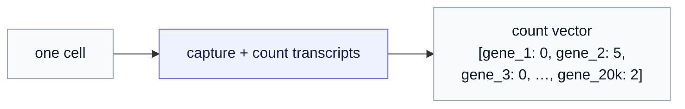

# Appendix — A primer on the data modalities (for readers without a biology background)

*Optional background. The series uses bio and health data as worked examples; this page explains those modalities from scratch so the examples land. If you already know single-cell RNA-seq, EHR codes, or wearable streams, skip it — nothing here is needed for the machine-learning ideas, only for the examples that illustrate them.*

The generative-JEPA design space is **modality-agnostic** — the routes care about latents, priors, and decoders, not about what the data *is*. But abstract routes are hard to learn from, so the chapters anchor each idea in a concrete domain: single-cell gene expression (Part 6's count decoder, Part 10's perturbation application) and continuous health monitoring (Part 11's diabetes world model). Those domains carry vocabulary an ML reader may not have met. This appendix supplies the minimum, in plain terms, with a pointer back to where each piece is used.

---

## 1. Single-cell RNA-seq — gene counts, dropout, library size

**The one-sentence version.** A single-cell RNA-seq (scRNA-seq) experiment measures, for each individual **cell**, how active each **gene** is — and it does so by *counting molecules*.

Let's unpack that. Every cell contains messenger-RNA transcripts, and the number of transcripts of a given gene is a proxy for how strongly that gene is "switched on." The instrument captures and counts those transcripts. So one cell becomes a long vector of **counts** — one non-negative integer per gene, across roughly 20,000 genes. A whole experiment is a big matrix: cells as rows, genes as columns, counts in the entries.



Three properties of that count vector matter for *how you model it*, and they are exactly why [Part 6 §2](06-route-a-latent-decoder-head.md) argues a plain Gaussian/MSE decoder is the wrong tool:

- **Counts are non-negative integers.** You cannot have $-3.2$ transcripts. A model that predicts continuous real numbers is already speaking the wrong language.
- **They are overdispersed.** Across cells, a gene's count varies far more than a simple Poisson-counting process would predict — the variance greatly exceeds the mean. This is what the **negative binomial (NB)** distribution is for: a count distribution with a mean *and* a separate dispersion knob that lets the variance run high.
- **They are dominated by dropout — a sea of zeros.** Typically **over 90%** of the entries are zero, and many of those are *technical* zeros: the gene was active, but no transcript happened to be captured. Dropout is a *measurement artifact*, not biology. The **zero-inflated** negative binomial (ZINB) adds an explicit "structural zero" probability to model this excess.

One more practical term: **library size**. Different cells yield different *total* counts — some cells are sequenced more deeply than others — purely as a technical matter. A cell's library size $\ell$ is its total captured counts. Because it is a technical nuisance, models separate "the *shape* of a cell's expression" (a profile over genes that sums to one) from "how deeply it was sequenced" ($\ell$), and reconstruct the count mean as profile $\times \ell$. That is exactly the softmax-rate-times-library-size construction in Part 6.

### The perturbation setup (used in Parts 5, 10)

Much of the biology in this series is about **perturbations**: you take a **baseline** (control) cell, apply something — knock out a gene, add a drug — and ask what the cell becomes. Comparing the perturbed cell to the baseline, gene by gene, gives the **change** in expression, called **differential expression**; the magnitude-and-pattern of that change is the perturbation's **effect size**. [Part 5 §3](05-two-gaps-four-routes.md) explains why effect size — the *change*, not the *after-state* — is the hard and important target, and why a model can ace the latent yet miss it.

### A tiny worked example

Three genes, one control cell and one drug-treated cell (counts):

| | gene A | gene B | gene C | library size $\ell$ |
|---|---|---|---|---|
| control | 8 | 0 | 40 | 48 |
| treated | 9 | 0 | 120 | 129 |

Read it off: gene C tripled, gene A barely moved, gene B reads zero in both (likely dropout). The **effect** is "gene C strongly up," and a good model must predict *that change* — not just that the treated cell still looks broadly like its baseline. Note the library sizes differ (48 vs. 129), which is why raw counts must be normalized before they are comparable.

---

## 2. Electronic health records (EHR) — medical codes as a language

**The one-sentence version.** An electronic health record turns a patient's clinical history into a sequence of **timestamped codes** — and you can treat that sequence like a sentence in a language.

When a clinician records a diagnosis, prescription, or lab result, it is logged against a *standard vocabulary*: **SNOMED** for diagnoses, **RXNORM** for drugs, **LOINC** for lab tests. Each event is a code with a date. So a patient becomes a chronological list of coded events — sparse (events happen only at visits), irregular (no fixed clock), and symbolic (codes, not numbers). The sibling [`ehr-sequencing`](https://github.com/pleiadian53/ehr-sequencing) project treats this exactly as a language model treats text: codes are "words," a patient history is a "document."

A slice of a diabetic patient's record (the format used in the [diabetes world-model example](../operator_world_models/05-worked-example-diabetes.md)):

```
2024-01-15:  [LOINC:4548-4, SNOMED:44054006, RXNORM:860975]
2024-06-15:  [LOINC:4548-4, LOINC:2339-0]
```

`LOINC:4548-4` is an HbA1c lab (a three-month average-glucose test), `SNOMED:44054006` is type 2 diabetes, `RXNORM:860975` is a glucose-lowering drug, `LOINC:2339-0` is a fasting-glucose result. The stream carries *what the system already knows about the patient* — diagnoses, every drug started or stopped, every lab — as one symbolic modality alongside the dense sensor streams below.

---

## 3. Wearable and continuous-monitoring streams (brief)

**The one-sentence version.** Wearables and medical sensors produce dense, continuously-sampled physiological time series — the raw material of "digital phenotyping."

Examples used in [Part 11](11-application-digital-phenotyping.md) and the [diabetes example](../operator_world_models/05-worked-example-diabetes.md): a **continuous glucose monitor (CGM)** reading blood sugar every five minutes; an insulin pen logging doses; a watch tracking steps, heart rate, and sleep; a scale logging weight. These streams are dense but **heterogeneous** (wildly different sampling rates), **irregular**, and **often missing** (people take the watch off). Handling that irregularity as the *native* input — rather than forcing everything onto a clean grid first — is itself part of the modeling challenge.

> **A standing caveat for all health data.** Real CGM and EHR data are **protected health information (PHI)** — working with them means de-identification, consent or a waiver, an IRB, and secure handling. Every health example in this series uses **synthetic / illustrative** data and is **not** medical advice.

---

## Where these show up in the series

| Modality | Introduced here for… | Used in |
|---|---|---|
| **scRNA-seq counts** | the count decoder; effect size | [Part 6 §2](06-route-a-latent-decoder-head.md), [Part 5 §3](05-two-gaps-four-routes.md), [Part 10](10-application-computational-biology.md) |
| **EHR codes** | the symbolic history modality | [Part 11](11-application-digital-phenotyping.md), [diabetes example](../operator_world_models/05-worked-example-diabetes.md) |
| **Wearable / CGM streams** | dense physiological monitoring | [Part 11](11-application-digital-phenotyping.md), [diabetes example](../operator_world_models/05-worked-example-diabetes.md) |

---

*Series home: [Generative JEPA](index.md). Back to [Part 6 — Route A](06-route-a-latent-decoder-head.md).*
