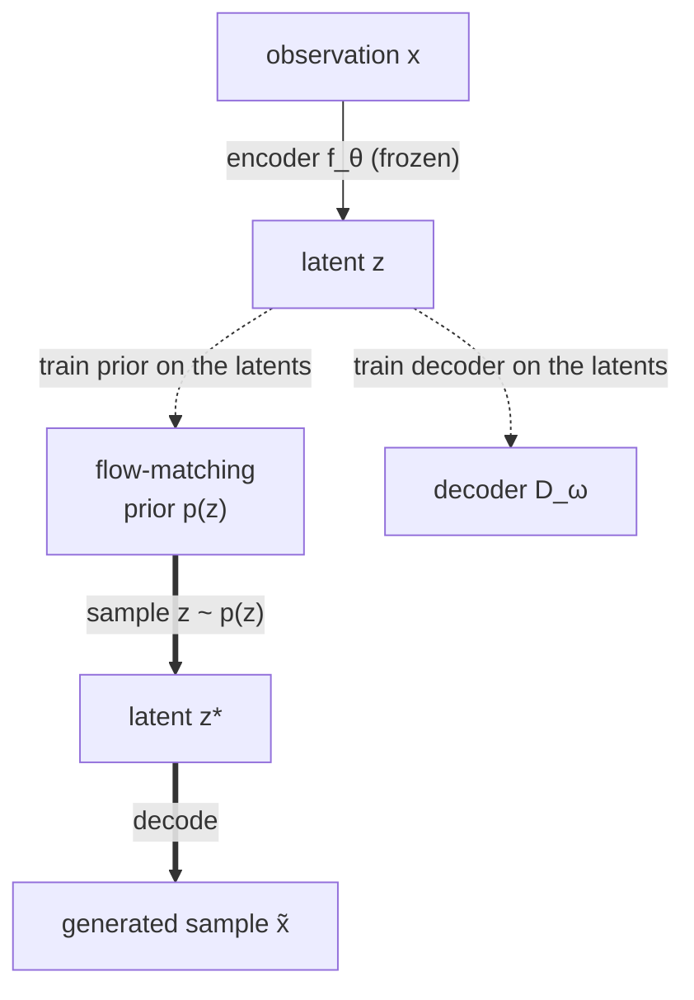

# Generative JEPA

*Turning a model that understands data into one that can generate it.*

JEPA learns by **predicting embeddings, not pixels**: hide part of an input, predict the *representation* of the hidden part from the representation of the visible part. The reward is a famously good encoder — but only an encoder. It has no decoder, defines no density, and cannot produce a new data point. This series is about the smallest honest set of additions that turn that encoder into a **sampleable generative model**, and about what each addition costs.

The recipe is two bolt-on pieces. JEPA gives you a map of the data — a latent space where *meaning* is organized. To generate, you need a way to **pick a point on that map at random** (a prior over latents) and a way to **walk from a latent back to a data point** (a decoder). Train the encoder once, freeze it, then learn those two pieces on top.

## The pipeline

Read top-to-bottom in two passes. **Solid arrows** are the forward path at training time: encode observations into latents. **Dashed arrows** are the two things you fit on the frozen latents — a prior and a decoder. **Bold arrows** are sampling: draw a latent from the prior, decode it into a brand-new observation.

Stated as four stages:

1. **Encoder** $f_\theta$ — JEPA representation learning. Predict masked-region *embeddings* from context embeddings; no reconstruction. Freeze when done. *(Stage 1.)*
2. **Latent prior** $p(z)$ — a **rectified-flow** model fit to the frozen latents, so you can sample new latents from noise. *(Stage 2.)*
3. **Decoder** $D_\omega$ — maps a latent back to data space, trained on the frozen latents. *(Stage 3.)*
4. **Sampling** — draw $z \sim p(z)$, then $\tilde x = D_\omega(z)$. *(Stage 4, plus how to know whether the samples are any good.)*

## Why this shape

The design is deliberately the *simplest* thing that closes the loop, because the point of the starter is to make every joint visible. Three choices define the v0 route, each revisited in the chapters:

- **Train once, freeze, then add.** The encoder never sees the prior or decoder loss. This keeps the representation purely self-supervised and makes the generative head a clean post-hoc study — at the cost that the latents were never trained to be *decodable* (see [Stage 3](03-the-decoder.md)).
- **One latent per observation.** We mean-pool the patch embeddings into a single vector $z$, so the prior and decoder are small and the math is transparent. Per-patch latents are the obvious next step for sharper, more diverse samples.
- **Flow matching for the prior.** Rectified flow gives a simple regression objective and straight noise-to-data paths — a clean, modern alternative to a diffusion prior.

This is the recipe that, in vision, underlies "encode with a strong representation model, then learn a prior and decoder on top." JEPA's contribution is the *encoder objective*; everything downstream is the generative stack.

## Reading order

| Part | Stage | What you get |
|---|---|---|
| **[0 — Generative models, and why JEPA](00-generative-models-and-why-jepa.md)** | background | what a generative model *is*, the latent-variable recipe, and why JEPA is a good substrate — no prior familiarity assumed |
| **[1 — The JEPA encoder](01-the-jepa-encoder.md)** | encode | predict embeddings not pixels; masking, the EMA target, and why collapse is the thing to watch |
| **[2 — The latent prior](02-the-latent-prior.md)** | sample latents | rectified flow over frozen $z$: the interpolant, the conditional flow-matching loss, ODE sampling |
| **[3 — The decoder](03-the-decoder.md)** | latents to data | $D_\omega: z \to x$ on frozen latents, and the decodability caveat this route makes honest |
| **[4 — Sampling and evaluation](04-sampling-and-evaluation.md)** | generate + judge | close the loop, then *measure* sample quality without eyeballing — and where to go next |

New to the symbols? The [notation reference](notation.md) defines every one.

## The reference run

Each chapter points at the runnable code in [`examples/generative_jepa/`](https://github.com/pleiadian53/ssl-lab/tree/main/examples/generative_jepa) and the scripts `01`–`06`. On full MNIST (a proof-of-concept; the core is modality-agnostic), one A40 run produced: encoder effective rank **103.7 / 128** with **95.3%** linear-probe accuracy; generated digits that an independent classifier reads as **all ten classes** with high confidence and that sit **as far from the training set as real held-out images do** — that is, genuinely new, not memorized. The numbers, and how to read them, are in [Stage 4](04-sampling-and-evaluation.md).

---

*New to generative modeling or JEPA? Start with [Part 0 — Generative models, and why JEPA](00-generative-models-and-why-jepa.md). Already comfortable with latent-variable generative models? Jump to [Part 1 — The JEPA encoder](01-the-jepa-encoder.md).*
