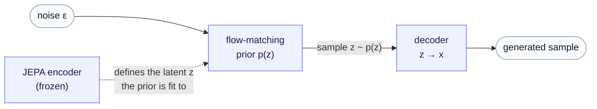

# ssl-lab documentation

A research lab for **self-supervised learning (SSL)** — tracking the SSL frontier and going deep on the methods most worth mastering. The current focus is **JEPA** (joint-embedding predictive architectures) and two ways to extend it.

This site is built from the `docs/` folder of [pleiadian53/ssl-lab](https://github.com/pleiadian53/ssl-lab) and rendered with full LaTeX math support.

## Research directions

**1. Generative JEPA — make the representation *sampleable*.** Add a prior over the latent and a decoder back to data space, turning a representation learner into a generative model. Built as a walking skeleton on MNIST (modality-agnostic core). → **[Full tutorial: Generative JEPA](generative_jepa/index.md)**.

**2. Action operators on JEPA — make prediction *active*.** Promote JEPA's fixed "predict region $q$" mask to a **learned operator the model chooses** — *sensing* (where to look) and *perturbing* (what an action does) — so the system can form and test hypotheses rather than only in-fill what's masked. The gentlest way in is the **[Time-Series JEPA](time_series_jepa/index.md)** series (JEPA pointed at time series — the natural first arena for action operators); then the **[Action Operators foundation](action_operator/00-from-actions-to-operators.md)** and the **[Operator World Models](operator_world_models/index.md)** synthesis. Builds on the action-operator formalism from the sibling project [GRL](https://github.com/pleiadian53/GRL).

## How we run experiments

**[Running an experiment you can trust](experimental-method/index.md)** — a methodology series on the part of research that decides whether any of the rest of it meant anything: what a metric is actually computed on, why a single seed is a narrator you cannot trust, how an *ablation* differs from a *control*, how to turn a difference into a verdict with a joint bootstrap and simultaneous intervals, and how to tell whether a component is even worth improving before you spend a month improving it. It is written for method development generally, not for biology, and its worked example is a project that **lost** to its own baseline, which makes it a far better teacher than a success would be. Read it before you trust a number, including your own.

## Read next

- **[Generative JEPA](generative_jepa/index.md)** — a four-part tutorial on extending a JEPA encoder into a sampleable generative model: the encoder, the flow-matching prior, the decoder, and sampling + evaluation.
- **[Time-Series JEPA](time_series_jepa/index.md)** — the accessible entry point for the operator track: JEPA pointed at time series, multimodal channels, and the one blind spot that motivates action operators.
- **[Action Operators](action_operator/00-from-actions-to-operators.md)** — the foundation: *From actions to operators* → *[Augmenting JEPA with Action Operators](action_operator/01-jepa-action-operators.md)* → *[A gallery of operators](action_operator/02-operator-gallery.md)* → *[The algebra of composition](action_operator/03-the-algebra-of-composition.md)* (what happens when you apply two operators: the commutator as the exact measure of non-additivity, the BCH correction series, and why the anticommutator is a different animal).
- **[Operator World Models](operator_world_models/index.md)** — the JEPA + operator world-model series, building on that foundation (state and latent operators, temporal prediction, conditioning on interventions).

## About

ssl-lab is a spin-off of [genai-lab](https://github.com/pleiadian53/genai-lab) (generative AI for computational biology). Methods are kept deliberately modality-agnostic so they can mature here and feed back into genomic generative models. See the repository [README](https://github.com/pleiadian53/ssl-lab#readme) for setup and the code layout.
