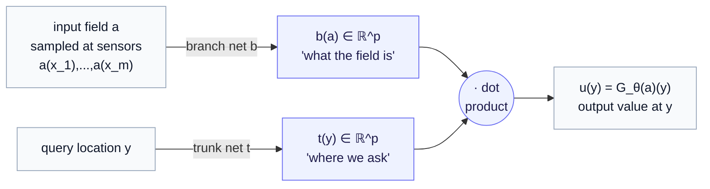

# Part 2 — DeepONet

*The first practical neural operator: split "what the input field is" from "where you are asking," then multiply.*

> **Where we are.** [Part 1](01-the-operator-learning-problem.md) ended with a theorem (Chen & Chen, 1995) saying any continuous operator can be written as a sum of products of two factors — one reading the input function, one reading the query location. **DeepONet** (Lu et al., 2021) is that theorem turned into a neural network. This chapter gives the architecture top-down — the idea, the interface, how to read it, where it breaks — then the equations. It is the most direct realization of operator learning and the easiest to hold in your head.

---

## 1. The core idea: factorize "what" from "where"

Think about what answering $u(y) = G(a)(y)$ actually requires. You must know two separate things:

- **what the input field is** — the whole pattern $a$ you applied (the drug concentration across the tissue); and
- **where you are asking** — the specific location $y$ at which you want the output value.

DeepONet's insight is to compute these two things with *two separate networks* and then combine them at the very end. One network looks only at the input field and produces a summary of "what is happening." The other looks only at the query location and produces a summary of "where we are asking." Their outputs are combined by a simple dot product to give the answer at that point.

The two networks have names that stuck:

- the **branch network**, $b$, reads the input function $a$ (given as its values at fixed sensor locations) and outputs a vector of $p$ numbers — a learned code for *what the input field is*;
- the **trunk network**, $t$, reads the query location $y$ and outputs a vector of $p$ numbers — a learned code for *where we are asking*.

The predicted output value is their inner product: multiply the two $p$-vectors component by component and sum. That is the whole architecture.

The elegance is that the trunk takes *one location at a time*, so you can evaluate the output field at **any** set of points, as many or as few as you like, simply by running the trunk on each — the branch is computed once per input field and reused. That is exactly the "query anywhere" property from Part 1, delivered by construction.

---

## 2. Why split it this way — the payoff of the factorization

Separating "what" from "where" buys three concrete things:

- **The output is genuinely a queryable function.** Because the query location $y$ enters through its own continuous network (the trunk), you can ask for the output at locations that were never in the training mesh. The trunk learns a set of $p$ continuous *basis functions* over the domain, and the branch learns the *coefficients* with which to combine them for this particular input — so the predicted field is a smooth combination of learned spatial patterns, evaluable anywhere.
- **The input mesh and the output mesh are decoupled.** The branch consumes the input at fixed sensor locations; the trunk produces the output at whatever locations you ask. They need not match, and neither needs to be a regular grid.
- **It mirrors a theorem, so it is principled.** This is not an architecture someone guessed; it is the 1995 operator-approximation form (Part 1, §6) made trainable. The branch is the input-encoding factor $b_k$, the trunk is the location-encoding factor $t_k$, and the sum-of-products is their dot product.

---

## 3. Inputs and outputs — the interface

**In.**
- To the branch: the input function $a$ sampled at a *fixed* set of $m$ **sensor** locations $x_1, \dots, x_m$ — the same sensors for every input function in the dataset. This fixed sensor set is a real constraint, noted again under limits.
- To the trunk: a query location $y$ (any point in the domain).

**Out.** The scalar value $u(y)$ of the output field at $y$. To get the whole field, run the trunk over many $y$'s; the branch output is computed once and shared.

So DeepONet's signature is: *the input field comes in at fixed sensors, the output field goes out at arbitrary query points.* If your measurements always come from the same instrument layout but you want to predict the response anywhere, this fits naturally.

---

## 4. How to interpret it

- **The trunk outputs are a learned basis; the branch outputs are coefficients.** A productive way to read a trained DeepONet: the trunk has discovered $p$ spatial "modes" of the output (think of them as learned shapes the answer is built from), and the branch decides how much of each mode this particular input calls for. Inspecting the trunk's $p$ functions can reveal the dominant patterns the operator uses.
- **More basis functions $p$ = more expressive output fields**, at more parameters and more risk of overfitting — $p$ is the main capacity knob.
- **A good fit at unseen query points** (not just at training locations) is the real test that it learned an operator rather than memorizing a mesh — the discretization-invariance litmus from Part 1, applied on the output side.

---

## 5. Limitations — the honest account

- **Fixed sensors on the input.** The vanilla branch requires every input function to be sampled at the *same* $m$ locations. If your input sampling varies experiment to experiment, the basic form does not directly apply (variants relax this, but it is the standard caveat).
- **The branch can be a bottleneck for very rich inputs.** Compressing a complicated high-resolution input field into the branch's input vector can lose structure; capacity and sensor density must be chosen with care.
- **Out-of-distribution inputs.** As with every neural operator, an input unlike the training distribution can produce a confidently wrong field. The factorized form does not change this.
- **It can need a lot of paired data** to pin down both networks well, especially as $p$ and input complexity grow — which is exactly why data-efficiency tools (active learning, mechanistic priors) are essential companions to it.

---

## 6. Fit for the tissue foundry

DeepONet is the **clearest first neural operator to build and reason about** for a tissue model. If a tissue construct is monitored by a fixed sensor layout (a multi-electrode array measuring electrophysiology at fixed sites), the branch consuming "the applied intervention field at those sensors" and the trunk producing "the response at any location and time" is a direct match to the instrument. Its readability — learned basis × coefficients — also makes it a good *teaching* operator: you can look inside and see what spatial patterns it relies on. The [Fourier Neural Operator](03-the-fourier-neural-operator.md) in the next chapter often wins on accuracy for grid-structured PDE problems, but DeepONet's flexibility on output location and its transparent structure make it the natural place to start.

---

## 7. The math, collected

*Deferred per the series' contract; this makes §§1–4 precise.*

**The architecture.** Fix sensor locations $x_1, \dots, x_m \in D$. The branch network $b$ maps the sampled input to a $p$-vector, and the trunk network $t$ maps a query location to a $p$-vector:

$$
b(a) = \big(b_1(a), \dots, b_p(a)\big) \in \mathbb{R}^p, \qquad t(y) = \big(t_1(y), \dots, t_p(y)\big) \in \mathbb{R}^p,
$$

where $b$ reads $a$ through its samples $\big(a(x_1), \dots, a(x_m)\big)$. The DeepONet prediction of the output field at location $y$ is their inner product (optionally plus a bias $b_0$):

$$
G_\theta(a)(y) = \sum_{k=1}^{p} b_k(a) t_k(y) + b_0.
$$

Compare directly with the 1995 theorem's form from [Part 1](01-the-operator-learning-problem.md) §6: $b_k$ is the input-encoding factor, $t_k$ is the location-encoding factor. DeepONet makes both factors deep neural networks and trains them jointly.

**Reading it as basis + coefficients.** Hold the input fixed; then $G_\theta(a)(\cdot) = \sum_k b_k(a) t_k(\cdot)$ is a linear combination of the $p$ functions $t_1, \dots, t_p$ with input-dependent coefficients $b_k(a)$. The trunk functions $\{t_k\}$ are a *learned basis* for the output space; the branch supplies the coordinates in that basis for each input — the precise statement of §4's interpretation.

**Training.** Given pairs $(a^{(j)}, u^{(j)})$ and output locations $\{y_i\}$, minimize the field-space loss from [Part 1](01-the-operator-learning-problem.md) §6, e.g.

$$
\mathcal{L}(\theta) = \frac{1}{N}\sum_{j=1}^N \frac{1}{Q}\sum_{i=1}^{Q} \big\lvert G_\theta(a^{(j)})(y_i) - u^{(j)}(y_i) \big\rvert^2,
$$

over $Q$ query points per example. Both networks are trained end to end by gradient descent; at inference the branch runs once per input and the trunk runs once per query point.

---

## 8. Where we go next

DeepONet realizes operator learning by *factorizing*: encode the input function and the query location separately, then combine. It is principled (it mirrors the existence theorem), flexible on output location, and transparent.

[Part 3](03-the-fourier-neural-operator.md) takes the *other* route from [Part 1](01-the-operator-learning-problem.md) §5 — the kernel-integral view — and makes the global mixing term cheap by computing it in **frequency space**. The result, the Fourier Neural Operator, is the field's workhorse for PDE problems on grids and the cleanest demonstration of zero-shot super-resolution.

> **One-paragraph recap.** DeepONet learns an operator by splitting it into a **branch** network that encodes the input field (sampled at fixed sensors) and a **trunk** network that encodes the query location, combined by a dot product: $G_\theta(a)(y) = \sum_k b_k(a) t_k(y)$. The trunk learns a basis of spatial modes; the branch learns the per-input coefficients. This delivers "query the output anywhere," decouples input and output meshes, and follows directly from the 1995 operator-approximation theorem. Its main constraint is fixed input sensors; its main risk, as ever, is out-of-distribution inputs.
