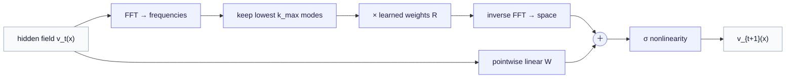

# Part 3 — The Fourier Neural Operator

*The workhorse: make the global integral cheap by doing it in frequency space.*

> **Where we are.** [Part 1](01-the-operator-learning-problem.md) §5 said a neural-operator layer needs a *global* term — an integral that lets every point feel the whole field. [DeepONet](02-deeponet.md) reached the global behavior by factorizing the operator. The **Fourier Neural Operator** (FNO; Li et al., ICLR 2021) takes the integral head-on and computes it efficiently using a classical fact: a convolution becomes a *multiplication* in frequency space. This chapter builds the idea top-down, then the math. FNO is the architecture you will most often see winning on PDE benchmarks and the cleanest demonstration of training coarse and evaluating fine.

---

## 1. The problem FNO solves, and the trick

A neural-operator layer must let information travel across the entire domain in one step — what happens here depends on the field everywhere. Part 1 wrote that as a kernel integral, $(\mathcal{K} v)(x) = \int_D \kappa(x, y) v(y) dy$: a weighted average of the whole field. Computed naively, that integral is expensive — every output point sums over every input point.

FNO's move is to *restrict the kernel to one that depends only on the displacement* $x - y$ rather than on $x$ and $y$ separately. An integral of that form is a **convolution** — the same operation a CNN does, but global rather than local. And convolution has a famous shortcut, the **convolution theorem**:

> **Convolution in space = multiplication in frequency.**

So instead of computing the global integral directly, FNO does three steps: transform the field to frequency space with the Fast Fourier Transform (FFT), **multiply** by a learned set of weights there, and transform back. Multiplication is cheap, and the FFT is fast — turning an expensive global integral into a quick, learnable operation. This is the entire idea; the rest is packaging.

---

## 2. The Fourier layer, in plain language

One **Fourier layer** transforms the hidden field $v$ into a new field, and it has two parallel paths whose results are added (then passed through a nonlinearity):

1. **The spectral (global) path.** Take the FFT of the field to get its frequency content. Keep only the **lowest $k_{\max}$ frequency modes** — the smooth, large-scale structure — and throw away the high-frequency rest. Multiply each kept mode by a learned weight (this is the learnable part — a small complex-valued weight tensor $R$). Transform back to space with the inverse FFT. This path mixes information globally and learns *which* large-scale patterns matter.
2. **The local (pointwise) path.** In parallel, apply an ordinary pointwise linear transform $W$ to the field — the same matrix at every point. This path handles local, per-point adjustments and lets the layer represent high-frequency detail that the truncated spectral path dropped.

Add the two paths, apply a nonlinearity, and that is one layer. Stack several. The first layer lifts the raw input field into a multi-channel hidden field; the last projects back down to the output field.

**Why keep only low modes?** Two reasons, one practical and one principled. Practically, truncating to $k_{\max}$ modes keeps the weight tensor small and the computation cheap. Principled: the solutions of many physical systems are *dominated by their large-scale structure*, so the low frequencies carry most of the signal, and discarding the high-frequency tail is a sensible, smoothing inductive bias. (When fine detail truly matters, that is the local path's job — and a known limitation when the detail is essential.)

---

## 3. Why FNO is resolution-invariant — the property made vivid

This architecture delivers the train-coarse-evaluate-fine promise especially cleanly, and it is worth seeing why. The learned weights $R$ live in **frequency space**, attached to *modes* — "the lowest 12 frequencies" — not to grid points. A frequency mode is a property of the underlying function, independent of how finely you sample it. So the *same* learned weights apply whether you run the FFT on a $64\times 64$ grid or a $256\times 256$ grid: you transform the finer field, multiply the same low modes by the same learned $R$, transform back at the finer resolution.

That is why FNO can be trained on cheap coarse data and evaluated on a finer grid it never saw — **zero-shot super-resolution** — and was the first ML method shown to do this for turbulent fluid flows. It is the most tangible payoff of the whole "learn the function, not the pixels" philosophy from [Part 1](01-the-operator-learning-problem.md).

---

## 4. Inputs and outputs — the interface

**In.** The input field $a$ sampled on a (typically regular) grid over the domain — for time-dependent problems, often the field over an initial time window, plus the grid coordinates as extra input channels so the network knows *where* each value sits.

**Out.** The output field $u$ on a grid — and, thanks to §3, on a *finer* grid than training if you ask. For time evolution, FNO either predicts a future time slice directly or is rolled forward step by step.

The practical signature: FNO is happiest with **grid-structured** data (it relies on the FFT), and in return it is fast, accurate on smooth PDE solutions, and resolution-flexible. (Variants extend it to irregular geometries; the vanilla form wants a grid — the mirror image of DeepONet, which is freer on geometry but fixes the input sensors.)

---

## 5. How to interpret it

- **The kept modes are a statement about scale.** Choosing $k_{\max}$ low says "the answer is dominated by large-scale structure"; raising it admits finer detail at more cost. Inspecting which modes carry energy tells you the spatial scales the operator considers important.
- **The spectral path is the global reasoning; the local path is the fine correction.** When predictions are smooth-but-right at large scale and slightly soft on fine features, that is the signature of the low-mode truncation — usually a feature, occasionally the limitation.
- **Convergence under refinement is the health check.** Evaluate the trained FNO at several resolutions; a genuine operator's predictions converge. FNO is designed to pass this and is often used to *demonstrate* the property.

---

## 6. Limitations — the honest account

- **It wants a grid.** The vanilla FNO relies on the FFT, so it is most natural on regularly-gridded domains. Real tissue geometry is irregular; using FNO there means a geometry-handling variant or a mapping to a regular domain — an added step and a research area in its own right.
- **Truncation drops fine scales.** Keeping only low modes is a smoothing bias. When the phenomenon you care about *is* fine-scale and sharp — a steep wavefront, a small region of broken conduction — important detail can be under-resolved.
- **Out-of-distribution and long rollouts.** As with all neural operators, inputs unlike training data are unreliable; and rolling FNO forward many steps in time compounds error, the same anchoring caveat the [Operator World Models](../operator_world_models/index.md) series raises for any learned dynamics.
- **Data and simulator bias.** Trained on a simulator, FNO inherits its biases and the sim-to-real gap; trained on measurements, it needs enough of them — again pointing to the data-efficiency tools alongside it.

---

## 7. Fit for the tissue foundry

FNO is the strongest candidate for the **spatial-emergence** core of a tissue model — exactly the piece that makes a tissue more than a bag of cells. Cardiac electrical propagation is governed by a reaction–diffusion PDE (a diffusion term spreading voltage across coupled cells, a reaction term from the single-cell ion dynamics); its solutions are fields with the kind of large-scale wave structure FNO captures well, and emergent quantities like conduction velocity and wavefront stability are read directly off the predicted field. A natural way to develop it is against a cardiac biophysical sandbox (a single-cell model coupled into a tissue PDE) — a controlled setting where FNO can be trained, its resolution-invariance verified, and its limits on sharp wavebreaks understood, before facing real measurements. The planned Part 4 works this case study in detail.

---

## 8. The math, collected

*Deferred per the series' contract; this makes §§1–3 precise.*

**The Fourier layer.** With hidden field $v_t : D \to \mathbb{R}^n$, let $\mathcal{F}$ denote the Fourier transform and $\mathcal{F}^{-1}$ its inverse. The layer is

$$
v_{t+1}(x) = \sigma\Big( W v_t(x) + \big(\mathcal{K} v_t\big)(x) \Big), \qquad \big(\mathcal{K} v_t\big)(x) = \mathcal{F}^{-1}\big( R \cdot (\mathcal{F} v_t) \big)(x).
$$

Here $W$ is the pointwise linear map (the local path); the global path transforms $v_t$ to frequency space with $\mathcal{F}$, multiplies by the learned complex weight tensor $R$, and transforms back with $\mathcal{F}^{-1}$. In practice $\mathcal{F}$ is the FFT, and $R$ is applied only to the lowest $k_{\max}$ modes: writing $\widehat{v}_t = \mathcal{F} v_t$ for the field's frequency content, the operation is, mode by mode,

$$
\big(R \cdot \widehat{v}_t\big)(\xi) = \begin{cases} R(\xi) \widehat{v}_t(\xi), & \lvert \xi \rvert \le k_{\max}, \\[2pt] 0, & \lvert \xi \rvert > k_{\max}, \end{cases}
$$

where $\xi$ indexes frequency modes and $R(\xi)$ is a learned complex matrix per kept mode. The truncation to $\lvert \xi \rvert \le k_{\max}$ is the low-mode keep of §2.

**Why this is a convolution.** Multiplying in frequency space and transforming back, $\mathcal{F}^{-1}(R \cdot \mathcal{F} v)$, is by the convolution theorem a convolution of $v$ with a kernel whose Fourier transform is $R$. So the spectral path *is* the kernel integral of [Part 1](01-the-operator-learning-problem.md) §6, specialized to a translation-invariant kernel $\kappa(x, y) = \kappa(x - y)$ and computed efficiently. FNO is the kernel-integral neural operator with the integral done by FFT.

**Resolution invariance, formally.** $R$ is indexed by frequency mode $\xi$, not by grid index. Sampling the same underlying field on a finer grid changes the FFT's array size but not the low modes' meaning, so the same $R$ applies and the operation converges as resolution refines — the precise statement behind §3's zero-shot super-resolution.

**The full network.** A pointwise lift $P$ raises the input field (concatenated with grid coordinates) to $n$ channels; several Fourier layers follow; a pointwise projection $Q$ maps to the $d_u$-component output: $G_\theta = Q \circ L_T \circ \dots \circ L_1 \circ P$, with each $L_t$ a Fourier layer. Training minimizes the relative $L^2$ field loss of [Part 1](01-the-operator-learning-problem.md) §6.

---

## 9. Where we go next

You have now met both landmark architectures and can see them as two answers to one question. **DeepONet** factorizes the operator into branch (input) and trunk (location) — flexible on output geometry, transparent, principled by the 1995 theorem. **FNO** computes the global kernel integral in frequency space — fast, accurate on gridded PDEs, and the cleanest super-resolution. Neither is universally better: DeepONet is freer on geometry and query points, FNO is sharper on grid-structured physics.

The planned chapters put these to work: **Part 4** develops the cardiac tissue case study (reaction–diffusion, conduction, coupling the operator to the world model), and **Part 5** is the practitioner's honest account of data, sim-to-real transfer, uncertainty, and failure modes. Until those are written, the [Operator World Models](../operator_world_models/index.md) series gives the complementary view — operators on latent state rather than on fields.

> **One-paragraph recap.** The Fourier Neural Operator computes a neural-operator layer's global integral as a **multiplication in frequency space**: FFT the field, keep and reweight the lowest $k_{\max}$ modes with learned weights $R$, inverse-FFT, and add a pointwise linear path for local detail. Because the weights attach to frequency *modes*, not grid points, the same operator runs at any resolution — enabling zero-shot super-resolution. FNO excels on grid-structured PDE fields (like cardiac reaction–diffusion), at the cost of wanting a grid and smoothing away fine scales. With DeepONet, it is one of the two foundational answers to learning maps between function spaces.
