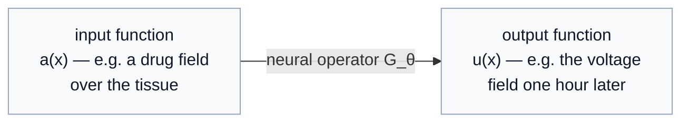

# Neural Operators

*Learning maps between whole functions — the tool for fields, not just vectors.*

Most neural networks learn a map between **vectors**: an image in, a label out; a state in, a next state out. A **neural operator** learns a map between **functions**: a whole input field in — a temperature distribution, an applied drug concentration across a tissue, an initial condition — and a whole output field out — the resulting flow, the voltage across the tissue an hour later, the solution of a differential equation. The input and output are not lists of numbers; they are *functions defined over space and time*, and the object you learn is an **operator** that turns one function into another.

This matters the moment your data is a **field**. A single cell's response can be a vector; a *tissue's* response is a spatiotemporal field — a wave of electrical activity sweeping across a sheet of cardiac cells, a concentration front diffusing through an organoid. The properties that decide therapeutic outcomes — conduction velocity, wavefront stability, where a wave breaks into a dangerous spiral — live in that field and *do not exist* at the level of one cell. Neural operators are the model family built to learn exactly these field-to-field maps, and that is why they are the piece that makes modeling a *tissue* genuinely different from modeling a *cell*.

> **Why this series, and who it is for.** This is a top-down tutorial for a reader who has *not* met neural operators before. We lead with intuition: what the method *is*, what it consumes and produces, how to read its outputs, and where it breaks — and only then open the mathematics. Each chapter puts the concepts first and gathers the equations into a clearly marked section near the end, so you can get the whole mental model on a first pass and return for the derivations on a second.

---

## The one-sentence version, and the one picture

A neural operator is a neural network whose input and output are **functions**, trained so that — once learned — it maps a new input function to its output function in a single fast forward pass, *at any resolution you ask for*.

Read it as: feed in *a whole field*, get back *a whole field*. The learned object $G_\theta$ — the operator, with trainable parameters $\theta$ — stands in for something that classically would have required solving a differential equation from scratch every time. Train it once on many (input field, output field) pairs, and afterward it answers new inputs in milliseconds instead of hours.

---

## Why a *new* model family — three things ordinary networks cannot do

A natural objection: can't I just flatten the field onto a grid, feed the pixels to a convolutional network, and predict the output pixels? You can, and sometimes it even works — but you lose three properties that define the method and that matter enormously for science.

1. **Resolution invariance (discretization invariance).** A neural operator learns the map between the *underlying functions*, not between fixed-size pixel grids. So you can train on a coarse $64\times 64$ grid and evaluate on a fine $256\times 256$ grid — *zero-shot super-resolution* — because the thing it learned was never tied to the grid. A plain CNN is welded to the resolution it trained on.
2. **Mesh / geometry freedom.** The input can be sampled at scattered, irregular points (sensors that are not on a nice grid — exactly the case for real measurements), and the output can be queried at *any* location you like, including ones you never measured.
3. **A map over a whole family of problems.** A classical solver solves *one* instance of an equation for *one* input. A neural operator learns the solution map for the *entire family* at once — change the input field and the answer comes for free, with no re-solving. That is what turns a slow simulator into a fast, queryable surrogate.

These are not conveniences; they are the reason neural operators are the right abstraction for "learn the tissue's spatiotemporal response and then query it cheaply under any new intervention."

---

## Where this sits relative to what we have already built

This series connects to the rest of the project at a precise and satisfying point. The [Operator World Models](../operator_world_models/index.md) series is also about **operators** — but operators on a *finite-dimensional latent state* $z$, where a learned matrix $A_\theta = \exp(M_\theta)$ pushes $z_t$ to $z_{t+1}$. Neural operators are the same spirit lifted one level higher: operators on *infinite-dimensional function spaces*, mapping a whole field to a whole field. One acts on the compressed *state* of a system; the other acts on the system's full *spatial extent*. They are complementary tools: the latent operator for the system's trajectory, the neural operator for its spatial emergence.

The motivating application throughout is a **tissue foundry**: a model that takes an intervention applied to a piece of engineered human tissue and predicts the resulting *spatiotemporal* response field — the level at which conduction, coupling, and arrhythmia actually appear.

---

## Reading order

A top-down arc: understand the *idea* and the *interface* first, then meet the two landmark architectures, then the applications.

| Part | Topic | What you get |
|---|---|---|
| **[0 — What is a neural operator?](00-what-is-a-neural-operator.md)** | functions-to-functions; resolution invariance; three mental models | the whole concept with no heavy math — **start here** |
| **[1 — The operator-learning problem](01-the-operator-learning-problem.md)** | function spaces; the solution map $G$; discretization invariance; why it is hard | the precise problem statement, and why ordinary networks do not solve it |
| **[2 — DeepONet](02-deeponet.md)** | the branch/trunk architecture; the operator universal-approximation theorem | the first practical neural operator: how it factorizes "what" from "where" |
| **[3 — The Fourier Neural Operator](03-the-fourier-neural-operator.md)** | spectral convolution; the Fourier layer; zero-shot super-resolution | the workhorse architecture: learning the kernel in frequency space |
| *4 — Neural operators for tissue & PDEs (planned)* | the cardiac case study; reaction–diffusion; coupling to the world model | where the method meets the foundry — *to be written* |
| *5 — Training, data, and limits (planned)* | data requirements; sim-to-real; failure modes; the frontier | the honest practitioner's chapter — *to be written* |

> **New to the underlying ideas?** You need only comfort with the idea of a function $f(x)$ and a neural network as a trainable function approximator. Everything else — function spaces, integral kernels, the Fourier transform — is built up gently, just-in-time, where it is first needed.

---

*Start with [Part 0 — What is a neural operator?](00-what-is-a-neural-operator.md). The two architecture chapters ([DeepONet](02-deeponet.md), [FNO](03-the-fourier-neural-operator.md)) are the payoff; the two conceptual chapters before them are what make the architectures feel inevitable rather than arbitrary.*
