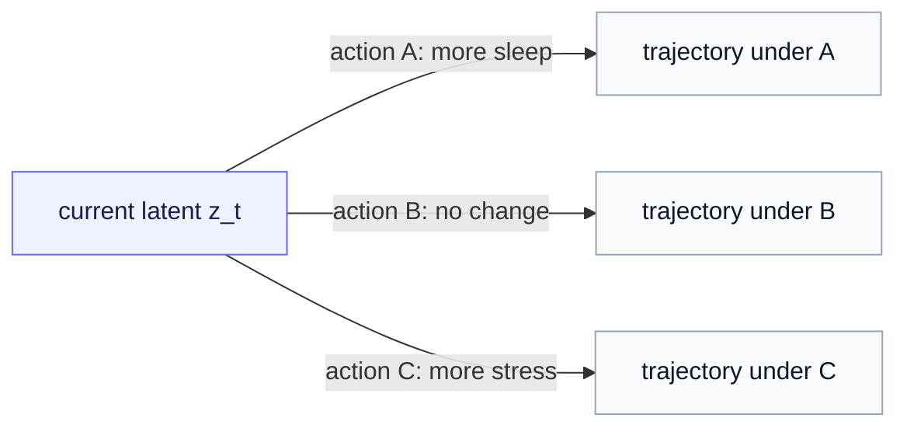

# What Is a World Model?

*From a map of the data to a model you can act on — and why a JEPA latent is a natural place to build one.*

> **Prerequisites — read these first.** This series is the synthesis of two foundations, and it assumes both. From [Time-Series JEPA](../time_series_jepa/index.md): a predictor that says *what comes next* in latent space, and the precise gap it leaves open. From the [Action Operators](../action_operator/00-from-actions-to-operators.md) foundation: an operator that transforms a state, *configured* by an action. If either phrase is unfamiliar, start there — the ideas below assume you have met both.

The two foundations each hand us a piece. Time-Series JEPA gives a predictor of the next latent state. The Action Operators foundation gives an operator that transforms a latent state under a chosen action. This series fuses them into a **world model**. But "world model" is a phrase that gets thrown around loosely, so before we build one, this chapter pins down exactly what it means, why a plain predictor is not yet one, and why JEPA's latent is the right place to put it. No new machinery here — just the concept the rest of the series rests on.

---

## 1. A map versus a world model

Start with the distinction that does all the work.

A representation learner — a plain encoder, or a static JEPA — gives you a **map** of the data. It tells you *where things are*: this person's Tuesdays cluster over here in latent space, their weekends over there, a bad stretch somewhere else. A map is genuinely useful. But it is passive. It describes where you are; it says nothing about where you are *going*.

A **world model** adds the missing half: *how the state evolves*. In its classic form it answers "given where the system is now (and what is done to it), where does it go next?" — a model of the dynamics, not just the layout.

> **The one-line contrast.** A map tells you *where you are*. A world model tells you *where you will go* — and, crucially, *where you would go if you did something different*.

Carry the running person from the Time-Series JEPA series. A *map* says: "today looks like a typical mid-week day." A *world model* says: "from today, next week's state will land *here* — and it would land *there* instead if they slept more." The second sentence is a different kind of object entirely, and producing it is the whole point.

---

## 2. The two properties that make it a world model

What exactly separates a world model from an ordinary next-step predictor? Two properties.

**Rollout — looking ahead by iterating.** Apply the one-step map, then feed its output back in and apply it again, and again. The model now *imagines* a trajectory many steps into the future without having to live through it. This is how a world model plans: it runs the future forward in its head.

**Action-conditioning — the future depends on what you do.** This is the real dividing line. A plain predictor forecasts the *single* most likely future — one trajectory, take it or leave it. A world model lets you *vary the action* and get a different trajectory for each. Ask "what if I did A?" versus "what if I did B?" and it answers with two different futures.

Now connect this to the two foundations, because it shows precisely what each one contributes:

- Time-Series JEPA already gives you **rollout** — its temporal predictor, iterated, runs the latent forward. What it *cannot* do is action-conditioning: its query says only *when*, never *what acted*. That was the exact blind spot the Time-Series JEPA series ended on.
- The **action operator** is what supplies the missing property. Conditioning the predictor on an action turns its single forecast into a family of action-dependent trajectories.

> **The equation of this series, in words.** World model = Time-Series JEPA's rollout **plus** the action operator's conditioning. Neither foundation is a world model alone; together they are.

(The mechanics of that conditioning — the single edit to the predictor, counterfactual rollout, the sharpened surprise signal — are Part 3. Here we only need to see *why* both ingredients are required.)

---

## 3. Why a JEPA latent is the right substrate

A world model needs a **state** to evolve. It could try to operate on the raw data — every pixel, every sensor reading — but that is hopeless: the raw state is enormous, noisy, and the true dynamics on it are intractable.

JEPA hands us a better state for free: a learned **latent** in which prediction is tractable, because JEPA was trained to predict *meaning* rather than raw signal. And the keystone of [Part 1](01-state-and-latent-operators.md) is exactly what makes this pay off — the intractable real-world operator `Ô_θ` on the raw state has a tractable *shadow* `f_θ` on the latent, and JEPA is the regime where you only ever compute the shadow. So the operator does its work in the latent, where it can be a clean, composable map.

That is what "operator world model" means, assembled from its parts: **an action operator acting on a JEPA latent.**

---

## 4. Not only Time-Series JEPA — but the natural first arena

It is worth being clear about scope, because it is easy to assume "operator world model" means "the temporal one." It does not. The general object — an action operator on a JEPA latent — spans several settings, only one of which involves time:

| arena | the action | time axis? |
|---|---|---|
| **I-JEPA (spatial)** | *where to look* next (sensing), or a spatial perturbation of the image | no |
| **Static perturbation** | an in-silico edit to a static input — e.g. a mutation, asking how splicing responds | no |
| **Time-Series JEPA (temporal)** | advance the state through time, under an intervention | yes |

All three are the same construction: a JEPA latent, and an operator the model configures and applies. So why does this series build the world model on the *temporal* arena specifically?

Because it is where every piece is at its clearest. When the transition is literally "advance from `t` to `t+1`," the question *"what acted in between?"* is at its sharpest, and the two world-model properties — rollout and action-conditioned trajectories — are at their most vivid (a week-ahead forecast under more sleep is something you can picture immediately). Time-Series JEPA is the **natural first arena**: the cleanest place to *introduce* the action operator into JEPA. Once the idea is solid here, it generalizes back to the spatial and static arenas, where the action is a place to look or an edit to make rather than a step through time.

---

## 5. The arc of this series

With the term grounded, here is where we go:

- **[Part 1 — State and latent operators](01-state-and-latent-operators.md):** the keystone — why an action lives in two spaces (`Ô_θ` on the raw state, `f_θ` on the latent) and how the encoder bridges them. This is what makes the operator tractable.
- **[Part 2 — JEPA as a temporal world model](02-jepa-as-a-temporal-world-model.md):** the temporal predictor read as a latent-dynamics operator, with rollout and the anchoring caveat.
- **[Part 3 — Conditioning JEPA on actions](03-conditioning-jepa-on-actions.md):** the single edit that adds action-conditioning — counterfactual rollout, composable interventions, a sharpened surprise signal.
- **[Part 4 — Generator bases and the operator in code](04-generator-bases-and-the-operator-in-code.md):** the concrete operators (the two application poles) and the runnable module.
- **[A worked example — a personal world model for diabetes](05-worked-example-diabetes.md):** the whole series threaded through one person's data, every symbol earned by something real. For these concepts in a full scenario, read this alongside the parts.

> **Recap before we proceed.** A world model is a model of how state evolves that you can *roll forward* and *condition on actions*. Time-Series JEPA supplies the first; the action operator supplies the second; the JEPA latent is where the operator can be made tractable. Everything after this is how to assemble those parts.

*Continue to [Part 1 — State and latent operators](01-state-and-latent-operators.md).*
