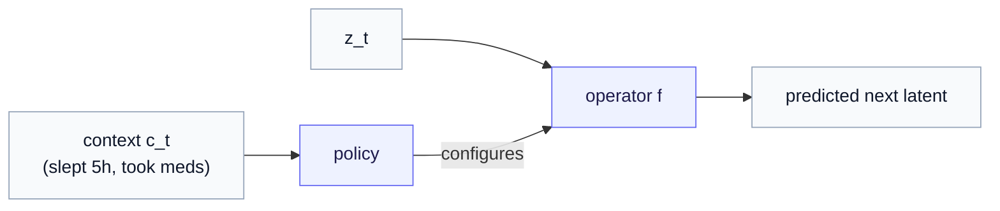
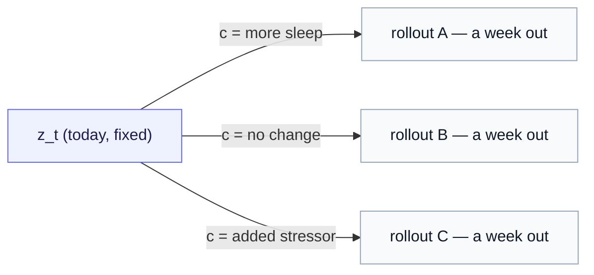

# Conditioning JEPA on Actions

*One edit to the predictor — give it the action — and prediction becomes intervention.*

> **Prerequisite.** [Part 2 — JEPA as a temporal world model](02-jepa-as-a-temporal-world-model.md) (and behind it, [Part 0](00-what-is-a-world-model.md), [Part 1](01-state-and-latent-operators.md), and the [Time-Series JEPA](../time_series_jepa/index.md) and [Action Operators](../action_operator/00-from-actions-to-operators.md) foundations). New symbol here: $c_t$, the context/intervention. Keep the [notation reference](notation.md) open.

[Part 0](00-what-is-a-world-model.md) said a world model needs two properties: **rollout** and **action-conditioning**. [Part 2](02-jepa-as-a-temporal-world-model.md) delivered the first — Time-Series JEPA's predictor, recognized as the latent operator $f_\theta$, rolled forward by composition — and ended on the gap: the operator's query says *when*, never *what acted*, so it averages over every unseen cause and its surprise signal is contaminated. This chapter delivers the second property and closes that gap. It turns out to be a single edit.

The running thread stays the person's behavioral rhythm; the protein case reappears at the end as the structured pole.

---

## 1. The single edit

Take Part 2's temporal predictor and make one substitution. Where the query carried only the time offset, it now carries the **action**:

$$
\underbrace{g_\phi(z_t, q_{\Delta t})}_{\text{query says only *when*}}
\qquad\longrightarrow\qquad
\underbrace{f_{\theta(c_t)}(z_t)}_{\text{operator configured by *what acted*}}
$$

Here $c_t$ is the **context / intervention** at time $t$ — the *known* causes of change you can record: hours slept, medication taken, a logged stressor (for a protein: a mutation, a bound ligand). A **policy** $\pi_\psi$ reads the state and the context and emits the operator parameters, $\theta(c_t) \sim \pi_\psi(z_t, c_t)$, and those parameters configure the latent operator $f_{\theta(c_t)}$ exactly as the [foundation](../action_operator/00-from-actions-to-operators.md) and [gallery](../action_operator/02-operator-gallery.md) describe.

Everything else about training is **unchanged** — same EMA target, same latent-space loss, same stop-gradient:

$$
\mathcal{L} = \big\lVert f_{\theta(c_t)}(z_t) - \mathrm{sg}(E_{\bar\xi}(x_{t+1})) \big\rVert^2.
$$

That is the whole mechanism. The predictor stops being "advance the latent by $\Delta t$, averaging over whatever happened" and becomes "advance the latent **under the specific operator the context selected.**" Part 2's recognition (the predictor *is* the operator) is what makes this a one-line change rather than a new architecture.

---

## 2. Why this is not cosmetic: the averaging defect, fixed

Recall Part 2's bad-night problem, now from the fix's side. Unconditioned, the predictor saw Friday's latent $z_t$ and had to produce *one* Saturday — but Saturday depends on the night's sleep, which it never saw, so it landed between the good-night and bad-night futures and was wrong in every specific case.

Condition on $c_t$ and the ambiguity dissolves. Told $c_t = \text{"slept 5h"}$, the operator predicts the low Saturday; told $c_t = \text{"slept 8h"}$, it predicts the high one. The single straddling average splits into the *right answer for each case*, because the thing that decided the outcome is now an input.

> **The reframing of "surprise."** Once the operator explains the *known* causes of change, the residual $\lVert z_{t+1} - \hat z_{t+1} \rVert$ no longer mixes "ordinary intervention" with "genuine change." It measures only what the known actions *fail* to explain. "Surprise" shifts from *anything I didn't predict* to *change not attributable to a known intervention* — and only the second is clinically meaningful.

---

## 3. Payoff one — counterfactual rollout (the headline)

This is the capability that justifies the whole construction. Once the operator is conditioned on the action, you can **hold the present fixed, swap the action, and re-roll the future**:

$$
z_{t+k}^{(\text{sleep})} = f_{\theta(c_{\text{sleep}})}^{k}(z_t)
\qquad\text{vs.}\qquad
z_{t+k}^{(\varnothing)} = f_{\theta(c_{\varnothing})}^{k}(z_t).
$$

"What would this person's mood-latent look like in a week under more sleep?" stops being a wish and becomes a *computation* — the same iterated-operator rollout from Part 2, run twice with different $c$. This is the line between a passive dashboard (it tells you where you are) and an actionable system (it tells you what to *do*), and it is precisely what a bare predictor **cannot** offer: with no input slot for the action, there is nothing to vary.

> **The honest caveat — read this before believing the picture.** Operators learned from *observational* streams give you **associational** dynamics, not causal ones: $f_{\theta(c)}$ is "the dynamics that tend to *accompany* $c$," not "the dynamics $c$ *causes*." Genuine counterfactual validity needs interventional data or causal assumptions you must defend separately. Treat the rollout as "dynamics conditioned on $c$" until you have earned the stronger claim — and do not let a compelling chart talk you out of that discipline.

---

## 4. Payoff two — composable interventions

Because each operator is a flow generated by $\exp$ (Part 1's Koopman move, made concrete in the [gallery](../action_operator/02-operator-gallery.md)), stacking interventions is algebra rather than guesswork.

**Repeating one intervention scales its generator.** A week of the same daily sleep operator is

$$
f_{\theta}^{7} = \exp(7 M_{\theta}),
$$

one clean matrix — the same composition trick Part 2 used for rollout, now with an *intervention* attached rather than a bare time step.

**Order matters, and that is a feature.** For two *different* interventions, $\exp(M_2)\exp(M_1) \ne \exp(M_1)\exp(M_2)$ in general: meds-then-stress lands somewhere different from stress-then-meds, with the discrepancy governed by the commutator $[M_1, M_2] = M_1 M_2 - M_2 M_1$ (Baker–Campbell–Hausdorff). A bare $\Delta t$ query has no compositional structure at all — you can iterate it in time, but there are no intervention operators to compose. Here, order-of-interventions is captured for free.

---

## 5. Payoff three — a sharpened, readable surprise signal

Two things fall out of conditioning, both useful for monitoring.

**A clean change-point signal.** From §2: the conditioned residual measures only change the known interventions do not explain, scored against the person's own baseline distribution of residuals. That is a far less noisy detector than thresholding raw features or thresholding an unconditioned residual.

**Eigenvalue-level interpretability.** Because the operator is $\exp(M_{\theta(c_t)})$, you can read the **eigenvalues of the generator** $M_{\theta(c_t)}$ as the policy emits them over time. Recall the gallery's instability case: a real part crossing toward positive in any mode means that direction *amplifies* — the policy thinks this person's dynamics are locally destabilizing under the current context. That is a principled, inspectable **decompensation flag**, unavailable in a vanilla predictor that has no explicit operator whose spectrum you could examine.

---

## 6. How this differs from a plain predictor — and the SSL-vs-RL line

It is worth stating precisely what we added, because it clarifies how much (and how little) machinery is in play.

Part 2 showed the predictor *is* the operator, lacking two things: **structure on the map** (Axis 1 — Part 4) and **meaning in the query** (Axis 2). This chapter filled Axis 2 — the query now carries an action, chosen by a policy rather than a fixed schedule. So a vanilla predictor is "the operator with a blind, fixed, when-only query"; the action operator is "the same operator, with the query *chosen* and *carrying what acted*."

One deliberate restraint: **this is still self-supervised.** The policy is trained by the *predictive* loss above — emit $\theta$, apply the operator, match the EMA target — with gradients flowing through the operator into $\pi_\psi$ (a reparameterized one-step path). There is **no reward and no critic.** The full reinforcement-learning apparatus (a value function scoring where the rollout lands, the actor–critic loop) becomes relevant only if you later attach a *control* objective — choosing interventions to optimize an outcome. For learning the conditioned dynamics, the predictive loss suffices. Keeping RL out until a real reward exists is a feature, not an omission.

---

## 7. The honest structural risk: explaining away the very thing you want to detect

Conditioning is double-edged, and the danger is exactly the inverse of the goal. If the policy and operator are *too expressive*, the model can absorb a **genuine decline** into the operator's parameters — "explain it away" as some intervention effect — and thereby *flatten the surprise signal you built conditioning to sharpen.* An over-powerful operator can fit anything, including the deterioration you needed to catch.

The mitigation is structural, and it is why the basis choice in Part 4 is load-bearing rather than cosmetic: keep $\Theta$ **deliberately small and structured** — a few *named* intervention generators, a low-dimensional coefficient vector — so the operator can explain *known* interventions but lacks the capacity to launder arbitrary change. This is the expressiveness-versus-structure dial again, now carrying the weight of the product's core claim: too free an operator destroys the detector.

> **Discussion.** This is an open design tension, not a solved problem. The named-intervention basis (Part 4) leans hard toward structure precisely to keep the detector honest; a free basis buys expressiveness at the cost of explain-away risk. Where to sit on that dial is empirical and application-specific — present the trade-off, don't pretend there's a universal answer.

---

## What we covered, and where we go next

One edit — replace the bare query with an operator configured by the intervention — gave the world model its second property, action-conditioning. From it came counterfactual rollout (the headline, with its associational caveat), composable interventions via $\exp(M)$, and a sharpened, eigenvalue-readable surprise signal — all trained by the unchanged self-supervised loss, with the explain-away risk held in check by keeping the operator structured.

What remains is to make $f_{\theta(c_t)}$ concrete: *which* generators $\{B_i\}$ build $M_\theta$, how the named-intervention basis makes $c_t$ literally the operator's coefficients, and how the two application poles are one piece of swappable code. That is **[Part 4 — Generator bases and the operator in code](04-generator-bases-and-the-operator-in-code.md)**.

> **See it in a real scenario.** Counterfactual rollout, the associational caveat, and the eigenvalue decompensation flag all play out concretely in the [worked example — a personal world model for diabetes](05-worked-example-diabetes.md): three two-week regimens compared for one person, and a surprise signal that catches deterioration the log cannot explain.
