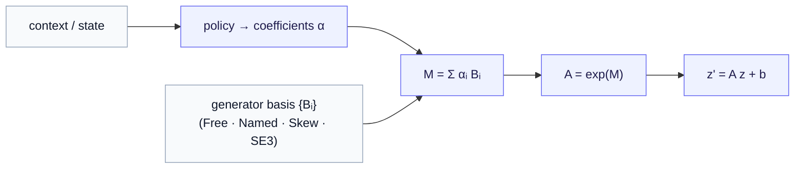

# Generator Bases and the Operator in Code

*The one design decision that sets everything — and the runnable module that turns this series into a forward pass.*

> **Prerequisite.** [Part 3 — Conditioning JEPA on actions](03-conditioning-jepa-on-actions.md), the [operator gallery](../action_operator/02-operator-gallery.md) (concrete generators), and [Part 1](01-state-and-latent-operators.md) (why $f_\theta$ is tractable). Keep the [notation reference](notation.md) open.

[Part 3](03-conditioning-jepa-on-actions.md) gave the conditioned operator $f_{\theta(c_t)}(z) = \exp(M_\theta) z + b_\theta$, with the generator built from a basis, $M_\theta = \sum_i \alpha_i B_i$, and the coefficients $\alpha = \theta$ emitted by the policy. It also flagged that *how structured* the operator is decides whether the surprise detector survives (the explain-away risk). Both threads converge on a single object: the **generator basis** $\{B_i\}$. This chapter shows what that basis looks like in practice, why it is the place you spend your inductive bias, and how the whole thing is a small, runnable PyTorch module — the same code serving both application poles by swapping one argument.

---

## 1. The generator is the design surface (a quick re-grounding)

From the [gallery](../action_operator/02-operator-gallery.md), recall *why* the operator is built as $\exp(M_\theta)$ rather than as a matrix $A_\theta$ directly: for **any** $M$, $\exp(M)$ is invertible; $\exp(0) = I$ gives a near-identity start; and $M$ lives in a flat vector space a network can emit gracefully, while $A$ lives on a curved manifold it cannot. So the policy emits $M$, and $\exp$ lifts it to the operator.

That leaves one question: *which* matrices is $M$ allowed to be? Rather than let the policy fill all $D^2$ entries freely, we fix a small **basis** of generators $\{B_1, \dots, B_m\}$ and let the policy emit only the coefficients:

$$
M_\theta = \sum_{i=1}^{m} \alpha_i B_i, \qquad \theta = (\alpha_1, \dots, \alpha_m).
$$

Now $\theta$ is a short vector, and — crucially — *the choice of $B_i$ decides what kind of operator $\exp(M_\theta)$ can be.* That is where the inductive bias lives, and it is the main design decision of the whole framework.

---

## 2. The four bases — the expressiveness ↔ structure dial

Four instantiations span the dial from "maximally free" to "rigidly structured." Each is a `GeneratorBasis` in code (next section); here is what each *means*.

| basis | $\{B_i\}$ concretely | $\exp(\sum \alpha_i B_i)$ guarantees | where it fits |
|---|---|---|---|
| **Free / $GL$** | $m$ learnable dense matrices, no constraint | invertible only | phenotyping default — the model discovers its own latent "modes of motion" |
| **Named** | one learnable matrix *per labeled intervention*: $B_{\text{sleep}}, B_{\text{stress}}, B_{\text{meds}}$ | invertible, **interpretable** | the illuminating phenotyping case (below) |
| **Skew / $SO(D)$** | skew-symmetric ($B^\top = -B$) | **orthogonal** — a norm-preserving rotation | circadian / cyclic latent dynamics, no blow-up |
| **$\mathfrak{se}(3)$** | the 6 fixed generators: 3 rotation + 3 translation | **rigid motion** | protein residue frames |

**The named-intervention basis is the one to sit with**, because it makes the formalism click into something operational. Assign *one generator per intervention type* and let the coefficient vector $\alpha$ **be the quantified intervention log itself**:

$$
M_{\theta(c_t)} = \underbrace{n_{\text{sleep}}}_{\text{hours slept}} B_{\text{sleep}} + \underbrace{n_{\text{stress}}}_{\text{stress index}} B_{\text{stress}} + \underbrace{n_{\text{meds}}}_{\{0,1\}} B_{\text{meds}} + \cdots
$$

Now $\alpha = c_t$ *directly* — no policy network needed in the simplest version. The $B_i$ are learned (what each intervention *does* to the latent), but the coefficients come straight from the context. Composition becomes bookkeeping: "a week" is $\exp(\sum_i (\text{week's totals})_i B_i)$, and the order-dependence of Part 3 is automatic. Best of all it is **interpretable**: inspecting the eigenvalues of the learned $B_{\text{sleep}}$ tells you *what kind of dynamics sleep induces* (a decay toward baseline? a rotation? a growth?). And recall the explain-away risk from Part 3 — a small, named basis is exactly the structural restraint that keeps the operator from laundering genuine change. The free basis sits at the opposite end: maximal expressiveness, the policy emits $\alpha$ from an MLP, but the per-intervention semantics are gone and the explain-away risk is higher. **$m$ is not just a capacity knob; it is load-bearing for the detector.**

---

## 3. Two domains, one code path

The reason the four bases share a table is that they share *code*. The behavioral pole (Free/Named, structure **learned**) and the protein pole (SE(3), structure **given** by physics) are the **same operator class with a different basis argument** — which is the payoff the whole corpus was built to demonstrate:



Swap `Bᵢ` from a free learnable set to the fixed $\mathfrak{se}(3)$ generators and the *same* forward pass produces a rigid 3D motion instead of a learned behavioral flow. "The phenotyping operator and the protein operator are one piece of code with a different algebra" stops being a slogan and becomes a constructor argument.

---

## 4. The operator in code

The module is [`src/ssllab/action_operator/context_operator.py`](https://github.com/pleiadian53/ssl-lab). Its heart is three lines: build $M$ from the basis and coefficients, exponentiate, apply.

```python
def generator(self, alpha):                  # M = Σ αᵢ Bᵢ
    B = self.basis()                         # (m, D, D)
    return torch.einsum("...m,mij->...ij", alpha, B)

def forward(self, z, c):                     # z' = exp(M) z + b(c)
    alpha, _ = self.coefficients(z, c)       # θ = α ~ π_ψ(z, c)
    A = torch.matrix_exp(self.generator(alpha))
    z_next = torch.matmul(A, z.unsqueeze(-1)).squeeze(-1)
    return z_next if self.bias_head is None else z_next + self.bias_head(c)
```

A few pieces are worth calling out, each tracing back to an idea in the series:

- **The basis is swappable.** `GeneratorBasis` has four subclasses — `FreeBasis`, `NamedBasis`, `SkewBasis`, `SE3Basis` — each returning its $\{B_i\}$ as an `(m, D, D)` tensor. `SkewBasis` returns $R - R^\top$ (always skew, so $\exp$ is a rotation); `SE3Basis` returns the 6 fixed $\mathfrak{se}(3)$ generators as a non-learnable buffer (the structure *is* the basis, not learned).
- **The policy splits two ways.** `MLPPolicy` emits $\alpha$ from $(z, c)$ with a **zero-initialized** head, so $\alpha = 0 \Rightarrow M = 0 \Rightarrow A = I$ — the operator starts as "do nothing" and training pushes it away from identity only as far as the data demands. `DirectInterventionPolicy` sets $\alpha = c$ (the named-intervention path of §2), so the quantified log *is* the coefficient vector.
- **The conditioned-JEPA loss is Part 3's single edit, verbatim** — latent L2 with the stop-gradient applied inside, plus an EMA helper:

```python
def conditioned_jepa_loss(operator, z_t, c_t, z_target):
    z_pred = operator(z_t, c_t)
    return ((z_pred - z_target.detach()) ** 2).sum(-1).mean()   # sg on the target
```

- **Two inspection methods make the series' claims observable.** `eigenvalues(z, c)` returns the eigenvalues of the *generator* $M$ (not $A$) — so a positive real part is the **decompensation flag** of Part 3, read directly. `energy(z, c)` returns $\lVert M \rVert_F^2$ — the least-action penalty, and the regularizer that fights explain-away by keeping the operator near identity unless the data demands otherwise.

---

## 5. The guarantees are verified, not asserted

The bases are not merely *labeled* with an operator class; they *provably* produce it, and the module's smoke test checks this numerically. The structural guarantees hold to floating-point tolerance:

- **Skew basis** → $A^\top A = I$ (orthogonality / norm preservation) to $\sim 10^{-7}$.
- **Named basis** → $\exp(7M) = (\exp M)^7$ to $\sim 10^{-6}$ — the flow/composition property of Part 3, confirmed: "a week" really is one clean matrix.
- **SE(3) basis** → $R^\top R = I$, $\det R = 1$, bottom row $[0,0,0,1]$ — a valid rigid transform.
- **Zero-init** → $f(z, c) = z$ at the start (near-identity), and the conditioned loss backpropagates into both policy and basis.

This is what it means for the expressiveness ↔ structure dial to be *real*: the guarantee you choose by picking a basis is the guarantee the math delivers.

---

## 6. What is deliberately left open

Two pieces are stubs in the module, because they branch on decisions outside its scope, and it would be dishonest to pretend otherwise:

- **The encoders $E_\xi / E_{\bar\xi}$.** Whether you build a research-validation artifact (predict clinical labels well) or an on-device product (real-time inference) pushes the encoder in different directions. The operator is agnostic to that choice; the module leaves it as an interface.
- **The reinforcement-learning attachment.** As Part 3 §6 stressed, the conditioned dynamics are learned by the *predictive* loss alone — no critic. The stochastic policy exposes `log_prob`/`entropy` for a later actor–critic loop, but only the reparameterized one-step path is wired, matching the "differentiable optimization suffices" stage. RL enters only when a control reward does.

> **Discussion — the open dial.** Where to sit on the basis dial is empirical. The named basis maximizes interpretability and detector safety (small, structured) but presumes you can *name and log* the interventions that matter; the free basis handles unknown dynamics but spends the explain-away safety margin and the per-intervention readout. A realistic system might use a *hybrid* — named generators for the logged interventions plus a small free residual for everything unmeasured — and tune the residual's size against how much the surprise signal degrades. That experiment is the natural next step beyond this series.

---

## Where this leaves us

The series closes here. We went from *what an action operator is* (the foundation) and *what a world model is* (Part 0), through the keystone that makes the operator tractable (Part 1), the temporal substrate it rides on (Part 2), the single edit that conditions it on actions (Part 3), and finally to the concrete bases and the runnable module (here) — where the behavioral and protein poles turn out to be one operator class with a different algebra, and every structural promise is checked in code.

- **The named basis in a real scenario:** [the worked example — a personal world model for diabetes](05-worked-example-diabetes.md), where $\alpha = c_t$ is literally Maya's daily log and the eigenvalues of each $B_i$ read out what insulin, carbs, exercise, and metformin each do.
- **Back to the start of the synthesis:** [Part 0 — What is a world model?](00-what-is-a-world-model.md).
- **The concrete operators by hand:** [A Gallery of Operators](../action_operator/02-operator-gallery.md).
- **The deep formalism (operator families, learning):** the [GRL project](https://github.com/pleiadian53/GRL).
