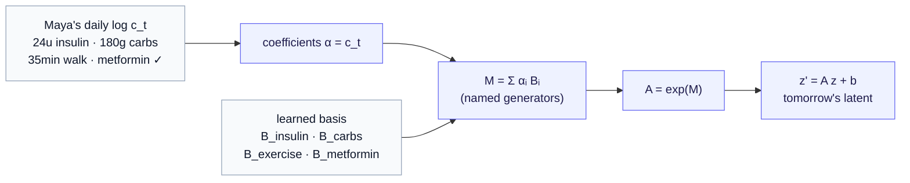
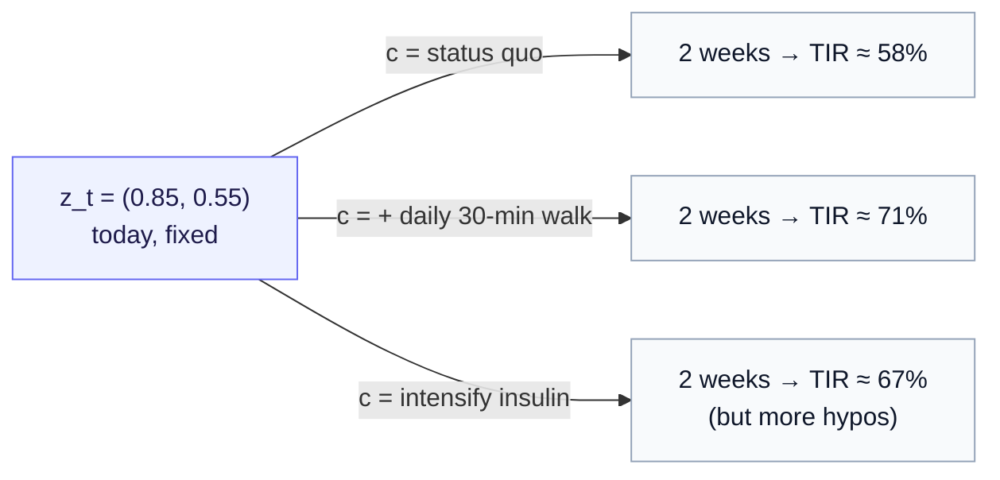

# A Worked Example: A Personal World Model for Diabetes Management

*One story, every symbol — the whole series, threaded through a single person's data.*

> **What this chapter is.** The [notation reference](notation.md) lists every symbol in this series in a table. A table is the right place to *look a symbol up*, but it is a poor place to *learn* one — a symbol means something only once you have watched it do a job. This chapter is that job. We take one coherent story — managing type 2 diabetes — and let it call each symbol into existence exactly when the story needs it. By the end, every entry in the notation table will have been earned by a concrete thing in one person's life. Read this after [Part 0](00-what-is-a-world-model.md) through [Part 4](04-generator-bases-and-the-operator-in-code.md); it assumes their ideas but re-introduces each one gently, from the angle of the example.

> **A caveat to read before anything else — this is illustrative.** Everything below uses **synthetic, illustrative data** and made-up numbers chosen to make the math legible, not a real patient. Real continuous-glucose and electronic-health-record (EHR) data are **protected health information (PHI)**: working with them means de-identification, consent or a waiver, an IRB, secure storage, and a great deal of care this tutorial does not depict. Nothing here is medical advice, and none of the rollouts below should be read as a real clinical prediction. The point is to make the *formalism* concrete — the person, "Maya," and her numbers are a teaching device.

---

## 1. Meet the person, and the streams that describe her

Maya has type 2 diabetes. Like a growing number of people managing a chronic metabolic condition, she is instrumented: a continuous glucose monitor (CGM) reports her blood sugar every five minutes, an insulin pen logs each dose, a phone app captures meals, a watch tracks steps and sleep, a scale logs weight. Underneath all of that sits her medical record — the diagnoses, prescriptions, and lab results that accumulate over years.

This is exactly the **digital-phenotyping** regime the series keeps returning to: an ocean of passive, multimodal signal against a trickle of sparse labels. The question this chapter answers is what it would mean to build, for Maya specifically, a *world model* — not a dashboard that shows where her glucose has been, but a model of how her metabolic state *evolves*, one she could roll forward and ask "what if?" of.

Start with the raw material. In the notation, **$x$** is a single raw observation and **$x_{\le t}$** is the whole window of history up to time $t$. For Maya, $x_{\le t}$ is the bundle of streams below — heterogeneous, sampled at wildly different rates, often missing:

| modality | what it is | rate | role in $x_{\le t}$ |
|---|---|---|---|
| **CGM glucose** | interstitial blood sugar (mg/dL) | every 5 min | the dense backbone signal |
| **Insulin** | units per dose, basal and bolus | per dose | a logged intervention |
| **Carbohydrates** | grams per meal | per meal | a logged intervention |
| **Steps / exercise** | activity minutes, intensity | per minute / per session | a logged intervention |
| **Sleep** | duration, staging | per night | context |
| **Weight** | kg | per weigh-in (sporadic) | slow-moving context |
| **Medical codes (EHR)** | diagnoses, prescriptions, labs as timestamped tokens | per clinical event (rare, irregular) | a sparse symbolic modality |

The last row deserves a closer look, because it is the one most people would not think to feed a glucose model.

### The EHR stream as one modality

A companion project, [`ehr-sequencing`](https://github.com/pleiadian53/ehr-sequencing), treats a patient's history the way a language model treats a document: each clinical event is a **timestamped medical code**, and the code vocabularies are the standard ones — SNOMED for diagnoses, RXNORM for drugs, LOINC for lab tests. A slice of Maya's coded record might read (this is the project's own example format, and — not coincidentally — its example is a diabetic trajectory):

```
2024-01-15:  [LOINC:4548-4, SNOMED:44054006, RXNORM:860975]
2024-06-15:  [LOINC:4548-4, LOINC:2339-0]
2024-12-15:  [SNOMED:44054006, RXNORM:860975]
```

Read it back: `LOINC:4548-4` is an **HbA1c** lab (the three-month average-glucose test), `SNOMED:44054006` is **type 2 diabetes mellitus** itself, `RXNORM:860975` is a **glucose-lowering medication** order, `LOINC:2339-0` is a **fasting glucose** result. So this stream is not redundant with the CGM — it carries *what the system already knows about her disease*: when it was diagnosed, every drug ever started or stopped, every quarterly lab. It is sparse and irregular (events arrive when she sees a clinician, not on a clock), and it is symbolic rather than numeric. Folding it in as **one modality among the dense streams** is precisely the irregular, missing-not-at-random challenge the [multimodal Time-Series JEPA chapter](../time_series_jepa/02-multimodal-temporal-channels.md) was built to handle: a per-modality encoder turns the code sequence into a vector, and it is fused with the rest into a single latent.

```mermaid
flowchart LR
    CGM["CGM glucose<br/>(5-min)"] --> ENC["per-modality<br/>encoders → fuse"]
    INS["insulin"] --> ENC
    CARB["carbs"] --> ENC
    ACT["steps / sleep"] --> ENC
    WT["weight"] --> ENC
    EHR["medical codes<br/>(SNOMED · RXNORM · LOINC)"] --> ENC
    ENC --> Z["z_t — latent metabolic state"]
    classDef accent fill:#eef2ff,stroke:#6366f1,color:#1e1b4b;
    classDef io fill:#f8fafc,stroke:#94a3b8,color:#0f172a;
    class ENC,Z accent;
    class CGM,INS,CARB,ACT,WT,EHR io;
```



---

## 2. From streams to a state: the encoder and the latent

A world model needs a **state** to evolve. The raw window $x_{\le t}$ is not it — it is enormous, noisy, and most of it (the exact shape of every glucose wiggle) is nuisance. What we want is a compact summary that keeps only what is *predictive* of where Maya is headed.

That summary is the **latent**. The **encoder $E$** — a neural network, written $E_\xi$ when we want to name its trainable weights $\xi$ (Greek *xi*) — maps the window to a vector:

$$
z_t = E_\xi(x_{\le t}).
$$

Here **$z_t$** is Maya's **latent metabolic state** at time $t$: a point in latent space $\mathcal{Z}$ that captures her *metabolic situation* — roughly how elevated and how stable her glucose system is right now — without committing to any single raw number. It is the encoded history, not a reading off the CGM.

There is a second copy of the encoder, the **target encoder $E_{\bar\xi}$** (read "E-xi-bar"). It is a slow **exponential moving average** (EMA) of the online encoder, updated as $\bar\xi \leftarrow \tau\bar\xi + (1-\tau)\xi$ with **$\tau$** (tau) close to 1, say $0.999$ — so the target drifts slowly and provides a stable goalpost. When we train, we will compare predictions against $E_{\bar\xi}$'s reading of what actually came next, and we will apply **stop-gradient $\mathrm{sg}$** to it (treat it as a fixed constant, no backprop into the target). All of this is standard JEPA plumbing, recalled here only so the symbols have homes; interested readers are encouraged to go through the [Time-Series JEPA series](../time_series_jepa/index.md), where it is built in full.

To make the latent *visualizable*, we will, throughout this chapter, read off a didactic **two-dimensional slice** of $z_t$ — the real latent is high-dimensional, but two interpretable directions carry the story. We **scale each axis to roughly $[0, 1]$**, where $0$ is Maya's own healthy baseline and $1$ is the high end of her typical range:

- **axis 1 — elevation:** how far Maya's glucose system sits *above her personal target* — $0$ = at target, $1$ = the top of her usual range.
- **axis 2 — instability:** how *variable / reactive* her glucose is — $0$ = steady, $1$ = her wildest swings.

On that scale, "$z_t = (0.8,\ 0.6)$" reads as "**well above target and fairly unstable**" — $0.8$ is high on the elevation axis, $0.6$ is past the midpoint on instability. These two numbers are a teaching readout, not the whole latent — but everything below works the same way in full dimension.

> **Map versus world model, in Maya's terms.** A plain encoder gives a *map*: "today looks like one of Maya's rough mid-week days." That is genuinely useful and entirely passive. A *world model* adds the missing half — *where the state goes next, and — the counterfactual question — where it would go if she did something different.* The rest of this chapter is how that second sentence becomes a computation.

---

## 3. Two operators: the physiology you mean and the matrix you build

Something happens to Maya overnight — she sleeps, her liver releases glucose, her last dose of medication wears off — and by morning her state has moved. Call that transformation an **action operator**. The keystone of [Part 1](01-state-and-latent-operators.md) is that this single idea splits into **two distinct objects**, and keeping them apart is what makes everything tractable.

- The **state operator $\hat O_\theta$** (read "O-hat-theta") acts on Maya's *true physiological state* $s$ — her actual metabolism, every hormone and cell — and turns it into its successor, $s' = \hat O_\theta(s)$. This is the *physically real* transformation. It is also **completely inaccessible**: nobody can write down the function that maps Maya's full physiology through a night, and you never observe $s$ directly — only the sensor streams it throws off. The subscript **$\theta$** names *which* operator (which night, under which conditions); the hat marks it as an **operator** — a function acting on a space, not a number. Note that this is the physics convention, as in $\hat H$ for a Hamiltonian — *not* the statistics "estimate" hat of $\hat\theta$. $\hat O_\theta$ is the *true* transformation, intractable though it is; the approximate, *learned* stand-in we actually build carries no hat — it is the latent operator $f_\theta$, next.)
- The **latent operator $f_\theta$** acts on the *latent* instead: $z' = f_\theta(z)$. This is the object you actually **compute with** — a concrete, simple map on the latent vector, the default form being

$$
f_\theta(z) = A_\theta z + b_\theta, \qquad A_\theta = \exp(M_\theta),
$$

a matrix $A_\theta$ you can multiply and compose, plus an optional **affine bias $b_\theta$** (read "b-theta") — a constant push in latent space, the natural home for Maya's personal baseline.

> **The distinction, in one line.** $\hat O_\theta$ is the physiology you *mean*; $f_\theta$ is the matrix you *build*. Same transformation, two spaces — and you only ever touch the second.

What links them is the encoder, and the link is exact enough to draw. Push Maya's overnight transition through $E$ from both directions and demand the two paths agree — the **commuting square**:

$$
\begin{array}{ccc}
s & \xrightarrow{\ \hat O_\theta\ } & s' \\[4pt]
{\scriptstyle E}\big\downarrow & & \big\downarrow{\scriptstyle E} \\[4pt]
z & \xrightarrow{\ f_\theta\ } & z'
\end{array}
\qquad\Longleftrightarrow\qquad
E\big(\hat O_\theta(s)\big) = f_\theta\big(E(s)\big).
$$

In words, there are two routes from tonight's real state $s$ (top-left) to tomorrow's latent $z'$ (bottom-right), and the square's content is that they must agree. The **live-it-then-read-it route** (across the top, then down the right): let the night actually happen, $s \to s'$, and only then encode the morning, $z' = E(s')$ — the true answer, available only *after* tomorrow arrives. The **read-it-then-predict route** (down the left, then across the bottom): encode tonight now, $z = E(s)$, then apply the latent operator, $\hat z' = f_\theta(z)$ — a matrix multiply you can do *tonight*, before the night happens. When the square commutes, those two land in the same place: the cheap latent prediction equals the true encoded outcome, so $f_\theta$ is a faithful **shadow** of the real overnight physiology — and we make it commute by training, penalizing the gap between the two routes (push $f_\theta(E(s))$ toward $E(s')$ on every observed night). The reason we can get away with never naming the intractable $\hat O_\theta$ is the JEPA payoff from Part 1: there is no decoder, no $E^{-1}$, nothing but encoded quantities compared against encoded quantities. Maya's true metabolism stays implicit, present only through the data it produced.

This is also where diabetes sits on the **expressiveness ↔ structure dial** from Part 1. Maya is at the **learned pole**: nobody handed us the physics of "what a 35-minute walk does to a metabolic latent," so the data must teach us $f_\theta$. (The opposite pole — proteins, where SE(3) rigid-motion structure is *given* by physics — is the same machinery with the basis fixed instead of learned. Here, it is all learned.)

---

## 4. The named basis: Maya's intervention log *is* the operator

Now we build $M_\theta$, the **flow generator** — the matrix inside the exponential. From [Part 4](04-generator-bases-and-the-operator-in-code.md): rather than let a network fill all $D^2$ entries of $M_\theta$ freely, we fix a small **generator basis** $\{B_i\}$ — a handful of matrices that span the *allowed* directions of motion — and let the operator be a weighted sum of them:

$$
M_\theta = \sum_{i} \alpha_i B_i, \qquad \theta = \alpha = (\alpha_1, \alpha_2, \dots).
$$

The **coefficient vector $\alpha$** (which *is* the operator parameter $\theta$) says "how much of each generator." And here is the move that makes diabetes the cleanest possible illustration of the **named-intervention basis**: assign **one generator per logged intervention type**, and let the coefficients be *Maya's daily log itself.*

$$
M_{\theta(c_t)} =
\underbrace{n_{\text{insulin}}}_{\text{units}} B_{\text{insulin}}
+ \underbrace{n_{\text{carbs}}}_{\text{grams}/100} B_{\text{carbs}}
+ \underbrace{n_{\text{exercise}}}_{\text{min}/30} B_{\text{exercise}}
+ \underbrace{n_{\text{metformin}}}_{\{0,1\}} B_{\text{metformin}}.
$$

The symbol **$c_t$** is the **context / intervention** at time $t$ — the *known, recorded* causes of change. For Maya on a given day, $c_t$ is literally a row in her log: *24 units of insulin, 180 g of carbs, a 35-minute walk, metformin taken.* The coefficients $\alpha$ are read straight off that row (lightly rescaled so the numbers sit near 1). No separate network is needed in this simplest version — **the log is the configuration.** Each $B_i$ is *learned* (the model discovers what each intervention does to the latent), but the *amounts* come directly from $c_t$.

What does each learned generator look like? Its **eigenvalues** tell the whole story (Part 1's Koopman view: $M$ is the velocity field, its eigenvalues are growth/decay rates plus rotation). On our two-axis readout slice, suppose training settles on:

| generator | learned eigenvalues (illustrative) | what it *does* to the latent |
|---|---|---|
| $B_{\text{metformin}}$ | $-0.12,\ -0.20$ | both axes **decay toward target** — pulls elevation and instability down. A healthy, mean-reverting drug. |
| $B_{\text{exercise}}$ | $-0.15,\ -0.10$ | similar inward pull (better insulin sensitivity), strongest on elevation. |
| $B_{\text{insulin}}$ | $-0.30,\ -0.05$ | a sharp downward pull on elevation — fast glucose-lowering. |
| $B_{\text{carbs}}$ | $+0.18,\ +0.05$ | a **push outward** — elevation rises, instability rises. The one destabilizing generator. |

(Negative real eigenvalue = that direction shrinks each step, toward baseline; positive = it grows. We will lean hard on this sign in §7.)

Now assemble a single ordinary day. Maya eats (carbs push up), doses insulin and takes metformin (pull down), walks (pull down). The generators **add**:

$$
M_{\theta(c_t)} = 0.24 B_{\text{insulin}} + 1.8 B_{\text{carbs}} + 1.17 B_{\text{exercise}} + 1 \cdot B_{\text{metformin}}.
$$

On a balanced day the downward pulls roughly offset the carbohydrate push, the net $M$ comes out close to zero, and $A_\theta = \exp(M_\theta) \approx I$ — *do almost nothing*, the state holds steady. That near-identity is exactly the sane default the $\exp$ parameterization gives for free ($\exp(0) = I$): Maya's well-managed day is a small wobble around her baseline $b_\theta$, not a lurch.



---

## 5. Rolling forward: a day, then two weeks

A one-step operator becomes a *world model* the moment you **iterate** it — predict tomorrow's latent, feed it back in, predict the day after. For a fixed daily operator, the composition collapses to a single matrix (Part 2's rollout, Part 1's flow property):

$$
f_\theta^{k}(z_t) = \exp(M_\theta)^k z_t = \exp(k M_\theta) z_t.
$$

So "two weeks of the same regimen" is not fourteen chained network calls — it is one clean computation, $\exp(14 M_\theta)$. If Maya's daily operator is a gentle inward pull (net eigenvalue about $-0.05$ on the elevation axis after the day's interventions net out), then over fourteen days that axis contracts by $e^{14\times(-0.05)} = e^{-0.7} \approx 0.50$ — her elevation halves, drifting halfway from wherever she is today back toward her target $b_\theta$. That is the world model *imagining a fortnight* without living through it.

This is also where the **anchoring caveat** from Part 2 bites, and it matters clinically. During *training*, every predicted step is checked against a real encoded observation ($E_{\bar\xi}$ of what actually happened next), so the predictor stays honest. During a genuine *rollout into the future* — the two weeks Maya has not lived yet — that anchor is gone: each step feeds the operator its own output, and small errors compound. A fortnight-ahead glucose trajectory is a *projection*, not a measurement, and the further out it runs the more it should be trusted as a direction rather than a number.

---

## 6. The headline: counterfactual rollout — "what should Maya do?"

Everything so far still only predicts *one* future — whatever the logged regimen implies. The world model earns its name when we **hold today fixed, swap the intervention, and re-roll.** Because the action lives in $c_t$, and $c_t$ sets the coefficients of $f_{\theta(c_t)}$, we can simply substitute a *different* $c$ and run the same rollout again.

Maya and her clinician are weighing three plans for the next two weeks. Fix her current latent $z_t = (0.85,\ 0.55)$ — elevated, moderately unstable — and roll each forward:

$$
z_{t+14}^{(\text{plan})} = f_{\theta(c_{\text{plan}})}^{14}(z_t),
\qquad \text{plan} \in \{\text{status quo},\ \text{add exercise},\ \text{intensify insulin}\}.
$$



To make the latent endpoints legible, read them out as **time-in-range** (TIR — the fraction of the day glucose sits in the healthy 70–180 mg/dL band, the standard CGM outcome) plus a hypoglycemia-risk flag:

- **Status quo** — the carbohydrate push and the existing pulls stay balanced; elevation barely moves; TIR lands around **58%**.
- **Add a daily 30-minute walk** — an extra $1.0 B_{\text{exercise}}$ each day tilts the net operator inward; elevation contracts toward target; TIR climbs to about **71%**, with no added hypo risk.
- **Intensify insulin** — a larger $B_{\text{insulin}}$ pull lowers average glucose (TIR around **67%**) but, because $B_{\text{insulin}}$ pulls *hard* on the elevation axis, the rollout also dips below the low threshold more often — the model flags **elevated hypoglycemia risk.**

That comparison — three numbers Maya could not have read off any dashboard, because a dashboard only shows the past — is the difference between a passive monitor and an *actionable* system. It is precisely what a bare predictor cannot do: with no input slot for the action, there is nothing to vary.

> **The honest caveat — do not let the chart oversell it.** These operators were learned from *observational* streams, so they give **associational** dynamics, not causal ones: $f_{\theta(c)}$ is "the dynamics that tend to *accompany* $c$ in Maya's history," not "the dynamics $c$ would *cause* if newly imposed." Maybe Maya only ever walked on days she already felt well. Genuine counterfactual validity needs interventional data or causal assumptions defended separately. Treat the rollout as "dynamics conditioned on $c$," label it as decision *support*, and keep the discipline even when the chart is persuasive. (This is the **learned pole's** standing tax, named in Part 1 and Part 3.)

And composition is now algebra, not guesswork. "Two weeks of walking" is $\exp(14 M_{\text{walk}})$, one matrix. And **order matters, as a feature**: starting metformin *then* ramping exercise lands at a different latent than the reverse, with the gap governed by the commutator $[M_1, M_2] = M_1 M_2 - M_2 M_1$ (Baker–Campbell–Hausdorff) — a real clinical phenomenon (sequencing of therapy) that the bare $\Delta t$ predictor, with no operators to compose, cannot represent at all.

---

## 7. Surprise, sharpened: catching decompensation the log can't explain

The second payoff of conditioning is a **cleaner surprise signal**. Define the residual between what the model predicted and what the target encoder actually saw:

$$
\mathcal{L} = \big\lVert f_{\theta(c_t)}(z_t) - \mathrm{sg}\big(E_{\bar\xi}(x_{t+1})\big) \big\rVert^2,
$$

which is the squared latent distance $\lVert v \rVert^2$ between prediction and reality — the same conditioned-JEPA loss from Part 3, with the stop-gradient on the target. The crucial shift: because $f_{\theta(c_t)}$ already *explains the logged interventions*, this residual no longer mixes "Maya ate a big dinner" (ordinary, logged) with "something is genuinely wrong." It measures **only the change her known actions fail to account for.**

So "surprise" stops meaning *anything I didn't predict* and starts meaning *deterioration not attributable to any logged intervention* — and only the second is clinically interesting. A glucose spike right after a logged 120 g meal is fully explained, residual near zero. A slow upward drift in elevation on **unchanged diet, insulin, and exercise** is a large residual against Maya's own baseline distribution of residuals — and that is the signal worth a clinician's attention.

There is an even sharper, *model-level* read available, because the operator is $\exp(M_{\theta(c_t)})$ and we can inspect the **eigenvalues of its generator** as the months pass. Recall from §4 that Maya's healthy generators all had **negative** real-part eigenvalues — perturbations decay back toward target. The flag is when that sign flips:

$$
\mathrm{Re}(\lambda_i) > 0 \quad\text{in any mode} \quad\Longrightarrow\quad \text{that direction now amplifies.}
$$

Concretely: suppose that over six months, *with her regimen unchanged*, the elevation-axis eigenvalue of Maya's effective daily operator drifts from $-0.05$ to $+0.04$. Then $e^{+0.04} \approx 1.04 > 1$: each day her elevation grows by 4% instead of shrinking, a slow runaway the logged interventions no longer counter. That is a principled, inspectable **decompensation flag** — the model's own read that Maya's metabolic dynamics are losing stability (progressive insulin resistance, beta-cell decline — the kind of thing no single intervention log captures). A vanilla predictor has no operator whose spectrum you could examine; here the warning is a number you can watch.

> **The structural risk, stated honestly.** Conditioning is double-edged. If the basis is *too expressive*, the operator can absorb that genuine decline into its parameters — "explain it away" as some intervention effect — and **flatten the very surprise signal you built it to raise.** The defense is the named basis itself: keep $\Theta$ (the space of operator parameters) small and *named*, a few generators tied to real logged interventions, so the operator can explain *insulin and carbs and exercise* but lacks the capacity to launder unexplained deterioration. The **energy penalty** $E(\hat O) = \lVert M_\theta \rVert_F^2$ (the squared Frobenius norm — sum of squared entries), weighted by **$\lambda$**, pulls the same direction: it keeps the operator near identity unless the data truly demand motion, a least-action prior against over-explaining. Where exactly to sit on the expressiveness-versus-structure dial is empirical and unsolved — present the trade-off, do not pretend there is a universal setting.

---

## 8. The policy, and the rest of the notation

We promised the daily log could *be* the coefficients, $\alpha = c_t$ — and in the simplest version it is. But the general object is a **policy $\pi_\psi$** (read "pi-psi"), a network with weights $\psi$ that reads Maya's current state and context and emits the operator parameters:

$$
\theta \sim \pi_\psi(z_t, c_t).
$$

Why allow a policy at all, when the log already gives $\alpha$? Because real interventions interact with *state*: 30 g of carbs do different things to Maya when she is already high and unstable than when she is at target and calm. A policy lets the emitted $\theta$ depend on $z_t$, not just on $c_t$ — the named-log path is the special case where $\pi_\psi$ ignores $z_t$ and copies $c_t$ straight through.

A stochastic policy does not emit a single $\theta$ but a *distribution* over them — a point in **$\Delta(\Theta)$**, the set of probability distributions over the operator-parameter space. The picture to hold: a single distribution is itself a single point (a Gaussian is pinned by its mean and spread, so "one bell curve" is one point with two coordinates), and $\pi_\psi$ is a *map from latent space into that space of distributions* — as Maya's state moves, the operator the policy favors slides with it. A *deterministic* policy emits one point of $\Theta$ outright; that is the $\alpha = c_t$ case.

For completeness, two symbols from the notation table that the story has been quietly standing in for. Vanilla Time-Series JEPA had a **predictor $g_\phi$** whose **query $q_{\Delta t}$** carried only the time offset $\Delta t$ — *how far ahead*, never *what acted*. Everything in this chapter is the single edit that replaces that blind query with $f_{\theta(c_t)}$: the same predictor, now told what Maya did. That is the entire move, viewed one last time: $g_\phi(z_t, q_{\Delta t}) \longrightarrow f_{\theta(c_t)}(z_t)$.

---

## 9. The whole notation, earned

Every symbol in the [reference](notation.md) has now done a job in Maya's story. Collected in one place:

| symbol | in Maya's world model |
|---|---|
| $x_{\le t}$ | her window of CGM, insulin, carbs, steps, sleep, weight, and medical-code streams |
| $s$ | her true metabolic physiology — real, inaccessible |
| $E_\xi,\ E_{\bar\xi},\ \tau,\ \mathrm{sg}$ | the encoder, its slow EMA target ($\tau \approx 0.999$), and the stop-gradient on that target |
| $z_t$ | her latent metabolic state (read out as elevation + instability) |
| $\hat O_\theta$ | the real overnight/daily transformation of her physiology |
| $f_\theta(z) = A_\theta z + b_\theta$ | the latent operator we compute; $b_\theta$ = her personal baseline |
| $B_i$ | one learned generator per intervention: $B_{\text{insulin}}, B_{\text{carbs}}, B_{\text{exercise}}, B_{\text{metformin}}$ |
| $\alpha = \theta$ | her quantified daily log — the coefficients themselves |
| $M_\theta = \sum_i \alpha_i B_i$ | the day's net generator |
| $A_\theta = \exp(M_\theta)$ | the day's operator; $\exp(k M_\theta)$ = a $k$-day rollout |
| $c_t$ | the logged intervention row at time $t$ |
| $\pi_\psi,\ \Delta(\Theta),\ \Theta$ | the policy emitting $\theta$ (here, $\alpha = c_t$), over the space of operator parameters |
| $g_\phi,\ q_{\Delta t}$ | the vanilla predictor and its when-only query — what conditioning replaces |
| $\mathcal{L},\ \lVert v\rVert^2$ | the conditioned latent-prediction loss = the surprise residual |
| $\mathrm{Re}(\lambda_i) > 0$ | the decompensation flag — her dynamics turning destabilizing |
| $E(\hat O) = \lVert M_\theta\rVert_F^2,\ \lambda$ | the least-action energy penalty keeping the operator honest |

> **Recap, and why the story was the lesson.** A *map* would have told Maya where her glucose has been. The *world model* tells her where she is heading (rollout, §5), where she would head under each plan she is weighing (counterfactual conditioning, §6), and when her own metabolism is quietly destabilizing in a way no logged action explains (sharpened surprise and the eigenvalue flag, §7) — all from the single edit of letting the operator see *what acted*, trained by the unchanged self-supervised loss, kept honest by a small named basis. Every symbol you would otherwise have memorized from a table is now attached to something real in one person's life. That attachment is the point: the table is the reference, the story is the lesson.

---

## Where to go from here

- **The concepts behind each move:** [Part 0 — What is a world model?](00-what-is-a-world-model.md) (map vs. world model), [Part 1 — State and latent operators](01-state-and-latent-operators.md) (the two operators and the commuting square), [Part 2 — JEPA as a temporal world model](02-jepa-as-a-temporal-world-model.md) (rollout, anchoring), [Part 3 — Conditioning JEPA on actions](03-conditioning-jepa-on-actions.md) (the single edit, counterfactuals, surprise), [Part 4 — Generator bases and the operator in code](04-generator-bases-and-the-operator-in-code.md) (the named basis, runnable module).
- **Every symbol, as a table:** the [notation reference](notation.md).
- **The EHR modality, in depth:** the companion [`ehr-sequencing`](https://github.com/pleiadian53/ehr-sequencing) project — medical codes as a temporal language. It is a separate effort, not part of this repo, but its representation of coded patient histories is exactly the kind of temporal modality an operator world model can reuse as one input stream.

*Series home: [Operator World Models](index.md).*
