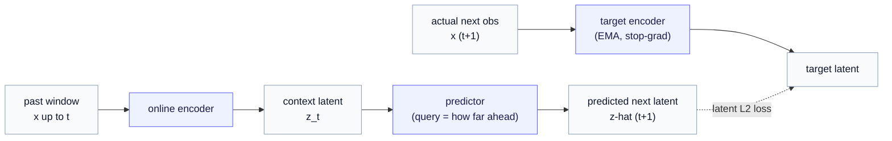

# From I-JEPA to Time-Series JEPA

*Turn "predict a hidden patch of an image" into "predict the next stretch of a time series" — and watch a predictor become a model of dynamics.*

> **Prerequisite.** A passing familiarity with self-supervised learning and the original image JEPA. We refresh both below in a paragraph; for the full encoder story see the [JEPA encoder chapter](../generative_jepa/01-the-jepa-encoder.md). No action-operator or world-model background is needed here. New to a symbol? Keep the [notation reference](notation.md) open.

The plan for this chapter: first a quick refresher on what image JEPA does, then the single substitution that turns it temporal, then the four moving parts and the forward pass — all carried by one running example you can picture. By the end you will have a model that predicts the future of a signal and, as a bonus, a built-in "this looks off" detector. We save the one thing it *can't* do for Part 3.

---

## 1. A refresher: what I-JEPA actually does

Self-supervised learning runs on a trick: hide part of the data, then train a model to recover it. Because *you* did the hiding, you already know the answer — no human labels needed.

Image JEPA (I-JEPA) makes one tasteful choice about *what* to recover. Rather than repaint the missing pixels, it predicts their **embedding** — the compact vector that captures the region's *meaning* (what is there, and how it relates to the rest of the image), not its surface appearance (the exact pixel values, texture, lighting). That distinction is the whole point: the precise speckle of a patch of fur is near-unpredictable noise and not worth a model's capacity, whereas "a dog's ear here, continuing the edge from the visible part" is both predictable from the surrounding context *and* what we actually want the model to understand. Concretely, I-JEPA splits a picture into a **context** (some visible patches) and a **target** (some hidden patches), and three actors do the work:

- an **encoder** turns the visible context into a latent vector;
- a **predictor** guesses the latent of the hidden target, told only *which region* to aim at;
- a **target encoder** — a slow-moving copy of the encoder — produces the "true" latent of the hidden region to compare against.

The training signal is simply the distance between the guess and the truth, *in latent space*. Why predict meaning instead of pixels? Because most pixels are unpredictable surface detail (the exact speckle of grass), and forcing a model to nail them wastes its capacity on noise. Predicting the embedding keeps the model focused on structure that's actually there to be predicted.

> **Hold onto three actors:** an encoder, a predictor told *where* to look, and a slow target encoder it's scored against. Time-Series JEPA keeps all three — it only changes what "where" means.

---

## 2. The one substitution: space becomes time

I-JEPA's "which region to predict" is a location *in space* — a patch over here, a patch over there. **Time-Series JEPA makes one substitution: the location becomes a point in *time*.** The context is the *past*; the target is the *future*.

> *"Traveling through space takes time; traveling through time creates space."*

The second clause is the surprising one, and it names the move we just made: I-JEPA travels in *space* (it hops to a hidden patch), while Time-Series JEPA travels in *time* (it steps to the next moment). That "traveling in time *creates* space" is a promise the corpus keeps later — once we roll the model forward to **generate**, the trajectory itself becomes the structure built.

That is the entire idea. Keep the encoder, keep the predictor, keep the slow target encoder; only reinterpret "the part we hide" as "what happens next."

And yet that small change transforms what the predictor *is*. Filling in a masked patch is completing a static picture. Predicting the next moment is **advancing the state through time** — taking "where the system is now" to "where it goes next." Quietly, the predictor has become a model of *dynamics*. That is the seed the rest of the corpus grows from, but we don't need any of it yet; we just need to see the machine work.

---

## 3. The running example: a person's weekly rhythm

Let us make this concrete and keep it concrete for the whole chapter.

Imagine tracking one number for a person each day — call it a daily **behavioral index** (loosely, "how active and engaged the day was"). Over a year it traces a familiar shape: a gentle **weekly rhythm**, lifting toward the weekend, dipping midweek, plus day-to-day noise. (In reality this would be many signals at once — heart rate, sleep, phone use — which is Part 2. One number is enough to build intuition.)

Time-Series JEPA's job, in this example, is: *given the past week or two, predict tomorrow's behavioral state — in latent space.*

Here is the picture worth carrying. The encoder reads the recent past and places it as a point $z_t$ in a small latent space. For a signal that mainly *cycles*, the most natural latent is a **phase on a circle** — *where in the weekly cycle are we right now?* As real days pass, that point walks steadily around the circle, once per week.

If you read the [operator gallery](../action_operator/02-operator-gallery.md), you have already met the operator that does this walking: the **rotation** — "a cycle that neither grows nor fades." Advancing one day around a 7-day cycle is a rotation of the phase by $360^\circ / 7 \approx 51.4^\circ$. Predicting tomorrow's latent, for this person, is largely *rotate today's phase by one day's worth of angle.* We will use exactly that in a moment.

---

## 4. The four pieces

Time-Series JEPA is the three I-JEPA actors plus a loss, now reading a time axis. Take them one at a time.

**The online encoder $E_\xi$.** It reads the recent past and produces the current latent: $z_t = E_\xi(x_{\le t})$, where $x_{\le t}$ is the window of signal up to time $t$ and $\xi$ (Greek *xi*) are its trainable weights. In the example, $E_\xi$ looks at the last week or two and reports the phase point $z_t$.

**The target encoder $E_{\bar\xi}$.** A second encoder whose weights $\bar\xi$ are a slow **exponential moving average** of the online weights: $\bar\xi \leftarrow \tau\bar\xi + (1-\tau)\xi$, with $\tau$ near 1 (say $0.99$). It produces the *targets* we score against, and — importantly — no gradient flows into it. Why bother with a second, lagging copy? Because if the target moved in lockstep with the predictor, the model could "win" by collapsing every input to the same constant vector (predict a constant, hit a constant — zero loss, zero learning). The slow copy is a **moving goalpost** the predictor can chase but never trivially catch, and that is what forces it to learn real structure.

**The predictor $g_\phi$.** Weights $\phi$ (Greek *phi*). It takes the context latent plus a **query** $q$ that says *what to predict* — here, *how far ahead* — and returns the predicted future latent. In the example, $g_\phi$ takes today's phase point and the instruction "one day ahead" and returns the predicted phase point for tomorrow.

**The loss.** The squared distance, in latent space, between the prediction and the (frozen) target. No pixels, no raw-signal reconstruction anywhere — exactly I-JEPA's discipline, now across time.

---

## 5. The forward pass

Put the four pieces in a line: encode the past, predict the next latent, and score it against the target encoder's reading of what actually happened next.

In symbols, where $\hat z_{t+1}$ is the predicted next latent, $q_{\Delta t}$ is the query carrying the time offset $\Delta t$, and $\mathrm{sg}$ means stop-gradient (treat the target as a fixed constant):

$$
z_t = E_\xi(x_{\le t}), \qquad \hat z_{t+1} = g_\phi(z_t, q_{\Delta t}), \qquad \mathcal{L} = \big\lVert \hat z_{t+1} - \mathrm{sg}(E_{\bar\xi}(x_{t+1})) \big\rVert^2.
$$

**Now walk the example through it, with numbers.** Suppose today the encoder reports a phase of $100^\circ$ on the weekly circle, i.e. $z_t = (\cos 100^\circ, \sin 100^\circ)$. The predictor has learned that one day advances the phase by about $51.4^\circ$, so it rotates:

$$
\hat z_{t+1} = R(51.4^\circ) z_t \quad\Rightarrow\quad \text{phase } 100^\circ \rightarrow 151.4^\circ.
$$

Tomorrow arrives. The target encoder reads the real next window and reports a phase of, say, $149^\circ$ — close, off only by the day's noise. The loss is the small gap between $151.4^\circ$ and $149^\circ$. Train on a year of such days and the predictor settles into "advance the phase by one day," because that is the rule that makes tomorrow predictable from today.

> **What we have built.** A model that, from the recent past, predicts the next latent — and a **residual** (the size of that gap) that is small when the person follows their usual rhythm. A large residual means "today did not look like the rhythm predicted." Hold that thought: that residual is a *surprise* signal, and it will matter a great deal later.

---

## 6. The query is a dial, not a constant

It is tempting to fix the query at "one day ahead" and forget it. Don't — the query slot is the most useful knob in the whole setup. Its coordinate is the offset $\Delta t$:

- Fix $\Delta t = 1$ and the predictor is a one-step-ahead forecaster (tomorrow).
- Let $\Delta t$ vary and the *same* predictor becomes **multi-horizon**: ask for $\Delta t = 7$ and it predicts a week out.

In the rhythm example this is satisfying: predicting a week ahead is rotating the phase by $7 \times 51.4^\circ = 360^\circ$ — a full turn, landing right back where you started, which is exactly what "same day next week" should mean. (Readers of the gallery will recognize this as composing the rotation operator with itself seven times — clean precisely because the operator has structure. We will lean on that hard once the predictor *becomes* such an operator, later in the corpus.)

---

## 7. I-JEPA and Time-Series JEPA, side by side

Everything we changed, in one view — and notice how little it is:

| I-JEPA (images) | Time-Series JEPA (time series) |
|---|---|
| context = visible patches | context = the past window $x_{\le t}$ |
| target = masked patches | target = the future observation $x_{t+1}$ |
| query = *spatial* position of the target | query = *temporal* offset $\Delta t$ |
| predictor: context + position → target latent | predictor: $z_t$ + offset → $\hat z_{t+1}$ |
| score vs. slow target encoder, in latent space | identical |

The architecture is the same machine; only the meaning of "where" moved from space to time. That economy is the point — Time-Series JEPA inherits everything that makes JEPA work and asks almost nothing new of it.

---

## What we covered, and where we go next

We took image JEPA's mask-and-predict and pointed it at time, met the four pieces (online encoder, slow target encoder, predictor, latent loss), watched a single forward pass turn "the recent past" into "the predicted next latent," and saw a surprise residual fall out for free. The running rhythm example gave each idea something to stand on — and quietly reused the gallery's rotation operator as the latent dynamics of a cycle.

Two threads are now open, and the next two chapters pick them up:

- **Real signals are many and messy.** One clean daily number was a teaching fiction. A real person streams heart rate, sleep, motion, and phone activity *at once*, at different rates, with gaps. Handling that is [Part 2 — Multimodal temporal channels](02-multimodal-temporal-channels.md) *(coming next)*.
- **The predictor knows *when*, not *what acted*.** Our predictor advances the rhythm by a day — but it never learns *why* a day turned out as it did. When the person sleeps badly and tomorrow drops unexpectedly, the residual spikes — but the model cannot tell "something is wrong" from "an ordinary thing happened that I wasn't told about." That single, structural limit is [Part 3 — The limits of pure Time-Series JEPA](03-the-limits-of-pure-tjepa.md) *(coming next)*, and it is the doorway to the rest of the corpus.
