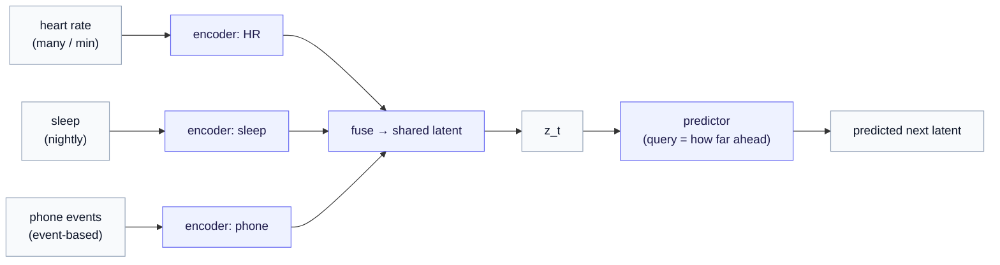

# Multimodal Temporal Channels

*One clean daily number was a teaching fiction. A real person streams many signals at once, on different clocks, with gaps — and handling that mess is where Time-Series JEPA earns its keep.*

> **Prerequisite.** [Part 1 — From I-JEPA to Time-Series JEPA](01-from-ijepa-to-tjepa.md). Keep the [notation reference](notation.md) handy.

In Part 1 we built the whole Time-Series JEPA machine on a single tidy signal — one behavioral number per day, tracing a clean weekly rhythm. That let every moving part stand on something concrete. Now we pay back the simplification. Real behavioral data is *multimodal* (many signals), *multi-rate* (each on its own clock), and *full of holes* (signals drop out constantly). This chapter keeps the exact Time-Series JEPA machine from Part 1 and shows what has to change around it to survive contact with real data. Nothing here needs the operator or world-model material; this is still pure Time-Series JEPA, just grown up.

---

## 1. What a real person actually streams

Swap the one daily number for what a phone and a wrist-worn sensor actually capture. On any given day our person from Part 1 might generate:

- **From a wearable:** heart rate and its variability (many samples a minute), motion/accelerometry (continuous), skin temperature, and a nightly sleep summary (one record per night).
- **From a phone:** app-switching patterns, typing dynamics, scroll behavior, location/mobility, and communication metadata (calls and messages — counts and timing, not content) — all *event-based*, arriving whenever the person acts.
- **Optionally:** short voice snippets, with acoustic features.

Each of these says something partial about the same hidden thing — the person's underlying behavioral and cognitive state. None says it alone. The promise of a multimodal model is to fuse these partial views into one coherent estimate of "how this person is doing," and then — as in Part 1 — to predict where it goes next.

But three features of this data break the clean setup, and they are the substance of this chapter.

---

## 2. Complication one: everything runs on a different clock

Heart rate arrives many times per minute. Sleep arrives once per night. A text message arrives at 9:47 p.m. and the next at 11:02 p.m. There is no shared, uniform tick.

The tempting fix — resample everything onto a fixed grid (say, hourly averages) — is a trap. Averaging heart rate into hourly bins throws away the fine structure that mattered; padding sleep to an hourly grid invents data that was never measured; and snapping event times to bins destroys the *timing* of events, which is often the signal itself (a flurry of late-night messages is meaningful precisely because of *when* it happened).

> **Design stance.** Treat irregular, multi-rate timing as the **native** input, not a defect to be flattened. The model should consume events with their real timestamps and intervals, rather than being handed a fake uniform grid. This irregularity is not noise to clean up — it is part of what the model should learn from.

---

## 3. Complication two: signals go missing, and not at random

People take the watch off to charge it. They leave the phone in a drawer. They travel. So at any moment, some channels are simply absent — and the gaps are everywhere.

The naive fix — fill missing values with zeros — is worse than wrong, for a subtle reason: **the missingness itself carries information.** A watch that is off all weekend, or a phone untouched for six hours midday, is not a neutral gap; the *pattern of absence* may correlate with the very state we are trying to read. Imputing zeros tells the model "the heart rate was zero," which is both false and discards the real signal hiding in "the watch was off."

> **Design stance.** Model **presence/absence explicitly** — let the model see *which* channels are available at each moment and treat that availability as part of the input, not a preprocessing nuisance. A missing channel is a fact about the day, not a blank to be filled.

---

## 4. Complication three: what should we hide?

In Part 1 there was one obvious thing to hide: the future. With many channels, hiding becomes a *choice* — and different choices teach the model different structure. This menu is the **masking curriculum**, and it is a real design lever:

- **Mask a future window** (the Part 1 move): predict where every channel goes next. Teaches *temporal* structure — the dynamics.
- **Mask a whole modality**: hide, say, the sleep channel and predict it from heart rate, motion, and phone activity. Teaches *cross-modal* structure — how the signals relate to each other. (This is the multimodal generalization of I-JEPA's spatial masking.)
- **Mask a context block in the middle**: hide an interior stretch and predict it from both sides. Teaches the model to interpolate, not just extrapolate.

A good Time-Series JEPA training run mixes these. Each forces the shared latent to capture a different facet of "how this person works," and together they make the latent far richer than any single masking rule would.

---

## 5. The architecture: per-modality encoders into one shared latent

The structural change from Part 1 is small and intuitive. Instead of a single encoder, give each modality its **own** encoder — one that understands heart-rate dynamics, another sleep, another phone events — and then **fuse** their outputs into a single shared latent $z_t$. From there, Time-Series JEPA proceeds exactly as in Part 1: a predictor advances $z_t$ under a query, scored against the slow target encoder.

And here Time-Series JEPA's founding choice — *predict in latent space, never reconstruct the raw signal* — pays off even more than it did for images. You emphatically do **not** want a model spending its capacity reproducing the exact jitter of an accelerometer trace or the precise microtiming of keystrokes; almost all of that is nuisance. You want the *latent* that is predictive of the next stretch of behavior. Predicting meaning rather than raw signal is the difference between a model that learns the person and one that memorizes sensor noise.

---

## 6. The running example, grown up

Take the same person from Part 1, now wearing the watch and carrying the phone.

**A concrete Saturday.** They take the watch off to charge it all day, so heart rate and sleep are missing. A zero-imputing model would "see" a heart rate of zero and a sleepless night and panic. Our model instead notes *the watch is absent* (Complication two), leans on the phone stream and the recent history to still place a sensible $z_t$, and carries the absence forward as part of what it knows about the day. The weekend rhythm from Part 1 still anchors the prediction; the missing channels widen the uncertainty rather than corrupting the estimate.

**A cross-modal lesson.** During training we sometimes hide the sleep channel and ask the model to predict it from heart rate, motion, and phone use (Complication three). Over many nights it discovers a link — late, restless phone activity tends to precede poor sleep — and bakes that relationship into the shared latent. Now even on the watch-off Saturday, the model has a learned sense of how the night probably went, inferred from the channels that *were* present.

This is the payoff of going multimodal: the channels cover for each other, and the shared latent becomes a robust estimate of state that no single sensor could provide.

---

## 7. Why this is a real research surface, not a footnote

It is worth being honest that this chapter describes open, hard problems, not solved ones. Off-the-shelf JEPA recipes assume clean, uniformly-sampled, fully-present inputs — images are a tidy grid of pixels. Behavioral streams are none of those things. Consuming irregular timing natively, modeling informative missingness, and designing a masking curriculum across heterogeneous channels are each genuine modeling contributions, not preprocessing details to wave away. For applications like continuous health monitoring, getting this layer right is most of the work — and most of the value.

---

## What we covered, and where we go next

We scaled Time-Series JEPA from one clean signal to many messy ones without changing its core: per-modality encoders fuse into a shared latent, irregular timing and informative missingness are treated as native inputs rather than scrubbed away, and a masking curriculum (future / modality / interior) teaches the latent several kinds of structure at once. The running person is now modeled from a real sensor suite, with the channels covering for each other.

And yet — however rich and robust this multimodal predictor becomes — it still only answers one question: *what comes next?* It never learns *what acted* to bring that next state about. When the person sleeps badly and tomorrow drops, the model registers a surprise but cannot attribute it. That single, structural limit is the subject of [Part 3 — The limits of pure Time-Series JEPA](03-the-limits-of-pure-tjepa.md), and it is where this series hands off to the rest of the corpus.
