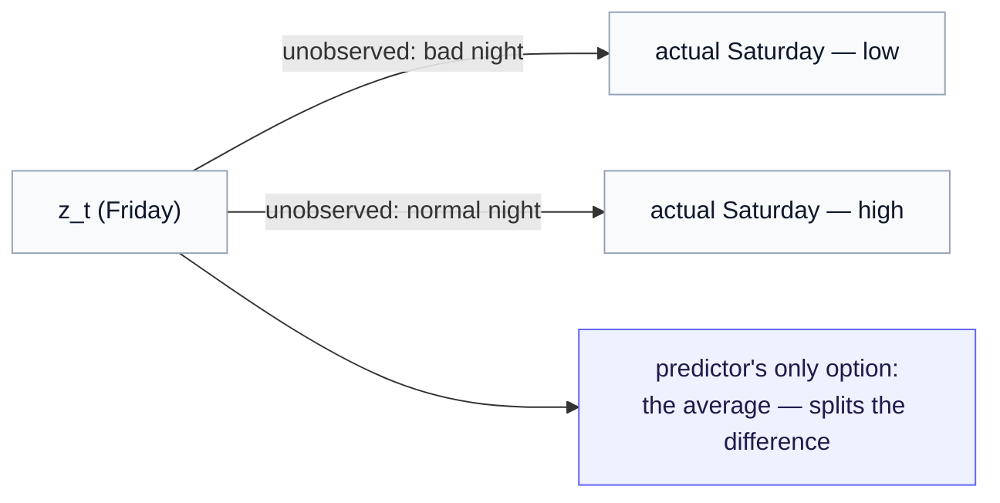

# The Limits of Pure Time-Series JEPA

*A predictor that says **what comes next** but never **what acted** — and why that single gap is the doorway to everything after.*

> **Prerequisite.** [Part 1 — From I-JEPA to Time-Series JEPA](01-from-ijepa-to-tjepa.md) and [Part 2 — Multimodal temporal channels](02-multimodal-temporal-channels.md). Keep the [notation reference](notation.md) handy.

By now we have built something genuinely useful. Time-Series JEPA takes a rich, multimodal, gappy stream of a person's signals and predicts where their latent state goes next, with a surprise residual that flags "today did not look like the usual pattern." That is a real capability. This short chapter is about its one structural limit — not a bug to be tuned away, but a gap built into what pure prediction *is*. Naming it precisely is the whole point, because it is exactly the gap the rest of the corpus exists to fill.

---

## 1. The blind spot: the query says *when*, never *what acted*

Recall the forward pass. The predictor takes the current latent $z_t$ and a query that carries the offset $\Delta t$ — *how far ahead*. That is all the query carries. It never carries *what happened* between $t$ and $t+1$.

But of course things happened. Our person slept badly, or well. They took a medication, or skipped it. They had a stressful call, traveled, drank too much coffee. **None of it reaches the predictor.** So the predictor is forced to do the only thing it can: fit the *average* over all those unseen causes that occurred in the training data — the **marginal** dynamics. It learns "what a typical Saturday looks like," blended across every kind of Friday night that ever preceded one.

> **The gap in one line.** Time-Series JEPA's predictor knows *when* it is predicting, never *under what action*. Every cause of change — slept-badly, took-meds, stressful-call — is invisible to it, and it can only average over them.

This single fact has two consequences, and both undercut exactly what we built.

---

## 2. Consequence one: wrong on every instance, even when right on average

Return to the weekly rhythm. It is Friday; the encoder places our person at latent $z_t$. What is Saturday?

That depends on something the model cannot see. After a **bad night**, Saturday comes in low. After a **normal night**, Saturday lifts as the weekend rhythm predicts. Two different unobserved causes, two genuinely different futures:

The predictor has one output and two answers to cover, so it lands in between — minimizing its *average* error while being wrong in *every specific case*. On the good Saturdays it under-predicts; on the bad ones it over-predicts. It is never actually right, because the thing that decides the outcome was never an input. (This is the familiar failure of a single average straddling two distinct modes, now playing out at the level of dynamics.)

---

## 3. Consequence two: the surprise signal is contaminated

Worse, the casualty is the very thing we prized in Part 1 — the surprise residual, our "this looks off" detector.

A residual spike on Saturday could mean either of two completely different things:

- **the person is genuinely destabilizing** — a real, clinically meaningful change, exactly what we want to catch; or
- **an ordinary thing happened that we couldn't tell the model about** — one bad night, nothing alarming.

Pure Time-Series JEPA *cannot distinguish these.* The detector inherits the predictor's blind spot. For a passive dashboard this is fatal: it cries wolf on every bad night (false alarms that train the user to ignore it) while a slow genuine decline can hide inside the same noise. A change-detector that cannot *attribute* change is not trustworthy — and "detect subtle change over time" was the entire promise.

> **Why this is the crux for real applications.** A monitoring system is only as good as its ability to separate *meaningful* change from *ordinary explained* change. Pure prediction conflates them, because it has no notion of the ordinary causes in the first place.

---

## 4. Why more data or capacity can't fix it

It is tempting to think this is a "needs more signal" problem — that the multimodal richness of Part 2 will eventually resolve it. It will not, and seeing why is important.

More channels make $z_t$ a *better estimate of where the person is*. They do not give the predictor a place to put *what acted between now and next*. The limitation is **architectural, not informational**: there is no input slot for the cause. You can grow the encoder, add modalities, and lengthen the context window forever; the query still says only $\Delta t$, and the prediction is still an average over unseen actions. No amount of better state estimation substitutes for conditioning on the action.

---

## 5. The way out, in one sentence

The fix is to stop hiding the cause. **Give the predictor a slot for the action** — let it condition not just on *when* but on *what acted*. Then two things change at once:

- the prediction stops averaging: told "bad night," it predicts the low Saturday; told "normal night," the high one — *right on each instance*;
- the surprise residual is cleaned: it now measures only *change the known actions do not explain*, which is the genuinely meaningful part. "Surprise" finally means "something happened beyond the ordinary causes I accounted for."

And once the predictor takes an action as input, you can do something pure Time-Series JEPA cannot dream of: **vary it.** Hold today fixed, feed a different action, and read off a different future — *what would next week look like under more sleep?* Prediction becomes intervention.

That slot, and the structure that makes it work, is the **action operator**. This series stops here, at the precise shape of the problem; the rest of the corpus is the solution:

- **What an action operator is**, built from scratch with no prior background — the [Action Operators](../action_operator/00-from-actions-to-operators.md) foundation.
- **How it plugs into the exact Time-Series JEPA predictor you just built** — conditioning, counterfactual rollout, and a sharpened surprise signal — the [Operator World Models](../operator_world_models/index.md) series.

---

## What we covered

Pure Time-Series JEPA predicts *what comes next* but is blind to *what acted* to bring it about. That blindness forces it to average over unseen causes — wrong on every instance — and contaminates the surprise signal that made it useful, in a way no extra data can repair, because the architecture has nowhere to put the cause. The repair is to give the predictor the action as an input. That is exactly where the Time-Series JEPA story ends and the action-operator story begins.

*Continue to the [Action Operators](../action_operator/00-from-actions-to-operators.md) foundation, then the [Operator World Models](../operator_world_models/index.md) series.*
