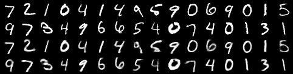
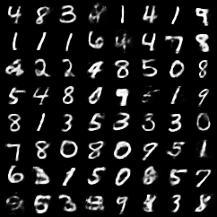

# Results — generative-JEPA on MNIST (`jepa_mnist`)

Interpretation ledger for the generative-JEPA vertical. Artifacts themselves live
under `output/<experiment>/` (git-ignored); this folder holds the committed
**interpretation** + figure snapshots. For *how* to read these metrics, see the
methodology docs:
- representation health → [../../jepa_basics/docs/representation-diagnostics.md](../../jepa_basics/docs/representation-diagnostics.md)
- sample evaluation → [../docs/evaluating-generated-samples.md](../docs/evaluating-generated-samples.md)

---

## Run: first realistic A40 run — 2026-06-04

| | |
|---|---|
| Experiment | `jepa_mnist` |
| Hardware | RunPod A40 (CA-MTL-1), ~27.5 min |
| Data | full MNIST (60k train) |
| Epochs | JEPA 100 · decoder 30 · flow prior 100 |
| Entry point | `run_pod_pipeline.sh /runpod-volume/ssl-lab/output` |
| Artifacts | `output/jepa_mnist/{checkpoints,samples,reports,logs}/` |

### Metrics

| Metric | Value | Reads as |
|---|---|---|
| JEPA final loss | **0.049** | smooth-L1 in latent space; converged |
| Effective rank | **103.7 / 128** | ~104 active latent directions — rich, no collapse |
| Feature std | **0.75** | stable, well above 0 — no collapse |
| Linear probe (test) | **95.3%** | frozen latent is linearly separable by digit |
| Linear probe (train) | 98.0% | (chance = 10%) |

Compared to the 1-epoch / 4k-subset smoke run (effective rank 45, probe 52%,
blurry blobs), the full run is a categorical improvement on every axis.

### Figures

**Reconstructions** — top two rows are real held-out digits, bottom two are the
decoder's reconstruction from the *frozen* JEPA latent:



**Unconditional samples** — drawn as `z ~ flow prior → decode`, never conditioned
on any real image:



---

## How to interpret this run

**Representation (the encoder).** Effective rank rising 74 → 103.7 / 128 with a
stable feature std ≈ 0.75 says the JEPA encoder learned a high-rank, non-collapsed
latent — the central thing that can go wrong in JEPA *didn't*. The 95.3% linear
probe confirms the latent is not just high-variance but **semantically organized**
(digit classes are linearly separable) despite no labels in pretraining.

**Reconstructions.** Faithful and legible — the decoder inverts the pooled latent
well. This is better than the route's worst-case "soft blob" caveat because the
encoder was actually trained to convergence.

**Samples.** Recognizable, varied digits — the headline result: a pure
representation learner (JEPA) extended into a model that **samples new, meaningful
data points** via a flow prior + decoder. Some samples are soft/ambiguous; that is
the expected ceiling of this v0 route — a **mean-pooled image-level latent** and a
**frozen, not-trained-to-be-decodable** encoder (see the backlog: per-patch latents
and a hybrid co-trained decoder both target sharper samples).

### Sample evaluation (intrinsic) — `06_eval_samples.py`

Quantitative battery from [`06_eval_samples.py`](../06_eval_samples.py) using an
**independent** MNIST CNN oracle (test acc 98.3%) for features + class
probabilities; 5000 generated vs 5000 real, features standardized by the real-set
statistics. (`reports/sample_eval.json`.)

| Metric | Value | Reads as |
|---|---|---|
| Classifier confidence | **0.92** | samples look like real digits to the oracle |
| Class coverage entropy | **0.996 / 1.0** | all 10 digits produced ~evenly |
| Classes covered | **10 / 10** | **no mode collapse** |
| FID | 10.4 | distributional distance (oracle feature space) |
| KID | 0.41 | unbiased MMD variant |
| Precision / Recall | 0.65 / 0.41 | fidelity > diversity |
| Density / Coverage | 0.96 / 0.80 | ~80% of the real manifold covered |
| Novelty: NN(gen→train) median | **2.73** | vs real test→train baseline **2.53** |

**Reading it:** full 10/10 class coverage with high confidence confirms the
generator hits every mode — no collapse. Precision (0.65) exceeding recall (0.41)
says samples are **realistic but somewhat less diverse** than the real set — the
expected signature of the pooled-latent + frozen-decoder route. Crucially, the
novelty check shows generated samples sit **slightly farther** from the training
set than real held-out images do (2.73 vs 2.53) — so the model is producing
**genuinely new digits, not memorizing** training data. That is the property that
matters most for the project's goal of *sampling meaningful new data points*.

**Caveat:** FID/KID are only comparable across runs when the **same cached oracle
and sample size** are used (the oracle is cached at `output/oracles/mnist_cnn.pt`
for exactly this reason). The remaining headroom is **recall/diversity**, which the
backlog items (per-patch latents, hybrid co-trained decoder, diffusion prior)
target directly.

## Reproduce

```bash
# locally (CPU/MPS, smaller for a smoke):
python examples/generative_jepa/run_pod_pipeline.sh    # writes output/jepa_mnist/

# on a GPU pod (writes to the volume, rsyncs back):
python examples/ops/ops_run_pipeline.py --execute --gpu a40 -- \
    bash examples/generative_jepa/run_pod_pipeline.sh /runpod-volume/ssl-lab/output
```
