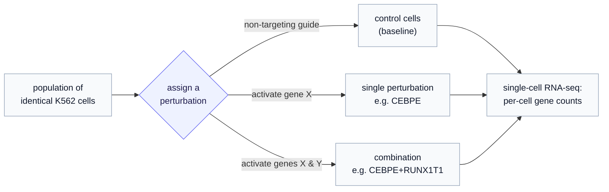
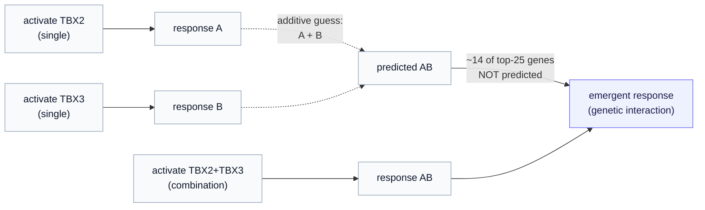

# Part 1 — What Perturb-seq measures, and what the intervention *is*

*Before any tensor, the biology. What experiment produced these numbers, what it means to "perturb" a cell, and why the condition the generative model is steered by is a gene — or a pair of genes — switched on.*

> **Where we are.** This is the data the [generative JEPA](../../../docs/generative_jepa/index.md) learns to generate from. The model's job, stated biologically, is: *given an untreated cell and an intervention, predict the distribution of cell states that intervention produces.* To make sense of that sentence you need to know what the cell states are, what an "intervention" physically is, and why we measure both single interventions and combinations. That is this chapter.

---

## 1. The one-sentence experiment

Take a population of identical cells. Leave some alone (the **controls**). In the others, switch **on** a specific gene — or two genes at once — and then read out, for every cell, how active all ~20,000 of its genes became. Do this for hundreds of different gene targets in one pooled experiment.

That is Perturb-seq: **a genetic perturbation, read out by single-cell RNA sequencing.** "Perturb" = change one gene's activity on purpose; "seq" = measure the whole transcriptome (all genes' expression) of each individual cell afterward. The result is a giant table — one row per cell, one column per gene, each entry a count of how many messenger-RNA molecules of that gene were captured in that cell — annotated with *which* perturbation each cell received.

Norman et al. (2019) ran exactly this on **K562 cells** (a human leukemia cell line, a workhorse of functional genomics) using **CRISPR activation**, across **287 perturbations**: 100 single genes and 131 gene *pairs*. About 111,000 cells in total. Our tutorial slice is a 10-perturbation, 3,945-cell corner of it.

---

## 2. What "switch a gene on" physically means — CRISPR activation

The word *perturbation* is doing a lot of work, so let us make it concrete. In Norman 2019 the perturbation is **CRISPRa** — CRISPR **a**ctivation.

You may know CRISPR as a gene-*cutting* tool. CRISPRa is a cousin that does not cut. It uses a deactivated Cas9 protein (it can still be steered to a gene by a short guide RNA, but its scissors are broken) fused to machinery that *recruits the cell's own transcription apparatus*. Steer it to the start of gene X, and the cell starts transcribing X **more** — X's expression goes up. No DNA is edited; the gene is simply turned up, like a dimmer switch.

So in this dataset an "intervention on gene X" means **make the cell express more of X than it normally would.** This has a beautifully direct fingerprint in the data, which we will see in §5: when you activate a gene, *that gene's own count usually shoots up* — it is frequently the single most-changed gene in the perturbed cells. The intervention is visible in its own readout.

> **Why this matters for the model.** The "condition" the generative model is steered by — written $z_p$ in the [design-space series](../../../docs/generative_jepa/07-route-b-variational-and-beyond-gaussian.md), read "z-perturbation" — is an embedding of *which gene(s) were activated.* Biologically, that condition is an instruction: "drive transcription of CEBPE up." The model must learn what downstream cascade that instruction sets off. (Other Perturb-seq datasets use CRISPR *interference*, CRISPRi, which turns genes **down** instead — the [Adamson 2016](https://pertpy.readthedocs.io/en/stable/api/datasets_index.html) dataset is one. The modeling is identical; only the sign of the nudge flips.)

---

## 3. Why a *cell line*, and why it is the right testbed

K562 cells are all (approximately) genetically identical and divide indefinitely, which is exactly what you want for this question. If two cells respond differently to the same perturbation, it is **not** because they started as different cell types — they did not — it is because the *response itself* is variable. That isolates the thing we care about: the spread of outcomes a single intervention produces.

This is the biological root of **Gap G1** from the [design-space map](../../../docs/generative_jepa/05-two-gaps-four-routes.md) — the reason a generative model must predict a *distribution*, not a point. Identical cells, identical intervention, genuinely different outcomes. Chapter 2 shows this spread in the numbers; here the point is conceptual: the cell line is what makes "same input, many outputs" a clean, real phenomenon rather than a confound.

---

## 4. Why single *and* combination perturbations — the genetic-interaction question

Here is the scientific heart of Norman 2019, and the reason combinations are not just "more perturbations" but the whole point.

Activate gene A alone: you get some response. Activate gene B alone: another response. Now activate **A and B together**. The naive expectation is that the joint response is just the *sum* of the two single responses — A's effect plus B's effect. **Genetic interaction** is precisely when that fails: when A and B *together* do something neither predicts alone. The pair can amplify, cancel, or steer the cell to an entirely new state.

This is **epistasis** — genes acting non-additively — and it is everywhere in biology (it is why drug combinations can do more than either drug, and why disease often needs more than one hit). Norman built the dataset to *measure* it at scale: by profiling singles and their pairs in the same experiment, you can ask, for each pair, "is the combination additive, or emergent?"

> **A worked example from the slice.** Take the pair **TBX2+TBX3** (two related developmental transcription factors). We can ask how much of the combination's strongest response is "explained" by its two singles. Of the combination's top 25 differentially-expressed genes — the 25 genes it moved most — only **11 are shared with either single's top genes; 14 are novel**, appearing in the *combination* that neither TBX2 nor TBX3 produced alone. The pair drives the cell somewhere new. (CEBPE+RUNX1T1 and CNN1+ETS2 show the same pattern — roughly half emergent.) That emergent half is the signal a model that merely *adds* single-gene effects would miss entirely.

This is why the dataset's headline test — built into our pipeline's data split (Chapter 2) — is **predict an unseen combination from its seen singles.** A model that has learned real biology should anticipate at least some of the emergent half; a model that only memorized single-gene effects cannot. It is the sharpest possible probe of whether a model understands genetic interaction, and it is exactly the [combinatorial generalization](../../../docs/generative_jepa/11-application-computational-biology.md) the generative JEPA is meant to demonstrate.

---

## 5. The intervention, made concrete — what activation looks like in the data

Let us close the loop between "switch a gene on" and the numbers, because it makes the whole abstraction tangible.

When CRISPRa activates a gene, the clearest thing that happens is that **the activated gene's own expression rises** — often dramatically. In the slice, the cells perturbed for **RUNX1T1** have, as their single most-changed gene, **RUNX1T1 itself** (its expression up enormously versus control). The intervention is legible in its own footprint: you could almost read off *which* gene was targeted just from which gene jumped.

But the interesting biology is the *rest* of the cascade — the genes that move because the activated gene is a transcription factor that turns *other* genes up or down. Activating **CEBPE** (a master regulator of myeloid blood-cell differentiation) moves a whole program of downstream genes (FYB, PRG3, RARRES3, and others — immune and differentiation markers), because CEBPE's job is to orchestrate that program. The perturbation is a single instruction; the response is a coordinated shift across hundreds of genes. *That coordinated shift is what the generative model must learn to produce* — and what Chapter 4's effect-size metric scores it on.

> **The condition, in one line.** The intervention $z_p$ is "activate this gene (or pair)." Its biological meaning is a *push on a regulatory network*: turn one knob, and a structured wave of downstream changes follows. Single perturbations probe one knob; combinations probe whether two knobs interact. The model's task is to predict the wave — its shape, its magnitude, and its cell-to-cell spread.

---

## 6. Recap, and where next

- **Perturb-seq** = activate specific genes in otherwise-identical cells, then read every cell's whole-transcriptome counts. Norman 2019: K562 cells, CRISPR *activation*, 287 single + paired gene perturbations.
- The **intervention** is "drive gene X (and maybe Y) up." It shows up first as X's own expression rising, then as a coordinated downstream cascade — the thing worth predicting.
- **Identical cells, variable responses** is why the model must predict a *distribution* (Gap G1), not a point.
- **Combinations** exist to measure **genetic interaction** — the emergent, non-additive response a pair produces — and "predict an unseen combination" is the dataset's sharpest generalization test. In our slice, combinations are roughly half emergent.

Next: [Part 2 — reading the dataset as model input](02-reading-the-dataset.md), where these ideas become concrete arrays — counts, library size, dropout, controls, and the split that turns "predict an unseen combination" into a train/test partition.
