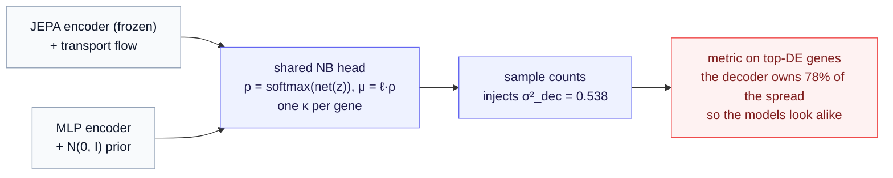

# Chapter 6 — Beyond the current limit

*Where a breakthrough would most plausibly come from. The method loses to a simpler baseline, and a loss of this size is not something a tuning pass repairs. It is a map of which components have to change, and by how much. This chapter orders the directions from the ones most likely to move the number to the deeper research bets, and says for each what we would expect to see.*

The result to beat, from [Chapter 4](04-results.md): on held-out gene combinations a from-scratch NB-VAE scores $0.766$ against the conditional flow's $0.648$, a gap of $0.118$ that survives correction for the whole family of comparisons, against a baseline whose seed-to-seed spread is $0.006$. Reseeding will not close it, and neither will a lever worth $+0.02$. Whatever comes next has to be structural.

[Chapter 5](05-challenges-and-limitations.md) traced the loss to three facts, worth restating here because each one is a lever this chapter reaches for. First, the encoder is frozen and condition-blind: it is pretrained on cell states alone and never sees the intervention, so all conditioning lives downstream in the flow and the representation itself is never shaped by the perturbation task. Second, the decoder is a shared bottleneck: the flow and the VAE read out through the same negative-binomial head, that head carries the large majority of the predicted spread on the genes the metric scores, and so whatever differs in the parts the two models do *not* share gets compressed at the output. Third, the metrics reward the mean and the marginals, which is precisely what a simple conditional generator already handles well, while the flow's distinctive promise of a rich and possibly multimodal joint distribution over the response is the hardest thing to measure and the least rewarded. Each fact is a lever, and the sections below are ordered by how readily each one moves.

## The one axis we have not measured: data efficiency

The cleanest remaining place for the flow to justify itself is the low-data regime. The whole premise of self-supervised pretraining is that a representation learned on abundant unlabeled cells pays off when labeled examples are scarce. Effect size at full data does not test that premise at all. The experiment is to subsample the training cells per perturbation to a ladder of fractions, retrain the flow and the VAE at each rung, and plot the $\Delta$-correlation against the number of cells. If the JEPA-plus-flow stack degrades more gracefully than the from-scratch VAE as data shrinks, that is a real and practically important win, and it is invisible to every number reported so far. This is the first thing to run, and it needs only the existing pipeline with a subsampling flag.

## Fix the shared bottleneck: a better-calibrated decoder

Why bother with the decoder at all? Because on the calibration axis it is doing most of the talking. The predicted populations are badly miscalibrated, and the decoder carries the large majority of the spread they do have, so a calibration number today reports mostly on the readout rather than on the generative model behind it. Any advantage the flow's latent distribution might hold stays buried underneath. What this section argues, though, is that the obvious repair is a trap, and that the identity below is what exposes it.

Start with the measured symptom. The predicted $80\%$ interval captures only about $37\%$ of the real held-out cells, against a nominal $0.80$. The populations the models generate are **too narrow**, not too wide, and this is true of the flow and the VAE alike. Whatever else is wrong, the models are over-confident.

Now the decomposition, and here a piece of exact algebra makes everything click. Both models generate a cell in the same two steps: draw a latent from the model's own distribution, $z \sim p(z \mid \text{pert})$, then draw counts from the decoder, $x \mid z \sim \mathrm{NB}(\mu(z), \kappa)$. The law of total variance splits the spread of the resulting population into exactly two pieces, one contributed by each step:

$$\underbrace{\mathrm{Var}[x_g]}_{\sigma_{\text{obs}}^2} = \underbrace{\mathbb{E}_z\big[\mu_g(z) + \mu_g(z)^2/\kappa_g\big]}_{\sigma_{\text{dec}}^2} + \underbrace{\mathrm{Var}_z\big[\mu_g(z)\big]}_{\sigma_{\text{bio}}^2}.$$

This is an identity rather than a modeling approximation, and it is worth reading slowly, because it assigns every unit of observed spread to an owner. Here $x_g$ is the count of gene $g$, $\mu_g(z)$ is the mean the decoder emits for a cell at latent $z$, and $\kappa_g$ is the negative binomial's dispersion. The second term on the right, $\mathrm{Var}_z[\mu_g(z)]$, is the variance of the decoded *mean* across the latent cloud: cells differ from one another because the model placed them at different latents. That is $\sigma^2_{\text{bio}}$, and it is precisely the part the flow and the VAE do differently, because it is set entirely by their latent distributions. The first term is the count noise the decoder adds around each cell's own mean, averaged over the cloud. That is $\sigma^2_{\text{dec}}$, it belongs to the shared readout, and it is the same kind of object in both models.

Measured on the transport flow, over the genes the metric scores:

$$\sigma^2_{\text{dec}} = 0.538, \qquad \sigma^2_{\text{bio}} = 0.140, \qquad \text{total} = 0.678, \qquad \text{real} = 0.824 .$$

Two things fall out at once. The model produces only $0.84$ of the spread it should, which is the under-dispersion. And the decoder owns $78\%$ of the spread it does produce, outweighing the latent distribution by nearly four to one. **That ratio is the compression.** The metric sees $\sigma^2_{\text{obs}}$, the decoder dominates it, and so two models with genuinely different latent distributions land in nearly the same place. The flow's contribution is a minority shareholder in its own readout.

The two boxes on the left are the only place the models differ, and they are exactly what $\sigma^2_{\text{bio}}$ measures. Everything downstream of the merge is shared. Chapter 4 makes the consequence concrete: the two models' latent contributions are almost equal ($0.140$ for the flow, $0.128$ for the VAE), so the gap between the models is *not* a gap in what their latent distributions do. It is mostly in the decoder each of them learned.

### The trap: two ways to fix coverage, and only one of them helps

Here is where the obvious repair goes wrong, and the identity is what shows it. The shortfall is $0.824 - 0.678 = 0.146$ of missing variance. There are two ways to supply it, they both fix coverage exactly as well, and they have **opposite** consequences for everything this project cares about.

**Fix A, give the decoder more noise.** Raise $\sigma^2_{\text{dec}}$ from $0.538$ to $0.684$ and the total lands on $0.824$. Coverage is repaired. But the decoder's share of the spread rises from $78\%$ to $83\%$, and the latent's share falls from $22\%$ to $17\%$. The shared component now speaks even louder, so a *better flow would be even harder to detect than it is today.* You would have fixed the metric and deepened the problem the metric was supposed to reveal.

**Fix B, give the latent distribution more spread.** Raise $\sigma^2_{\text{bio}}$ from $0.140$ to $0.286$, leave the decoder alone, and the total lands on $0.824$ just the same. Coverage is repaired, and now the latent's share rises to $35\%$. The generative model becomes a larger fraction of what the metric sees, which is the only way its quality can ever register.

Both fixes produce identical coverage. Only one of them makes the flow legible. And that reframes the whole lever: **the calibration failure is not really a readout problem, it is a generative one.** The latent cloud that the flow produces is simply too tight. Its decoded means do not vary enough from cell to cell to account for the biological heterogeneity that is actually there. Tuning the count head cannot manufacture that variety, because the count head is downstream of where the variety would have to come from.

So the decoder work that remains is narrow and honest. The dispersion should be raised toward the residual the identity names, $\sigma^2_{\text{dec}} \to \mathrm{Var}[x_g] - \sigma^2_{\text{bio}}$, so the readout stops being over-confident, and the readout's mean head can be anchored so that it models the deviation from baseline rather than the whole absolute profile ([Chapter 8](08-modeling-the-readout-count-decoder.md) develops both). Those are worth doing. They are *not* worth mistaking for the main event. Two cautions ride along: the zero-inflated variant the code supports is tempting for dropout-heavy data, but modern UMI counts are generally not zero-inflated and a dropout gate can mask a dispersion problem rather than fix it; and any loss reweighting must use answer-agnostic signals only.

The main event is the latent distribution, and the section on conditioning below is where it lives. A flow whose predicted cloud carries only $22\%$ of the response's variance has not yet earned the word *generative*, and the operator route of [Chapter 7](07-modeling-the-transition-action-operators.md), with its dialable residual velocity field, is the most direct way to make that cloud wider in a structured way rather than merely noisier.

## Give the metrics something the flow can win

A generative model's distinctive value is the full joint distribution of the response, including multimodality and gene-gene correlation, and that is the least-rewarded thing on the current scoreboard. Two changes would let the flow show an edge if it has one. First, build metrics that isolate joint structure from marginal noise, for instance comparing predicted and true gene-gene correlation matrices, or measuring how well each model reproduces a known bimodal response where cells split between two fates. Second, and harder, disentangle the biological variation the flow controls from the technical count noise the decoder adds, so that calibration reads the latent distribution rather than the decoder. Until the evaluation can see joint structure, a model that captures it well will keep scoring the same as one that does not.

## Move conditioning into the representation

The frozen, condition-blind encoder is a deliberate choice that buys modularity, and relaxing it is a spectrum rather than a switch. The gentlest step is joint training: stop freezing the encoder and let the conditional generative loss shape it, accepting some risk that the representation drifts from clean self-supervision. A middle step is condition injection, feeding the intervention into the encoder so its output is a state-under-condition rather than a pure state. The scalability of injection turns on how the condition is represented, and a parametric, compositional condition like the gene-set embedding is what lets it reach unbounded interventions.

The deepest step is to make the self-supervised task itself conditional. Pretrain the encoder with a predictor that is conditioned on an action and learns to predict the next latent from the current latent and that action. The representation is then perturbation-aware from the start, because the pretraining required it. This is the operator world model, where an intervention is read as an operator that drives a transition in latent space and the predictor *is* that conditioned transition. Reading the condition as a parametric operator $f_{\theta(c)}$ is also what makes rich conditioning scale, since the operator is generated from the structure of the intervention rather than enumerated over a fixed menu. The [design-space survey](../../../../docs/generative_jepa/10-route-d-world-model-planning.md) and the [operator world models](../../../../docs/generative_jepa/index.md) line develop this route, and it is the most substantial bet on the list, because it changes what the representation is for rather than only what happens downstream of it.

## Smaller levers worth pulling

Several cheaper experiments could sharpen the flow without changing its character. Optimal-transport coupling hurt when applied globally across mixed perturbations, but coupling *within* a perturbation, matching controls to targets of the same intervention, respects the conditioning the global version ignored and might help where the global version hurt. Classifier-free guidance was left at its neutral setting throughout, and a guidance sweep could trade diversity for sharpness in the predicted effect, with the sweet spot found against the $\Delta$-correlation. And the DeepSets variant of the gene-set embedding, which can model interactions a pure additive sum cannot, is worth testing on the combinations where two genes interact non-additively, the genuine epistasis that additivity is bound to miss.

One further lever sits earlier in the pipeline than any of these: how genes are grouped into tokens before Stage A. The default is a fixed random partition ([Chapter 3 §2](03-training-and-evaluation.md)). [Chapter 6a](06a-the-tokenization-design-space.md) develops the full design space: pathway groups, co-expression modules, the bias mechanisms each introduces, and how to test a swap without breaking the combo-split discipline.

## Buy statistical power

Every combination result rests on twenty held-out combinations, which limits resolution to roughly $0.05$. Norman 2019 contains far more combinations than we held out, so a larger held-out set, more training seeds, and ideally a second Perturb-seq dataset would let a real difference between the flow and the baseline become visible if one exists. This does not change the method, but without it we cannot distinguish a genuine improvement from seed noise, and [Chapter 4](04-results.md) showed how easily that noise misleads.

## How we would read the outcomes

These directions are not equally likely to pay off, and it is worth being explicit about what each would mean. If data efficiency favors the flow, the method has a clear practical niche even at full-data parity, and that is the most likely near-term win. If a better decoder or a joint-structure metric reveals a gap, the flow's distributional modeling was real but hidden, and the contribution stands. If the operator route lifts the result, the value was never in bolting a flow onto a frozen encoder but in making conditioning native to the representation, which reframes the whole line of work. And if none of them move the number, that is itself a clean and publishable conclusion: for this task, a simple conditional generator is enough, and the case for generative JEPA rests on the reusable encoder and transfer rather than on beating a baseline at effect size. Each outcome advances the understanding, which is the point of having measured the loss carefully enough to trust it.

---

*Previous: [Chapter 5 — Challenges and limitations](05-challenges-and-limitations.md). Up: [the method series](index.md). Related: [Chapter 6a — The tokenization design space](06a-the-tokenization-design-space.md).*
