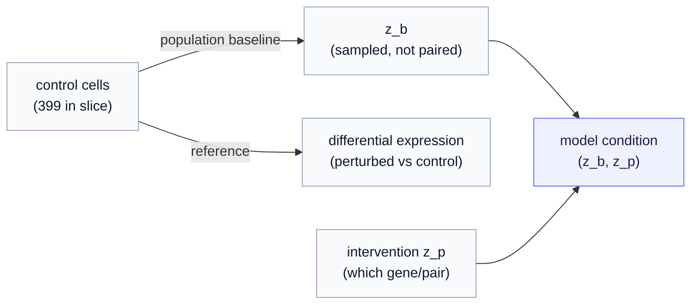

# Part 2 — Reading the dataset as model input

*The same experiment, now as arrays. What every field in the processed cache means, why counts are integers full of zeros, what the control cells are *for*, and how "predict an unseen combination" becomes a concrete train/validation/test split.*

> **Where we are.** [Part 1](01-what-is-perturb-seq.md) explained the biology: activate genes in identical cells, read out per-cell transcriptomes, and study how single and paired interventions reshape them. Now we open the processed cache and read every number the model will actually see. All values below are from the [tutorial slice](index.md) — 3,945 cells, 2,000 highly-variable genes, 10 perturbations — and you can reproduce them.

---

## 1. The shape of the thing

After processing, the dataset is a handful of aligned arrays, one row per cell. The light loader (`ssllab.data.perturbseq`) hands them to you as a batch dictionary:

| Field | Shape | What it is |
|---|---|---|
| `counts` | `(B, 2000)` int | **raw** integer mRNA counts per highly-variable gene |
| `libsize` | `(B,)` float | total counts in the cell (its sequencing depth) |
| `pert_id` | `(B,)` int | which perturbation this cell received (index into `pert_names`) |
| `is_control` | `(B,)` bool | True for non-targeting (baseline) cells |
| `ctrl_group` | `(B,)` int | which control pool this cell is matched to |
| `tokens` | `(B, 50, 40)` float | the gene vector regrouped into encoder tokens (Part 3) |

Here `B` is the batch size. Everything else in the cache (the normalized matrix, the differential-expression lists, the splits, the manifest of every processing knob) supports these. Let us take the load-bearing fields one at a time, because each one encodes a fact about the biology that the model must respect.

---

## 2. Counts are integers, and most of them are zero

The fundamental measurement is a **count**: how many messenger-RNA molecules of a given gene were captured in a given cell. So the data are **non-negative integers**, not real numbers — in the slice the largest single entry is **2,402** (a highly-expressed gene in some cell), and the smallest is 0.

And zeros dominate. In the slice, **70.3% of all (cell, gene) entries are zero.** Most genes, in most cells, register no counts at all. This is **dropout**, and it has two causes worth separating:

- **Biological zeros** — the gene genuinely is not expressed in that cell.
- **Technical zeros** — the gene *is* expressed, but the sequencing simply failed to capture any of its molecules. Single-cell capture is lossy; a lowly-expressed transcript easily reads as zero by chance.

You cannot tell which is which from a single zero, and that ambiguity is a modeling problem, not a nuisance to scrub away. It is the reason the [decoder](../../../../docs/generative_jepa/06-route-a-latent-decoder-head.md) uses a **count likelihood** (negative binomial, optionally zero-inflated) rather than squared error: squared error would treat these integer, zero-heavy, over-dispersed counts as if they were tidy Gaussian measurements and spend all its capacity modeling the noise. The data's *measurement model* is baked into its shape, and the model must match it.

> **Why we keep the raw counts.** The cache stores `counts` as raw integers *on purpose* — even though tokens (Part 3) use a normalized version. The eventual count decoder is trained on the likelihood of the **real** counts, and the success metric (Part 4) is computed in count/expression space. Throw the raw counts away and you cannot recover either. This is the "G2 decoder seam" the [pipeline](../../README.md) deliberately preserves.

---

## 3. Library size — the depth knob you must not confuse with biology

Cells differ in how many total molecules were captured — their **library size** $\ell$ (read "ell"), the sum of all of a cell's counts. In the slice, $\ell$ ranges widely: **median 14,200 counts per cell, from 3,885 at the low end to 44,475 at the high end** — a more-than-tenfold spread.

This spread is mostly **technical**: a cell with twice the library size is not twice as transcriptionally active, it just got sequenced more deeply. If you compared raw counts between a shallow and a deep cell you would "discover" differences that are pure depth. So library size is a **covariate** — a known nuisance you correct for, not a signal you predict.

Two places it shows up:

- **Normalization for tokens.** To get comparable features, we divide each cell's counts by its library size and rescale to a common total (counts-per-10,000), then take $\log(1 + \cdot)$ to tame the heavy tail. The cache's `hvg_X` is this **log1p-CP10K** matrix (its largest value in the slice is 8.74, versus 2,402 for the raw count — the log compression is dramatic). These normalized features are what become tokens.
- **A given input to the decoder.** When the model later *generates* counts, it does **not** predict library size — it predicts a relative gene-rate profile and is *handed* $\ell$ as a covariate, assembling the mean as (rate $\times \ell$). The [Route A decoder chapter](../../../../docs/generative_jepa/06-route-a-latent-decoder-head.md) writes this out; here the point is that $\ell$ enters as a known quantity, exactly because it is depth, not biology.

> **The symbol map so far.** $\ell$ = library size (total counts in a cell). Raw `counts` = the integer measurement. `hvg_X` = log1p-CP10K normalized features (depth-corrected). The model reads normalized features through tokens, predicts in count space, and treats $\ell$ as given.

---

## 4. Controls — what "baseline" means when cells are destroyed

To know what an intervention *did*, you need to know what the cell looked like *without* it. But single-cell RNA-seq is **destructive** — measuring a cell kills it — so there is no "before" snapshot of the same cell. You cannot pair a perturbed cell with its own untreated self.

The solution is **control cells**: cells that received a *non-targeting* guide (the CRISPRa machinery present but aimed at nothing), so they sit at the unperturbed baseline. In the slice there are **399 control cells**. They play two roles:

- **The baseline state $z_b$** (read "z-baseline"). The generative model's condition is "this baseline, plus this intervention." Since there is no paired before-cell, the baseline is drawn from the *control population* — the pipeline's `ControlSampler` does exactly this, handing the model control cells matched by `ctrl_group` (the slice has one group, all controls pooled). This is **population-level pairing**, and it is forced on us by the destructiveness of the assay, not a shortcut.
- **The reference for "what changed."** Every notion of *effect* in this dataset is "perturbed versus control." Differential expression (Part 4) compares each perturbation's cells against these controls. No controls, no effect, no benchmark.



---

## 5. The perturbation label — a structured condition

Each non-control cell carries a perturbation label: a single gene like `CEBPE`, or a pair like `CEBPE+RUNX1T1` (the pipeline alphabetizes and `+`-joins, so order never matters). The slice's 10 labels are balanced by design — roughly 390–399 cells each:

```
control 399 | CEBPE 390 | RUNX1T1 391 | TBX2 396 | TBX3 396 | CNN1 396 | ETS2 394
CEBPE+RUNX1T1 396 | TBX2+TBX3 393 | CNN1+ETS2 394
```

The label is the raw material of the condition $z_p$. Crucially it has **structure**: a combination is *made of* its singles. `CEBPE+RUNX1T1` is not an opaque new category — it is "CEBPE **and** RUNX1T1, together." A model can exploit that structure (embed each gene, compose the pair) to generalize to combinations it never saw — which is precisely the test the split sets up next.

---

## 6. The split — turning "predict an unseen combination" into train/test

A dataset split is where the *scientific question* becomes a *measurable task*. The pipeline writes two splits; the headline one is `combo`, built to test genetic-interaction generalization.

The rule: **hold out whole combinations whose two singles are both seen in training.** That way the model goes into the test having learned each gene's solo effect — and is asked to predict what they do *together*, which (Part 1) is roughly half emergent and cannot be reached by adding the singles. Control and singles always go to training (the baseline and the building blocks must be available).

In the slice that yields:

| Split | Perturbations | Cells |
|---|---|---|
| **train** | control, CEBPE, RUNX1T1, TBX2, TBX3, CNN1, ETS2, **CNN1+ETS2** | 3,156 |
| **val** | **CEBPE+RUNX1T1** | 396 |
| **test** | **TBX2+TBX3** | 393 |

Read the test row as the actual exam question: *the model has seen TBX2 alone and TBX3 alone during training, but never TBX2+TBX3 — predict the distribution of cell states that combination produces.* Success means anticipating the emergent half of the response, scored by effect size (Part 4). The split is **at the perturbation level**, not the cell level — every cell of `TBX2+TBX3` is held out together, so there is no leakage of the combination into training. (The pipeline also writes a simpler `cells` split — a random per-cell hold-out where all perturbations are seen — as a sanity baseline; the `combo` split is the real benchmark.)

> **Why so few in val/test here.** With only three combinations in the slice, the split gives one combination each to val and test. The full Norman run has **131 combinations**, so the same rule produces a properly populated split. The slice is for understanding the *mechanism*; the production run is where the numbers get statistically meaningful.

---

## 7. Recap, and where next

- The model sees, per cell: raw integer **`counts`** (70% zeros — dropout, biological and technical), a **`libsize`** covariate (a 10× technical depth spread, median 14,200), a **`pert_id`** label (structured: combos are made of singles), and an **`is_control`** flag.
- **Raw counts are kept** because the decoder's likelihood and the success metric live in count space; **normalized `hvg_X`** (log1p-CP10K) is what feeds tokens.
- **Controls** supply the baseline $z_b$ (population-level, because the assay is destructive) and the reference for every "what changed" comparison.
- The **`combo` split** operationalizes the genetic-interaction question: hold out whole combinations whose singles are seen, and ask the model to predict the emergent joint response.

Next: [Part 3 — from a cell to tokens](03-tokenization.md), where the 2,000-gene normalized vector becomes the `(50, 40)` token tensor the JEPA encoder reads.
