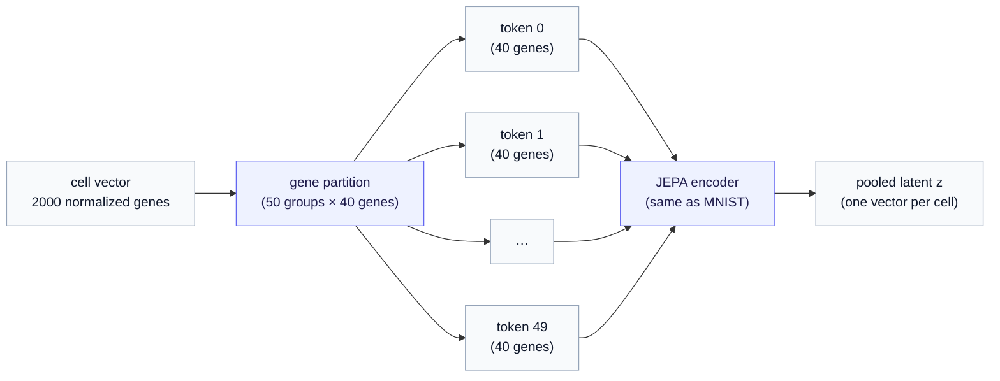

# Part 3 — From a cell to tokens

*A cell is a flat vector of gene expression. The JEPA encoder wants a sequence of tokens. This chapter is the bridge: how 2,000 genes become a `(50, 40)` tensor, why we group genes the way an image is cut into patches, and what that buys the self-supervised objective.*

> **Where we are.** [Part 2](02-reading-the-dataset.md) left us with a cell as a 2,000-dimensional vector of normalized gene features (`hvg_X`). But the encoder we reuse — the same JEPA transformer that read MNIST image patches — does not consume flat vectors; it consumes a **sequence of tokens**. This chapter is the adapter, and it is deliberately the *direct analogue* of how images are tokenized, so that one encoder serves both modalities unchanged.

---

## 1. The contract every modality must meet

The whole `ssllab` stack agrees on one input shape. Every data adapter — images, cells, anything — must emit a tensor

$$
\text{tokens} \in \mathbb{R}^{B \times n_{\text{tokens}} \times d_{\text{tok}}}
$$

where $B$ is the batch size (how many examples), $n_{\text{tokens}}$ is the number of tokens per example, and $d_{\text{tok}}$ (read "d-tok") is the feature dimension of each token. The encoder projects each token to an embedding and runs a transformer over the sequence — it never needs to know whether a token is an image patch or a group of genes. That indifference is the point: **build the adapter right, and the model is modality-agnostic.**

For MNIST, the adapter (`patchify`) cuts a 28×28 image into a 4×4 grid of 7×7 patches: $n_{\text{tokens}} = 16$, $d_{\text{tok}} = 49$ (the pixels in a patch). For cells, we need the gene-space version of the same move.

---

## 2. The problem — a cell has no grid

An image has spatial structure: nearby pixels belong together, so cutting it into square patches is natural. A cell's gene-expression vector has **no such layout** — gene 7 and gene 8 in the panel are neighbors only by accident of ordering. There is no grid to slice.

So we make one. We **partition the 2,000 highly-variable genes into $n_{\text{tokens}}$ groups**, and each group becomes one token — its features are that group's gene values. In the slice, with $n_{\text{tokens}} = 50$ groups, each token holds $d_{\text{tok}} = 2000 / 50 = 40$ genes:

$$
\underbrace{2000 \text{ genes}}_{\text{a cell}} \longrightarrow \underbrace{50 \text{ tokens}}_{n_{\text{tokens}}} \times \underbrace{40 \text{ genes each}}_{d_{\text{tok}}}.
$$

This is the gene-space analogue of `patchify` — `tokenize_cells` in [`ssllab.data.perturbseq`](../../../../src/ssllab/data/perturbseq.py). It gathers, for each of the 50 groups, that group's 40 gene values out of the cell vector, producing the `(50, 40)` tensor. Batch it and you have `(B, 50, 40)` — exactly the contract. (The production run uses 5,000 genes → still 50 tokens, now $d_{\text{tok}} = 100$ each.)



---

## 3. How the genes are grouped — and the honesty about it

Which genes land in which group? The default is a **fixed random partition**: shuffle the 2,000 gene indices once (with a fixed seed) and deal them into 50 groups. `make_gene_partition(n_hvg, n_tokens, seed)` does exactly this, and the seed is recorded in the cache manifest so processing and training *always* agree on the partition — the loader refuses to run if its seed disagrees with the cache. Determinism here is not fussiness: if the grouping drifted between runs, a trained encoder would receive scrambled tokens at inference.

Now the honesty. A random partition is **deliberately neutral, not biologically meaningful.** Genes in the same group share a token purely by the luck of the shuffle, not because they belong to the same pathway. That is a reasonable *default* — it imposes no unjustified structure and lets the transformer learn relationships across tokens via attention — but it is a knob we expect to revisit, which is why the manifest records `"scheme": "random"`. Better groupings are an open lever:

- **Pathway / gene-program groups** — put genes from the same biological program (a signaling pathway, a regulon) in one token, so a token means something.
- **Co-expression groups** — group genes that vary together across cells (data-driven modules).

These could make masked prediction (next section) more meaningful, at the cost of baking in a prior. The series treats this as a Stage-A design choice, not a settled answer. The default gets us a runnable, reproducible contract today. The conditional-flow method series develops the full tradeoff in [Chapter 6a](../../conditional-flow-jepa/06a-the-tokenization-design-space.md): why random grouping is defensible, what pathway and co-expression alternatives would change, and how to test a swap without breaking the combo split.

> **Inverse exists.** Because the partition is a permutation of the gene indices, tokenization is exactly invertible: `detokenize_cells` scatters the token values back to a 2,000-gene vector. Nothing is lost in the regrouping — it is a reshaping, like `patchify`/`unpatchify` for images.

---

## 4. Why tokens at all — the self-supervised objective they enable

You might ask: if it is just a regrouping, why not feed the encoder the flat 2,000-vector? Because tokens are what make JEPA's **masked-prediction** pretraining possible, and that is how the cell encoder (Stage A) will be trained.

The intra-cell JEPA objective is: **hide some of a cell's gene-group tokens, and train the encoder–predictor to fill in the hidden groups' embeddings from the visible ones.** To "hide a gene group" you need gene groups to exist as discrete units — i.e. tokens. The cell learns a representation in which the visible part of its transcriptome predicts the rest, which is a strong, label-free way to learn what a cell *is*. (This mirrors I-JEPA hiding image patches; the [encoder chapter](../../../../docs/generative_jepa/01-the-jepa-encoder.md) has the full mechanism.)

After pretraining, the encoder produces, for each cell, a single pooled **latent** $z$ (read "z") — the mean of its token embeddings, one vector per cell. That $z$ is the object the rest of the generative stack acts on: the baseline latent $z_b$ (Part 2) is the encoder's $z$ for a control cell, and the conditional flow prior generates perturbed-cell latents $z$ given the condition. **Tokens in, one latent per cell out** — and the whole generative model lives downstream of that latent.

> **One caveat for Stage A.** The masking that decides *which* tokens to hide is, in the current MNIST code, tuned to a 2D image grid. Gene tokens have no grid, so Stage A will supply a gene-appropriate masking (e.g. hide random gene groups). That is encoder-training work, flagged in the [pipeline plan](../../README.md), not part of this data-tokenization step — the `(B, 50, 40)` contract is ready regardless.

---

## 5. Seeing it on the real slice

Concretely, on the tutorial cache, one batch from the loader looks like this:

```python
from ssllab.data import get_perturbseq_dataloaders
train, val, test = get_perturbseq_dataloaders(data_dir="data", artifact="norman_tutorial", seed=0)
batch = next(iter(train))
batch["tokens"].shape   # torch.Size([B, 50, 40])  -> 50 gene-group tokens, 40 genes each
```

and those tokens feed the *unchanged* JEPA encoder:

```python
from ssllab.jepa.model import build_jepa
jepa = build_jepa(token_dim=40, n_tokens=50, embed_dim=128)
z = jepa.embed(batch["tokens"])   # (B, 128) -> one latent per cell
```

That `build_jepa(token_dim=40, n_tokens=50, ...)` is the *same* factory that builds the MNIST encoder with `token_dim=49, n_tokens=16`. Two numbers change; the architecture does not. The adapter did its job.

---

## 6. Recap, and where next

- The encoder consumes a universal contract: `(B, n_tokens, d_tok)` tokens. The cell adapter must produce it from a flat gene vector.
- A cell has **no natural grid**, so we **partition the 2,000 genes into 50 groups of 40** — each group is a token. This is the gene-space `patchify`; it is invertible and deterministic (seeded, recorded in the manifest).
- The grouping defaults to **random** — neutral and reproducible, but biologically arbitrary and revisitable (pathway / co-expression groups are the open upgrade).
- Tokens exist to enable **masked-prediction pretraining** (hide gene groups, predict them), which yields **one pooled latent $z$ per cell** — the object the generative model acts on.
- The payoff: the *same* JEPA encoder reads cells and images; only `token_dim` and `n_tokens` change.

Next: [Part 4 — did the model get it right?](04-success-metrics.md) — effect size, differential expression, calibration, and why the metric that matters scores the *change* an intervention causes, not the cell's absolute state.
