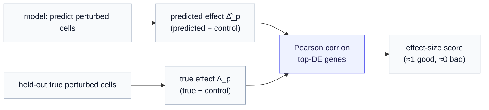

# Part 4 — Did the model get it right? Success metrics

*A model can reconstruct a cell beautifully and still be useless. This chapter is about the metric that actually matters in perturbation biology — effect size — what it measures, why it is the right target, and the two companions (calibration, data efficiency) that keep it honest.*

> **Where we are.** [Parts 1–3](01-what-is-perturb-seq.md) built up the data: the intervention, the counts, the controls, the split, the tokens. Now the question that decides everything — **how do we score a prediction?** The answer is the reason the whole [design-space series](../../../../docs/generative_jepa/05-two-gaps-four-routes.md) insists on a decoder that reaches data space, and it is sharp enough to rule modeling choices in or out.

---

## 1. The trap — predicting the cell instead of the effect

Here is the failure that motivates everything. Suppose you score a model on how well it reproduces a perturbed cell's **absolute state** — its full expression profile. A model can score *wonderfully* on that and still be worthless, because a perturbed cell's state is dominated by the large, stable **baseline** every K562 cell already has. The intervention's effect — the genes the perturbation actually moved — is a comparatively *small* perturbation riding on top of that big baseline.

So a model that nails the baseline and completely fumbles the effect still looks excellent on absolute-state reconstruction. It is the genomics version of forecasting tomorrow's weather as "same as today" — right most days, useless for the *change* a front brings. This is **baseline dominance**, developed in full in [Part 5 §3 of the design-space series](../../../../docs/generative_jepa/05-two-gaps-four-routes.md); the consequence here is a rule:

> **Score the change, not the state.** What we care about is the **effect** of the intervention — how far each gene moved from baseline — not the after-state, most of which was already there before we did anything.

---

## 2. Differential expression — the change vector

So we define the change precisely. For a perturbation $p$, compare its cells against the controls, gene by gene, and record how much each gene's expression shifted. That vector of per-gene changes is the **differential expression** — written $\Delta_p$ (read "delta-p"), the **effect** of $p$:

$$
\Delta_p[g] = (\text{expression of gene } g \text{ under } p) - (\text{expression of gene } g \text{ in control}).
$$

A positive $\Delta_p[g]$ means $p$ pushed gene $g$ up; negative means down. The whole vector $\Delta_p$ — its pattern and magnitude — *is* what the perturbation did. The pipeline precomputes, for each perturbation, the **top differentially-expressed genes** (the genes with the largest $|\Delta_p|$) and caches them in `de_genes.json` — these are the genes a metric should focus on, because they are where the signal is.

**On the real slice**, this is vivid. CRISPR-activating **RUNX1T1** makes *RUNX1T1 itself* the single most-changed gene (the intervention activating its own target). Activating the differentiation factor **CEBPE** lights up a coordinated downstream program (FYB, PRG3, RARRES3, ALOX5AP — immune and differentiation markers). The effect is not one gene; it is a structured wave, and $\Delta_p$ is its shape.

> **Why top-DE genes, not all genes.** Most genes barely move under a given perturbation, so scoring across all 2,000 would drown the signal in thousands of near-zero changes the model can trivially "get right" by predicting no change. Restricting to the top movers — commonly the top 20 or 50 — concentrates the score on the genes the intervention actually affected. The cache stores the top 50; the metric slices as needed.

---

## 3. The benchmark — effect-size correlation

Now the metric the field actually reports, the one **scGen, CPA, and scPPDM** are all scored on. Predict a perturbation's effect $\hat\Delta_p$ (the model's differential expression), and compare it to the true $\Delta_p$ on the top-DE genes using the **Pearson correlation**:

$$
\text{effect-size score}(p) = \text{corr}\big(\hat\Delta_p[\text{top-DE}],\ \Delta_p[\text{top-DE}]\big),
$$

where "corr" is the Pearson correlation coefficient — read as "do the predicted and true per-gene changes rise and fall together across the top genes?" A score near 1 means the model captured the *pattern* of the effect (which genes go up, which go down, by roughly how much); near 0 means it did not.

This single number is demanding in exactly the right way. To score well, a model must get the **direction and relative magnitude** of the change right on the genes that matter — it cannot coast on the baseline, because the baseline was subtracted away. It is the operational form of "score the change, not the state."

**The exam question, concretely.** Recall the slice's held-out test combination, **TBX2+TBX3** (Part 2). The model trained on TBX2 alone and TBX3 alone, never the pair. At test time it predicts the pair's effect $\hat\Delta_{\text{TBX2+TBX3}}$, and we score it against the true $\Delta$ on the combination's top-DE genes. Since roughly **half of those top genes are emergent** — present in the combination but in neither single (Part 1) — a model that merely adds the two single effects is *guaranteed* to miss them and score poorly. Effect size on a held-out combination is the sharpest test of whether the model learned genetic interaction.

---

## 4. The second axis — calibration (did it get the *spread* right?)

Effect size scores the *average* change. But the whole reason for a **generative** model (Gap G1, [Part 5](../../../../docs/generative_jepa/05-two-gaps-four-routes.md)) is that identical cells respond *differently* — the perturbation produces a *distribution* of outcomes, not one. So a second axis asks: **does the model's predicted spread of outcomes match the real cell-to-cell spread?**

A model can nail the mean effect and still be badly **mis-calibrated** — too confident (predicting all cells respond identically when they fan out) or too diffuse (predicting noise where the real response is tight). Worse, when the true response is genuinely **multi-modal** — the same perturbation drives some cells one way and some another — a model that can only produce one bump per condition will predict a midpoint that *no cell actually occupies* (the two-fates problem, [Part 7 §3](../../../../docs/generative_jepa/07-route-b-variational-and-beyond-gaussian.md)). That is the failure the conditional flow prior was chosen to avoid, and calibration is how you catch it.

Calibration is checked by comparing the *generated population* against the *real population* of perturbed cells — their variance per gene, their correlations, whether the predicted cloud covers the real one. You report it **alongside** effect size, never instead of it: a model with great mean effect and terrible spread is only half a generative model.

---

## 5. The third axis — data efficiency (did JEPA earn its keep?)

The last axis is methodological, and it is the experiment the whole approach hangs on. The generative JEPA conditions on a **JEPA-pretrained** cell latent. That pretraining is a *hypothesis* — that a self-supervised representation helps — not a given. So the discipline ([the verdict §7.2](../../../../dev/generative_jepa/QA/verdict-which-route-to-build-first.md)) is:

> **Beat a from-scratch baseline, or the pretraining bought nothing.** Train a plain conditional model (a from-scratch count-VAE, no JEPA) and a JEPA-pretrained one, and compare on effect size, calibration, **and data efficiency** — does JEPA win *with less labeled perturbation data?* If the JEPA model cannot beat the baseline, you learned that the pretraining was an expensive initialization and nothing more — which is worth knowing early.

Data efficiency is where self-supervised pretraining *should* shine: it learned what cells look like from unlabeled transcriptomes, so it should need fewer perturbation examples to predict effects. Measuring it keeps the project honest about *why* JEPA is there.

---

## 6. Report all three — never one number

The summary discipline: **effect size, calibration, and data efficiency are reported together.** Each catches a different failure:

| Axis | Question | Failure it catches |
|---|---|---|
| **Effect size** | Did the mean *change* match, on top-DE genes? | Modeling the baseline, missing the effect |
| **Calibration** | Did the *spread* of outcomes match? | One-bump predictions; mode collapse |
| **Data efficiency** | Did JEPA beat from-scratch, with less data? | Pretraining bought nothing |

A single number hides which failure you are in. Effect size is the **headline** — it is what the field benchmarks and what baseline dominance demands — but a model that wins it while flunking calibration is not yet a generative model, and one that wins both without beating the from-scratch baseline has not justified its representation.

---

## 7. Series recap

Across four chapters we read Norman 2019 end to end:

- **[Part 1](01-what-is-perturb-seq.md)** — the experiment: CRISPR-*activate* genes in identical K562 cells, read whole-transcriptome counts; single and paired perturbations; the **intervention** is "drive gene(s) up," and combinations exist to measure **genetic interaction** (roughly half the combination response is emergent).
- **[Part 2](02-reading-the-dataset.md)** — the data as arrays: integer **counts** (70% dropout), the **library-size** covariate (median 14,200), **controls** as the population baseline $z_b$, structured perturbation labels, and the **`combo` split** that holds out whole unseen combinations.
- **[Part 3](03-tokenization.md)** — a cell's 2,000-gene vector becomes **50 tokens × 40 genes** via a deterministic gene partition (the gene-space `patchify`), enabling masked-prediction pretraining and yielding **one latent $z$ per cell**.
- **[Part 4](04-success-metrics.md)** — score the **change, not the state**: **effect size** (Pearson of predicted vs true differential expression on top-DE genes), kept honest by **calibration** and **data efficiency**.

With the data understood and verified end to end on the real slice, the next build is **Stage A** — pretraining the intra-cell JEPA encoder on these tokens — which produces the latent $z$ that the [conditional flow prior](../../../../docs/generative_jepa/09-conditional-flow-prior.md) and count decoder turn into predicted perturbation responses, scored exactly as above.
